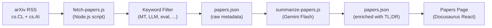

# 연구 논문 피드

Champollion은 arXiv에서 가져온 기계 번역 및 NLP 연구 논문을 실무자를 위해 필터링하고 요약한 큐레이션 피드를 운영해요. 이 피드는 반자동으로 동작해요. 매일 논문을 가져와서 필터링하고, AI로 요약한 뒤 웹사이트에 게시해요.

## 존재 이유

champollion의 번역 파이프라인은 발표된 연구의 기법들을 기반으로 만들어졌어요 — 레지스터 기반 프롬프팅(register-steered prompting), 코칭 데이터 주입(coaching data injection), 컨텍스트 롤오버(context rollover), 품질 게이트(quality gates) 등이에요. Papers 피드는 세 가지 목적을 가지고 있어요:

1. **투명성**: 사용자가 각 기능을 뒷받침하는 연구를 확인할 수 있어요
2. **발견**: arXiv에 발표된 새로운 기법이 향후 기능이나 사용자 설정에 도움이 될 수 있어요
3. **커뮤니티**: champollion을 단순한 또 하나의 API 래퍼가 아니라 연구 기반 도구로 자리매김해요

## 아키텍처



### 파이프라인 단계

#### 1. 가져오기(매일)

`scripts/fetch-papers.js`는 arXiv Atom API에 다음 범주의 최신 논문을 쿼리해요:
- `cs.CL` (Computation and Language)
- `cs.AI` (Artificial Intelligence)

반환 항목: 제목, 저자, 초록, arXiv ID, PDF 링크, 게시일, 범주.

#### 2. 필터링

논문은 키워드 관련성에 따라 필터링돼요. 논문은 최소한 하나의 기본 키워드와 일치해야 해요:

**기본 키워드**(≥1개 일치 필수):
- `machine translation`, `neural machine translation`, `NMT`
- `LLM`, `large language model`
- `multilingual`, `cross-lingual`
- `document-level translation`
- `low-resource language`, `endangered language`
- `translation evaluation`, `BLEU`, `COMET`, `chrF`
- `tokenization`, `morphology`, `polysynthetic`
- `context window`, `sliding window`
- `prompt engineering` (번역 맥락에서)

**부스트 키워드**(관련성 점수를 높임):
- `i18n`, `internationalization`, `localization`
- `few-shot`, `in-context learning`
- `terminology`, `glossary`, `consistency`
- `quality estimation`, `hallucination`

#### 3. 요약(AI 지원)

`scripts/summarize-papers.js`는 새로운(요약되지 않은) 논문을 처리해요:

각 논문에 대해 초록을 다음과 함께 Gemini 3.5 Flash로 보내요:
```
Read this ML research abstract and produce:
1. A 2-sentence TL;DR accessible to a software developer (not a researcher)
2. A single bullet: "Why this matters for MT" — how could this technique
   improve machine translation quality, cost, or speed in production?

Abstract: {abstract}
```

출력은 원시 메타데이터와 함께 `papers.json`에 다시 저장돼요.

#### 4. 게시

Docusaurus Papers 페이지(`website/src/pages/papers.js`)는 `papers.json`를 필터링 가능하고 페이지가 나뉜 카드 그리드로 렌더링해요.

각 카드는 다음을 표시해요:
- **제목**(arXiv에 연결됨)
- **저자**(처음 3명 + "et al.")
- **날짜**(게시일 또는 마지막 업데이트일)
- **TL;DR**(AI 생성)
- **중요한 이유**(AI 생성)
- **범주**(arXiv 태그)
- **PDF 링크**

### 자동화

GitHub Actions 워크플로가 파이프라인을 매일 실행해요:

```yaml title=".github/workflows/fetch-papers.yml"
name: Fetch MT Research Papers
on:
  schedule:
    - cron: '0 6 * * *'  # 06:00 UTC daily
  workflow_dispatch: {}   # Manual trigger

jobs:
  fetch:
    runs-on: ubuntu-latest
    steps:
      - uses: actions/checkout@v4
      - uses: actions/setup-node@v4
        with:
          node-version: 20
      - run: node scripts/fetch-papers.js
      - run: node scripts/summarize-papers.js
        env:
          GEMINI_API_KEY: ${{ secrets.GEMINI_API_KEY }}
      - name: Commit if changed
        run: |
          git config user.name "github-actions[bot]"
          git config user.email "github-actions[bot]@users.noreply.github.com"
          git add website/src/data/papers.json
          git diff --cached --quiet || git commit -m "chore: update research papers feed"
          git push
```

## 데이터 스키마

```typescript
interface Paper {
  id: string;           // arXiv ID (e.g., "2406.12345")
  title: string;
  authors: string[];
  abstract: string;
  published: string;    // ISO date
  updated: string;      // ISO date
  pdfUrl: string;
  categories: string[];
  primaryCategory: string;

  // Computed by filter
  relevanceScore: number;
  matchedKeywords: string[];

  // Computed by summarizer (null until processed)
  tldr: string | null;
  whyItMatters: string | null;
  summarizedAt: string | null;
}
```

## 파일 위치

| 파일 | 용도 |
|------|---------|
| `scripts/fetch-papers.js` | arXiv RSS 페처 및 키워드 필터 |
| `scripts/summarize-papers.js` | Gemini를 통한 AI 요약 |
| `website/src/data/papers.json` | 논문 데이터(저장소에 커밋됨) |
| `website/src/pages/papers.js` | Docusaurus 페이지 컴포넌트 |
| `website/src/pages/papers.module.css` | 페이지 스타일 |
| `.github/workflows/fetch-papers.yml` | 매일 자동화 |

## 구현 상태

| 기능 | 상태 |
|---------|--------|
| `fetch-papers.js` (arXiv 가져오기 + 필터) | 🔲 계획됨 |
| `summarize-papers.js` (AI 요약) | 🔲 계획됨 |
| Papers 페이지(React 컴포넌트) | 🔲 계획됨 |
| GitHub Actions 워크플로 | 🔲 계획됨 |
| 페이지 내 범주/키워드 필터링 | 🔲 계획됨 |
| 페이지 나누기 | 🔲 계획됨 |

## 참고 자료

- [아키텍처](/docs/concepts/architecture) — champollion의 컴포넌트들이 어떻게 연관되는지
- [컨텍스트 롤오버](/docs/concepts/context-rollover) — 이 연구 피드에서 직접 정보를 얻은 기능
