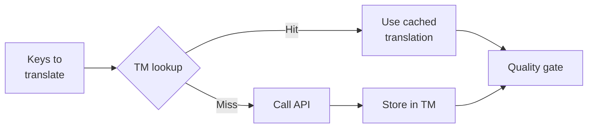

# Translation Memory

Translation Memory(TM)는 champollion의 내장 캐싱 레이어예요. 원본 텍스트 + 로케일 + 방식을 키로 사용하여 모든 번역을 저장하므로, `sync`를 다시 실행해도 실제로 변경된 키에 대해서만 API를 호출해요.

## TM이 존재하는 이유

TM이 없으면 모든 `sync`가 수정된 모든 키를 다시 번역해요 — 이전 실행에서 동일한 로케일에 대해 정확히 같은 영어 텍스트를 이미 번역했더라도 말이죠. 이로 인해 비용이 낭비되는 일반적인 시나리오는 다음과 같아요:

| 시나리오 | TM 없음 | TM 사용 |
|----------|-----------|---------|
| 1개 키 변경 후 sync 재실행 (500개 키 × 10개 로케일) | 5,000회 API 호출 | 10회 API 호출 |
| 키를 이전 영어 값으로 되돌리기 | 전체 API 호출 | 즉시 캐시 히트 |
| 동일한 문구가 3개의 로케일 파일에 나타남 | 3회 API 호출 | 1회 API 호출 + 2회 캐시 히트 |
| Dry-run → 실제 sync | 양쪽 모두 전체 API 호출 | 첫 실행에서 캐시, 두 번째 실행에서 재사용 |

TM은 **기본적으로 활성화**되어 있으며 별도의 설정이 필요하지 않아요. 번역은 모든 `sync` 동안 자동으로 캐시되고 이후 실행 시 제공돼요.

## 작동 방식

### 캐시 키

각 TM 항목은 세 가지 값의 SHA-256 해시를 키로 사용해요:

```
SHA-256( sourceValue + '\x00' + locale + '\x00' + method )
```

| 구성 요소 | 키에 포함되는 이유 |
|-----------|-------------------|
| `sourceValue` | 다른 영어 텍스트 → 다른 번역 |
| `locale` | "Hello"는 프랑스어와 일본어로 다르게 번역됨 |
| `method` | Google Translate 출력 ≠ GPT-4o 출력 |

널 바이트 구분자(`\x00`)는 `"ab" + "c"`와 `"a" + "bc"` 간의 충돌을 방지해요.

### Sync 중



1. 번역 API를 호출하기 전에 champollion은 키를 **TM 히트**와 **TM 미스**로 분류해요
2. 히트는 캐시에서 즉시 제공돼요 — API 호출, 지연, 비용 없음
3. 미스는 일반 번역 파이프라인을 거쳐요
4. API에서 받은 새 번역은 향후 실행을 위해 TM에 저장돼요
5. 모든 번역(캐시 + 신규)은 품질 게이트를 통과해요

### 저장소

TM은 프로젝트 루트의 `.champollion/tm.json`에 저장돼요. 파일은 크기를 관리 가능하게 유지하기 위해 압축된 JSON(예쁘게 출력하지 않음)을 사용해요. 각 항목은 다음을 저장해요:

| 필드 | 설명 |
|-------|-------------|
| `t` | 번역된 텍스트 |
| `ts` | 캐시된 시점의 ISO-8601 타임스탬프 |
| `l` | 대상 로케일 코드 (통계/필터링용) |
| `m` | 번역 방식 이름 (통계/필터링용) |

50개 언어 × 500개 키 = 25,000개 항목 기준으로, 파일 크기는 약 2-3 MB 정도예요.

## 캐시 관리

### 통계 보기

```bash
champollion tm stats
```

항목 수, 파일 크기, 그리고 로케일별 분류를 보여줘요:

```
  Translation Memory — .champollion/tm.json

  Entries:      2,847
  File size:    1.2 MB
  Created:      2026-05-20
  Last entry:   2026-05-24

  By locale:
    fr       482 entries  (llm: 380, llm-coached: 102)
    de       471 entries  (llm: 471)
    ja       465 entries  (llm: 465)
```

### 캐시 지우기

```bash
# Clear everything (with confirmation prompt)
champollion tm clear

# Clear without prompt (CI environments)
champollion tm clear --yes

# Clear only one locale
champollion tm clear --locale fr
```

### 한 번의 실행에서 TM 건너뛰기

```bash
# Force fresh API calls for all keys (useful when switching providers)
champollion sync --no-tm
```

이는 캐시를 삭제하지 않아요 — 이번 실행에서만 무시하고 새 결과를 저장하지 않을 뿐이에요.

## TM이 도움이 되지 않는 경우

다음과 같은 경우 TM은 캐시 히트를 생성하지 않아요:

- **원본 텍스트 변경** — 해시가 바뀌므로 미스가 돼요
- **방식 변경** — `llm`에서 `google-translate`로 전환하면 캐시 키가 달라져요
- **첫 실행** — 콜드 스타트, 아직 항목 없음
- **`--no-tm` 플래그** — 명시적으로 캐시를 우회해요

## `.champollion/tm.json`를 커밋해야 할까요?

**일반적으로는 아니에요.** TM은 로컬 개발자 최적화예요. sync 중에 자동으로 채워지며 동일한 머신에서 sync를 다시 실행할 때만 도움이 돼요. 하지만 다음과 같은 경우에는 커밋을 고려해 볼 수 있어요:

- 팀이 번역을 sync하는 단일 CI 러너를 공유하는 경우
- API 호출 없이 재현 가능한 빌드를 원하는 경우
- 규정 준수를 위해 번역을 아카이빙하는 경우

일반적인 사용 시에는 `.champollion/tm.json`를 `.gitignore`에 추가하세요.

---

## 함께 보기

- [Sync 작동 방식](/docs/concepts/how-sync-works) — TM이 파이프라인에서 어디에 위치하는지
- [CLI 레퍼런스 — tm](/docs/reference/cli#tm) — 명령어 레퍼런스
- [CLI 레퍼런스 — sync --no-tm](/docs/reference/cli#sync) — TM 우회하기
