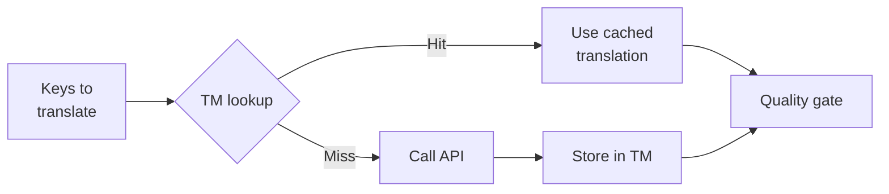

# Translation Memory

Translation Memory(TM)는 champollion의 내장 캐싱 레이어예요. 원본 텍스트 + 로케일 + 방식을 키로 사용하여 모든 번역을 저장하므로, `sync`를 다시 실행해도 실제로 변경된 키에 대해서만 API를 호출해요.

## TM이 존재하는 이유

TM이 없으면 모든 `sync`가 수정된 모든 키를 다시 번역해요 — 이전 실행에서 동일한 로케일에 대해 정확히 같은 영어 텍스트를 이미 번역했더라도 말이죠. 이로 인해 비용이 낭비되는 일반적인 시나리오는 다음과 같아요:

| 시나리오 | TM 없음 | TM 사용 |
|----------|-----------|---------|
| 1개 키 변경 후 sync 재실행 (500개 키 × 10개 로케일) | 5,000회 API 호출 | 10회 API 호출 |
| 키를 이전 영어 값으로 되돌리기 | 전체 API 호출 | 즉시 캐시 히트 |
| 동일한 문구가 3개의 로케일 파일에 나타남 | 3회 API 호출 | 1회 API 호출 + 2회 캐시 히트 |
| Dry-run → 실제 sync | 양쪽 모두 전체 API 호출 | 첫 실행에서 캐시, 두 번째 실행에서 재사용 |

TM은 **기본적으로 활성화**되어 있으며 별도의 설정이 필요하지 않아요. 번역은 모든 `sync` 동안 자동으로 캐시되고 이후 실행 시 제공돼요.

## 작동 방식

### 캐시 키

각 TM 항목은 세 가지 값의 SHA-256 해시를 키로 사용해요:

```
SHA-256( sourceValue + '\x00' + locale + '\x00' + method )
```

| 구성 요소 | 키에 포함되는 이유 |
|-----------|-------------------|
| `sourceValue` | 다른 영어 텍스트 → 다른 번역 |
| `locale` | "Hello"는 프랑스어와 일본어로 다르게 번역됨 |
| `method` | Google Translate 출력 ≠ GPT-4o 출력 |

널 바이트 구분자(`\x00`)는 `"ab" + "c"`와 `"a" + "bc"` 간의 충돌을 방지해요.

`sourceValue`은 키 번역의 기준이 되는 원본 텍스트에, 동일한 두 텍스트를 구분해 주는 추가 정보가 함께 결합된 형태예요:

- **gettext 컨텍스트(context).** `msgctxt`가 있는 항목은 해당 컨텍스트와 함께 캐시돼요. 예를 들어 동사 "Open"과 형용사 "Open"은 서로 다른 두 개의 항목이 돼요.
- **원본에 없는 복수형.** i18next는 복수형을 접미사가 붙은 키로 저장하며, 대상 언어에는 원본에 없는 형태가 있을 수 있어요. 프랑스어와 스페인어는 `count_many`를 추가하며, 이는 영어의 `count_other` 텍스트로부터 번역돼요. 두 키는 동일한 텍스트를 전송하지만, 모델에는 서로 다른 형태(`"2 recettes"` 및 `"1 000 000 de recettes"`)를 요청하므로 각각 별도의 항목이 생성돼요. `count_other`는 일반 형태를 유지하고, `count_many`는 텍스트와 해당 형태가 합쳐진 키 아래에 캐시돼요. 다른 범주의 텍스트로부터 번역되는 모든 형태에도 동일하게 적용돼요(아랍어 `_zero`, `_two`, `_few`, `_many`; 러시아어 `_few`, `_many`; 서수 형태).
- **gettext `msgid_plural` 및 ARB / ICU 복수형**은 키당 하나의 메시지(하나의 값에 모든 형태 포함)이므로 이전과 마찬가지로 하나의 항목이 돼요.

0.4.0 이전에는 차용된 형태(borrowed form)가 번역 기준이 된 형태의 항목을 공유했고, 해당 항목에는 마지막으로 저장된 응답이 보관되었기 때문에 `--redo all`가 두 키에 동일한 형태를 쓸 수 있었어요. 이전 버전의 캐시는 사용되는 과정에서 복구돼요. 공유 항목에 차용된 형태의 텍스트가 들어 있는 경우, 해당 형태 고유의 항목으로 이동하며 다른 형태는 다음에 큐에 들어갈 때 다시 번역돼요. 그렇지 않으면 해당 항목은 차용의 기준이 된 형태에 그대로 유지되고, 차용된 형태는 처음 큐에 들어갈 때 모델로 한 번 전송돼요(실행 시 안내 메시지가 표시돼요). `champollion verify`는 차용된 형태가 차용 기준 형태와 정확히 일치하는 텍스트를 갖고 있고 캐시상 모델이 그렇게 작성했다는 기록이 없을 때 경고를 표시해요. 언어에 따라 두 형태를 동일하게 작성하기도 하므로 이는 경고로 처리되며, `--redo keys:<key>`는 다시 요청해요.

### Sync 중


```mermaid
flowchart LR
    A["Keys to\ntranslate"] --> B{"TM lookup"}
    B -->|Hit| C["Use cached\ntranslation"]
    B -->|Miss| D["Call API"]
    D --> E["Store in TM"]
    C --> F["Quality gate"]
    E --> F
```

1. 번역 API를 호출하기 전에 champollion은 키를 **TM 히트**와 **TM 미스**로 분류해요
2. 히트는 캐시에서 즉시 제공돼요 — API 호출, 지연, 비용 없음
3. 미스는 일반 번역 파이프라인을 거쳐요
4. API에서 받은 새 번역은 향후 실행을 위해 TM에 저장돼요
5. 모든 번역(캐시 + 신규)은 품질 게이트를 통과해요

### 저장소

TM은 프로젝트 루트의 `.champollion/tm.json`에 저장돼요. 파일은 크기를 관리 가능하게 유지하기 위해 압축된 JSON(예쁘게 출력하지 않음)을 사용해요. 각 항목은 다음을 저장해요:

| 필드 | 설명 |
|-------|-------------|
| `t` | 번역된 텍스트 |
| `ts` | 캐시된 시점의 ISO-8601 타임스탬프 |
| `l` | 대상 로케일 코드 (통계/필터링용) |
| `m` | 번역 방식 이름 (통계/필터링용) |

50개 언어 × 500개 키 = 25,000개 항목 기준으로, 파일 크기는 약 2-3 MB 정도예요.

## 캐시 관리

### 통계 보기

```bash
champollion tm stats
```

항목 수, 파일 크기, 그리고 로케일별 분류를 보여줘요:

```
  Translation Memory — .champollion/tm.json

  Entries:      2,847
  File size:    1.2 MB
  Created:      2026-05-20 09:14 MDT
  Last entry:   2026-05-24 17:52 MDT

  By locale:
    fr       482 entries
               380  llm · model google/gemini-3.8-flash · register formal-vous
               102  llm-coached · model google/gemini-3.8-flash · register formal-vous · coaching 3f2a9c1b
    de       471 entries
               471  llm · model google/gemini-3.8-flash · register formal-Sie
    ja       465 entries
               465  llm · model google/gemini-3.8-flash · register polite
```

날짜는 표준시 표기와 함께 이 머신의 현지 시간으로 표시돼요(`--json`는
저장된 UTC 타임스탬프를 `createdAt` 및 `lastEntryAt`로도 제공해요).
로캘 아래의 각 줄은 해당 항목들을 생성한 요소, 즉 방식(method), 모델,
말투(register)예요(프롬프트에 코칭 텍스트가 포함되는 모든 방식인 `llm`, `local`, `openai`, `anthropic`, `gemini`,
`llm-coached`의 경우 코칭 텍스트의 핑거프린트도 포함돼요. 언어 쌍, 언어 또는 폴백 자체의 `coachingFile`가
이를 위해 읽히며, 파일 경로가 아닌 텍스트 내용이 기준이 돼요). 하나의
로캘 아래에 두 개의 모델이 있다는 것은 대개 모델이 전환되었음을 의미해요. `champollion status`는
로캘 파일 자체에 현재 두 모델의 텍스트가 섞여 있는지 여부를 알려줘요.

### 캐시 지우기

```bash
# Clear everything (with confirmation prompt)
champollion tm clear

# Clear without prompt (CI environments)
champollion tm clear --yes

# Clear only one locale
champollion tm clear --locale fr
```

### 한 번의 실행에서 TM 건너뛰기

```bash
# Fresh API calls for everything queued (useful when debugging quality)
champollion sync --redo all --fresh     # --fresh = --no-tm
```

이렇게 해도 캐시가 삭제되지는 않으며 이번 실행에서는 캐시를 읽지 않을 뿐이에요. 하지만 이번 실행에서 번역한(비용을 지불한) 내용은 여전히 저장되므로 다음 실행에서는 다시 캐시가 적용돼요.

## 모델 전환하기

**전환 방법.** 모델은 `champollion.config.json`의 설정 항목이에요. `"model"`(방식도 함께 변경하는 경우 `"defaultMethod"`도 함께) 또는 `"pairs"`에서 언어 쌍 자체의 `"model"`를 수정하세요. 다음 `champollion sync` 실행 시 해당 설정이 사용돼요.

`sync --model <name>`(및 `--method <name>`)는 **한 번의 실행에 대해서만** 모델을 지정해요. 설정 파일은 변경되지 않으며 sync 실행 시 이를 안내하고, 이후 일반 `sync`를 실행하면 다시 설정된 모델을 사용해요. 해당 실행에서 번역된 내용은 파일에 유지돼요. 그 후 일반 sync를 실행하면 다른 모델이 작성한 번역이 무엇인지 알려주며, 두 가지 해결 방법을 제시해요. 해당 모델을 설정된 모델로 지정하여 유지하거나(`"model"`에 해당 모델을 설정 — 아무것도 전송되지 않음), 설정된 모델로 다시 번역하도록 하는 것이에요(예상 비용과 함께 출력되는 redo 명령어). `champollion status`도 동일한 내용을 안내해요. 전환하기 위해 `champollion init`를 다시 실행할 필요는 없어요. `init --force`는 플래그로 지정된 항목만 다시 작성하고 다른 모든 설정은 유지해요([CLI 레퍼런스](/docs/reference/cli#init)).

모델을 변경해도 캐시가 버려지지 않아요. 새 모델 아래에 문자열 항목이 없더라도 방식, 말투, 코칭이 변경되지 않았다면 sync는 이전 모델에서 생성된 번역을 재사용해요. 재사용된 항목은 다른 일반 캐시 적중(cache hit)과 동일한 품질 검사를 거쳐요. 예상 비용을 안내하기 전에 sync는 몇 개의 번역을 재사용할지, 그리고 어떤 모델이 이를 작성했는지 알려줘요. 이는 드라이 런(dry run)에서도 마찬가지이며, 전환이 완료된 후에도 마찬가지예요. 이전 모델만 번역했던 텍스트로 되돌아간 문자열에는 해당 모델의 번역이 제공되며, 실행 시 비용 예상치 전에 이를 안내해요.

이전 모델이 번역한 항목을 새 모델이 대신 번역하도록 하려면 다음과 같이 실행하세요(이전
모델이 번역했던 키를 전송하며, 새 모델이 이미 번역한 내용은
여전히 캐시에서 가져와요):

```bash
champollion sync --redo all --fresh-on-model-change
```

단독으로 실행할 때 `--fresh-on-model-change`는 실행 시 어차피 번역해야 하는 키(새 키 또는 변경된 키)에만
영향을 줘요. 전체 재번역이 완료되면 sync는 해당 언어에 대한 모델 변경
안내를 중단해요. 새 모델의 응답이 실패한 키는
`.champollion.lock`에 **보류 중(pending)**으로 기록돼요. 다음
`champollion sync` 실행 시 캐시가 아닌 새 모델에 해당 키를 한 번 더 요청하며,
이 작업이 완료되면 전환이 마무리돼요. `champollion status`는 보류 중인 키를 나열하고,
파일에 이전 모델의 텍스트가 포함되어 있을 때(현재 모델의 텍스트와 섞여 있거나
전부 이전 모델인 경우) 이를 알려줘요([품질 게이트](/docs/concepts/quality-gate#a-redo-that-could-not-finish)).
sync가 각 값을 작성한 모델을 `.champollion.lock`에 기록하므로(응답한 모델, 또는
캐시된 번역을 제공한 모델), 어떤 모델이 작성했는지 식별할 수 있어요. 0.4.0 이전에 작성된 값의 경우
캐시를 참조하며, 두 모델이 동일한 텍스트를 캐시한 경우 "model unknown"으로 표시돼요. 새로 번역할 것이
없는 일반 `champollion sync`를 실행하면 파일이 설정된 모델이 아닌 다른 모델에 의해 작성되었을 때,
위의 명령어와 함께 언어당 한 줄씩 안내가 출력돼요.
대량 재실행(bulk redo)은 사람이 파일에서 직접 수정한 번역을 절대로 덮어쓰지 않아요
([번역 수정하기](/docs/guides/professional-translators#editing-key-value-files)).

방식, 말투 또는 코칭을 변경하면 여전히 새로운 번역이 생성돼요. 이러한 변경 사항은 다른 텍스트를 얻기 위해 존재하는 것이기 때문이에요. 캐시에 다른 방식으로 생성된 동일한 텍스트의 번역이 들어 있음에도 키가 모델로 전송되는 경우(예: `local` → `llm` 전환 후), sync는 언어마다 한 번씩 이를 생성했던 요소를 명시하며 안내해요. 이것이 실행 시 캐시에서 제공된 항목이 없는 것으로 나타나는 이유예요.

방식, 말투 또는 코칭을 변경하더라도 그 자체만으로는 아무것도 다시 번역되지 않아요. 새로 번역할 내용이 없는 일반 sync(또는 드라이 런)는 파일을 있는 그대로 유지해요. 그리고 언어별로 다른 방식이 작성한 값이 몇 개인지, 이를 대체할 redo 명령어(`champollion sync --pair en:fr --redo all`), 예상 비용을 안내해요.

## TM이 도움이 되지 않는 경우

다음과 같은 경우 TM은 캐시 히트를 생성하지 않아요:

- **원본 텍스트 변경** — 해시가 달라지므로 캐시 미스(miss)가 발생해요
- **방식(method) 변경** — `llm`에서 `google-translate`로 전환하면 캐시 키가 달라져요
- **말투(register) 또는 코칭 변경** — 캐시 키에 이 항목들이 포함돼요(모델만 변경된 경우에는 재사용돼요. 위 내용 참조). 언어 쌍의 폴백은 고유한 키(방식, 모델, 말투, 코칭)를 가져요. 이를 변경한 후 `sync` 및 `status`는 이전 설정이 작성한 값과 redo 명령어(`--redo all`, 모델만 변경된 경우는 `--fresh-on-model-change`)를 안내해요. 0.4.0 이전에 작성된 캐시는 `llm-coached`에 대해서만 코칭을 키에 포함했어요. 첫 실행 시 해당 언어 쌍이 당시에 가지고 있던 코칭으로 생성된 항목들이 유지돼요
- **키에 포함되지 않는 요소:** 용어집, 그리고 `llm-coached`의 문법 규칙 및 스타일 노트 — 이를 수정해도 캐시된 내용은 다시 번역되지 않아요(`--redo keys:… --fresh`로 다시 요청할 수 있어요)
- **`--retranslate <glob>`** — 지정된 콘텐츠 파일을 의도적으로 새로 번역해요
- **첫 실행** — 콜드 스타트(cold start) 상태이며, 아직 항목이 없어요
- **`--no-tm` / `--fresh`** — 의도적으로 캐시를 우회해요
- **보류 중인 키** — redo 작업이 완료되지 못한 키는 캐시에서 제공되지 않고 모델에 다시 요청돼요

캐시는 특정 키가 *큐에 추가될지(queued)* 여부를 결정하지 않아요. 이미 번역이 파일에 존재하며 변경되지 않은 키는 조회를 거치기도 전에 건너뛰어요(캐시 적중으로 집계되지 않아요). 그리고 품질 게이트에서 모델의 응답을 거부한 키는 일반 sync 실행 시 해당 모델로 다시 전송되지 않아요. 동일한 응답에 대해 비용이 다시 청구될 수 있기 때문이에요([보류됨](/docs/concepts/quality-gate#refused-keys-are-held-back)). 단, 캐시 조회는 계속 수행돼요.

## `.champollion/tm.json`를 커밋해야 할까요?

**일반적으로는 아니에요.** TM은 로컬 개발자 최적화예요. sync 중에 자동으로 채워지며 동일한 머신에서 sync를 다시 실행할 때만 도움이 돼요. 하지만 다음과 같은 경우에는 커밋을 고려해 볼 수 있어요:

- 팀이 번역을 sync하는 단일 CI 러너를 공유하는 경우
- API 호출 없이 재현 가능한 빌드를 원하는 경우
- 규정 준수를 위해 번역을 아카이빙하는 경우

일반적인 사용 시에는 `.champollion/tm.json`를 `.gitignore`에 추가하세요.

---

## 참고 항목

- [Sync 작동 방식](/docs/concepts/how-sync-works) — TM이 파이프라인에서 어디에 위치하는지
- [CLI 레퍼런스 — tm](/docs/reference/cli#tm) — 명령어 레퍼런스
- [CLI 레퍼런스 — sync --no-tm](/docs/reference/cli#sync) — TM 우회하기
