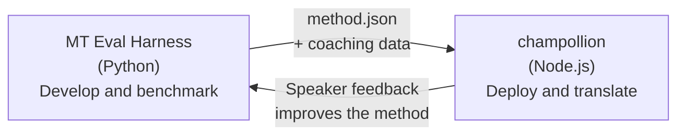

# Eval Harness 브릿지

champollion과 MT Eval Harness는 하나의 생태계를 이루는 두 개의 별도 도구입니다. harness는 번역 방법이 **검증되는** 곳입니다. Champollion은 검증된 방법이 **배포되는** 곳입니다. 두 도구는 공유 플러그인 형식을 통해 연결돼요.



## 흐름: 연구 → 프로덕션

### 1. harness에서 방법 만들기

`async translate(entries, config) → [{id, predicted}]`를 구현하는 모든 Python 클래스는 harness에 연결할 수 있어요. harness는 내부에서 무슨 일이 일어나는지 신경 쓰지 않아요 — 프롬프트 기반 LLM, 맞춤 학습 모델, 결정론적 규칙 등 무엇이든 가능해요.

### 2. 벤치마크하기

harness는 재현 가능한 지표를 사용해 표준화된 코퍼스에 대해 방법을 평가해요: chrF++, FST 수용도(형태론적으로 풍부한 언어용), 형태론적 정확도, 의미론적 점수.

### 3. 플러그인으로 내보내기

방법이 허용 가능한 품질에 도달하면 champollion 플러그인으로 패키징하세요 — 선택적 coaching 데이터를 포함한 `method.json` 매니페스트예요.

:::info[Export CLI 예정]
현재는 method.json 매니페스트를 수동으로 생성해요. `mt-eval export` 명령이 이를 자동화할 예정이에요. 전체 플러그인 형식은 [Method Interface](/docs/network/specifications/methods)를 참고하세요.
:::

### 4. champollion에 설치하기

```bash
champollion plugin install ./my-method-plugin/
```

### 5. 실제 콘텐츠 번역하기

```bash
champollion sync
```

이제 벤치마킹한 방법이 프로덕션에서 실제 번역을 생성하고 있어요.

## 흐름: 프로덕션 → 연구

배포된 번역은 이중 언어 사용자가 검토해요. 그들의 피드백은 체계적인 오류(잘못된 시제 패턴, 누락된 어휘, 부자연스러운 표현)를 찾아내요. 연구자는 harness에서 방법을 업데이트하고, 다시 벤치마크하고, 다시 내보내고, 다시 배포해요. 시스템은 사용을 통해 학습해요.

## 플러그인 형식

`method.json` 매니페스트는 두 도구 사이의 계약이에요:

```json
{
  "name": "crk-coached-v3",
  "type": "llm-coached",
  "version": "3.0.0",
  "description": "Coached LLM translation for Plains Cree",
  "locales": ["crk"],
  "config": {
    "model": "google/gemini-3.5-flash",
    "temperature": 0.3
  },
  "benchmarks": {
    "crk": {
      "composite_score": 0.67,
      "fst_acceptance": 0.82,
      "corpus_size": 150
    }
  }
}
```

전체 형식은 [Plugin Specification](/docs/reference/plugin-spec)을 참고하세요.

## 구축된 항목 vs. 계획된 항목

| 구성 요소 | 상태 |
|-----------|--------|
| TranslationMethod protocol | ✅ 구축됨 |
| Harness benchmark runner | ✅ 구축됨 |
| method.json 플러그인 형식 | ✅ 구축됨 |
| `champollion plugin install/remove/list` | ✅ 구축됨 |
| Coaching 데이터 로딩 | ✅ 구축됨 |
| `mt-eval export` CLI | 🔲 계획됨 |
| 커뮤니티 검토 인터페이스 | 🔲 계획됨 |
| 암호화된 테스트셋 평가 | 🔲 계획됨 |

## 더 읽어보기

- [번역 메서드](/docs/guides/translation-methods) — 사용 가능한 모든 메서드와 작동 방식
- [플러그인 사양](/docs/reference/plugin-spec) — method.json 형식
- [API를 통한 메서드 제공](/docs/guides/serving-a-method) — 서버 측 메서드 호스팅
- [데이터 주권](/docs/network/sovereignty/data-sovereignty) — 원주민 데이터 주권 원칙, CARE 및 암호화 보호
- [MT 연구자를 위한 정보](/docs/network/leaderboard/rules) — eval harness 문서
