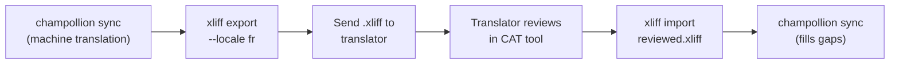

# 전문 번역가와 함께 작업하기

Champollion은 기계 번역을 생성하지만, 일부 프로젝트는 사람의 검토가 필요해요 — 규제 관련 콘텐츠, 브랜드에 민감한 문구, 또는 중요도가 높은 UI 같은 경우죠. XLIFF 워크플로를 사용하면 번역물을 전문가 검토용으로 내보내고 다시 매끄럽게 가져올 수 있어요.

## XLIFF란?

XLIFF(XML Localization Interchange File Format)는 번역 도구를 위한 업계 표준 교환 형식이에요. 모든 전문 CAT(컴퓨터 보조 번역) 도구가 이를 지원해요:

- **memoQ** — XLIFF 가져오기, 문맥 내 검토, 검토된 파일 내보내기
- **SDL Trados Studio** — 네이티브 XLIFF 지원
- **Phrase (Memsource)** — 번역가 팀을 위한 XLIFF 작업 업로드
- **Smartling** — XLIFF 수집 파이프라인
- **OmegaT** — XLIFF를 지원하는 무료/오픈소스 CAT 도구

Champollion은 최대한의 도구 호환성을 위해 XLIFF 2.0+가 아닌 XLIFF 1.2(범용적으로 지원되는 버전)를 생성해요.

## 워크플로



### 1단계: 기계 번역 생성

먼저 `sync`을 실행하여 기준이 되는 기계 번역을 얻으세요:

```bash
champollion sync
```

### 2단계: XLIFF 내보내기

소스 + 타깃 쌍을 XLIFF로 내보내세요:

```bash
champollion xliff export --locale fr
```

이렇게 하면 다음 내용을 담은 `.champollion/xliff/fr.xliff`이 작성돼요:
- 영어 값을 가진 모든 소스 키
- 현재의 기계 번역(있는 경우)이 `<target>`로 표시됨
- 번역이 없는 키는 `state="new"`로 표시됨

```xml
<trans-unit id="hero.title" xml:space="preserve">
  <source>Welcome to our platform</source>
  <target state="translated">Bienvenue sur notre plateforme</target>
</trans-unit>
```

### 3단계: 번역가에게 전송

`.xliff` 파일을 번역가에게 보내거나 CAT 플랫폼에 업로드하세요. 번역가는 소스와 타깃을 나란히 볼 수 있으며, 다음을 할 수 있어요:

- 기계 번역 편집
- 누락된 번역 채우기
- 품질 문제 표시
- 자체 번역 메모리 및 용어집 적용

### 4단계: 검토된 파일 가져오기

번역가가 검토된 `.xliff`을 반환하면, 가져오세요:

```bash
# Preview what will change
champollion xliff import .champollion/xliff/fr.xliff --dry

# Apply changes
champollion xliff import .champollion/xliff/fr.xliff
```

출력:
```
  ✓ Imported 142 translations for fr
    Updated:    23 (changed from existing)
    Added:      0 (new keys)
    Unchanged:  119
    Written to: locales/fr.json
```

### 5단계: 빈 곳 채우기

XLIFF를 내보낸 후 새 키가 추가되었다면, `sync`을 실행하여 번역하세요:

```bash
champollion sync
```

Champollion은 여전히 누락된 키만 번역해요 — XLIFF 가져오기를 통해 검토된 번역은 보존돼요.

## 팁

### 사용자 정의 경로 내보내기

```bash
# Export to a specific directory
champollion xliff export --locale ja --out ./for-review/

# Export with a specific filename
champollion xliff export --locale de --out ./review/german.xliff
```

### 여러 로케일

각 로케일을 개별적으로 내보내세요:

```bash
for locale in fr de ja ko; do
  champollion xliff export --locale $locale
done
```

### 버전 관리

`.champollion/xliff/`을 `.gitignore`에 추가하세요 — XLIFF 파일은 프로젝트 소스가 아니라 일시적인 산출물이에요:

```gitignore
.champollion/xliff/
```

### XLIFF를 사용할 때 vs. 그냥 `sync`을 사용할 때

| 시나리오 | 권장 사항 |
|----------|---------------|
| 내부 앱, 90% 이상 품질 허용 가능 | 그냥 `sync` — 기계 번역으로 충분해요 |
| 사용자 대면 마케팅 문구 | 사람 검토를 위해 XLIFF 내보내기 |
| 법률/규제 관련 콘텐츠 | XLIFF 내보내기 — 사람 검토 필수 |
| 50개 이상의 로케일, 빠듯한 마감 | 먼저 `sync`, 상위 5개 로케일만 XLIFF 내보내기 |
| 번역가가 이미 CAT 도구를 사용 중 | XLIFF가 자연스러운 인계 형식이에요 |

---

## 함께 보기

- [CLI Reference — xliff](/docs/reference/cli#xliff) — 명령어 참조
- [Translation Memory](/docs/concepts/translation-memory) — 검토된 번역 캐싱
- [Translation Methods](/docs/guides/translation-methods) — 기계 번역 옵션
