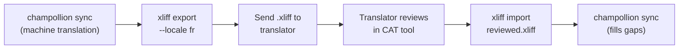

# 전문 번역가와 함께 작업하기

Champollion은 기계 번역을 생성하지만, 일부 프로젝트는 사람의 검토가 필요해요 — 규제 관련 콘텐츠, 브랜드에 민감한 문구, 또는 중요도가 높은 UI 같은 경우죠. XLIFF 워크플로를 사용하면 번역물을 전문가 검토용으로 내보내고 다시 매끄럽게 가져올 수 있어요.

XLIFF는 앱의 **문자열 파일**(키와 값)을 다뤄요. 번역된 **Markdown**(뉴스레터, 블로그 게시물, 문서 페이지)은 다른 방식으로 검토해요. 검토자가 번역된 `.md` 파일을 직접 편집하면 동기화 시 해당 편집 내용이 유지돼요. 아래의 [번역된 Markdown 검토하기](#reviewing-translated-markdown)를 참고하세요.

## XLIFF란?

XLIFF(XML Localization Interchange File Format)는 번역 도구를 위한 업계 표준 교환 형식이에요. 모든 전문 CAT(컴퓨터 보조 번역) 도구가 이를 지원해요:

- **memoQ** — XLIFF 가져오기, 문맥 내 검토, 검토된 파일 내보내기
- **SDL Trados Studio** — 네이티브 XLIFF 지원
- **Phrase (Memsource)** — 번역가 팀을 위한 XLIFF 작업 업로드
- **Smartling** — XLIFF 수집 파이프라인
- **OmegaT** — XLIFF를 지원하는 무료/오픈소스 CAT 도구

Champollion은 최대한의 도구 호환성을 위해 XLIFF 2.0+가 아닌 XLIFF 1.2(범용적으로 지원되는 버전)를 생성해요.

## 워크플로


```mermaid
flowchart LR
    A["champollion sync\n(machine translation)"] --> B["xliff export\n--locale fr"]
    B --> C["Send .xliff to\ntranslator"]
    C --> D["Translator reviews\nin CAT tool"]
    D --> E["xliff import\nreviewed.xliff"]
    E --> F["champollion sync\n(fills gaps)"]
```

### 1단계: 기계 번역 생성

먼저 `sync`을 실행하여 기준이 되는 기계 번역을 얻으세요:

```bash
champollion sync
```

### 2단계: XLIFF 내보내기

소스 + 타깃 쌍을 XLIFF로 내보내세요:

```bash
champollion xliff export --locale fr
```

이렇게 하면 다음 내용을 담은 `.champollion/xliff/fr.xliff`이 작성돼요:
- 영어 값을 가진 모든 소스 키
- 현재의 기계 번역(있는 경우)이 `<target>`로 표시됨
- 번역이 없는 키는 `state="new"`로 표시됨

```xml
<trans-unit id="hero.title" xml:space="preserve">
  <source>Welcome to our platform</source>
  <target state="translated">Bienvenue sur notre plateforme</target>
</trans-unit>
```

### 3단계: 번역가에게 전송

`.xliff` 파일을 번역가에게 보내거나 CAT 플랫폼에 업로드하세요. 번역가는 소스와 타깃을 나란히 볼 수 있으며, 다음을 할 수 있어요:

- 기계 번역 편집
- 누락된 번역 채우기
- 품질 문제 표시
- 자체 번역 메모리 및 용어집 적용

### 4단계: 검토된 파일 가져오기

번역가가 검토된 `.xliff`을 반환하면, 가져오세요:

```bash
# Preview what will change
champollion xliff import .champollion/xliff/fr.xliff --dry

# Apply changes
champollion xliff import .champollion/xliff/fr.xliff
```

출력:
```
  ✓ Imported 142 translations for fr
    Updated:    23 (changed from existing)
    Added:      0 (new keys)
    Unchanged:  119
    Written to: locales/fr.json
```

### 5단계: 빈 곳 채우기

XLIFF를 내보낸 후 새 키가 추가되었다면, `sync`을 실행하여 번역하세요:

```bash
champollion sync
```

Champollion은 여전히 누락된 키만 번역해요 — XLIFF 가져오기를 통해 검토된 번역은 보존돼요.

## 팁

### 사용자 정의 경로 내보내기

```bash
# Export to a specific directory
champollion xliff export --locale ja --out ./for-review/

# Export with a specific filename
champollion xliff export --locale de --out ./review/german.xliff
```

### 여러 로케일

각 로케일을 개별적으로 내보내세요:

```bash
for locale in fr de ja ko; do
  champollion xliff export --locale $locale
done
```

### 버전 관리

`.champollion/xliff/`을 `.gitignore`에 추가하세요 — XLIFF 파일은 프로젝트 소스가 아니라 일시적인 산출물이에요:

```gitignore
.champollion/xliff/
```

### XLIFF를 사용할 때 vs. 그냥 `sync`을 사용할 때

| 시나리오 | 권장 사항 |
|----------|---------------|
| 내부 앱, 90% 이상 품질 허용 가능 | 그냥 `sync` — 기계 번역으로 충분해요 |
| 사용자 대면 마케팅 문구 | 사람 검토를 위해 XLIFF 내보내기 |
| 법률/규제 관련 콘텐츠 | XLIFF 내보내기 — 사람 검토 필수 |
| 50개 이상의 로케일, 빠듯한 마감 | 먼저 `sync`, 상위 5개 로케일만 XLIFF 내보내기 |
| 번역가가 이미 CAT 도구를 사용 중 | XLIFF가 자연스러운 인계 형식이에요 |

## 로캘 파일에서 직접 번역 편집하기 {#editing-key-value-files}

검토자는 로캘 파일(`messages/fr.json`, `locale/fr/LC_MESSAGES/django.po`, `app_fr.arb`, …)에서 직접 번역을 수정한 후 커밋할 수도 있어요. Champollion은 자신이 작성하는 모든 값의 지문을 `.champollion.lock`에 기록해요. 더 이상 지문과 일치하지 않는 값은 사람이 수정한 것으로 간주되며, 동기화 시 해당 사용자의 수정본으로 처리돼요.

| 실행 작업 | 편집된 값의 처리 방식 |
|-----------|----------------------------------|
| 영문 변경 없는 일반 `sync` 실행 | 변경되지 않고 유지돼요(기존과 동일). |
| `sync --redo all` / `--force`, 모델 변경(`--redo all --fresh-on-model-change`), 또는 redo로 보류된 키의 재시도 | **유지돼요.** 실행 시 유지된 개수와 항목, 그리고 값을 덮어쓰는 방법(`--redo keys:<key>`)이 표시돼요. |
| 해당 키를 직접 지정한 `sync --redo keys:<key>` | 덮어써져요 — 해당 키를 직접 요청했기 때문이에요. 편집되었던 문구가 먼저 출력돼요. |
| **해당 키의 영문 원본이 변경된 경우** | 다시 번역돼요(편집 내용은 이전 텍스트 기준이었기 때문이에요). 다시 적용할 수 있도록 편집되었던 문구가 출력되며, 프로젝트 루트의 `.champollion-replaced-edits.jsonl`에 추가돼요. |

`.champollion-replaced-edits.jsonl`는 잠금 파일 옆에 위치하여 버전 관리(Git 추적)되는 파일이에요(`.champollion/` 캐시 폴더는 머신별로 생성되며 git에서 무시돼요). 교체된 편집본마다 한 줄의 JSON 형식으로 로캘, 파일, 키, 편집된 문구, 교체된 이유, 새로운 원본 텍스트가 기록돼요. 해당 문구의 유일한 사본이므로 잠금 파일과 함께 커밋해 주세요. `champollion status`에서 보관 중인 항목 수를 확인할 수 있어요.

이 기록이 존재하기 전에 작성되었거나 다른 도구로 작성된 값에는 지문이 없어요. 이러한 값은 번역 캐시에 해당 키에 대한 텍스트가 정확히 일치할 때만 Champollion이 작성한 것으로 인정돼요. 그렇지 않으면 사람이 작성한 것으로 간주되어 일괄 redo 시에도 유지돼요(실행 시 작성 기록이 없는 값으로 표시돼요). `champollion xliff import`로 가져온 값 역시 사람이 작업한 것이므로 동일하게 유지돼요.

## 번역된 Markdown 검토하기 {#reviewing-translated-markdown}

`contentDir`의 콘텐츠 파일(예: `newsletters/2026-10.md` → `newsletters/2026-10.crk.md`)은 XLIFF 내보내기를 지원하지 않아요. 검토자는 번역된 파일 자체에서 직접 작업해요.

1. `champollion sync`를 실행하고 번역본을 `.champollion-content.lock`와 함께 커밋해요.
2. 검토자가 번역된 파일에서 본문 단락이나 `title` 같은 번역된 프론트매터 필드를 편집하고 커밋해요.
3. 이후 동기화 시에도 해당 편집 내용이 유지돼요. 다른 단락의 영문 원본이 변경되더라도 검토자가 수정한 단락은 그대로 유지되고 변경된 단락만 번역돼요. 실행 시 `kept the edits made by hand to …`가 출력돼요.

두 가지 예외가 있으며, 동기화 시 두 경우 모두 경고가 표시돼요. 검토자가 수정한 영문 단락 자체가 변경되면 해당 단락은 다시 번역되며, 다시 적용할 수 있도록 검토자의 이전 문구가 출력돼요. 검토자가 단락을 추가하거나 삭제한 상태에서 원본이 변경되면, 누군가 직접 수동으로 업데이트할 때까지 해당 파일은 그대로 유지되며 매 동기화마다 목록에 표시돼요.

편집 내용을 버리고 기계 번역으로 되돌리려면 파일 이름을 지정하세요: `champollion sync --redo files:2026-10.md`. 전체 규칙은 [콘텐츠 번역](/docs/guides/content-translation#reviewing-and-editing-translations)에서 확인할 수 있어요.

---

## 참고 항목

- [CLI 레퍼런스 — xliff](/docs/reference/cli#xliff) — 명령어 레퍼런스
- [번역 메모리](/docs/concepts/translation-memory) — 검토된 번역 캐싱
- [번역 방식](/docs/guides/translation-methods) — 기계 번역 옵션
- [콘텐츠 번역](/docs/guides/content-translation) — Markdown 번역 및 검토자 편집 내용 유지 방법
- [품질 게이트](/docs/concepts/quality-gate#refused-keys-are-held-back) — 게이트에서 거부된 키 및 redo로 보류된 키
