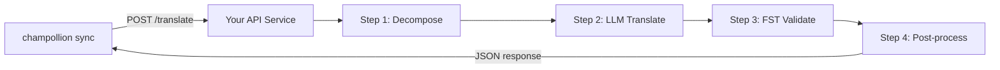

# 사용자 정의 메서드를 API로 제공하기

champollion의 **`api` 메서드**를 사용하면 어떤 번역 쌍이든 외부 HTTP 엔드포인트로 연결할 수 있어요. 이것은 단일 LLM 프롬프트로 처리하기에는 너무 복잡한 파이프라인 — 형태소 분석기, 유한 상태 변환기(FST), 다단계 LLM 체인, 또는 여러분이 구축한 사용자 정의 연구 방법 — 을 통합하는 방법이에요.

이러한 엔드포인트를 구축하는 방법에는 두 가지가 있어요:

1. **`champollion serve`** — 이 규약에 따라 기존 champollion 프로젝트에 구성된 스택(메서드, 레지스터, 코칭, 번역 메모리, 품질 게이트)을 서비스하는 단일 명령어예요. 서버 코드가 필요하지 않아요. [코드 없는 방식](#the-zero-code-path-champollion-serve)을 참조하세요.
2. **사용자 정의 서비스** — champollion 외부에 존재하는 파이프라인을 위해 규약을 구현하는 자체 HTTP 서버를 작성해요.

## 왜 API 서비스인가요?

일부 번역 파이프라인은 단순한 프롬프트-응답 주기 안에서 실행될 수 없어요:

| 파이프라인 단계 | 예시 |
|---|---|
| **형태소 분해** | 번역 전에 다종합적 단어를 형태소로 분리 |
| **FST 검증** | 음운론적 또는 형태론적 규칙을 위반하는 출력을 거부 |
| **다단계 LLM 체인** | 서로 다른 모델을 사용한 생성 → 검증 → 수정 주기 |
| **사전 조회** | 파이프라인 중간에 선별된 이중 언어 사전을 상호 참조 |
| **휴먼 인 더 루프** | 불확실한 번역을 전문가 검토를 위해 대기열에 추가 |

`api` 메서드는 여러분의 파이프라인을 블랙박스처럼 취급해요 — champollion이 소스 문자열을 보내면, 여러분의 서비스가 번역을 반환해요. 내부에서 무슨 일이 일어나는지는 전적으로 여러분에게 달려 있어요.

## 아키텍처



## 코드 없는 방식: `champollion serve`

파이프라인이 이미 champollion 프로젝트(구성된 메서드(LLM, 코칭됨, 또는 엔진), 레지스터, 코칭 파일, 번역 메모리, 결정론적 품질 게이트)라면 서버를 작성할 필요가 전혀 없어요. `champollion serve`는 아래에 설명된 정확한 규약에 따라 **직접 구성한 스택**을 구축해요:

```bash
# Owner side — run from the project whose champollion.config.json defines the stack
CHAMPOLLION_SERVE_TOKEN=$(openssl rand -hex 24) npx champollion serve
# [OK] champollion serve listening on http://127.0.0.1:1822/translate
```

모든 요청은 `champollion sync`이 사용하는 것과 동일한 파이프라인을 거쳐 실행돼요:

- **번역 메모리(Translation Memory)** — TM이 이미 보유하고 있는 문자열은 업스트림 제공자를 거치지 않고 캐시에서 무료로 제공돼요. 게이트 검증을 통과한 API 결과는 다음 요청을 위해 캐시돼요.
- **품질 게이트(Quality gate)** — 모든 응답은 결정론적으로 검증돼요(반복, 길이 비율, 문자 스크립트 준수, 소스 에코). 실패한 항목은 구조화된 키별 오류(HTTP 207/422)로 반환되며, 품질이 저하된 결과가 조용히 출력되는 일은 절대 없어요.
- **비용 보호(Cost guard)** — `--max-cost-per-request` 및 `--max-session-cost`는 제공자 호출이 이루어지기 전에 *예상* 업스트림 비용이 한도를 초과하는 요청을 거부해요. 가격을 알 수 없는 메서드 역시 한도 적용 시 거부돼요. 알 수 없다는 것이 무료를 의미하지는 않으니까요. TM으로 처리되는 요청은 비용이 $0으로 알려져 있으므로 항상 통과돼요.

서버는 기본적으로 `127.0.0.1`에 바인딩돼요. 포트에 접근할 수 있는 사람이라면 누구나 업스트림 API 예산을 사용할 수 있으므로, 이를 노출하는 것은 명시적인 결정이어야 해요. 즉, `--bind 0.0.0.0`와 강력한 베어러(bearer) 토큰이 필요해요. `--no-auth`는 루프백 바인딩과 함께 사용할 때만 허용돼요. IP별 속도 제한과 요청 크기 한도는 기본적으로 켜져 있어요. `champollion serve --help`을 참조하세요.

### 컨슈머 연결하기

컨슈머가 설치할 플러그인 매니페스트를 생성하세요(양쪽에서 각각 하나의 명령어 사용):

```bash
# Owner side
champollion serve --emit-manifest --endpoint https://translate.example.org
# [OK] Wrote ./my-project-serve/method.json
```

```bash
# Consumer side
champollion plugin install ./my-project-serve
```

```json title="champollion.config.json (consumer)"
{
  "pairs": {
    "en:crk": { "methodPlugin": "my-project-serve" }
  }
}
```

```bash
CHAMPOLLION_API_KEY=<the server's bearer token> champollion sync
```

컨슈머의 `api` 메서드는 소스 문자열을 서버로 POST 요청해요. 그러면 여러분의 스택이 번역, 게이트 검증, 캐싱을 수행해요. 매니페스트의 `qualityTier`은 구성된 쌍을 정직하게 전달하는 역할을 해요(쌍이 다를 경우 가장 보수적인 티어 적용). 프롬프트, 코칭 데이터, 제공자 키는 절대 여러분의 머신 외부로 유출되지 않아요.

이 가이드의 나머지 부분에서는 **사용자 정의(custom)** 서비스를 작성하는 방법을 다뤄요. 이는 파이프라인이 champollion 프로젝트가 아닐 때(예: Python FST 체인, 맞춤형 연구 시스템) 유용해요. 통신 규약(wire contract)은 어느 쪽이든 동일해요.

## 서비스 설정하기

여러분의 API 서비스는 JSON을 받고 반환하는 단일 엔드포인트를 구현해야 해요:

### 요청 형식

champollion은 이 정확한 JSON 본문을 전송해요 ([api.js](https://github.com/gamedaysuits/Champollion/blob/main/cli/lib/methods/api.js) 참고):

```json
POST /translate
Content-Type: application/json
Authorization: Bearer <CHAMPOLLION_API_KEY>

{
  "source_locale": "en",
  "target_locale": "crk",
  "method": "crk-coached-v1",
  "keys": {
    "greeting": "Hello, welcome to our app",
    "farewell": "Goodbye and thanks"
  }
}
```

| 필드 | 타입 | 설명 |
|-------|------|-------------|
| `source_locale` | string | BCP 47 소스 언어 코드 |
| `target_locale` | string | BCP 47 대상 언어 코드 |
| `method` | string | 플러그인 이름 또는 `"default"` |
| `keys` | object | 키 → 번역할 소스 문자열의 맵 |
```

### Response Format

Your service must return a `translations` object. An optional `meta` object can include cost and diagnostic info:

```json
{
  "translations": {
    "greeting": "tânisi, pê-kîwêw ôta",
    "farewell": "ekosi mâka, kinanâskomitin"
  },
  "meta": {
    "model": "my-custom-pipeline/v1",
    "cost_usd": 0.0042,
    "method": "decompose-translate-validate"
  }
}
```

| Field | Type | Required | Description |
|-------|------|----------|-------------|
| `translations` | object | ✅ | Map of key → translated string |
| `meta` | object | — | Optional metadata |
| `meta.cost_usd` | number | — | If present, displayed in champollion's output |
| `errors` | object | — | For partial success (HTTP 207): map of key → `{ message }` |

### Minimal Express Server

```javascript
import express from 'express';

const app = express();
app.use(express.json());

/**
 * champollion API contract:
 *
 * Request:  { source_locale, target_locale, method, keys: { "key": "source" } }
 * Response: { translations: { "key": "translated" }, meta: { ... } }
 */
app.post('/translate', async (req, res) => {
  const { source_locale, target_locale, method, keys } = req.body;

  const translations = {};

  for (const [key, source] of Object.entries(keys)) {
    // --- Your pipeline goes here ---
    // Step 1: Morphological decomposition
    const morphemes = await decompose(source, source_locale);

    // Step 2: LLM translation with context
    const draft = await llmTranslate(morphemes, target_locale);

    // Step 3: FST validation
    const validated = await fstValidate(draft, target_locale);

    // Step 4: Post-processing (orthography normalization, etc.)
    translations[key] = await postProcess(validated);
  }

  res.json({
    translations,
    meta: {
      model: 'my-custom-pipeline/v1',
      method: 'decompose-translate-validate',
    },
  });
});

app.listen(3001, () => {
  console.log('Translation API running on http://localhost:3001');
});
```

## Configuring champollion

Point a translation pair at your running service in `champollion.config.json`:

```json
{
  "inputLocale": "en",
  "pairs": {
    "en:crk": {
      "method": "api",
      "endpoint": "http://localhost:3001/translate",
      "register": "Formal Plains Cree. Use SRO orthography."
    }
  }
}
```

Then run sync as usual:

```bash
npx champollion sync
```

champollion will POST your source strings to the endpoint and write the returned translations to `crk.json`.

## Case Study: Plains Cree Pipeline

:::info[Under Development]
The Plains Cree pipeline described below is **under active development** and is not yet running in production. Details here reflect the current design direction and may change as the project evolves.
:::

The **arena** project demonstrates this pattern. Its Plains Cree pipeline uses:

1. **Morphological decomposition** — Break polysynthetic Cree words into translatable morpheme chains
2. **LLM translation** — Context-enriched GPT-4o translation with coaching data (SRO orthography rules, register instructions)
3. **FST validation** — Finite-state transducer checks that outputs conform to Cree phonological rules
4. **Confidence scoring** — Each translation gets a confidence score based on FST pass rate and dictionary coverage

The entire pipeline runs as a single HTTP endpoint that champollion calls via the `api` method.

### Running Evaluations

After translating, you can evaluate output quality using the harness directly:

```bash
# Clone the harness
git clone https://github.com/gamedaysuits/Champollion.git
cd Champollion/arena
pip install -e .

# 실제 번들로 제공되지 않는 코퍼스를 대상으로 평가 실행
mt-eval run --corpus eval-amh-fra-globalvoices-test-v1 --model gemini-pro --yes
```

This produces structured evaluation records with chrF++, BLEU, and exact match scores that can be used as regression baselines.

## Authentication

If your API requires authentication, set the `apiKey` field or use an environment variable:

```json
{
  "pairs": {
    "en:crk": {
      "method": "api",
      "endpoint": "https://my-mt-service.example.com/translate",
      "apiKey": "${CRK_API_KEY}"
    }
  }
}
```

## Data Sovereignty

The `api` method is particularly important for **Indigenous language communities**. By self-hosting the translation pipeline, a community keeps full control over:

- **Proprietary coaching data** — register instructions, orthography rules, and domain glossaries never leave community infrastructure.
- **Linguistic resources** — curated dictionaries, FST grammars, and elder-verified translations remain under community ownership.
- **Access policies** — the community decides who can call the endpoint and under what terms.

This design follows the direction of [Indigenous data-sovereignty principles](/docs/network/community/low-resource-languages#data-sovereignty-principles) — community ownership and control of language data: sensitive language data stays governed by the community rather than a third-party platform.

:::tip
Combine the `api` method with a private deployment (e.g., a community-hosted VM or on-prem server) for the strongest data-sovereignty posture. `champollion serve` gives a community exactly this self-hosting posture without writing any server code — coaching data, provider keys, and the Translation Memory all stay on community infrastructure. See [Support a Low-Resource Language](/docs/network/community/low-resource-languages) for a full walkthrough.
:::

## Cost Estimation

The `api` method returns `null` for cost estimation by default — your service controls pricing. If you want to provide cost transparency, have your API return a `cost` field in the metadata:

```json
{
  "translations": { "...": "..." },
  "metadata": {
    "cost": {
      "estimatedCost": 0.0042,
      "currency": "USD",
      "source": "my-service-pricing"
    }
  }
}
```

## 모범 사례

1. **실패 시 빈 문자열을 반환하세요** — 소스 문자열을 "번역"으로 반환하지 마세요. `""`를 반환하면 champollion의 품질 게이트가 이를 감지해요. 해당 키는 건너뛰어지고 다음 sync에서 재시도돼요.
2. **신뢰도 점수를 포함하세요** — 파이프라인이 품질을 추정할 수 있다면, 메타데이터에 반환하세요. 이는 품질 감사에 도움이 돼요.
3. **헬스 체크를 구현하세요** — `GET /health` 엔드포인트를 추가하면 champollion이 대규모 sync를 시작하기 전에 연결 상태를 확인할 수 있어요.
4. **레이트 리밋을 우아하게 처리하세요** — 파이프라인에 처리량 제한이 있다면, `429` 상태 코드를 반환하세요. champollion의 배치 시스템이 백오프를 수행해요.
5. **모든 것을 로깅하세요** — 다단계 파이프라인은 조용히 실패할 수 있어요. 디버깅을 위해 각 단계의 입력/출력을 로깅하세요.

## 라이선스

`api` 메서드 패턴은 완전히 개방되어 있어요 — 여러분만의 번역 파이프라인을 HTTP 서비스로 래핑하는 데 라이선스 제한이 없어요. `arena` eval 하네스는 AGPL-3.0-or-later 라이선스(§7 eval-standard-plugin 예외 포함)로 제공되며, 해당 조건에 따라 이를 연구하고 확장할 수 있어요.

## 참고 항목

- [번역 메서드(Translation Methods)](/docs/guides/translation-methods) — 모든 내장 메서드(`openai`, `google`, `api` 등)에 대한 개요
- [플러그인 사양(Plugin Specification)](/docs/reference/plugin-spec) — `api` 메서드 필드를 포함한 `champollion.config.json`의 전체 스키마
- [자원이 부족한 언어 지원하기(Support a Low-Resource Language)](/docs/network/community/low-resource-languages) — 데이터 주권 원칙을 포함하여 자원이 부족한 언어를 위한 엔드투엔드 가이드
- [아키텍처(Architecture)](/docs/concepts/architecture) — champollion의 동기화 루프, 일괄 처리(batching) 및 메서드 디스패치 작동 방식
- [MT 평가(MT Evaluation)](/docs/network/leaderboard/rules) — 평가 방법론, 지표 및 리더보드 제출 프로세스
- [메서드 리더보드(Method Leaderboard)](/leaderboard) — 메서드 및 언어 쌍 전반에 걸친 실시간 품질 순위
