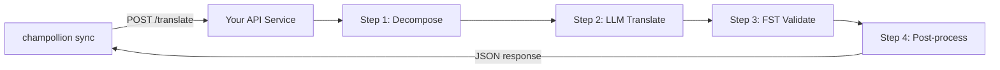

# 사용자 정의 메서드를 API로 제공하기

champollion의 **`api` 메서드**를 사용하면 어떤 번역 쌍이든 외부 HTTP 엔드포인트로 연결할 수 있어요. 이것은 단일 LLM 프롬프트로 처리하기에는 너무 복잡한 파이프라인 — 형태소 분석기, 유한 상태 변환기(FST), 다단계 LLM 체인, 또는 여러분이 구축한 사용자 정의 연구 방법 — 을 통합하는 방법이에요.

이러한 엔드포인트를 구축하는 방법에는 두 가지가 있어요:

1. **`champollion serve`** — 기존 champollion 프로젝트에 구성된 스택(방식, 어조(register), 코칭, 번역 메모리, 품질 게이트)을 이 규약에 맞춰 서빙하는 단 하나의 명령어예요. 서버 코드가 필요 없어요. [코드 없는 경로](#the-zero-code-path-champollion-serve)를 참고하세요.
2. **커스텀 서비스** — champollion 외부에 완전히 독립적으로 존재하는 파이프라인을 위해, 규약을 구현하는 자체 HTTP 서버를 직접 작성하는 방식이에요.

## 왜 API 서비스인가요?

일부 번역 파이프라인은 단순한 프롬프트-응답 주기 안에서 실행될 수 없어요:

| 파이프라인 단계 | 예시 |
|---|---|
| **형태소 분해** | 번역 전에 다종합적 단어를 형태소로 분리 |
| **FST 검증** | 음운론적 또는 형태론적 규칙을 위반하는 출력을 거부 |
| **다단계 LLM 체인** | 서로 다른 모델을 사용한 생성 → 검증 → 수정 주기 |
| **사전 조회** | 파이프라인 중간에 선별된 이중 언어 사전을 상호 참조 |
| **휴먼 인 더 루프** | 불확실한 번역을 전문가 검토를 위해 대기열에 추가 |

`api` 메서드는 여러분의 파이프라인을 블랙박스처럼 취급해요 — champollion이 소스 문자열을 보내면, 여러분의 서비스가 번역을 반환해요. 내부에서 무슨 일이 일어나는지는 전적으로 여러분에게 달려 있어요.

## 아키텍처


```mermaid
graph LR
    A[champollion sync] -->|POST /translate| B[Your API Service]
    B --> C[Step 1: Decompose]
    C --> D[Step 2: LLM Translate]
    D --> E[Step 3: FST Validate]
    E --> F[Step 4: Post-process]
    F -->|JSON response| A
```

## 코드 없는 경로: `champollion serve`

파이프라인이 이미 champollion 프로젝트(구성된 방식(LLM, 코칭 적용, 또는 엔진), 어조, 코칭 파일, 번역 메모리, 결정론적 품질 게이트)로 되어 있다면 서버를 직접 작성할 필요가 전혀 없어요. `champollion serve`는 아래 설명된 정확한 규약에 맞춰 **직접 구성한 스택**을 바로 띄워 줘요:

```bash
# Owner side — run from the project whose champollion.config.json defines the stack
CHAMPOLLION_SERVE_TOKEN=$(openssl rand -hex 24) npx champollion serve
# [OK] champollion serve listening on http://127.0.0.1:1822/translate
```

모든 요청은 `champollion sync`가 사용하는 것과 동일한 파이프라인을 거쳐요:

- **번역 메모리(TM)** — TM에 이미 존재하는 문자열은 업스트림 제공자에 접근하지 않고 캐시에서 무료로 제공돼요. 게이트 검증을 통과한 API 결과는 다음 요청을 위해 캐시돼요.
- **품질 게이트** — 모든 응답은 결정론적으로 검증돼요(반복, 길이 비율, 문자 체계 준수 여부, 소스 에코). 실패한 경우 조용히 품질이 저하된 출력이 반환되는 대신, 키별 구조화된 오류(HTTP 207/422)로 반환돼요.
- **비용 보호** — `--max-cost-per-request` 및 `--max-session-cost`는 제공자 호출이 이루어지기 전에, *예상* 업스트림 비용이 설정한 한도를 초과하는 요청을 거부해요. 가격이 알려지지 않은 방식도 한도 설정 하에서는 거부돼요. 알려지지 않았다고 해서 무료인 것은 아니니까요. TM에서 처리되는 요청은 확실한 $0이므로 항상 통과돼요.

서버는 기본적으로 `127.0.0.1`에 바인딩돼요. 포트에 접근할 수 있는 사람이라면 누구나 업스트림 API 예산을 소진할 수 있으므로, 이를 외부에 노출하는 것은 신중한 결정이어야 해요 — `--bind 0.0.0.0`와 강력한 베어러 토큰을 함께 사용하세요. `--no-auth`는 루프백 바인드와 함께 사용할 때만 허용돼요. IP별 속도 제한과 요청 크기 상한은 기본적으로 켜져 있어요. 자세한 내용은 `champollion serve --help`를 참고하세요.

### 컨슈머(Consumer) 연결하기

컨슈머가 설치할 플러그인 매니페스트를 생성하세요(양쪽에서 각각 명령어 하나씩 실행):

```bash
# Owner side
champollion serve --emit-manifest --endpoint https://translate.example.org
# [OK] Wrote ./my-project-serve/method.json
```

```bash
# Consumer side
champollion plugin install ./my-project-serve
```

```json title="champollion.config.json (consumer)"
{
  "pairs": {
    "en:crk": { "methodPlugin": "my-project-serve" }
  }
}
```

```bash
CHAMPOLLION_API_KEY=<the server's bearer token> champollion sync
```

컨슈머의 `api` 방식은 소스 문자열을 여러분의 서버로 POST 전송해요. 여러분의 스택은 번역, 게이트 검증, 캐싱을 수행하며, 매니페스트의 `qualityTier`는 구성된 언어 쌍을 그대로 정직하게 전달해요(언어 쌍 간 티어가 다른 경우 가장 보수적인 티어 적용). 프롬프트, 코칭 데이터, 제공자 키는 절대로 로컬 머신 외부로 유출되지 않아요.

이 가이드의 나머지 부분에서는 **커스텀** 서비스를 작성하는 방법을 다뤄요. 파이프라인이 champollion 프로젝트가 아닐 때(Python FST 체인, 맞춤형 연구 시스템 등) 유용해요. 통신 규약은 두 방식 모두 동일해요.

## 서비스 설정하기

여러분의 API 서비스는 JSON을 받고 반환하는 단일 엔드포인트를 구현해야 해요:

### 요청 형식

champollion은 이 정확한 JSON 본문을 전송해요 ([api.js](https://github.com/gamedaysuits/Champollion/blob/main/cli/lib/methods/api.js) 참고):

```json
POST /translate
Content-Type: application/json
Authorization: Bearer <CHAMPOLLION_API_KEY>

{
  "source_locale": "en",
  "target_locale": "crk",
  "method": "my-project-serve",
  "keys": {
    "greeting": "Hello, welcome to our app",
    "farewell": "Goodbye and thanks"
  }
}
```

| 필드 | 타입 | 설명 |
|-------|------|-------------|
| `source_locale` | string | BCP 47 소스 언어 코드 |
| `target_locale` | string | BCP 47 타깃 언어 코드 |
| `method` | string | 플러그인 이름 또는 `"default"` |
| `keys` | object | 키 → 번역할 소스 문자열 맵 |
| `instructions` | object | 엔드포인트가 `"acceptsInstructions": true`를 선언한 경우에만 해당: 키 → 키별 메모 (메시지에 필요한 복수형 형태, 품질 게이트 재시도의 피드백 등) |
| `text_format` | string | Markdown 문서 텍스트의 경우 `"markdown"`(아래 참조), 앱 문자열의 경우 생략 |

### 응답 형식

서비스는 반드시 `translations` 객체를 반환해야 해요. 선택 사항인 `meta` 객체에는 비용 및 진단 정보를 포함할 수 있어요:

```json
{
  "translations": {
    "greeting": "<the greeting, translated>",
    "farewell": "<the farewell, translated>"
  },
  "meta": {
    "model": "my-custom-pipeline/v1",
    "cost_usd": 0.0042,
    "method": "decompose-translate-validate"
  }
}
```

| 필드 | 타입 | 필수 여부 | 설명 |
|-------|------|----------|-------------|
| `translations` | object | ✅ | 키 → 번역된 문자열 맵 |
| `meta` | object | — | 선택적 메타데이터 |
| `meta.cost_usd` | number | — | 제공된 경우 champollion 출력에 표시됨 |
| `errors` | object | — | 부분 성공(HTTP 207) 시 사용: 키 → `{ message }` 맵 |

### 최소 Express 서버 예제

```javascript
import express from 'express';

const app = express();
app.use(express.json());

/**
 * champollion API contract:
 *
 * Request:  { source_locale, target_locale, method, keys: { "key": "source" } }
 * Response: { translations: { "key": "translated" }, meta: { ... } }
 */
app.post('/translate', async (req, res) => {
  const { source_locale, target_locale, method, keys } = req.body;

  const translations = {};

  for (const [key, source] of Object.entries(keys)) {
    // --- Your pipeline goes here ---
    // Step 1: Morphological decomposition
    const morphemes = await decompose(source, source_locale);

    // Step 2: LLM translation with context
    const draft = await llmTranslate(morphemes, target_locale);

    // Step 3: FST validation
    const validated = await fstValidate(draft, target_locale);

    // Step 4: Post-processing (orthography normalization, etc.)
    translations[key] = await postProcess(validated);
  }

  res.json({
    translations,
    meta: {
      model: 'my-custom-pipeline/v1',
      method: 'decompose-translate-validate',
    },
  });
});

app.listen(3001, () => {
  console.log('Translation API running on http://localhost:3001');
});
```

## champollion 구성하기

`champollion.config.json`에서 실행 중인 서비스를 가리키도록 번역 쌍을 설정하세요:

```json
{
  "inputLocale": "en",
  "pairs": {
    "en:crk": {
      "method": "api",
      "endpoint": "http://localhost:3001/translate",
      "register": "Formal Plains Cree. Use SRO orthography."
    }
  }
}
```

그런 다음 평소처럼 동기화를 실행하세요:

```bash
npx champollion sync
```

champollion은 소스 문자열을 엔드포인트로 POST 전송하고, 반환된 번역 결과를 `crk.json`에 기록해요.

### 엔드포인트가 지시사항을 잘 따르나요?

언어 쌍 설정(또는 플러그인의 `method.json` 최상위 수준)에서 `"acceptsInstructions"`로 이를 지정해 주세요:

- **`false`** — `nmt-forge serve`로 서빙되는 것과 같은 학습된 NMT 모델은 텍스트 번역만 수행하며, 같은 질문을 두 번 받아도 동일하게 답변해요. 품질 게이트에서 모델의 답변 중 하나를 거부하면, champollion은 모델에 **다시 묻지 않아요**(불필요한 호출 낭비이기 때문이에요). 대신 두 번째 답변을 평가하듯 첫 번째 답변을 평가하고(그대로 유지된 이름은 허용됨), 나머지는 해당 언어 쌍의 `fallback`로 보내요.
- **`true`** — 엔드포인트 뒤에 있는 LLM은 키별 메모를 활용할 수 있어요. 요청에 `instructions` 객체가 포함되며, 거부된 키는 게이트의 피드백과 함께 다시 질문돼요.
- **설정되지 않음(unset)** — champollion이 판단할 수 없어요. 거부된 키는 피드백 없이 한 번 더 요청되며, 실행 로그에는 엔드포인트가 이를 무시할 수도 있다고 표시돼요.

```json
{
  "pairs": {
    "en:crk": {
      "method": "api",
      "endpoint": "http://127.0.0.1:8378/translate",
      "acceptsInstructions": false,
      "fallback": { "method": "llm-coached" }
    }
  }
}
```

여기서의 폴백은 호스팅된 모델이에요. 모든 처리를 이 머신 내에서만 유지하려면 대신 `"fallback": { "method": "local", "model": "<your local model>" }`를 사용하세요(상황별 선택 기준은 [폴백 방식](/docs/getting-started/configuration#fallback)을 참고하세요).

## 사례 연구: 플레인스 크리어(Plains Cree) 파이프라인

:::info[개발 진행 중]
아래에 설명된 플레인스 크리어 파이프라인은 **현재 활발히 개발 중**이며 아직 프로덕션에서 실행되고 있지 않아요. 여기에 기술된 세부사항은 현재 설계 방향을 반영한 것이며 프로젝트가 진행됨에 따라 변경될 수 있어요.
:::

**arena** 프로젝트가 이 패턴을 잘 보여줘요. 해당 프로젝트의 플레인스 크리어 파이프라인은 다음을 사용해요:

1. **형태소 분석(Morphological decomposition)** — 포합어(polysynthetic)인 크리어 단어를 번역 가능한 형태소 체인으로 분해
2. **LLM 번역** — 코칭 데이터(SRO 철자법 규칙, 어조 지침)를 포함한 문맥 강화 GPT-4o 번역
3. **FST 검증** — 유한 상태 변환기(Finite-state transducer)가 출력이 크리어 음운 규칙을 준수하는지 확인
4. **신뢰도 점수 산출** — FST 통과율과 사전 커버리지를 기반으로 각 번역에 신뢰도 점수 부여

전체 파이프라인은 champollion이 `api` 방식을 통해 호출하는 단일 HTTP 엔드포인트로 실행돼요.

### 평가 실행하기

번역 후에는 평가 하네스를 직접 사용하여 출력 품질을 평가할 수 있어요:

```bash
# Clone the harness
git clone https://github.com/gamedaysuits/Champollion.git
cd Champollion/arena
python3 -m pip install -e .

# Run the evaluation against a real, non-bundled corpus
mt-eval run --corpus eval-amh-fra-globalvoices-test-v1 --model google/gemini-3.1-pro-preview --yes
```

이를 통해 회귀 기준점(baseline)으로 사용할 수 있는 chrF++, BLEU, 완전 일치(exact match) 점수가 포함된 구조화된 평가 레코드가 생성돼요.

## 인증

API에 인증이 필요한 경우, 해당 언어 쌍 설정에서 토큰을 담고 있는 환경 변수 이름을 지정(`"${VAR}"`, 환경 변수 또는 `.env.local`에서 읽어옴)하거나 `CHAMPOLLION_API_KEY`를 직접 설정하세요. Champollion은 엔드포인트에 해당 토큰만 전송하며, 다른 제공자의 키는 절대 전송하지 않아요. 루프백 엔드포인트(`nmt-forge serve`, `champollion serve`)에는 인증이 필요하지 않아요.

```json
{
  "pairs": {
    "en:crk": {
      "method": "api",
      "endpoint": "https://my-mt-service.example.com/translate",
      "apiKey": "${CRK_API_KEY}"
    }
  }
}
```

콘텐츠(Markdown 본문)도 동일한 규약을 통해 처리돼요. 각 블록이 하나의 키가 되며(`segment.<N>`, 또는 전체 페이지의 경우 `body`), 요청에 `"text_format": "markdown"`가 포함되므로 서버는 문서 텍스트와 앱 문자열을 구분할 수 있어요. 이 필드를 인식하지 못하는 서버는 그냥 무시해도 돼요.

## 데이터 주권(Data Sovereignty)

`api` 방식은 특히 **원주민 언어 커뮤니티**에 매우 중요해요. 번역 파이프라인을 자체 호스팅함으로써 커뮤니티는 다음 사항에 대한 완전한 통제권을 유지할 수 있어요:

- **독점 코칭 데이터** — 어조 지침, 철자법 규칙, 도메인 용어집이 커뮤니티 인프라 외부로 절대 유출되지 않아요.
- **언어 자원** — 정선된 사전, FST 문법, 어르신들이 검증한 번역물이 커뮤니티의 소유로 유지돼요.
- **접근 정책** — 누가 어떤 조건으로 엔드포인트를 호출할 수 있는지 커뮤니티가 직접 결정해요.

이 설계는 [원주민 데이터 주권 원칙](/docs/network/community/low-resource-languages#data-sovereignty-principles)의 방향을 따라요. 언어 데이터의 커뮤니티 소유권과 통제권을 보장하여, 민감한 언어 데이터가 서드파티 플랫폼이 아닌 커뮤니티 자체에 의해 관리되도록 해요.

:::tip
가장 강력한 데이터 주권을 확보하려면 `api` 방식을 프라이빗 배포(예: 커뮤니티에서 호스팅하는 VM 또는 온프레미스 서버)와 결합하세요. `champollion serve`를 사용하면 서버 코드를 전혀 작성하지 않고도 커뮤니티가 이러한 자체 호스팅 환경을 그대로 구축할 수 있어요. 코칭 데이터, 제공자 키, 번역 메모리가 모두 커뮤니티 인프라 안에 머무르게 돼요. 전체 가이드는 [저자원 언어 지원하기](/docs/network/community/low-resource-languages)를 참고하세요.
:::

## 비용 추정

`api` 방식은 비용 추정을 위해 기본적으로 `null`를 반환해요. 가격 책정은 서비스 측에서 직접 제어하니까요. 비용 투명성을 제공하고 싶다면, API 응답 메타데이터에 `cost` 필드를 반환하도록 구성하세요:

```json
{
  "translations": { "...": "..." },
  "metadata": {
    "cost": {
      "estimatedCost": 0.0042,
      "currency": "USD",
      "source": "my-service-pricing"
    }
  }
}
```

## 모범 사례

1. **실패 시 번역을 반환하지 마세요** — 소스 문자열을 "번역"으로 반환하지 마세요. `translations`에서 해당 키를 제외하거나(또는 HTTP 207과 함께 `errors` 아래에 보고하세요), 그래야 해당 키를 건너뛰고 다음 동기화 때 다시 요청할 수 있어요. 품질 게이트에서 거부된 답변(빈 문자열, 소스 에코 등)은 기억되므로, 일반 동기화 시에는 `--redo keys:`로 명시적으로 지정하지 않는 한 해당 키를 엔드포인트로 다시 보내지 않아요(같은 답변에 대해 비용이 또 청구될 수 있으니까요).
2. **신뢰도 점수를 포함하세요** — 파이프라인에서 품질을 추정할 수 있다면 메타데이터로 반환해 주세요. 품질 검수에 도움이 돼요.
3. **헬스 체크를 구현하세요** — 대규모 동기화를 시작하기 전에 champollion이 연결 상태를 확인할 수 있도록 `GET /health` 엔드포인트를 추가하세요.
4. **속도 제한을 유연하게 처리하세요** — 파이프라인에 처리량 제한이 있는 경우 `429` 상태 코드를 반환하세요. champollion의 배치 시스템이 백오프(대기 후 재시도)를 수행해요.
5. **모든 것을 로깅하세요** — 다단계 파이프라인에서는 조용히 오류가 발생할 수 있어요. 디버깅을 위해 각 단계의 입력과 출력을 기록해 두세요.

## 라이선스

`api` 메서드 패턴은 완전히 개방되어 있어요 — 여러분만의 번역 파이프라인을 HTTP 서비스로 래핑하는 데 라이선스 제한이 없어요. `arena` eval 하네스는 AGPL-3.0-or-later 라이선스(§7 eval-standard-plugin 예외 포함)로 제공되며, 해당 조건에 따라 이를 연구하고 확장할 수 있어요.

## 참고 항목

- [번역 방식](/docs/guides/translation-methods) — 모든 내장 방식(`openai`, `google`, `api` 등)에 대한 개요
- [플러그인 사양](/docs/reference/plugin-spec) — `api` 방식 필드를 포함한 `champollion.config.json` 전체 스키마
- [저자원 언어 지원하기](/docs/network/community/low-resource-languages) — 데이터 주권 원칙을 포함한 저자원 언어를 위한 엔드투엔드 가이드
- [아키텍처](/docs/concepts/architecture) — champollion의 동기화 루프, 배치 처리, 방식 디스패치 작동 원리
- [기계 번역(MT) 평가](/docs/network/leaderboard/rules) — 평가 방법론, 지표 및 리더보드 제출 절차
- [방식 리더보드](/leaderboard) — 방식 및 언어 쌍 전반의 실시간 품질 순위
