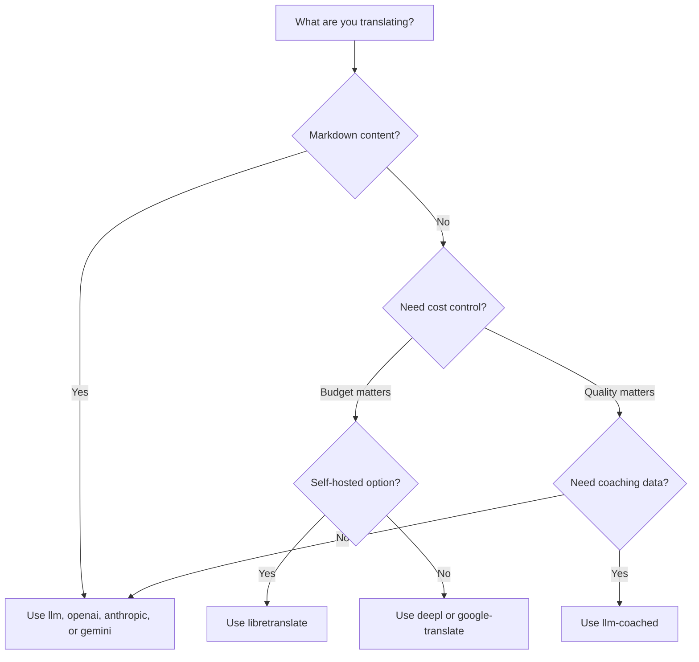

# 번역 방법

Champollion은 다양한 번역 방식을 지원해요. 각 언어 쌍마다 다른 방식을 사용할 수 있어서, 전체 프로젝트에 한 가지 방식만 사용하도록 얽매일 필요가 없어요.

## 방법 비교

### LLM 제공자

품질 중심, Markdown 인식, 코칭 호환. 콘텐츠 중심 프로젝트에 가장 적합해요.

| 방법 | 키 | 기능 |
|--------|-----|-------------|
| `llm` (기본값) | `OPENROUTER_API_KEY` | OpenRouter를 통한 LLM — 200개 이상의 모델, 자동 라우팅 |
| `llm-coached` | `OPENROUTER_API_KEY` | LLM + 문법 규칙, 사전, 스타일 노트 |
| `openai` | `OPENAI_API_KEY` | 직접 OpenAI API (gpt-4o, gpt-4o-mini) |
| `anthropic` | `ANTHROPIC_API_KEY` | 직접 Anthropic API (Claude Sonnet, Haiku, Opus) |
| `gemini` | `GEMINI_API_KEY` | 직접 Google Gemini API (Flash, Pro) — 무료 등급 |

### 전통적 MT

속도와 비용 중심. 대량 키-값 쌍에 가장 적합해요.

| 방식 | 키 | 설명 |
|--------|-----|-------------|
| `google-translate` | `GOOGLE_TRANSLATE_API_KEY` | Google Cloud Translation API v2 (194개 언어) |
| `deepl` | `DEEPL_API_KEY` | 용어집을 지원하는 DeepL API (33개 언어) |
| `microsoft-translator` | `MICROSOFT_TRANSLATOR_API_KEY` | Azure Cognitive Services Translator (135개 언어) |
| `libretranslate` | *(자체 호스팅)* | 자체 호스팅 LibreTranslate (AGPL, 무료) |
| `tilde` | `TILDE_API_KEY` | Tilde MT — EU에서 개발한 엔진, 발트해 및 유럽 언어에 강점 |
| `translated` | `LARA_ACCESS_KEY_ID` + `LARA_ACCESS_KEY_SECRET` | Translated's Lara — 전문가용 적응형 기계 번역(MT) (200개 언어) |

### 인프라

| 방법 | 키 | 기능 |
|--------|-----|-------------|
| `api` | *(제공자별)* | 모든 REST 번역 엔드포인트를 위한 경량 HTTP 클라이언트 |

## 결정 트리



---

## `llm` — LLM 번역 (기본값)

[OpenRouter](https://openrouter.ai)의 모든 LLM을 통해 번역해요. 이것은 기본 방법이며 가장 다재다능해요.

**작동 방식:**
1. 레지스터 및 컨텍스트 지침과 함께 키를 배치 처리해요 (기본 80개/배치)
2. 구조화된 프롬프트로 OpenRouter에 전송해요
3. JSON 응답을 파싱해요
4. [품질 게이트](/docs/concepts/quality-gate)를 통해 각 번역을 검증해요
5. 통과한 번역을 작성하고, 실패한 경우 재시도하거나 거부해요

**사용 시기:** 대부분의 프로젝트. 특히 코드 블록과 숏코드를 보호해야 하는 Markdown이 포함된 콘텐츠 중심 사이트에 적합해요.

**설정:**

```json
{
  "defaultMethod": "llm",
  "model": "google/gemini-3.5-flash"
}
```

## `llm-coached` — 코칭된 LLM 번역

`llm`과 동일하지만, 모든 프롬프트에 문법 규칙, 용어 사전, 스타일 노트가 주입돼요.

**작동 방식:**
1. `.champollion/coaching/<locale>.json` 또는 플러그인의 `coaching/` 디렉터리에서 코칭 데이터를 로드해요
2. 문법 규칙, 사전 용어, 스타일 노트를 시스템 프롬프트에 주입해요
3. 소스 키와 일치하는 사전 용어는 필수 용어로 포함돼요
4. 번역은 `llm`과 마찬가지로 진행되며, 코칭 데이터가 정확성을 더해줘요

**사용 시기:** 저자원 언어, 도메인별 용어(법률, 의료), 격식 있는 레지스터, 또는 일반 LLM 출력이 충분히 정확하지 않은 모든 경우에 적합해요.

**코칭 데이터 형식:**

```json title=".champollion/coaching/fr.json"
{
  "grammar_rules": [
    "French adjectives agree in gender and number with the noun they modify",
    "Use 'vous' for formal contexts, 'tu' for informal"
  ],
  "dictionary": {
    "dashboard": "tableau de bord",
    "deployment": "déploiement",
    "settings": "paramètres"
  },
  "style_notes": "Prefer active voice. Avoid anglicisms where a native French term exists."
}
```

참고: [저자원 언어 가이드](/docs/network/community/low-resource-languages)

---

## `openai` — 직접 OpenAI API

OpenAI Chat Completions API를 통해 직접 번역해요. OpenRouter 중개자 없이 — 당신의 키, 당신의 계정, 당신의 사용량 대시보드예요.

**모델:** `gpt-4o` (기본값), `gpt-4o-mini`

**기능:**
- ✅ Markdown 인식 (콘텐츠 번역)
- ✅ 코칭 지원 (문법 규칙, 사전 재정의, 스타일 노트)
- ✅ 구조화된 키-값 출력을 위한 JSON 모드
- ✅ 재시도 시 지수 백오프

**설정:**

```json
{
  "pairs": {
    "en:fr": { "method": "openai", "model": "gpt-4o-mini" }
  }
}
```

```bash
export OPENAI_API_KEY=sk-proj-...
```

[platform.openai.com/api-keys](https://platform.openai.com/api-keys)에서 키를 발급받으세요.

## `anthropic` — 직접 Anthropic API

Anthropic Messages API를 통해 직접 번역해요. 코칭 데이터에 `system` 매개변수를 사용하여 Anthropic의 프롬프트 캐싱을 활성화해요.

**모델:** `claude-sonnet-4-6` (기본값), `claude-haiku-4-5`, `claude-opus-4-7`

**기능:**
- ✅ Markdown 인식 (콘텐츠 번역)
- ✅ 코칭 지원 (문법 규칙, 사전 재정의, 스타일 노트)
- ✅ 시스템 프롬프트 캐싱 (배치 전반에 걸쳐 코칭 비용을 분산)
- ✅ 재시도 시 지수 백오프

**설정:**

```json
{
  "pairs": {
    "en:ja": { "method": "anthropic", "model": "claude-haiku-4-5" }
  }
}
```

```bash
export ANTHROPIC_API_KEY=sk-ant-...
```

[console.anthropic.com](https://console.anthropic.com/settings/keys)에서 키를 발급받으세요.

## `gemini` — 직접 Google Gemini API

Google Gemini `generateContent` API를 통해 직접 번역해요. **무료 등급 사용 가능** — 최고의 무비용 출발점이에요.

**모델:** `gemini-2.5-flash` (기본값), `gemini-2.5-pro`

**기능:**
- ✅ Markdown 인식 (콘텐츠 번역)
- ✅ 코칭 지원 (문법 규칙, 사전 재정의, 스타일 노트)
- ✅ `responseMimeType`을 통한 JSON 응답 모드
- ✅ 무료 등급 (넉넉한 일일 할당량)
- ✅ 재시도 시 지수 백오프

**설정:**

```json
{
  "pairs": {
    "en:ko": { "method": "gemini", "model": "gemini-2.5-pro" }
  }
}
```

```bash
export GEMINI_API_KEY=AI...
```

[aistudio.google.com/apikey](https://aistudio.google.com/apikey)에서 키를 발급받으세요.

### 모델 검증 {#model-validation}

직접 LLM 제공자(`openai`, `anthropic`, `gemini`)는 첫 사용 시 모델 문자열을 검증해요. 이를 통해 세 가지 종류의 실수를 잡아내요:

**잘못된 방법 형식** — 직접 제공자에 OpenRouter 스타일의 모델 경로를 사용하는 경우:

```
[WARN] OpenAI: model "google/gemini-3.5-flash" looks like an OpenRouter path.
       Direct providers use bare model names (e.g., "gpt-4o").
       To use OpenRouter models, set method to 'llm' instead.
```

**잘못된 제공자** — 완전히 다른 제공자의 모델을 사용하는 경우:

```
[WARN] Gemini: model "claude-sonnet-4-6" is an Anthropic model.
       This provider (gemini) cannot serve Anthropic models.
       Use --method anthropic or set "method": "anthropic" in config.
```

**지원 중단되었거나 잘못 입력된 모델** — 첫 API 호출 시, champollion은 제공자의 실시간 모델 목록을 가져와 당신의 모델을 대조해요:

```
[WARN] Gemini: model "gemini-1.5-flash" not found in available models.
       Similar models: gemini-2.0-flash, gemini-2.5-flash, gemini-2.5-pro
       The API call will proceed — the provider will give the final verdict.
```

:::note[이것은 오류가 아니라 경고입니다]
모델 검증은 경고를 기록하지만 API 호출을 차단하지는 않아요. 최종 판단은 공급자 API가 내려요 — 향후 모델 이름이 다른 패턴과 일치할 수도 있으며, 우리는 휴리스틱에 근거해 차단하고 싶지 않아요.
:::

---

## `google-translate` — Google Cloud Translation API

Google Cloud Translation API v2와의 직접 통합이에요. REST API를 사용해요 — SDK나 서비스 계정 없이. API 키만 있으면 돼요.

**사용 시기:** 뉘앙스보다 속도와 비용이 더 중요한 대용량 키-값 문자열 쌍에 사용해요. 기본적으로 194개 언어를 지원해요([Google의 공식 목록](https://docs.cloud.google.com/translate/docs/languages)).

**제한 사항:**
- ⚠️ **Markdown 인식 없음.** 코드 블록, 숏코드, 보간 변수를 손상시켜요.
- 레지스터/톤 제어 없음
- 코칭 또는 용어 적용 없음

```bash
npx champollion sync --method google-translate
```

:::tip[자동 감지]
`GOOGLE_TRANSLATE_API_KEY`만 설정되어 있고 (OpenRouter 키는 없는 경우) champollion은 자동으로 Google Translate로 전환해요. 설정 변경이 필요 없어요.
:::

## `deepl` — DeepL API

DeepL 번역 API와의 직접 통합이에요. 일관된 용어를 위한 용어집을 지원해요.

**사용 시기:** DeepL이 뛰어난 유럽 언어(독일어, 프랑스어, 스페인어, 네덜란드어, 폴란드어 등)에 적합해요. 용어집 지원으로 코칭 데이터 없이도 일관된 용어를 적용할 수 있어요.

**기능:**
- ✅ 자동 무료/프로 엔드포인트 감지 (무료 키의 `:fx` 접미사)
- ✅ 용어집 생성 및 관리
- ✅ 격식 수준 제어
- ⚠️ **Markdown 인식 없음** — 키-값 쌍만 지원

**설정:**

```json
{
  "pairs": {
    "en:de": { "method": "deepl" }
  }
}
```

```bash
export DEEPL_API_KEY=your-key-here
```

[deepl.com/pro-api](https://www.deepl.com/pro-api)에서 키를 발급받으세요.

## `microsoft-translator` — Azure Cognitive Services

Microsoft Translator Text API v3과의 직접 통합이에요.

**사용 시기:** 기존 Azure 인프라를 갖춘 엔터프라이즈 환경에 사용해요. Google Translate에서 지원하지 않는 일부 언어(티베트어, 페로어, 이누크티투트어 등)를 포함하여 135개 언어를 지원해요.

**기능:**
- ✅ 요청당 최대 100개 세그먼트 (높은 처리량)
- ✅ 지연 시간 최적화를 위한 선택적 리전 매개변수
- ⚠️ **Markdown 인식 없음** — 키-값 쌍만 지원
- ⚠️ **콘텐츠 번역 없음** — 키-값 쌍만 지원

**설정:**

```json
{
  "pairs": {
    "en:ar": { "method": "microsoft-translator" }
  }
}
```

```bash
export MICROSOFT_TRANSLATOR_API_KEY=your-key
export MICROSOFT_TRANSLATOR_REGION=global  # optional
```

[Azure Portal](https://portal.azure.com) → Cognitive Services → Translator에서 키를 발급받으세요.

## `libretranslate` — 자체 호스팅 번역

LibreTranslate를 사용한 자체 호스팅 오픈소스 번역이에요. 로컬 또는 자체 인프라에서 실행돼요 — API 비용 제로, 완전한 데이터 주권을 제공해요.

**사용 시기:** 오프라인 번역, 데이터 프라이버시 준수(GDPR), 또는 무비용 운영이 필요한 프로젝트에 적합해요. 외부 API에 의존해서는 안 되는 CI 파이프라인에 특히 유용해요.

**기능:**
- ✅ 자체 호스팅 — 외부 API 호출 없음
- ✅ 무료 및 오픈소스 (AGPL-3.0)
- ✅ Docker 배포 가능
- ⚠️ **Markdown 인식 없음** — 키-값 쌍만 지원
- ⚠️ **콘텐츠 번역 없음** — 키-값 쌍만 지원
- ⚠️ 언어 쌍에 따라 품질이 다름

**설정:**

```bash
# Run LibreTranslate locally with Docker
docker run -d -p 5000:5000 libretranslate/libretranslate

# Configure (optional — defaults to localhost:5000)
export LIBRETRANSLATE_API_URL=http://localhost:5000/translate
```

```json
{
  "pairs": {
    "en:es": { "method": "libretranslate" }
  }
}
```

---

## `api` — 원격 번역 API

커뮤니티 호스팅 또는 IP 보호 번역 엔드포인트를 위한 경량 HTTP 클라이언트예요. Champollion은 키를 내보내고 번역을 받아와요 — 번역 로직은 전혀 포함하지 않아요.

**사용 시기:** 번역 방법이 서버 측에 호스팅되는 경우(예: 독점 코칭 데이터, 파인튜닝된 모델, 배포할 수 없는 FST 파이프라인).

```json
{
  "pairs": {
    "en:crk": {
      "method": "api",
      "endpoint": "https://api.example.com/v1/translate",
      "apiKey": "your-key"
    }
  }
}
```

:::note[커뮤니티 통제 번역 (주권 지향)]
`api` 방식은 **커뮤니티의 통제하에 커뮤니티가 호스팅하는 번역(주권 지향, sovereignty-aspirant)**으로 가는 가교 역할을 해요. 원주민 및 소수 언어 커뮤니티는 자체 번역 엔드포인트를 호스팅하여 코칭 데이터, 미세 조정된 모델, 언어적 지적 재산(IP)을 커뮤니티의 통제하에 유지할 수 있으며, Champollion은 씬 클라이언트(thin client)로서 이에 연결돼요.

전체 커뮤니티 호스팅 안내는 [저자원 언어 지원하기](/docs/network/community/low-resource-languages)를, 엔드포인트 요구 사항은 [API를 통한 방법 제공](/docs/guides/serving-a-method)을 참고하세요.
:::

---

## 언어 쌍별 설정

진정한 강점은 언어 쌍마다 방법을 혼합하는 데 있어요:

```json title="champollion.config.json"
{
  "version": 3,
  "pairs": {
    "en:fr": { "method": "deepl" },
    "en:ja": { "method": "openai", "model": "gpt-4o" },
    "en:ko": { "method": "gemini" },
    "en:ar": { "method": "microsoft-translator" },
    "en:crk": { "methodPlugin": "crk-coached-v1" }
  }
}
```

이 설정은 프랑스어는 DeepL(용어집 지원)을 통해, 일본어는 OpenAI(품질)를 통해, 한국어는 Gemini(무료 등급)를 통해, 아랍어는 Microsoft Translator(적용 범위)를 통해, Plains Cree는 코칭된 플러그인(전문화)을 통해 번역해요.

## 플러그인

플러그인은 특정 언어 쌍을 위해 미리 패키지화된 번역 레시피예요. 이는 코드가 아닌 JSON 매니페스트로, champollion에게 어떤 방식을 어떤 설정으로 사용할지, 그리고 어떤 품질이 벤치마크되었는지 알려줘요.

:::tip[평가 하네스에서 프로덕션까지 명령어 하나로]
[평가 하네스](/docs/network/specifications/harness)에서 개발되고 검증된 플러그인은 직접 설치할 수 있어요 — 거기서 검증한 방식이 단일 `plugin install` 명령어로 여기에 배포돼요. 전체 평가 워크플로는 [MT Evaluation](/docs/network/leaderboard/rules)을 참고하세요.
:::

```bash
champollion plugin install ./french-formal-v1/
champollion plugin list
champollion plugin remove french-formal-v1
```

전체 매니페스트 형식은 [플러그인 사양](/docs/reference/plugin-spec)을 참고하세요.

---

## 제공자 전환

방법 간에 이동하나요? 모델 형식과 환경 변수가 바뀌어요 — 여기 안내도가 있어요:

### OpenRouter → 직접 제공자

```diff title="champollion.config.json"
 {
   "pairs": {
     "en:fr": {
-      "method": "llm",
-      "model": "openai/gpt-4o"
+      "method": "openai",
+      "model": "gpt-4o"
     }
   }
 }
```

```diff title="Environment variables"
- export OPENROUTER_API_KEY=sk-or-v1-...
+ export OPENAI_API_KEY=sk-proj-...
```

**주요 차이점:**
- OpenRouter는 `provider/model` 형식을 사용해요 (예: `openai/gpt-4o`). 직접 제공자는 순수 모델 이름을 사용해요 (예: `gpt-4o`).
- 각 직접 제공자는 자체 환경 변수를 가져요 (`OPENAI_API_KEY`, `ANTHROPIC_API_KEY`, `GEMINI_API_KEY`).
- 잘못된 모델 형식을 사용하면 champollion이 경고해줘요 — [모델 검증](#model-validation)을 참고하세요.

### 직접 제공자 → OpenRouter

```diff title="champollion.config.json"
 {
   "pairs": {
     "en:ja": {
-      "method": "anthropic",
-      "model": "claude-sonnet-4-6"
+      "method": "llm",
+      "model": "anthropic/claude-sonnet-4-6"
     }
   }
 }
```

:::tip[OpenRouter와 Direct 중 언제 사용할까요]
**OpenRouter 사용**: 환경 변수를 변경하지 않고 모델 간 전환하고 싶거나, 하나의 키로 200개 이상의 모델에 접근하고 싶을 때 사용하세요. **직접 공급자 사용**: 더 간단한 청구, 더 낮은 지연 시간(중개자 없음), 또는 Anthropic의 프롬프트 캐싱과 같은 공급자별 기능에 접근하고 싶을 때 사용하세요.
:::

---

## 비용 비교

번역된 키 1,000개당 대략적인 비용 (키당 ~10토큰, 배치당 80키 가정):

| 방법 | 비용 / 1K 키 | 속도 | 품질 | 최적 용도 |
|--------|----------------|-------|---------|----------|
| `gemini` (Flash) | **무료** (등급 내) | 빠름 | 양호 | 시작하기, 개인 프로젝트 |
| `google-translate` | ~$0.02 | 가장 빠름 | 적절 | 대량, 유럽 언어 |
| `deepl` | ~$0.02 | 빠름 | 양호 | 유럽 언어, 용어 |
| `microsoft-translator` | ~$0.01 | 빠름 | 적절 | Azure 사용처, 넓은 언어 적용 범위 |
| `libretranslate` | **무료** (자체 호스팅) | 다양 | 보통 | 에어갭, GDPR, CI 파이프라인 |
| `gemini` (Pro) | ~$0.07 | 중간 | 매우 양호 | 품질 민감, 무료 할당량 |
| `openai` (GPT-4o-mini) | ~$0.01 | 빠름 | 양호 | 저예산 LLM |
| `openai` (GPT-4o) | ~$0.10 | 중간 | 매우 양호 | 품질 민감 |
| `anthropic` (Haiku) | ~$0.01 | 빠름 | 양호 | 저예산 LLM |
| `anthropic` (Sonnet) | ~$0.10 | 중간 | 매우 양호 | 품질 민감 |
| `anthropic` (Opus) | ~$0.50 | 느림 | 우수 | 최대 품질 |
| `llm` (OpenRouter) | 모델별 다양 | 다양 | 다양 | 모델 비교, 실험 |

:::note[이것은 추정치입니다]
실제 비용은 소스 텍스트 길이, 배치 크기, 공급자 가격 변동에 따라 달라져요. 정확한 요율은 각 공급자의 현재 가격 페이지를 확인하세요.
:::

---

## 참고 항목

- [지원 언어](/docs/reference/supported-languages)
- [코칭 데이터](/docs/concepts/coaching-data)
- [저자원 언어 지원하기](/docs/network/community/low-resource-languages)
- [플러그인 사양](/docs/reference/plugin-spec)
- [API를 통한 방법 제공](/docs/guides/serving-a-method)
- [품질 게이트](/docs/concepts/quality-gate)
- [아키텍처](/docs/concepts/architecture)
- [문제 해결](/docs/guides/troubleshooting) — 모델 오류, API 문제

