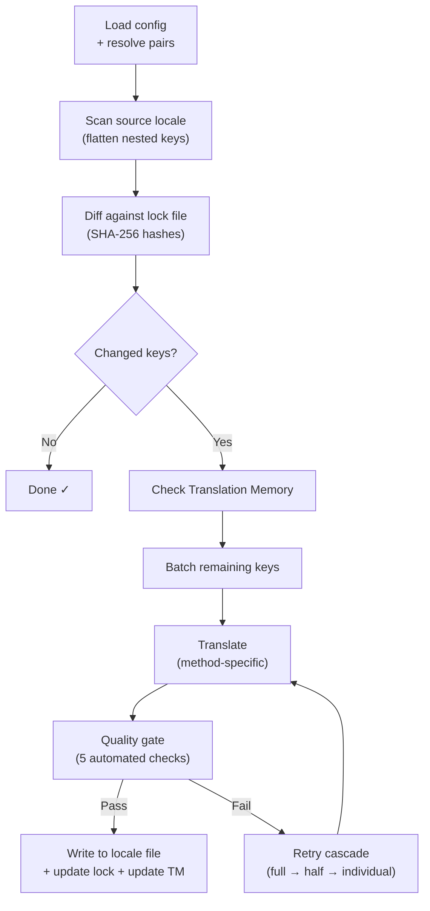

# champollion 작동 방식

champollion은 명령어 하나로 앱의 로케일 파일을 번역해요. 내부에서 어떤 일이 일어나는지 살펴볼게요.

## 파이프라인

`npx champollion sync`을 실행하면 champollion은 6단계 파이프라인을 수행해요:



**핵심 설계 결정 사항:**

- **SHA-256 해시를 통한 변경 감지.** Champollion은 `.champollion.lock`에서 모든 소스 값을 해시로 추적해요. 영어 문자열을 업데이트하면 해당 키만 다시 번역돼요. 이것이 `sync`가 반복 실행 시 빠른 이유예요 — 최소한의 작업만 수행하거든요.

- **Translation Memory 캐싱.** API를 호출하기 전에 champollion은 캐시된 번역(소스 텍스트 + 로케일 + 방식을 키로 사용)을 `.champollion/tm.json`에서 확인해요. 하나의 키를 변경한 후 일반적인 재동기화를 수행하면 142개의 키는 캐시에서 가져오고 1개의 키만 API를 호출해요.

- **쓰기 전 품질 게이트.** 모든 번역은 파일에 반영되기 전에 다섯 가지 자동 검사(빈 값, 소스 반복, 환각 루프, 길이 팽창, 스크립트 준수)를 통과해요. 실패는 기록되며, 절대 조용히 받아들여지지 않아요.

- **실패 시 재시도 캐스케이드.** 배치가 실패하면(JSON 파싱 오류, API 타임아웃) champollion은 점진적으로 더 작은 배치로 재시도해요: 전체 → 절반 → 개별. 이렇게 하면 나머지를 차단하지 않고 문제가 되는 키를 분리할 수 있어요.

## 번역 메서드

Champollion은 다양한 번역 방식을 지원하며, 각 방식은 서로 다른 상황에 적합해요. 주요 방식은 다음과 같아요:

| 방식 | 작동 방식 | 적합한 경우 |
|--------|-------------|----------|
| **`llm`** | 모든 OpenRouter 모델에 대한 구조화된 프롬프트 | 자원이 풍부한 언어 |
| **`llm-coached`** | 동일한 프롬프트 + 문법 규칙, 사전, 스타일 노트 | LLM이 예측 가능한 오류를 일으키는 언어 |
| **`google-translate`** | Google Cloud Translation API 배치 요청 | GT 지원이 우수한 고자원 언어 |
| **`api`** | 자체 엔드포인트로의 HTTP POST | 커스텀 파이프라인, 커뮤니티가 관리하는 모델 |

방식은 언어 쌍별로 구성돼요. 프랑스어에는 `google-translate`를 사용하고 Plains Cree에는 `llm-coached`를 사용할 수 있어요 — 각 쌍에는 가장 잘 맞는 방식이 적용돼요.

## 코칭 데이터

`llm-coached` 쌍의 경우, 코칭 데이터는 LLM에게 명시적인 언어 지식, 즉 문법 규칙, 강제 용어, 스타일 선호도를 제공해요. 이는 구조화된 컨텍스트로서 모든 프롬프트에 주입돼요.

```json title="coaching/crk.json"
{
  "grammar_rules": ["Animate nouns take different plural forms than inanimate nouns"],
  "dictionary": {"welcome": "ᑕᓂᓯ", "settings": "ᐃᑕᐢᑌᐘᐃᓇ"},
  "style_notes": "Use Standard Roman Orthography (SRO) unless explicitly configured otherwise."
}
```

코칭 데이터는 모델을 파인튜닝하지 않고도 번역 품질을 향상시키는 주요 메커니즘이에요. 규칙을 변경하고 → 동기화를 다시 실행하고 → 도움이 되는지 확인하세요. 반복은 즉각적으로 이루어져요.

## 플러그인

플러그인은 특정 언어 쌍을 위해 미리 패키지화된 번역 레시피예요. 이는 코드가 아닌 JSON 매니페스트로, champollion에게 어떤 방식을 어떤 설정으로 사용할지, 그리고 어떤 품질이 벤치마크되었는지 알려줘요.

```bash
champollion plugin install ./crk-coached-v3/
champollion sync   # uses the installed plugin for en→crk
```

플러그인은 연구와 프로덕션 사이의 간극을 메워요: [Network](/arena)에서 좋은 점수를 받은 방식을 플러그인으로 패키지화하여 여기에 배포할 수 있어요.

## 더 큰 그림

champollion은 두 부분으로 이루어진 생태계의 한 축이에요:

- **[the Network](/arena)** — 재현 가능한 벤치마킹을 통해 번역 방식이 **개발되고 검증되는** 곳
- **champollion** — 검증된 방식이 실제 콘텐츠를 번역하기 위해 **배포되는** 곳

[Eval Harness Bridge](/docs/guides/bridge)가 이 둘을 연결해요. Network에서 스스로를 입증한 방식은 여기에 배포돼요. 프로덕션에서 받은 화자 피드백은 다음 버전을 개선해요.

---

## 더 깊이 알아보기

- [동기화 작동 방식](/docs/concepts/how-sync-works) — 단계별 파이프라인 상세 설명
- [품질 게이트](/docs/concepts/quality-gate) — 다섯 가지 자동 검사
- [Translation Memory](/docs/concepts/translation-memory) — 캐싱과 비용 절감
- [번역 방식](/docs/guides/translation-methods) — 방식 상세 비교
- [아키텍처](/docs/concepts/architecture) — 시스템 설계 개요
