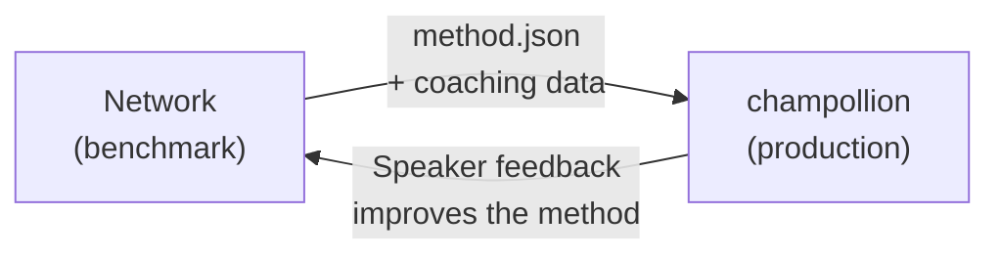

# 프로덕션에 배포하기

Network에서 작동함을 확인했어요. 이제 배포할 차례예요.

Network는 R&D를 위한 공간이에요 — 번역 방법을 구축하고, 벤치마킹하고, 비교하는 곳이죠. **프로덕션 배포**는 개발자 대상 번역 CLI인 [champollion](https://champollion.dev)을 통해 이루어져요. 둘은 공유 플러그인 형식을 통해 연결돼요.


```mermaid
graph LR
    A["Network\n(benchmark)"] -->|"method.json\n+ coaching data"| B["champollion\n(production)"]
    B -->|"Speaker feedback\nimproves the method"| A
```

---

## 배포 경로

### 1. 방법을 플러그인으로 내보내기

벤치마크 결과를 패키징하는 `method.json` 매니페스트를 생성하세요:

```json
{
  "name": "french-formal-v1",
  "type": "llm-coached",
  "version": "1.0.0",
  "description": "Formal-register French (example manifest; the benchmark values are illustrative)",
  "locales": ["fr"],
  "config": {
    "model": "google/gemini-2.5-flash",
    "temperature": 0.3
  },
  "benchmarks": {
    "fr": {
      "corpus_chrf": 72.3,
      "exact_match_rate": 0.42,
      "corpus_size": 500
    }
  }
}
```

매니페스트와 함께 코칭 데이터(문법 규칙, 사전)도 포함하세요.

### 2. Champollion에 설치하기

```bash
champollion plugin install ./french-formal-v1/
```

### 3. 페어 구성하기

```json title="champollion.config.json"
{
  "pairs": {
    "en:fr": { "methodPlugin": "french-formal-v1" }
  }
}
```

### 4. 실제 콘텐츠 번역하기

```bash
npx champollion sync
```

이제 벤치마킹한 방법이 프로덕션에서 실제 번역을 생성하고 있어요.

---

## 토착어의 경우

원주민 언어 커뮤니티를 지원하는 방식은 프로덕션 배포 전에 **커뮤니티의 동의**가 필요해요. 원주민 데이터 주권 원칙 — 언어 데이터에 대한 커뮤니티의 소유권과 통제권 — 은 번역 방식을 개발하고 평가하며 배포하는 모든 과정을 규정해요.

그 어떤 점수로도 배포 가능 여부를 결정할 수 없어요 — 높은 chrF++ 점수나 수상 기준이라 해도 마찬가지예요. 해당 언어의 화자가 결과물을 평가한 후, 언어 커뮤니티의 자치 기구가 동의하는 **경우에만 비로소** 배포할 수 있어요.

전체 거버넌스 프레임워크는 [데이터 주권](/docs/network/sovereignty/data-sovereignty)과 [소유권 이전](/docs/network/sovereignty/ownership-transfer)을 참고하세요.

---

## 참고 항목

- [Eval Harness Bridge](https://champollion.dev/docs/guides/bridge) — Network→champollion 파이프라인에 대한 자세한 설명
- [플러그인 명세](https://champollion.dev/docs/reference/plugin-spec) — method.json 매니페스트 형식
- [champollion 에이전트 가이드](https://champollion.dev/docs/guides/agent-guide) — 번역에 champollion을 사용하는 방법
