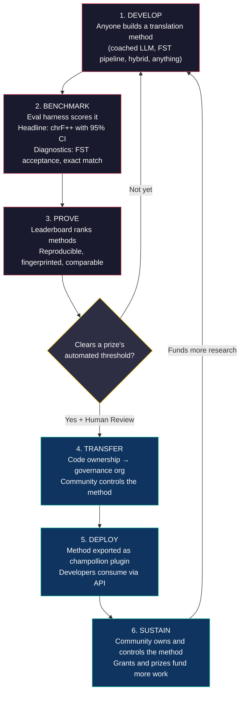
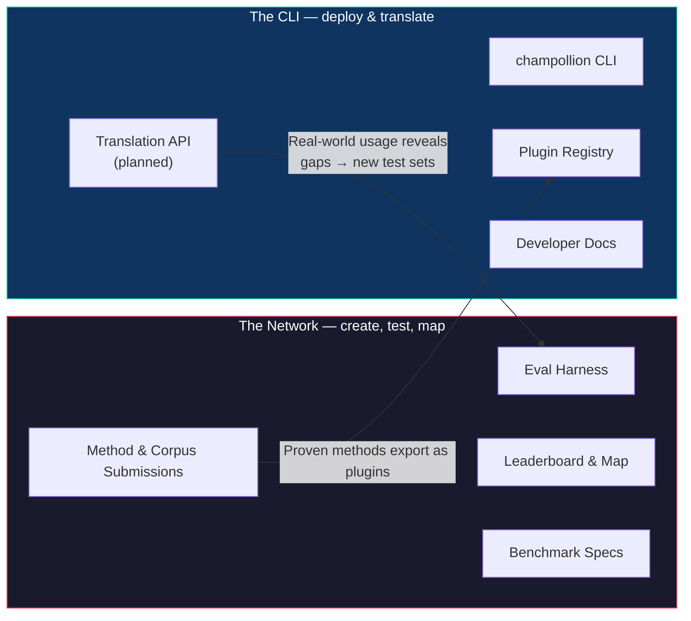
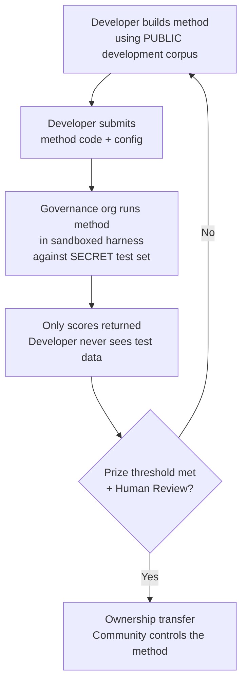

# 네트워크 작동 방식: 빌드, 테스트, 개발, 배포

> **요약.** 전 세계 소외 언어를 위한 기계 번역은 모델 학습의 문제가 아니라 *인프라*의 문제입니다. 단일 모델, 연구소 또는 기업이 이 문제를 해결할 수는 없어요. 이 문서는 전 세계의 ML 엔지니어, 언어학자, 언어 화자 커뮤니티를 분산형 연구소로 탈바꿈시키는 플랫폼 아키텍처를 설명합니다. 누구나 번역 방식을 구축하고, 네트워크는 플랫폼이 절대 볼 수 없는 커뮤니티 보유 평가 데이터를 포함하여 그 방식이 제대로 작동하는지 테스트합니다. 그리고 효과가 입증된 방식은 해당 언어를 사용하는 커뮤니티가 소유하는 자산이 됩니다. 이 메커니즘은 개방적이고 협력적인 방식의 개발과 관리자가 설정한 유연한 조건이 결합된 형태입니다. 이는 실제로는 여전히 드문 조합이지만, 이 문제에 꼭 필요하다고 생각하는 방식이에요.

---

> [!IMPORTANT]
> **범위.** 이 플랫폼은 문서, 교육 자료, 공식 커뮤니케이션, UI 문자열 등 **공식적인 서면 텍스트 번역**을 평가합니다. 챗봇이나 실시간 통역기, 무제한 도메인 대화 시스템이 아니에요. 리더보드는 특정 텍스트 도메인의 큐레이션된 병렬 말뭉치를 기준으로 번역 방식의 순위를 매깁니다(도메인 분류는 [Benchmark Specification §2.7](/docs/network/specifications/benchmark#27-domain)을 참조하세요). 기계 번역(MT)은 언어 부흥을 위한 인프라이지, 이를 대체하는 수단이 아닙니다. 아이들은 기계가 아닌 사람에게서 언어를 배웁니다.

### 현재 도메인 커버리지

보드는 **실시간으로 업데이트**되고 있습니다. 실행 결과가 지속적으로 게시되며,
누구나 더 추가할 수 있어요. 아래 표는 도메인별로 *지원되는* 공개 참조 말뭉치를 보여줍니다.
실시간 순위는 [리더보드](/leaderboard)에서 확인할 수 있어요.
말뭉치는 실행 시점에 소스에서 가져오며, 이곳에 호스팅되지 않습니다.

| 도메인 | 참조 말뭉치 | 상태 | 참고 |
|--------|------------------|--------|-------|
| 뉴스 / 저널리즘 | Global Voices (OPUS) | 지원됨 — 제출 가능 | 493개 언어 쌍, CC BY 3.0 |
| 일상 / 혼합 (서면) | Tatoeba | 지원됨 — 제출 가능 | 874개 언어 쌍, CC BY 2.0 |
| 교육 / 교과서 | EdTeKLA (Plains Cree) | 연구 전용 — **순위 없음**; 원격 모델 API 평가 동의 필요 | EdTeKLA의 수정된 CC BY-NC-SA (주권 범위, 비상업적); 리더보드, 상금, API/상업적 경로에서 제외됨 |
| 서사 / 문학 | — | 계획됨 | 아직 실행 가능한 말뭉치가 연결되지 않음 |
| 종교 / 경전 | FLORES+ (성경 도메인) | 연결됨, 상대 평가 전용 | 실행 가능한 말뭉치; 오염도가 높아 상대 평가로만 사용됨 — 공식 점수 산정에는 절대 사용되지 않음 |
| 구어 / 실시간 | — | 범위 외 | 이 시스템은 음성이 아닌 서면 텍스트를 평가함 |
| 기술 / 과학 | — | 예정 | 도메인별 용어 검증 필요 |

## 네트워크의 목적

작동 방식에 앞서 미션을 먼저 말씀드릴게요. Champollion 네트워크는 다음 네 가지 약속을 바탕으로 합니다.

1. **번역 테스트 세트 생성 및 신뢰성 확보.** 대부분의 언어에서 희소하고 가치 있는 것은 또 다른 모델이 아니라, 사람이 직접 작성하고 도메인에 충실하며 버전이 고정된 *신뢰할 수 있는* 테스트 세트예요. Network는 이러한 테스트 세트를 만들고 신뢰할 수 있도록 하기 위해 존재해요.
2. **분야 파악을 용이하게.** 누가 무엇을 번역할 수 있는지, 각 텍스트 유형별로 각 방법이 얼마나 우수한지, 그리고 어떤 격차가 있는지를 흩어져 있는 논문이나 PDF에 묻어두지 않고 공개 맵으로 드러내요.
3. **인간과 기계 모두, 어떤 방법이든 환영해요.** 우리는 해결책 지향적인 실용주의자예요. 전문 번역가, 규칙 기반 시스템, 코칭된 LLM, 미세조정(fine-tuned) 모델 모두 동등하게 환영받아요. 우리는 어떤 도구가 이기느냐가 아니라, 언어가 실제로 번역되는 데 집중해요.
4. **커뮤니티와 *함께* 협력하도록 설계되었어요. 커뮤니티 말뭉치를 직접 호스팅하지 않으며 주권은 양보할 수 없어요.** 언어 데이터는 생체 데이터와 같아요. 말뭉치를 제공하는 사람들이 해당 말뭉치와 이를 기준으로 측정되는 모든 것에 대한 권리를 보유해요.

아래에 설명된 루프, 하네스, 리더보드, 배포 브리지 등 모든 내용은 이 네 가지 약속을 실현하기 위한 것입니다.

---

## 1. 문제점: 기계 번역 ≠ 머신 러닝

자원이 부족한 언어(LRL)를 위한 기계 번역은 흔히 데이터를 수집하고, 모델을 학습시키고, 배포하는 머신 러닝 문제로 인식됩니다. 하지만 이러한 인식은 잘못되었으며, 그 오류의 결과는 중대합니다. 전 세계 대부분의 언어에 구조적으로 작동할 수 없는 접근 방식에 자금, 인재, 인프라를 집중시키기 때문이에요.

### 1.1 ML 프레임이 실패하는 이유

기계 번역을 위한 표준 ML 파이프라인에는 대규모 병렬 말뭉치, 검증된 평가 벤치마크, 배포 경로라는 세 가지가 필요합니다. Google Cloud Translation 목록에 있는 194개 언어와 NLLB-200이 다루는 200개 언어의 경우 이 세 가지가 모두 존재해요. OMT-1600의 롱테일에 속하는 약 1,200개 언어(저자들이 모델이 "충분히 잘 이해한다"고 보고한 400여 개를 제외한 나머지)의 경우, 평가 데이터는 존재하지만 품질이 대부분 사용 가능한 기준치 이하이고, 모델 가중치는 공개되지 않으며, 배포 파이프라인도 없습니다. 나머지 5,400여 개 언어의 경우에는 이 중 어느 것도 존재하지 않아요.

| 요구 사항 | 고자원 언어 | OMT-1600 롱테일 (약 1,200개 LRL) | 나머지 약 5,400개 언어 |
|-------------|------------------------|-------------------------------|---------------------------|
| **병렬 말뭉치** | 수백만 개의 문장 쌍 (Europarl, UN Corpus, OpenSubtitles) | 성경 도메인 병렬 텍스트, 웹 스크래핑, 합성 역번역. 커뮤니티 큐레이션 데이터 없음. | 수백에서 수천 개 수준이거나 아예 없음 |
| **평가 벤치마크** | WMT, FLORES, NTREX — 표준화되고 재현 가능함 | BOUQuET (성경 도메인), met-BOUQuET. 형태론적 검증 없음. 독립적인 평가 없음. | 표준 벤치마크 없음; 임시 평가 |
| **배포 경로** | Google Translate, DeepL, Azure — 상업용 API | 모델 가중치 미공개. CLI, 플러그인 시스템, 커뮤니티 배포 가능 API 없음. | 없음. API, 제품, 시장 모두 없음. |

ML 접근 방식은 학습할 데이터가 존재하고 배포할 시장이 존재할 때 효과가 있습니다. OMT-1600은 첫 번째 조건을 크게 확장했지만, 독립적인 품질 검증, 형태론적 검증 또는 커뮤니티 거버넌스가 없는 확장은 신뢰할 수 없는 확장입니다. 문제는 단순히 "더 나은 모델이 필요하다"는 것이 아니라, "커뮤니티가 통제하는 조건 하에 모델이 작동함을 증명하는 인프라가 필요하다"는 것이에요.

### 1.2 LRL을 위한 기계 번역에 실제로 필요한 것

소외 언어를 위한 번역은 근본적으로 학습의 문제가 아닙니다. 이는 **방식 엔지니어링(method engineering)**의 문제, 즉 사용 가능한 리소스(LLM, 형태소 도구, 커뮤니티 지식, 언어 규칙)를 조합하여 작동하는 번역 파이프라인을 구축하고, 엄격한 평가를 통해 그 효과를 증명하는 과제입니다.

이러한 차이는 중요합니다.

| 구분 | ML 접근 방식 | 방식 엔지니어링 접근 방식 |
|-----------|------------|---------------------------|
| **핵심 활동** | 데이터로 모델 학습 | 도구, 프롬프트, 언어 지식을 파이프라인으로 결합 |
| **병목 현상** | 병렬 데이터의 양 | 엔지니어링 창의성 + 평가 인프라 |
| **참여 가능자** | GPU 클러스터와 데이터 세트를 보유한 팀 | API 키, 사전, 아이디어를 가진 누구나 |
| **평가** | 분리된 테스트 세트에 대한 BLEU/chrF | 형태론적 검증 + 사람의 검토 + 자동화된 지표 |
| **배포** | 모델 서빙 | 방식을 플러그인으로 패키징 |

최신 LLM은 이미 많은 저자원 언어에 대한 잠재적 지식을 포함하고 있어, 그럴듯해 *보이는* 결과물을 생성할 수 있습니다. 문제는 이러한 결과물이 형태론적으로 유효하지 않은 경우가 많다는 점이에요(모델이 해당 언어에 존재하지 않는 단어 형태를 환각으로 만들어냅니다). 여기서 엔지니어링 과제는 LLM이 알고 있는 것을 어떻게 추출하고, 언어적 현실에 맞게 검증하며, 그 결과를 프로덕션 환경에서 사용할 수 있도록 패키징할 것인가 하는 점입니다.

이것이 바로 우리가 모델이 아닌 **방식**을 벤치마킹하는 이유입니다. 방식은 모델 선택 + 프롬프트 엔지니어링 + 도구 사용 + 전/후처리 + 코칭 데이터 + 재시도 전략을 모두 포함하는 전체 레시피입니다. 같은 모델을 사용하더라도 다른 방식을 사용하는 두 팀은 다른 점수를 받게 됩니다. 이것이 핵심이에요.

### 1.3 포합어(Polysynthetic Languages)가 모든 것을 무너뜨리는 이유

전 세계에서 가장 소외된 언어 중 상당수는 **포합어(polysynthetic)**입니다. 생산적인 형태론적 과정을 통해 문장 전체를 하나의 단어로 인코딩하죠. Plains Cree어의 다음 단어를 예로 들어볼게요.

> **ê-kî-nitawi-kîskinwahamâkosiyân**
> *"내가 학교에 갔을 때"*

단 하나의 단어입니다. 이 단어에는 시제(과거), 방향(~로 가는), 어근(배우다), 태(수동/재귀), 인칭(1인칭 단수)이 모두 인코딩되어 있어요. Cree어가 한 단어로 표현하는 것을 영어는 여섯 단어로 표현해야 합니다.

이는 모든 수준에서 표준 기계 번역을 무너뜨립니다.

- **토큰화(Tokenization)** — BPE와 SentencePiece는 교착어 형태론을 위해 설계되었기 때문에 포합어 단어를 의미 없는 조각으로 찢어버립니다.
- **환각(Hallucination)** — LLM은 유효한 단어가 아닌 그럴듯해 보이는 문자열을 생성합니다. 해당 언어를 구사하지 못하는 사람은 그 차이를 알 수 없어요. 형태론적 검증이 없다면 환각은 눈에 띄지 않습니다.
- **평가(Evaluation)** — 단어 수준 지표(BLEU)는 이러한 언어들이 작동하는 방식의 근본인 자연스러운 굴절 변형에 페널티를 줍니다. 문자 수준 지표(chrF++)가 더 낫긴 하지만, 구조적 검증 없이는 여전히 불충분해요.

해결책은 더 큰 모델이나 더 많은 학습 데이터가 아닙니다. **사용자에게 도달하기 전에 환각을 잡아내는 인프라**, 즉 "이것은 이 언어의 단어가 아닙니다"라고 명확하게 말할 수 있는 형태소 분석기(FST)가 필요합니다.

---

## 2. 기존 접근 방식이 작동하지 않는 이유

### 2.1 상업용 기계 번역

상업용 번역 서비스는 역사적으로 시장 규모에 최적화되어 왔습니다. Meta의 OMT-1600(2026년 3월)은 하나의 시스템에 1,600개 언어를 담아내는 중대한 변화를 보여줍니다. 하지만 롱테일에 속하는 약 1,200개 언어(저자들이 모델이 "충분히 잘 이해한다"고 보고한 400여 개를 제외한 나머지)의 경우, 품질이 사용 가능한 기준치 이하이고, 모델 가중치를 사용할 수 없으며, 배포 파이프라인도 없습니다. 구조적인 인센티브 문제가 진화한 셈이죠. 빅테크 기업이 이제 LRL을 위한 모델을 구축할 수는 있지만, 독립적인 평가, 형태론적 검증 또는 커뮤니티 거버넌스가 없다면 커버리지 확대만으로는 문제를 해결할 수 없어요.

### 2.2 학술 연구

학술적인 기계 번역 연구는 압도적으로 고자원 언어 쌍에 집중되어 있습니다. 학습 데이터, 공유 과제, 논문 발표 기회가 그곳에 있기 때문이죠. 저자원 언어 쌍을 연구하는 연구자들은 논문 출판, 컴퓨팅 자금 조달, 배포에 어려움을 겪습니다. LRL을 위한 배포 인프라가 존재하지 않기 때문이에요.

### 2.3 일회성 대회

Kaggle 대회를 열 수도 있습니다. "영어→Plains Cree어, 최고 chrF++ 점수 달성자에게 1만 달러 상금." 그러면 다음과 같은 일이 벌어집니다.

1. 누군가 우승하여 노트북을 제출하고, 상금을 받고, 집으로 돌아갑니다.
2. 그 노트북은 Kaggle의 아카이브에서 썩어갑니다. 아무도 배포하지 않고, 아무도 유지보수하지 않아요.
3. 테스트 세트는 결국 공개되어 영원히 오염됩니다.
4. 거버넌스 조직은 수명 주기에 대한 실질적인 통제권 없이 Google의 서비스 약관에 따라 Google 인프라에 언어 데이터를 업로드하게 됩니다.
5. 배포 브리지가 없습니다. 우승한 노트북이 곧 작동하는 API는 아니니까요.

일회성 포상금은 현상금 사냥꾼을 끌어들일 뿐입니다. 커뮤니티 거버넌스가 있는 지속적인 리더보드만이 지속적인 참여를 만들어냅니다.

### 2.4 미세 조정(Fine-Tuning)

병렬 텍스트로 오픈 모델을 미세 조정하는 것은 명백한 ML 접근 방식입니다. 하지만 대부분의 LRL의 경우, 미세 조정에 필요한 병렬 말뭉치 자체가 존재하지 않는 데이터입니다. 그리고 이를 생성하려면 미세 조정이 대체하고자 하는 바로 그 이중 언어 구사자와 커뮤니티의 참여가 필요해요. 데이터가 필요한 기술로는 데이터 부족 문제를 스스로 해결할 수 없습니다.

---

## 3. 해결책: 주권적 평가를 동반한 협력적 방식 개발

이 플랫폼은 전통적인 접근 방식을 뒤집습니다. 한 팀이 하나의 모델을 구축하는 대신, **글로벌 커뮤니티가 함께 번역 방식을 구축하고 테스트**하며, 네트워크가 효과적인 방식을 검증합니다. 그리고 효과가 입증된 방식은 언어 커뮤니티가 소유권과 통제권을 유지한 채 프로덕션 환경에 배포됩니다.

### 3.1 전체 루프

```mermaid
graph TD
    A["1. DEVELOP\nAnyone builds a translation method\n(coached LLM, FST pipeline, hybrid, anything)"] --> B["2. BENCHMARK\nEval harness scores it\nHeadline: chrF++ with 95% CI\nDiagnostics: FST acceptance, exact match"]
    B --> C["3. PROVE\nLeaderboard ranks methods\nReproducible, fingerprinted, comparable"]
    C --> D{"Clears a prize's\nautomated threshold?"}
    D -->|"Not yet"| A
    D -->|"Yes + Human Review"| E["4. TRANSFER\nCode ownership → governance org\nCommunity controls the method"]
    E --> F["5. DEPLOY\nMethod exported as champollion plugin\nDevelopers consume via API"]
    F --> G["6. SUSTAIN\nCommunity owns and controls the method\nGrants and prizes fund more work"]
    G -->|"Funds more research"| A

    style A fill:#1a1a2e,stroke:#e94560,color:#fff
    style B fill:#1a1a2e,stroke:#e94560,color:#fff
    style C fill:#1a1a2e,stroke:#e94560,color:#fff
    style D fill:#2d2d44,stroke:#ffcc00,color:#fff
    style E fill:#0f3460,stroke:#16c79a,color:#fff
    style F fill:#0f3460,stroke:#16c79a,color:#fff
    style G fill:#0f3460,stroke:#16c79a,color:#fff
```

각 단계에는 특정 기능이 있습니다.

| 단계 | 진행 내용 | 혜택 대상 |
|-------|-------------|--------------|
| **개발** | 연구자, 학생 또는 취미 개발자가 LLM 프롬프팅, FST 파이프라인, 사전, 미세조정 모델, 규칙 기반 시스템 또는 하이브리드 등 원하는 모든 도구를 사용하여 번역 방법을 구축해요 | 기여자는 학습하고, 실험하며, 결과를 공개해요 |
| **벤치마크** | 평가 하네스가 재현 가능한 지표를 통해 표준화된 말뭉치를 기준으로 방법을 평가해요. 모든 실행은 테스트된 내용과 성능에 대한 완전한 기록인 [실행 카드(run card)](/docs/network/specifications/benchmark#3-run-card-schema)를 생성해요 | 연구자는 재현 가능하고 비교 가능한 결과를 얻어요 |
| **검증** | 결과가 공개 리더보드에 표시돼요. 방법을 순위화하고, 비교하며, 면밀히 검토해요. 커뮤니티는 무엇이 효과적이고 무엇이 그렇지 않은지 확인할 수 있어요 | 모두가 최신 기술 동향(SOTA)을 한눈에 파악할 수 있어요 |
| **양도** | 원주민 언어의 경우, 기본 약관 템플릿에 따라 상금의 자동 임계값을 통과하고 화자의 인간 검증을 거친 방법은 해당 코드의 소유권이 언어 커뮤니티의 거버넌스 조직으로 이전돼요 | 커뮤니티가 코드, 가중치, 배포 결정을 포함한 방법을 완전히 소유해요 |
| **배포** | 이 방법은 커뮤니티가 자체 인프라에서 실행할 수 있는 [champollion](https://github.com/gamedaysuits/Champollion) 플러그인으로 내보내져요. 개발자는 기반 방법을 이해할 필요 없이 번역을 활용할 수 있어요 | 개발자는 상용 API가 지원하지 않는 언어에 대한 번역을 얻을 수 있어요 |
| **지속 가능성** | 보조금 지원 및 후원 상금(현재는 자체 자금으로 운영 중이며 적극적으로 유치하고 있어요)을 통해 더 많은 말뭉치 확보, 화자 검증, 연구 비용을 조달해요. Champollion은 비상업적 프로젝트이며 커뮤니티가 소유한 자산에서 얻는 수익에 대해 어떠한 지분도 가져가지 않아요 | 유급 말뭉치 작업과 커뮤니티 소유의 방법은 단일 보조금의 수명을 넘어 지속돼요 |

### 3.2 개방형 협업이 효과적인 이유

개방형 참여는 부수적인 것이 아니라 핵심 메커니즘입니다. 그 이유는 다음과 같아요.

**접근 방식의 다양성.** 영어→Plains Cree어에 가장 적합한 방식은 FST로 제어되는 코칭된 LLM일 수 있습니다. 영어→Quechua어에 가장 적합한 방식은 사전 증강 파이프라인일 수 있죠. 영어→Inuktitut어에 가장 적합한 방식은 Nunavut Hansard 말뭉치에서 부트스트랩된 미세 조정 모델일 수 있습니다. 단일 팀이나 접근 방식이 모든 언어를 지배할 수는 없어요. 리더보드는 어떤 *종류*의 언어에 어떤 *종류*의 접근 방식이 효과적인지 보여주며, 이러한 메타 결과 자체가 하나의 연구 기여가 됩니다.

**지속적인 참여.** 리더보드는 결코 끝나지 않습니다. 항상 구축할 수 있는 더 나은 방식이 존재하죠. 모든 제출물은 이 문제에 컴퓨팅 자원과 지적 노력을 기부하는 셈입니다. 일회성 보조금과 달리, 개방적이고 지속적인 프로세스는 글로벌 커뮤니티로부터 지속적인 연구 투자를 이끌어냅니다.

**낮은 진입 장벽.** API 키, 사전, 아이디어만 있으면 됩니다. 평가 하네스는 오픈 소스입니다. 말뭉치 형식은 간단한 JSON이에요. 언어학 전공 학생이 자원이 풍부한 연구소와 맞먹을 수 있으며, 때로는 더 나은 결과를 낼 수도 있습니다. 도메인 지식(언어에 대한 이해)이 컴퓨팅 리소스보다 더 중요할 수 있기 때문이에요.

**배포 브리지.** 하네스에서 좋은 점수를 받은 방식은 구성 변경 한 번으로 프로덕션 환경에 배포됩니다. "여기서 증명하고, 저기서 배포하세요." 이것이 바로 Kaggle, WMT 공유 과제, 학술 논문이 메우지 못하는 간극입니다.

### 3.3 플랫폼 아키텍처

champollion.dev는 **두 가지 얼굴을 가진 하나의 허브**입니다. 동일한 사이트에서 테스트 세트를 만들고, 방식을 평가하고, 결과를 매핑하는 네트워크를 호스팅하는 동시에, 검증된 방식을 실제 프로젝트에 배포하는 CLI도 호스팅합니다. 하나의 도메인, 하나의 문서 세트, 하나의 데이터 계층을 공유하며, 아래의 레이블은 두 개의 사이트가 아닌 두 가지 *역할*을 설명합니다.

```mermaid
graph LR
    subgraph supply ["The Network — create, test, map"]
        S1["Eval Harness"]
        S2["Leaderboard & Map"]
        S3["Benchmark Specs"]
        S4["Method & Corpus Submissions"]
    end

    subgraph demand ["The CLI — deploy & translate"]
        D1["champollion CLI"]
        D2["Translation API\n(planned)"]
        D3["Plugin Registry"]
        D4["Developer Docs"]
    end

    S4 -->|"Proven methods export as plugins"| D3
    D2 -->|"Real-world usage reveals\ngaps → new test sets"| S1

    style supply fill:#1a1a2e,stroke:#e94560,color:#fff
    style demand fill:#0f3460,stroke:#16c79a,color:#fff
```

**[네트워크](/docs/network/)**는 시험장입니다. 대상 사용자는 번역가, 언어학자, 커뮤니티, 연구자입니다. 이곳의 모든 것은 테스트 세트를 만들고, 사람이나 기계의 방식을 평가하며, 공백이 어디에 있는지 매핑하는 것과 관련이 있습니다.

**[CLI](https://champollion.dev)**는 배포 측면입니다. 대상 사용자는 앱에 번역이 필요한 개발자입니다. 개발자는 방식이 어떻게 작동하는지 이해할 필요 없이 그저 호출하기만 하면 됩니다.

이 두 얼굴을 연결하는 다리는 바로 **방식(method)**입니다. 네트워크에서 생성되고 신뢰를 얻으며, CLI를 통해 배포용으로 패키징되고, 커뮤니티 언어의 경우 커뮤니티가 소유하게 됩니다.

---

## 4. 주권적 평가: 인프라가 중요한 이유

평가 인프라는 기술적인 세부 사항이 아니라 주권 모델의 핵심입니다. 표준 평가(공유 플랫폼에 테스트 세트 업로드)는 언어 데이터에 대한 통제권을 포기하는 것이기 때문에 원주민 언어에는 적합하지 않아요.

### 4.1 주권 메커니즘

```mermaid
graph TD
    DEV["Developer builds method\nusing PUBLIC development corpus"] --> SUBMIT["Developer submits\nmethod code + config"]
    SUBMIT --> SANDBOX["Governance org runs method\nin sandboxed harness\nagainst SECRET test set"]
    SANDBOX --> SCORES["Only scores returned\nDeveloper never sees test data"]
    SCORES --> THRESHOLD{"Prize threshold met\n+ Human Review?"}
    THRESHOLD -->|No| DEV
    THRESHOLD -->|Yes| TRANSFER["Ownership transfer\nCommunity controls the method"]
```

개발자는 골드 스탠다드 평가 데이터를 절대 볼 수 없어요. 공개 개발용 말뭉치를 기준으로 개발한 다음, 거버넌스 조직에 방법 코드를 제출하면 조직이 비밀 테스트 세트를 기준으로 샌드박스에서 이를 실행해요. 결과로는 점수만 반환돼요. 이는 단순한 보안 문제가 아니에요. 언어 데이터에 대한 커뮤니티의 소유권과 통제권을 요구하는 원주민 데이터 주권 원칙에 맞춰 구축된 구조예요. 이 원칙을 충족하는지 여부는 우리가 판단할 문제가 아니며, 해당 커뮤니티가 결정할 몫이에요.

### 4.2 다른 사람의 플랫폼에서 실행할 수 없는 이유

Kaggle에서 거버넌스 조직은 Google의 서비스 약관에 따라 Google 인프라에 언어 데이터를 업로드합니다. 원하는 시점에 접근 권한을 취소할 수 없어요. 제출물에 맞춤형 법적 조건(소유권 이전 등)을 첨부할 수도 없습니다. 데이터가 다른 목적으로 사용되지 않을 것이라는 암호학적 보장도 없죠. 데이터 주권이란 커뮤니티가 평가 엔드포인트를 통제하고, 키를 보유하며, 이를 폐쇄할 수 있음을 의미합니다.

---

## 5. 평가 철학: 마이크로 평가(Microeval)와 LYSS

표준 기계 번역 지표(BLEU, chrF++, COMET)는 여러 언어에 걸쳐 일반화되도록 설계되었습니다. 이러한 일반성은 강점이자 맹점입니다. 포합어의 경우, 참조 문장과 문자 n-gram을 공유하는 형태론적으로 유효하지 않은 단어는 chrF++에서 좋은 점수를 받지만, 화자라면 누구나 횡설수설하는 것으로 인식할 것입니다.

**마이크로 평가(Microeval) 개발**은 사용 가능한 최고의 언어 도구를 사용하여 특정 언어에 맞춤화된 평가 지표를 구축하는 것을 의미합니다. 이 프레임워크를 **LYSS**(Linguistically-informed Yield & Structural Scoring)라고 부릅니다.

| 구성 요소 | 측정 내용 | 도구 | 상태 |
|-----------|-----------------|------|--------|
| **LYSS-fst** | 형태론적 유효성 | 유한 상태 트랜스듀서(FST) | ✅ 구현됨 (Plains Cree) |
| **LYSS-eq** | 언어적 등가성 | 언어학자가 큐레이션한 변형 규칙 | ✅ 구현됨 (Plains Cree) |
| **LYSS-sem** | 의미 보존성 | 언어별 의미 모델 | ✅ 구현됨 (Plains Cree) |

모든 언어의 모든 실행은 동일한 표준 지표인 95% 신뢰구간이 포함된 말뭉치 chrF++로 대표 점수가 매겨지고 순위가 결정돼요. LYSS 구성요소는 그 옆에 보고되는 **진단 지표**예요. 이 지표들은 참조 문장과 n-그램을 공유하지만 실제 단어가 아닌 경우처럼 chrF++가 놓칠 수 있는 부분을 보여주며, 대표 점수에 포함되거나 순위를 매기는 데 사용되지 않아요. 이전에는 혼합 복합 점수(blended composite)에서 가중치를 가졌으나, 실제로 번역하지 않고도 좋은 점수를 받을 수 있다는 문제 때문에 해당 복합 점수는 폐지되었어요([이유 보기](/docs/network/specifications/scoring#why-the-composite-was-retired)). 결과물이 실제로 좋은지는 자동화된 숫자가 아니라 화자가 판단해요.

실행 점수가 산정되는 방식은 [실행 점수 산정 방식](/docs/network/specifications/scoring#how-runs-are-scored)을 참고해 주세요. LYSS 구현 방식은 [평가 사양(Scoring Specification)](/docs/network/specifications/scoring)의 부록 B를 참고해 주세요.

> [!WARNING]
> **실행 간 비교 가능성.** chrF++ 점수는 동일한 평가 세트에 대한 실행 사이에서만 비교할 수 있으며, "더 우수함"은 두 숫자를 단순히 나란히 놓고 비교하는 것이 아니라 대응 유의성 검정(paired significance test)을 통해 결정돼요([유의성 사양](/docs/network/specifications/significance)). 진단 지표는 해당 도구(FST, 용어집 등)가 존재하는 경우에만 제공되므로, 어떤 실행은 다른 실행보다 더 많은 진단 지표를 보고할 수 있어요. 리더보드에는 각 항목별로 계산된 지표가 표시돼요.

---

## 6. 대상 사용자

### ML 엔지니어 및 연구자

어떤 공유 과제에서도 다루지 않는 언어 쌍에 대한 표준화된 벤치마크를 제공하는 공개 리더보드입니다. 평가 하네스로 모든 결과를 재현해 보세요. 방식을 게시하고 최고 점수를 경신해 보세요. 모든 제출물은 특정 구성 및 데이터 세트 버전에 대한 지문(fingerprint)이 기록되므로 무엇을 테스트했는지 모호함이 없습니다.

### 언어 커뮤니티

여러분의 언어를 위해 구축된 번역 기술에 대한 소유권과 통제권을 가질 수 있어요. 이 설계는 여러 팀이 여러분의 언어를 대상으로 동시에 작업할 수 있도록 하며, 그 결과물은 여러분이 소유하게 돼요(아직 어떤 언어에 대해서도 대회가 열린 적은 없어요). 이 혜택은 커뮤니티가 관리하는 소유권, 기여 표기(attribution), 역량 강화, 데이터 조건을 통해 전달돼요. 수익 분배 방식은 절대 아니에요. Champollion은 비상업적 프로젝트이며, 커뮤니티가 소유한 자산에서 창출하는 수익에서 어떤 몫도 취하지 않아요.

### 후원자 및 보조금 심사자

번역 연구 제안서를 평가하기 위한 투명하고 재현 가능한 지표를 제공합니다. 논문 출판을 넘어선 측정 가능한 성과, 즉 시간에 따른 품질 지표, 언어 커버리지, 관리자의 통제하에 구축 및 등록된 말뭉치, 커뮤니티에 제공된 유급 화자 시간 등을 확인할 수 있습니다. 성공적인 방식은 개방형 평가 인프라에서 실행되는 커뮤니티 소유의 자산이 됩니다. 보조금의 영향력은 자금 지원이 끝날 때 사라지는 것이 아니라, 재사용 가능한 방식과 공개 벤치마크를 통해 배가됩니다.

### 개발자

상업용 API가 제공하지 않는 언어에 대한 번역을 지원합니다. 단일 CLI 명령(`npx champollion sync`)으로 커뮤니티에서 검증된 방식을 사용하여 로캘 파일을 번역할 수 있어요. 프랑스어에는 Google Translate를, Plains Cree어에는 코칭된 LLM을, Quechua어에는 커뮤니티 API를 사용해 보세요. 이 모든 것을 동일한 프로젝트에서 동일한 인터페이스로 사용할 수 있습니다.

### 학생

실질적인 영향을 미치는 공개 챌린지입니다. 소외 언어를 위한 번역 방식을 구축하고, 벤치마킹하고, 결과를 발표해 보세요. 인프라는 무료이고 데이터 세트는 공개되어 있으며, 리더보드는 여러분이 상위 10위권 대학에 있든 도서관 단말기에서 작업하든 상관하지 않습니다.

---

## 7. 사회적 및 기술적 맥락

### 7.1 가속화되는 언어 부흥

전 세계적으로 언어 부흥 노력이 증가하고 있습니다. 캐나다, 미국, 호주, 뉴질랜드, 북유럽의 원주민 커뮤니티 전역에서 몰입 학교, 커뮤니티 언어 둥지(language nests), 디지털 아카이빙 프로젝트가 확대되고 있어요. 이러한 노력에는 기술, 특히 언어 데이터에 대한 커뮤니티의 주권을 존중하는 번역 기술이 필요합니다.

### 7.2 기준선을 바꾼 LLM

2023년 이전에는 포합어를 위한 기계 번역 기능을 구축하려면 상당한 NLP 전문 지식, 맞춤형 모델 학습, 대규모 컴퓨팅 예산이 필요했습니다. 하지만 최신 LLM은 이 기준선을 바꾸어 놓았어요. 코칭 데이터와 형태론적 검증이 포함된 잘 만들어진 프롬프트만 있으면 학습 없이도 일부 언어 쌍에 대해 사용 가능한 번역을 생성할 수 있습니다. 이는 방식 개발의 진입 장벽을 획기적으로 낮춰줍니다. 이제 문제는 "어떻게 모델을 구축할 것인가?"에서 "모델이 생성한 것을 검증하고 수정하는 파이프라인을 어떻게 구축할 것인가?"로 바뀌었습니다.

### 7.3 개방적이고 재현 가능한 측정

공개적이고 공유된 평가는 이 분야에서 무엇이 효과적인지 학습하는 방식을 재편했습니다. Chatbot Arena, LMSYS, Hugging Face Open LLM Leaderboard는 누구나 실행하고 확인할 수 있는 개방적이고 재현 가능한 측정이 폐쇄적이고 자체적으로 보고된 주장보다 실제 진전을 더 빠르게 드러낸다는 것을 보여주었어요. 우리는 토너먼트 문화가 아닌 그 교훈을 받아들여, 상업용 기계 번역이 존재하지 않거나 독립적으로 검증되지 않은 수천 개의 언어 번역에 적용합니다. 목표는 누가 누구를 이겼는지 순위를 매기는 것이 아니라, 어떤 언어와 어떤 종류의 텍스트에 무엇이 효과적인지 공유하고 확인할 수 있는 지도를 만드는 것입니다.

### 7.4 타협할 수 없는 원주민 데이터 주권

원주민 데이터 주권 원칙(언어 데이터에 대한 커뮤니티의 소유권과 통제권, CARE 원칙(집단적 이익, 통제 권한, 책임성, 윤리성), 테 마나 라라웅가(Te Mana Raraunga, 마오리 데이터 주권)와 같은 프레임워크)은 선택적인 추가 요소가 아니에요. 원주민 언어 자원을 다루는 모든 기술에 필수적인 구조적 요구사항이에요. 우리의 평가 인프라는 단순한 정책 선언에 그치지 않고 아키텍처 수준에서 이러한 원칙에 부합하도록 구축되었어요. 그리고 이를 실제로 충족하는지 여부는 우리가 아니라 해당 커뮤니티가 결정할 몫이에요.

---

## 8. 긴장과 한계 {#8-tensions-and-limitations}

이 프로젝트는 종종 공동체적이고 관계 지향적이며 원로의 지도를 받는 지식 시스템을 지원하기 위해 경쟁적 벤치마킹이라는 서구적 메커니즘을 사용합니다. 이러한 긴장은 실재하며, 단순한 주장으로 해결할 것이 아니라 명확히 짚고 넘어가야 합니다.

**벤치마킹 vs. 공동체 지식.** 리더보드는 개인의 순위를 매기고 수치화된 점수를 최적화합니다. 반면 원주민 지식 전통은 관계적 권위, 공동체의 교정, 관계 기반의 정당성을 강조하죠. 개인의 경쟁적 최적화를 핵심 메커니즘으로 하는 플랫폼을 구축하면서 이러한 지식 시스템을 지원한다고 주장할 수는 없습니다. 커뮤니티가 방식을 소유하고, 평가를 통제하며, 배포할 항목을 결정하는 주권 아키텍처(§4)는 우리의 구조적 대응이지만, 이것이 긴장을 완전히 해소하지는 못합니다. 리더보드는 여전히 리더보드니까요.

**우리가 취하고 있는 조치.** 플랫폼은 개인 제출뿐만 아니라 팀 및 커뮤니티 제출도 지원해요. 리더보드는 결과를 "누가 이기고 있는가"가 아니라 "현재 기술의 최고 수준(current state of the art)"으로 구성해요. 리더보드 점수가 아니라 거버넌스 조직이 무엇을 배포할지 결정해요. 어떤 자동화된 점수도 개발자에게 권리를 부여하지 않으며, 결정은 커뮤니티가 내려요. 우리는 아직 파트너 커뮤니티나 자문 기구를 두고 있지 않아요. 이러한 프레임워크와 인센티브가 자신들에게 도움이 되지 않는다고 알리고 이를 변경하도록 요구할 수 있는 자격을 갖춘 자문 기구를 설립하는 것이 원주민 언어를 대상으로 한 대회를 열기 전에 먼저 이루어져야 해요.

**기계 번역은 언어 부흥이 아닙니다.** 번역은 언어 간에 텍스트를 변환합니다. 언어 부흥은 새로운 화자를 만들어내죠. 완벽한 기계 번역 시스템이라도 전수 문제, 위상 문제, 교육적 문제를 해결하지는 못합니다. 오히려 "컴퓨터가 언어를 구사할 수 있다"는 환상을 심어주어 인간을 통한 전수의 시급성을 약화시킬 수도 있어요. 우리는 기계 번역을 세대 간 전수의 대체재가 아니라 인프라(사후 편집을 위한 초안 번역, 언어 학습 앱을 위한 형태소 도구, 자국어 서비스를 요구하는 커뮤니티를 위한 정치적 레버리지)로 구축합니다. 기술의 배포 여부, 시기, 방법은 커뮤니티가 통제합니다.

이 섹션은 초청 비평(2026년 5월)에서 이러한 긴장이 확인되었고, 이를 내부 문서에 묻어두지 않고 공개적으로 명시하기로 약속했기 때문에 존재합니다.

> [!NOTE]
> **리더보드 점수는 자동화된 프록시입니다.** 리더보드에 표시되는 모든 점수는 통제된 조건 하에 평가 하네스에서 계산된 자동화된 측정값입니다. 이는 방식의 상대적인 성능을 나타낼 뿐 품질을 보장하지는 않아요. 커뮤니티에서 검증된 방식은 별도로 표시됩니다. 자동화된 점수가 개발자에게 배포 권한을 부여하지 않으며, 거버넌스 조직이 이를 결정합니다.

---

## 9. 현재 상태

### 현재 제공되는 기능

- **champollion** — CLI 도구예요. 여러 번역 방법, 언어 쌍별 구성, 품질 게이트, 일반적인 로케일 파일 형식 지원을 제공해요.
- **MT Eval Harness** — 작동 중인 평가 프레임워크예요. chrF++, FST 수용(acceptance), 완전 일치(exact match) 지표가 구현되었어요. 실행 카드 스키마가 확정되었으며, 핑거프린팅 및 무결성 검증이 작동 중이에요.
- **EDTeKLA Dev v1** — 플레인스크리어(Plains Cree) 평가 말뭉치(EdTeKLA의 수정된 CC BY-NC-SA 라이선스 — 주권 범위 한정, 비상업적)로, 앨버타 대학교의 EdTeKLA 연구 그룹에서 제공받았어요. 비상업적 라이선스로 인해 리더보드, 상금 및 API/상용화 경로에서 제외되었으며, 항목 수는 [평가 데이터셋 페이지](/docs/network/leaderboard/datasets#edtekla-development-set-v1)에 한 번 명시되어 있어요.
- **FLORES+ Devtest** — 1,012개 문장 × 870개 카탈로그 언어 쌍(CC BY-SA 4.0).
- **Network 웹사이트** — 리더보드, 사양, 튜토리얼, 주권 프레임워크를 포함하는 Docusaurus 기반 문서 사이트예요.
- **Benchmark Specification** — 말뭉치 스키마, 실행 카드 형식, 평가 프로토콜을 정의하는 [표준 사양](/docs/network/specifications/benchmark)이에요. 지표 정의, chrF++ 대표 점수 및 실행 비교 방식에 대한 자세한 내용은 [SCORING_SPEC.md](/docs/network/specifications/scoring)를 참고해 주세요.

### 향후 계획

| 단계 | 항목 | 상태 |
|-------|------|--------|
| 베이스라인 전수 조사 | EDTeKLA 대상 12개 모델 × 3개 온도(temperature) × 2개 코칭 구성 | ⏸ 동의 대기 중 — 원격 모델 API 평가를 위한 권리 보유자의 공식 승인을 대기 중이에요 |
| 점수 표준 | 95% CI 및 sacreBLEU 서명이 포함된 chrF++ 대표 점수, 대응 유의성 검정, 가중치 적용 복합 점수 폐지 | ✅ 완료 |
| 시맨틱 점수 | CrkSemanticMetric(평가 표준)의 판정 가중치 적용 점수 | ✅ 완료 |
| 형태소 정확도 | 골드 스탠다드 분석 기준 형태소별 채점 | 🔲 예정 |
| 동등 일치 | CrkLinterMetric(평가 표준)을 통한 변이형 클래스 매칭 | ✅ 완료 |
| Champollion API | 커뮤니티 소유 방법을 위한 API | 🔲 예정 |
| 두 번째 언어 | 두 번째 언어 쌍(이눅티투트어, 케추아어 또는 사미어)으로 확장 | 🔲 예정 |

---

## 10. 시작하기

**방식 구축:** [평가 하네스](https://github.com/gamedaysuits/Champollion)를 복제하고, 기준선 실험을 실행하여 리더보드에서 자신의 위치를 확인해 보세요.

**말뭉치 기여:** 소외 언어를 구사하신다면, 큐레이션된 번역 쌍 50개만으로도 새로운 리더보드 트랙을 열기에 충분합니다. [언어 커뮤니티를 위한 안내](/docs/network/community/for-language-communities)를 참조하세요.

**번역 배포:** [champollion](https://github.com/gamedaysuits/Champollion)을 설치하고 `npx champollion sync` 명령으로 앱을 번역해 보세요.

**노력 후원:** 비용 프레임워크 및 지속 가능성 전망에 대해서는 [경제 모델](/docs/network/sovereignty/economic-model)을 참조하세요.

---

## 참고 항목

- **[벤치마크 사양](/docs/network/specifications/benchmark)** — 말뭉치 형식, 실행 카드 스키마, 평가 프로토콜, 주권
- **[평가 사양](/docs/network/specifications/scoring)** — chrF++ 대표 점수, 기타 표준 지표, 진단 지표, 비용/속도 공식
- **[Network](/arena)** — R&D 검증장
- **[champollion](https://github.com/gamedaysuits/Champollion)** — 배포 플랫폼
- **[저자원 언어 지원하기](/docs/network/community/low-resource-languages)** — 다종합어(polysynthetic) MT 과제 및 접근 방식 심층 분석

---

*이 문서는 프로젝트를 처음 접하는 모든 분을 위한 진입점입니다. 전체 기술 사양은 [BENCHMARK_SPEC.md](/docs/network/specifications/benchmark)(프로토콜) 및 [SCORING_SPEC.md](/docs/network/specifications/scoring)(지표)를 참조하세요.*
