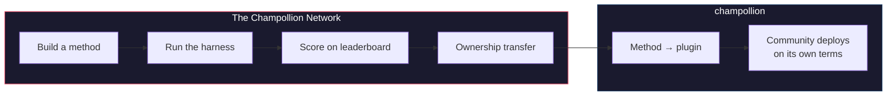

# Champollion 네트워크

> **요약.** Champollion 네트워크는 가능한 한 많은 언어 쌍에 대한 번역 테스트 세트를 *생성하고 신뢰*하기 위한 개방형 인프라입니다. 전문가 및 커뮤니티*와 함께* 구축되며, 결코 그들로부터 무단 수집(스크래핑)하지 않습니다. 또한 누가 무엇을 번역할 수 있는지, 각 방법이 각 텍스트 유형에서 얼마나 우수한지, 그리고 부족한 부분이 어디인지 등 전체 분야를 쉽게 파악할 수 있게 해줍니다. 인간이든 기계든 모든 방법을 환영해요. 여러분도 번역 방법을 구축 및 제출하고 실제 말뭉치(코퍼스)를 상대로 어떤 점수를 받는지 확인할 수 있습니다. 커뮤니티가 데이터를 제공하는 언어의 경우, 주권은 타협할 수 없는 요소입니다. 말뭉치를 제공하는 사람들이 해당 말뭉치와 이를 기준으로 측정된 모든 것에 대한 권한을 갖습니다.

이 섹션은 지도의 홈입니다. 하위 페이지에서는 측정된 언어 쌍의
네트워크가 어떻게 구축되는지([네트워크 작동 방식](/docs/network/how-it-works)),
공개 작업 대기열이 왜 그렇게 순위를 매기는지([대기열의 이유](/docs/network/perspectives/why-the-queue) 및
[대기열 구성 명세](/docs/network/specifications/queue-construction)),
그리고 연결 강도가 어떻게 계산되는지([연결 강도](/docs/network/specifications/connection-strength))를 설명해요.
이 프로젝트를 신뢰할지 결정하는 중이라면
[솔직한 한계](/docs/network/honest-limitations)부터 시작해 보세요. 무엇을 구축할지
이미 알고 있다면 [Champollion이란?](/docs/what-is-champollion)에서
시작할 수 있습니다.

**두 가지 종류의 벤치마크로 운영됩니다.** *공개 벤치마크(Public benchmarks)*는 개방형 데이터셋을 사용하여 모든 방법을 저렴하고 투명하게 매핑하고 순위를 매깁니다. 이는 오염 위험이 명시된 스크래핑/오픈 데이터 기준 계층이에요. *주권 벤치마크(Sovereign benchmarks)*는 골드 스탠다드입니다. 언어 커뮤니티가 생성, 소유 및 통제하며 Champollion이 **절대 볼 수 없는** 비밀 테스트 세트로, 커뮤니티가 승인할 때만 블라인드 평가가 이루어집니다. 인프라 자체는 소스가 공개되어 있고 단일 주체에 의해 관리되지만, 커뮤니티에 속하는 것은 해당 언어의 테스트 세트와 이를 위해 구축된 번역 방법입니다.

:::info[출시/초기 단계]
네트워크는 아직 초기 단계지만 활성화되어 있습니다. 리더보드에는 실제 게시된 실행 결과가 포함되어 있으며
누구나 제출할 수 있도록 열려 있어요. 검증, 커뮤니티 확인, 홀드아웃(held-out) 평가 등
우리가 주장하는 것과 아직 주장하지 않는 것에 대한 정확한 내용은
**[솔직한 한계](/docs/network/honest-limitations)**를 참조하세요.
:::

---

## 문제점

Google의 Cloud Translation 서비스는 194개 언어를 지원합니다([Google의 공식 목록](https://docs.cloud.google.com/translate/docs/languages)). Meta의 NLLB-200은 200개를 다루며, OMT-1600(2026년 3월)은 1,600개를 지원한다고 주장해요. 하지만 지구상에는 7,000개가 넘는 언어가 사용되고 있습니다. OMT-1600의 롱테일에 속하는 약 1,200개 언어(지원하는 1,600개에서 저자들이 모델이 "충분히 잘 이해한다"고 보고한 400여 개를 뺀 수치)의 경우, 모델 가중치를 사용할 수 없고 품질이 사용 가능한 기준치 미만입니다. 또한 평가는 성경 도메인 텍스트와 표준 기계 번역 지표를 사용했으며, 형태소 검증, 독립적인 테스트, 커뮤니티 거버넌스가 전혀 없었습니다. 나머지 약 5,400개 언어에 대해서는 어떤 사전 학습된 모델도 결과를 전혀 생성하지 못합니다.

거대 기술 기업(Big Tech)들이 이제 저자원 언어(LRL) 지원에 투자하고 있지만, 독립적인 품질 검증, 형태소 검증 또는 커뮤니티 거버넌스가 없는 지원은 신뢰할 수 없는 지원입니다. 번역 도구가 가장 필요한 화자들은 정작 도구가 구축될 가능성이 가장 낮은 커뮤니티에 속해 있어요.

**네트워크는 이를 바꾸기 위해 존재합니다.** 테스트 세트를 생성하고, 인간이든 기계든 모든 방법을 이에 대해 평가하며, 재현 가능한 채점, 공개 제출, 데이터 및 결과 통제권에 대한 커뮤니티 거버넌스를 통해 모든 언어에 대한 결과를 매핑하는 인프라를 제공해요.

언어 데이터는 *생체 데이터(biodata)*입니다. 유전자나 건강 데이터처럼 언어는 이를 사용하는 사람들의 정체성과 관계를 담고 있으며, 의미 있는 수준으로 익명화할 수 없습니다. 따라서 말뭉치를 제공하는 사람들이 해당 말뭉치와 이를 기준으로 측정된 모든 것에 대한 권한을 갖습니다. 주권은 여기에 덧붙여진 부가 기능이 아니라, 나머지 모든 것이 구축되는 기반이에요.

---

## 작동 방식

1. **번역 방법을 구축합니다** — 코칭된 LLM, 파인튜닝된 모델, FST 기반 파이프라인 등 번역을 생성하는 모든 방법이 가능해요.
2. **테스트 하네스(harness)가 벤치마크를 수행합니다** — 특정 Git 커밋에 핑거프린트된 표준화된 지표(chrF++, 정확한 일치, FST 수용도)를 사용합니다.
3. **결과가 리더보드에 표시됩니다** — 실시간으로 제출이 공개되며, 게시된 모든 실행 결과는 재현 및 비교가 가능해요.
4. **방법이 성공적으로 작동하면 소유권이 이전됩니다** — 원주민 언어의 경우, 해당 방법의 코드가 커뮤니티 거버넌스 조직으로 이전됩니다.
5. **커뮤니티가 원하는 방식과 시기에 배포합니다.** 이 방법은 [champollion](https://champollion.dev) 플러그인으로 내보낼 수 있으며 커뮤니티 인프라에서 완전히 실행될 수 있습니다. Champollion은 거기서 발생하는 수익의 어떤 몫도 취하지 않아요.

**여기서 구축하고, 그곳에 배포하세요.**

:::tip[언어를 해독하고, 승리하고, 돌려주세요]
이것은 의도적인 ML 벤치마킹 작업입니다. 경쟁은 어려운 언어 쌍을 해결하는
원동력이 됩니다. ML 연구원과 역량 있는 모든 개발자가 특정 어려운 언어 쌍을 위한
최고의 방법을 구축하고, **현상금이 열려 있을 때 이를 획득**하며, 그 결과물인
방법을 해당 언어를 소유한 주권 조직에 넘겨주기를 바랍니다. 경쟁의 에너지는
실재하며, 단순히 리더보드에 오르기 위해서가 아니라 미션을 향해 맞춰져 있습니다.
[상금 명세](/docs/network/specifications/prizes)를 참조하세요.
:::

---

## 대상 사용자

| 대상 | 네트워크가 제공하는 것 |
|---|---|
| **ML 엔지니어 / 연구원** | 표준화된 벤치마크, 재현 가능한 채점, 테스트에 사용할 수 있는 공유 말뭉치 |
| **언어학자** | 문법 규칙과 사전을 테스트 가능한 방법으로 전환하는 프레임워크 |
| **전문가 / 인간 번역가** | 서비스를 등록하고 발견될 수 있는 공간 — 여기서 인간 번역은 부차적인 것이 아니라 기계와 함께 나열되고 벤치마킹되는 일급(first-class) 방법입니다. |
| **언어 커뮤니티 구성원** | 언어의 번역 방법이 개발되고 배포되는 방식에 대한 거버넌스 |
| **후원자 / 지원금 심사자** | 번역 연구 제안서를 평가하기 위한 투명하고 재현 가능한 지표 |
| **학생** | 실질적인 영향을 미칠 수 있는 열린 초대 — 번역 방법을 구축하고 결과를 기여해 보세요. |

---

## 지원되는 참조 말뭉치

**게시판은 활성화되어 있으며 아직 초기 단계입니다** — 첫 번째 스윕(sweep)이 게시되었고
기여자들이 대기열 항목을 실행함에 따라 더 많은 결과가 추가되고 있어요. 아래 내용은
리더보드가 아니라, 현재 제출물을 채점할 수 있는 공개 참조 말뭉치 세트입니다.
말뭉치는 절대 이곳에 호스팅되지 않습니다. 테스트 하네스는 실행 시점에 업스트림 소스에서
참조 데이터를 가져와 새로 가져온 데이터를 바탕으로 채점합니다.

### Global Voices (OPUS) — 뉴스 도메인
- **지원 범위:** 493개 언어 쌍이 카탈로그화되어 실행 가능 (예: `eval-amh-fra-globalvoices-test-v1`, 암하라어 → 프랑스어)
- **라이선스:** CC BY 3.0
- **출처:** [Global Voices via OPUS](https://opus.nlpl.eu/)

### Tatoeba — 대화형 / 혼합 도메인
- **지원 범위:** 874개 언어 쌍이 카탈로그화되어 실행 가능 (예: `eval-afr-eng-tatoeba-dev-v1`, 아프리칸스어 → 영어)
- **라이선스:** CC BY 2.0
- **출처:** [Tatoeba community](https://tatoeba.org)

:::note[EdTeKLA는 연구 전용입니다 — 순위 벤치마크가 아닙니다]
EdTeKLA 평원 크리어(Plains Cree) 말뭉치(*Cree: Language of the Plains*)는
[EdTeKLA의 **수정된** CC BY-NC-SA](https://github.com/EdTeKLA/IndigenousLanguages_Corpora)를
따릅니다. 이는 주권이 적용된 비상업적 조건입니다(원본 교재 자체는 CC
BY-NC-ND 4.0입니다). 이 말뭉치는 **모든 순위에서 제외**됩니다. 리더보드,
상금 또는 API/상업용 트랙에 대한 자격이 없으며, 원격
모델 API 평가는 **동의가 필요(consent-gated)**합니다. 권리자의 명시적인
허가가 기록되지 않는 한 테스트 하네스는 제3자 모델 API로 텍스트를 전송하는 것을
거부합니다(로컬 평가는 여전히 가능해요).

FLORES+는 이곳에 연결되어 실행 **가능**하지만(870개 카탈로그화된 쌍, 예:
`eval-flores-devtest-v1-amh-fra`), **오염도가 높습니다**. 프론티어 모델이 이미 보았을
가능성이 매우 높은 공개된 웹 크롤링 평가 데이터이기 때문이에요.
따라서 **상대적 비교용**으로만 사용됩니다. 방법들을 일대일로 비교하는 데는 사용할 수 있지만,
**절대적인 품질 벤치마크로는 절대 보고되지 않으며**, 오직 **테스트 및
설명 목적으로만** 사용됩니다. FLORES+ 결과는 품질 점수로 순위가 매겨지지 않으며
[번역 지도](https://champollion.dev)에서 체인 엣지(chain edge)로 사용되지 않습니다.
우리가 주장하는 것과 주장하지 않는 것에 대한 정확한 내용은
[솔직한 한계](/docs/network/honest-limitations)를 참조하세요.
:::

---

## 단 하나의 규칙

:::danger[평가 데이터로 학습하지 마세요]
학습 데이터, 퓨샷(few-shot) 예제, 사전 항목 또는 프롬프트 자료 등 벤치마크 데이터셋에 노출된 방법은 **실격 처리**됩니다. 원하는 데이터로 파인튜닝하는 것은 자유입니다. 단지 테스트 세트만은 피해주세요.
:::

---

## 다음 단계

- **[방법 제출하기](/docs/network/getting-started/submit-a-method)** — 첫 번째 벤치마크 실행을 제출하는 방법
- **[벤치마크 명세](/docs/network/specifications/benchmark)** — 전체 실험 프로토콜
- **[리더보드 규칙](/docs/network/leaderboard/rules)** — 제출 기준 및 어뷰징 방지 정책
- **[데이터 관리](/docs/network/sovereignty/data-sovereignty)** — 말뭉치는 관리자에게 유지되며 모든 라이선스가 존중됩니다.
- **[작업 자금 조달 방식](/docs/network/sovereignty/economic-model)** — 비상업적이며 현재 자체 자금으로 운영됩니다. 후원자를 찾고 있으며 모든 자금의 사용처가 공개됩니다.

**[→ 리더보드 보기](https://champollion.dev/leaderboard)**
