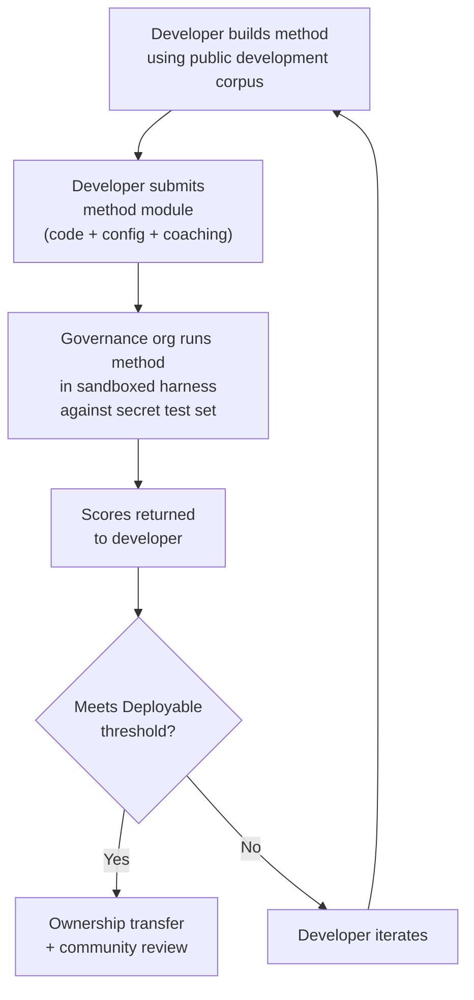

# 벤치마크 명세서

> **요약.** 이 문서는 Champollion MT 평가 생태계를 위한 평가 프로토콜을 정의해요. 코퍼스 형식(§2), 실행 카드 스키마(§3), 벤치마크 프로토콜(§6), 인간 검증 요구 사항(§7), 주권 메커니즘(§8), 리더보드 및 제출 모델(§9), 비용 프레임워크(§10), 새로운 언어로의 확장성(§11)을 다뤄요. 지표 정의, 복합 점수 가중치, 품질 티어 임계값, 비용/속도 지표 공식에 대해서는 모든 채점 로직의 단일 진실 공급원(single source of truth)인 `SCORING_SPEC.md`을 참조하세요. 이 문서는 해당 세부 정보를 중복해서 설명하지 않고 SCORING_SPEC을 참조해요.


---

## 1. 원칙

### 1.1 언어는 생체 데이터입니다

언어는 중립적인 테스트 자료가 아닙니다. 유전 데이터나 건강 데이터처럼 언어 데이터는 **생체 데이터**입니다: 언어는 그것을 사용하는 사람들의 정체성, 친족 관계, 관계를 담고 있으며, 의미 있게 익명화될 수 없습니다 — 메타데이터를 제거해도 언어는 여전히 그 사람들이 누구인지를 인코딩합니다. 이 명세서에 대한 결과는 구체적입니다: 코퍼스를 제공하는 사람들이 그것에 대한 열쇠와 그것에 대해 측정되는 모든 것에 대한 열쇠를 쥐고 있습니다. 따라서 주권(§8)은 프로토콜의 부가 요소가 아닙니다; 그것은 프로토콜의 전제 조건이며, 아래의 다른 모든 원칙은 그 안에서 작동합니다.

### 1.2 자동 지표는 대리 지표입니다

이 문서에서 정의된 모든 메트릭은 기계로 계산됩니다. chrF++, FST 수용, 형태론적 정확도, 의미 유사도 — 이 모두는 번역 품질에 대한 자동화된 대리 지표입니다. 이들은 빠른 반복, 체계적인 비교, 회귀 탐지에 유용합니다. 이들은 **사람의 판단을 대체하지 못합니다**.

평가 계층 구조:

```
Automated metrics (run cards, benchmarks)
    ↓ proxy for
Human review (bilingual speakers validate output)
    ↓ proxy for
Actual utility (does this help a language community?)
```

아무리 높은 자동화 점수라도, 유창한 화자가 출력을 읽고 그것이 정확하고 자연스러우며 문화적으로 적절하다고 확인하는 것을 대체할 수 없습니다. §5에서 정의된 품질 티어는 자동화된 종합 점수에 대한 휴리스틱 레이블입니다 — 진행 상황을 추적하는 데 유용하지만, 그 자체만으로는 결코 충분하지 않습니다.

### 1.3 모델이 아니라 방법

우리는 **모델**이 아니라 **방법**을 벤치마킹합니다. 모델은 하나의 구성 요소입니다. 방법은 전체 레시피입니다: 모델 선택, 프롬프트 설계, 도구 사용, 전/후처리, 코칭 데이터, 재시도 전략 등 모든 것입니다. 동일한 모델을 서로 다른 방법으로 사용하는 두 팀은 서로 다른 점수를 얻게 됩니다. 그것이 핵심입니다.

### 1.4 재현성

모든 벤치마크 결과는 재현 가능해야 합니다. 실행 카드(§3)는 실험의 완전한 구성을 담습니다. 지문(§3.5)은 실험 설정을 식별합니다. 실행 카드 해시(§3.6)는 결과의 무결성을 검증합니다. 동일한 방법, 코퍼스, 구성을 가진 사람은 누구나 ±2% 이내의 점수를 달성해야 합니다(온도 > 0에서의 LLM 샘플링 비결정성을 고려함).

### 1.5 합성 평가 데이터 금지

**이 프로젝트는 합성 평가 데이터를 생성하거나 사용하거나 지지하지 않습니다.** 모든 코퍼스는 진정으로 사람이 저술한 텍스트에서 출처를 얻어야 합니다 — 출판된 번역물, 교과서, 이중언어 문서, 또는 유창한 화자로부터 유도된 번역물.

LLM은 다음을 지원할 수 있습니다:
- 문장 정렬(기존 이중언어 텍스트에서 병렬 구절 찾기)
- 형식 변환(출판된 자료를 코퍼스 스키마로 변환)
- 메타데이터 보강(난이도 티어, 레지스터 레이블 제안)
- 사람 번역을 위한 출발 문장 제안(§11.3 — 번역 단계는 항상 사람이 수행함)

LLM은 참조 번역이나 평가 쌍을 **절대** 생성해서는 안 됩니다.

**우리는 학습 데이터에 대해 개발 중립적입니다.** 방법 개발자가 자신의 방법에서 합성 학습 데이터, 역번역, 또는 데이터 증강을 사용한다면, 그것은 그들의 선택입니다 — 우리는 학습 과정이 아니라 출력을 평가합니다. Meta의 OMT-1600은 역번역을 통해 생성된 약 2억 7천만 개의 합성 병렬 문장을 사용합니다. 우리는 이런 방식으로 학습된 방법에 대해 이의가 없습니다. 우리는 사람이 큐레이션한 것에 대해서만 테스트합니다.

> **평가에 성경 텍스트를 사용하지 않는 이유는?** OMT-1600은 1,600개 언어 중 1,560개 언어를 성경 도메인 텍스트로 평가합니다(Meta AI, *Omnilingual MT*, arXiv:2603.16309, 2026). 성경 번역은 고어체 레지스터, 전례 어휘, 정형화된 문장 구조를 가지고 있습니다. 우리의 평가 코퍼스는 커뮤니티가 큐레이션한, 도메인이 다양한 텍스트에서 출처를 얻습니다 — 건강, 법률, 교육, 정부, 대화, 기술 도메인(§2.7 참조). 이것은 의도적인 설계 선택입니다. 커뮤니티는 단일 종교적 레지스터가 아니라, 실제로 살아가고 일하는 도메인을 위한 번역을 필요로 합니다. 창세기 1장 1절에서 좋은 점수를 받는 방법은 밴드 협의회 안건이나 클리닉 접수 양식에서의 성능에 대해 거의 아무것도 알려주지 않습니다.

---

## 2. 코퍼스 스키마

코퍼스는 구조화된 메타데이터를 가진 병렬 텍스트 쌍의 큐레이션된 집합입니다. 이것은 모든 방법이 측정되는 기준이 되는 진실 근거입니다.

### 2.1 데이터셋 엔벨로프

코퍼스 파일의 최상위 구조:

```json
{
  "dataset": {
    "id": "edtekla-dev-v1",
    "version": "1.0",
    "language_pair": "EN→CRK",
    "source_language": "en",
    "target_language": "crk",
    "created": "2026-05-01",
    "license": "LicenseRef-EdTeKLA-Modified-CC-BY-NC-SA-4.0",
    "provenance": ["gold_standard", "textbook"]
  },
  "entries": [ ... ]
}
```

| 필드 | 유형 | 필수 | 설명 |
|-------|------|----------|-------------|
| `id` | string | ✅ | 고유한 데이터셋 식별자, 실행 카드와 리더보드에서 사용됨 |
| `version` | string | ✅ | 시맨틱 버전. 증가시키면 이전 실행 카드 비교가 무효화됨 |
| `language_pair` | string | ✅ | 표시 레이블(예: `EN→CRK`) |
| `source_language` | string | ✅ | BCP 47 출발 언어 코드 |
| `target_language` | string | ✅ | BCP 47 도착 언어 코드 |
| `created` | string | ✅ | ISO 8601 생성 날짜 |
| `license` | string | ✅ | SPDX 라이선스 식별자 |
| `provenance` | string[] | ✅ | 항목 전반에 걸쳐 사용된 출처 태그 목록 |

### 2.2 항목 스키마

코퍼스의 각 항목은 하나의 번역 과제를 나타냅니다:

```json
{
  "id": 42,
  "source": "I see the dog",
  "reference": "niwâpamâw atim",
  "segment": "gold_standard",
  "difficulty": 2,
  "provenance": "gold_standard",
  "register": "conversational",
  "context": "declaration",
  "morphological_analysis": "ni-wâpam-âw atim | 1sg-see.TA-3sg.DIR dog.AN",
  "notes": "Animate noun (atim); direct form because speaker is proximate",
  "variant_class": "simple-ta-direct"
}
```

| 필드 | 유형 | 필수 | 설명 |
|-------|------|----------|-------------|
| `id` | integer | ✅ | 코퍼스 내 고유 식별자 |
| `source` | string | ✅ | 출발 언어의 출발 텍스트 |
| `reference` | string | ✅ | 도착 언어의 골드 스탠다드 참조 번역 |
| `segment` | string | 📎 | 코퍼스 파티션: `gold_standard`, `held_out`, `development`, 또는 `diagnostic` |
| `difficulty` | integer | 📎 | 난이도 등급 1–5(§2.4 참조) |
| `provenance` | string | 📎 | 이 항목의 출처(§2.5 참조) |
| `register` | string | 📎 | 레지스터/격식 수준(§2.6 참조) |
| `context` | string | 📎 | 소통 기능(§2.6 참조) |
| `domain` | string | 📎 | 16개 코드 분류 체계의 사용 사례 도메인(§2.7 참조). 다음 중 하나여야 함: `conv`, `ecommerce`, `edu`, `financial`, `gov`, `legal`, `literary`, `marketing`, `medical`, `news`, `religious`, `scientific`, `subtitles`, `support`, `tech`, `ui`. 생성 시점에 검증됨. |

> **📎 = 권장.** 하네스는 기본값을 통해 누락된 선택 필드를 유연하게 처리합니다. 서드파티 코퍼스는 항목당 `id`, `source`, `reference`만 제공하면 됩니다.
| `morphological_analysis` | string | ❌ | 골드 스탠다드 형태론적 분석 |
| `notes` | string | ❌ | 번역자 노트, 방언 변형, 모호성 플래그 |
| `variant_class` | string | ❌ | 허용 가능한 번역 변형을 그룹화하는 클래스 레이블 |


### 2.3 코퍼스 세그먼트

코퍼스는 서로 다른 접근 수준을 가진 세그먼트로 나뉩니다:

| 세그먼트 | 목적 | 접근 | 최소 크기 |
|---------|---------|--------|-------------|
| `development` | 방법 개발 및 반복. 개발자가 자유롭게 사용함. | **공개** | 30개 항목 |
| `diagnostic` | 특정 언어학적 현상을 위한 대상 테스트. | **공개** | 10개 항목 |
| `gold_standard` | 공식 벤치마크 평가. 리더보드 점수가 여기서 나옴. | **비밀** — 거버넌스 조직이 보유 | 50개 항목 |
| `held_out` | 향후 평가를 위해 예약됨. 활성화될 때까지 사용되지 않음. | **비밀** — 거버넌스 조직이 보유 | 10개 항목 |

> **현재 상태:** 출시된 데이터셋에는 `development` 세그먼트만 존재합니다. `diagnostic`, `gold_standard`, `held_out` 세그먼트는 코퍼스가 성장함에 따라 향후 사용을 위해 정의되어 있습니다.

`gold_standard` 및 `held_out` 세그먼트는 완전히 비밀입니다. 출발 문장과 참조 번역 모두 거버넌스가 통제하는 인프라에 보유됩니다. 방법 개발자는 질문도 답변도 결코 볼 수 없습니다. 주권 메커니즘에 대해서는 §8을 참조하세요.

### 2.4 난이도 티어

| 티어 | 설명 | 예시 |
|------|-------------|----------|
| 1 — 기본 어휘 | 단일 단어, 흔한 인사, 숫자 | "hello" → "tânisi", "dog" → "atim" |
| 2 — 단순 문장 | 주어-동사 또는 SVO, 현재 시제 | "I see the dog" → "niwâpamâw atim" |
| 3 — 중간 복잡도 | 과거/미래 시제, 소유격, 유생성 | "I saw his dog yesterday" |
| 4 — 복잡한 형태론 | 방외성, 수동태, 접속형 어순, 관계절 | "the woman whose son went to the store" |
| 5 — 고급 | 복수 절, 격식 레지스터, 의례적, 관용적 | 레지스터에 적합한 어조를 가진 전체 단락 |

잘 구성된 코퍼스는 다섯 개의 난이도 티어 전반에 걸친 항목을 포함해야 하며, 대부분의 실제 번역 과제가 속하는 티어 2–4에 가중치를 두어야 합니다.

### 2.5 출처 태그

모든 항목은 그 출처를 표시해야 합니다:

| 태그 | 의미 |
|-----|---------|
| `gold_standard` | 유창한 화자에 의해 검증됨 |
| `textbook` | 출판된 교육 자료에서 나옴 |
| `elicited` | 구조화된 유도 세션을 통해 생성됨 |
| `corpus` | 병렬 코퍼스에서 추출됨 |

> **참고:** 실제로 출처 값은 자유 형식 문자열입니다. 위의 태그는 관례이며 검증된 열거형이 아닙니다 — 데이터셋은 다른 서술적 출처 문자열을 사용할 수 있습니다.

### 2.6 레지스터와 컨텍스트

**레지스터**는 격식과 사회적 맥락을 설명합니다:

| 레지스터 | 설명 |
|----------|-------------|
| `conversational` | 동등한 사람들 간의 일상 대화 |
| `formal` | 공식 또는 기관 언어 |
| `technical` | 도메인 특화 어휘 |
| `ceremonial` | 전통적 또는 신성한 언어 사용 |
| `educational` | 언어 교육 자료 |

**컨텍스트**는 소통 기능을 설명합니다:

> 🔲 **계획됨.** `context` 필드는 스키마에 정의되어 있지만 현재 데이터셋에는 아직 채워지지 않았습니다. 향후 코퍼스 보강을 위해 예약되어 있습니다.

| 컨텍스트 | 설명 |
|---------|-------------|
| `greeting` | 사회적 인사 또는 작별 |
| `declaration` | 사실 진술 |
| `question` | 의문문 |
| `instruction` | 명령 또는 지시 |
| `narrative` | 이야기 서술 또는 묘사 |
| `label` | UI 레이블, 버튼 텍스트, 또는 제목 |
| `error` | 오류 메시지 또는 경고 |

### 2.7 도메인 {#27-domain}

**도메인**은 실제 사용 사례 — 번역되는 콘텐츠의 유형을 설명합니다. 이것은 레지스터와 컨텍스트와 직교합니다:

- **레지스터**는 답합니다: *이것은 얼마나 격식적인가?*
- **컨텍스트**는 답합니다: *이 문장은 무엇을 하고 있는가?*
- **도메인**은 답합니다: *이것은 어떤 산업/사용 사례를 위한 것인가?*

법률 계약서(도메인: `legal`)는 격식적(레지스터: `formal`)이고 선언(컨텍스트: `declaration`)을 포함할 수 있습니다. 법률 챗봇 대화록(도메인: `legal`)은 대화적(레지스터: `conversational`)이고 질문(컨텍스트: `question`)을 포함할 수 있습니다. 같은 도메인, 다른 레지스터와 컨텍스트입니다.

| 도메인 코드 | 설명 | 일반적 소비자 |
|-------------|-------------|-------------------|
| `ui` | 소프트웨어 인터페이스 문자열 | 앱 개발자, 현지화 팀 |
| `legal` | 계약서, 법령, 법원 제출 서류, 이민 문서 | 로펌, 법원, 컴플라이언스 팀, IP 변호사 |
| `medical` | 임상 노트, 약물 라벨, 환자 커뮤니케이션, 시험 프로토콜 | 병원, 제약, 임상시험, 환자 포털 |
| `financial` | 은행, 보험, 규제 제출 서류, 감사 보고서 | 은행, 보험사, 규제 기관, 감사인 |
| `edu` | 교과서, 커리큘럼, 수업 계획, 학술 자료 | 학교, 대학교, 교과서 출판사 |
| `ecommerce` | 제품 설명, 리뷰, 마켓플레이스 목록 | 온라인 소매업체, 마켓플레이스 판매자 |
| `marketing` | 광고 카피, 브랜드 메시징, 캠페인, 슬로건 | 광고 대행사, 브랜드 팀 |
| `gov` | 정책 문서, 규정, 공지, 법령 | 정부 기관, 컴플라이언스 팀 |
| `scientific` | 연구 논문, 초록, 방법론, 연구비 제안서 | 연구자, 학술지, 연구비 지원 기관 |
| `religious` | 경전, 전례 텍스트, 신학 주석 | 신앙 공동체, 전례 출판사 |
| `support` | FAQ, 오류 메시지, 문제 해결 가이드, 챗봇 스크립트 | SaaS 회사, 헬프 데스크 |
| `subtitles` | 영화, TV, 스트리밍, 게임 대사 | 스트리밍 플랫폼, 스튜디오, 게임 회사 |
| `news` | 저널리즘, 통신 보도, 사설, 보도자료 | 미디어 조직, 통신사 |
| `literary` | 소설, 시, 서사, 문화 텍스트 | 출판사, 문화 보존 조직 |
| `conv` | 비격식 대화, 소셜 미디어, 메시징 | 소비자 앱, 소셜 플랫폼 |
| `tech` | API 문서, 매뉴얼, 엔지니어링 명세, 기술 가이드 | 문서화 팀, 엔지니어링 조직 |

> **도메인 특화 벤치마크.** 일반 벤치마크는 모든 도메인에 걸쳐 방법을 평가합니다. 하지만 Network는 **도메인 필터링 벤치마크**도 지원합니다 — 여기서는 특정 도메인으로 태그된 항목에 대해서만 점수를 계산합니다. 이를 통해 사용자는 다음과 같은 질문에 답할 수 있습니다: "프랑스어로 법률 문서를 번역하는 데 가장 좋은 방법은 무엇인가?" vs. "전반적인 프랑스어 점수가 가장 좋은 방법은 무엇인가?"
>
> 도메인 필터링 리더보드 순위를 통해 사용자는 단일 사용 사례 내에서 방법을 비교할 수 있습니다. 서로 다른 방법은 도메인에 따라 다르게 수행됩니다 — 법률 용어로 파인튜닝된 방법은 대화 텍스트보다 법률 텍스트에서 훨씬 높은 점수를 받을 수 있습니다. Network는 사용자가 자신의 특정 사용 사례에 가장 잘 맞는 방법을 찾도록 돕습니다.

> **미래: Network 어시스턴트.** 사용자가 자신의 MT 사용 사례(도메인, 언어 쌍, 품질 요건)를 설명하도록 돕고 리더보드에서 관련 커뮤니티 검증 방법을 표시하는 대화형 어시스턴트 — 예를 들어 "의료 도메인 EN→JA 벤치마크에서 가장 높은 점수를 받는 방법은 무엇인가?" — 는 충분한 도메인 태그 평가 데이터와 방법 다양성을 조건으로 우리가 고려하고 있는 탐색 지원 기능입니다.

---

## 3. 실행 카드 스키마 {#3-run-card-schema}

실행 카드는 평가의 원자 단위입니다. 이것은 단일 평가 실행의 완전한 구성과 결과를 기록하는 자체 완결형 JSON 문서입니다: 하나의 방법, 하나의 모델, 하나의 구성, 하나의 데이터셋.

모든 실행 카드는 세 가지 차원을 담습니다:
- **품질** — 번역이 얼마나 좋은가?
- **비용** — 그것을 생산하는 데 비용이 얼마나 들었나?
- **속도** — 얼마나 오래 걸렸나?

### 3.1 최상위 필드

| 필드 | 유형 | 설명 |
|-------|------|-------------|
| `run_id` | string | 실행 시작 시 생성된 UUID v4 |
| `harness_version` | string | 하네스의 시맨틱 버전(예: `2.0`) |
| `timestamp` | string | 실행이 시작된 ISO 8601 UTC 타임스탬프 |
| `elapsed_seconds` | number | 전체 실행의 실제 경과 시간 |

### 3.2 방법 구성

이 필드들은 실험 설정을 정의합니다 — 무엇을 어떻게 테스트했는지.

| 필드 | 유형 | 필수 | 설명 |
|-------|------|----------|-------------|
| `model_slug` | string | ✅ | 모델 식별자(예: `google/gemini-2.5-flash`) |
| `model_id` | string | ❌ | API가 반환한 확인된 모델 식별자 |
| `condition` | string | ✅ | 실험 레이블(예: `baseline`, `coached-v3`, `few-shot`) |
| `temperature` | number | ✅ | 샘플링 온도 |
| `system_prompt_sha256` | string | ✅ | 전체 시스템 프롬프트의 SHA-256 해시 |
| `system_prompt_used` | string | ✅ | 전체 시스템 프롬프트 텍스트 |
| `coaching_data_sha256` | string | ❌ | 사용된 경우 코칭 데이터 파일의 SHA-256 해시 |
| `fst_version` | string | ❌ | 사용된 경우 FST 분석기 버전 |
| `tools_enabled` | string[] | ❌ | 방법에서 사용 가능한 도구 목록 |
| `batch_size` | number | ❌ | 동시 API 배치당 항목 수 |
| `max_retries` | number | ❌ | 해당하는 경우 FST 거부에 대한 최대 재시도 횟수 |

:::info[게시된 실행 카드에는 method_config가 포함돼요]
실행 카드가 리더보드에 게시되면(`mt-eval publish`를 통해), 표준 8개 필드로 구성된 MethodConfig(`model`, `temperature`, `batchSize`, `register`, `coachingFile`, `coachingPrompt`, `promptContext`, `qualityTier` — 모두 camelCase)를 담은 `method_config` 블록도 함께 포함돼요. 이를 통해 재구성이 필요 없는 가져오기가 가능해요. `champollion leaderboard --install`는 `method_config`을 직접 읽어서 플러그인 매니페스트로 기록해요. 위(§3.2)의 텔레메트리 필드는 하네스가 관찰한 내용을 기록하고, `method_config`는 개발자가 의도한 내용을 기록해요.
:::

### 3.3 데이터셋 참조

| 필드 | 유형 | 설명 |
|-------|------|-------------|
| `dataset.id` | string | 데이터셋 식별자 |
| `dataset.version` | string | 데이터셋 버전 |
| `dataset.language_pair` | string | 표시 레이블 |
| `dataset.sha256` | string | 데이터셋 파일 내용의 SHA-256 해시 |
| `dataset.entry_count` | number | 평가된 항목 수 |

데이터셋 SHA-256은 결과를 데이터의 특정 버전에 고정합니다. 데이터셋이 변경되면 오래된 실행 카드는 비교할 수 없습니다.

### 3.4 점수(품질)

전체 실행에 대한 집계 메트릭. 모든 품질 메트릭은 **자동화**됩니다 — §1.2 참조.

| 필드 | 유형 | 설명 |
|-------|------|-------------|
| `scores.total` | number | 평가된 총 항목 수 |
| `scores.exact_matches` | number | 출력이 참조와 정확히 일치한 항목 |
| `scores.exact_match_rate` | number | 0.0–1.0 |
| `scores.equivalent_matches` | number | 허용 가능한 변형과 일치하는 항목 |
| `scores.equivalent_match_rate` | number | 0.0–1.0 |
| `scores.fst_accepted` | number | FST 분석기에 의해 수용된 항목 |
| `scores.fst_acceptance_rate` | number | 0.0–1.0, FST가 구성되지 않은 경우 `null` |
| `scores.morphological_accuracy` | number | 0.0–1.0, FST 파생(표제어 일치), FST가 없거나 표제어 일치 단어가 없으면 `null`. 활성화될 때까지 참고용 — Scoring Spec §2.2 참조 |
| `scores.morph_coverage` | number | 0.0–1.0, 참조에 표제어 일치되는 분석 가능한 예측 단어의 비율(`morphological_accuracy`이 얼마나 희소한지 공개함) |
| `scores.chrf_plus_plus` | number | 코퍼스 수준 chrF++ 점수(0–100) |
| `scores.semantic_score` | number | 임베딩 기반 의미 유사도(0.0–1.0) |
| `scores.ter` | number | 번역 편집률(0–∞, 낮을수록 좋음) |
| `scores.length_ratio` | number | avg(len(predicted)/len(reference)), 이상값 = 1.0 |
| `scores.code_switching_rate` | number | 0.0–1.0, 출발 언어 누출이 있는 항목의 비율 |
| `scores.hallucination_rate` | number | 0.0–1.0, 환각 콘텐츠가 있는 항목의 비율 |
| `scores.terminology_adherence` | number | 0.0–1.0, 용어집 용어 준수(용어집이 없으면 `null`) |
| `scores.tokens_per_second` | number | total_tokens / elapsed_seconds |
| `scores.entries_per_minute` | number | 분당 번역된 항목 수 |
| `scores.composite` | number | 가중 종합 점수(0.0–1.0). SCORING_SPEC §4 참조 |
| `scores.errors` | number | 실패한 항목(API 오류, 타임아웃 등) |
| `scores.by_difficulty` | object | 난이도 티어별로 세분화된 점수 |
| `scores.by_provenance` | object | 출처 태그별로 세분화된 점수 |
| `scores.by_domain` | object | ✅ 구현됨 — 도메인별로 세분화된 점수(§2.7). 도메인 필터링 리더보드 순위를 가능하게 함. tester.py로 계산되고 publish.py를 통해 전달됨. |

### 3.5 합계(비용)

| 필드 | 유형 | 설명 |
|-------|------|-------------|
| `totals.prompt_tokens` | number | 모든 API 호출에 걸친 총 입력 토큰 |
| `totals.completion_tokens` | number | 총 출력 토큰 |
| `totals.reasoning_tokens` | number | 사고 연쇄에 사용된 토큰(대부분 모델의 경우 0) |
| `totals.cached_tokens` | number | 제공자의 프롬프트 캐시에서 제공된 토큰 |
| `totals.total_cost_usd` | number | USD 단위 총 비용 |
| `totals.cost_per_entry_usd` | number | `total_cost_usd / entry_count` |
| `totals.cost_per_source_char` | number | 출발 문자당 USD — 언어 전반에 걸쳐 비교 가능 |

### 3.6 타이밍(속도)

| 필드 | 유형 | 설명 |
|-------|------|-------------|
| `elapsed_seconds` | number | 전체 실행의 실제 경과 시간(최상위) |
| `scores.avg_latency_seconds` | number | 항목당 평균 응답 시간 |
| `scores.median_latency_seconds` | number | 항목당 중앙값 응답 시간 |
| `scores.p95_latency_seconds` | number | 항목당 95백분위수 응답 시간 |

### 3.7 항목별 결과

`results[]` 배열의 각 항목은 하나의 번역을 기록합니다. 항목별 데이터는 비정규화된 LYSS 판정(마이그레이션 006)과 함께 `run_card_entries` 테이블(마이그레이션 005)에 저장됩니다.

| 필드 | 유형 | 설명 |
|-------|------|-------------|
| `entry_id` | string | 코퍼스의 `entries[].id`와 일치 |
| `source` | string | 번역된 출발 텍스트 |
| `expected` | string | 골드 스탠다드 참조 번역 |
| `raw_predicted` | string \| null | 후처리 전 원시 모델 출력 |
| `predicted` | string | 방법의 실제 출력(후처리됨) |
| `segment` | string | 세그먼트 식별자(예: 문장 인덱스) |
| `difficulty` | string \| null | 코퍼스의 난이도 티어 |
| `domain` | string | 코퍼스의 도메인 태그(§2.7) |
| `exact_match` | boolean | 출력이 참조와 정확히 일치했는지 여부 |
| `chrf_score` | number \| null | 문장 수준 chrF++(0–100) |
| `bleu_score` | number \| null | 문장 수준 BLEU(0–100) |
| `latency_s` | number \| null | 초 단위 응답 시간 |
| `cost_usd` | number \| null | 이 항목에 대한 USD 단위 비용 |
| `tool_call_count` | integer | 사용된 도구 호출 수(없으면 0) |
| `error` | string \| null | 이 항목이 실패한 경우 오류 메시지 |
| `plugin_metrics` | object | 전체 항목별 플러그인 출력(JSONB) |
| `fst_valid` | boolean \| null | GiellaLT FST가 예측을 수용함(비정규화된 LYSS-fst) |
| `equivalent_match` | boolean \| null | CRK 린터가 구조적 등가성을 확인함(비정규화된 LYSS-eq) |
| `semantic_verdict` | string \| null | LYSS-sem 판정: `VALID`, `MISMATCH`, `UNKNOWN`, `ERROR` |
| `code_switching_detected` | boolean \| null | 출력에서 출발 언어 토큰이 탐지됨 |
| `hallucination_detected` | boolean \| null | 출력에서 조작된 콘텐츠가 탐지됨 |


### 3.8 지문

재현성 식별자예요. 핑거프린트가 동일한 두 실행은 같은 실험 설정을 사용한 거예요.

지문은 다음의 정렬된 연결의 SHA-256 해시입니다:
- `dataset.sha256`
- `model_slug`
- `condition`
- `system_prompt_sha256`
- `temperature`
- `harness_version`
- `batch_size`
- `tools_enabled`

> **왜 8개 구성 요소인가?** 배치 크기와 도구 호출은 출력 품질에 실질적으로 영향을 미치며 신원에 포함되어야 합니다. 다른 모든 매개변수가 일치하더라도, 서로 다른 배치 크기나 서로 다른 도구가 활성화된 두 실행은 서로 다른 실험 설정입니다.

동일한 지문을 가진 두 실행은 비교 가능한 결과를 산출해야 합니다. 차이는 API 비결정성(온도 > 0) 또는 제공자 측 모델 업데이트 때문입니다.

### 3.9 실행 카드 해시

전체 실행 카드 JSON의 SHA-256 해시(해싱 동안 `run_card_hash` 필드 자체는 `""`으로 설정됨). 이것은 변조 탐지 봉인입니다. 어떤 필드가 변경되면 해시가 깨집니다.

---

## 4. 자동화된 메트릭

이 섹션의 모든 메트릭은 기계로 계산됩니다. §1.2 참조.

### 4.1 메트릭 정의

| 메트릭 | 상태 | 무엇을 측정하는가 | 범위 |
|--------|--------|-----------------|-------|
| **chrF++** | ✅ 구현됨 | 문자 n-gram F-점수. 문자 수준에서 작동하여, 단어가 길고 고도로 굴절되는 형태론적으로 풍부한 언어에서 단어 수준 메트릭(BLEU)보다 더 견고합니다. sacrebleu로 계산됨. | 0–100(네이티브 스케일). 종합에 사용될 때 100으로 나눔. |
| **FST 수용률** | ✅ 구현됨 | 형태론적 분석기(GiellaLT HFST)가 도착 언어의 유효한 형태로 수용한 예측 단어의 비율. FST가 수용하는 단어는 실제의 구조적으로 유효한 단어입니다 — 환각이 아닙니다. | 0.0–1.0 |
| **정확 일치** | ✅ 구현됨 | 유니코드 정규화 후 참조와 정확히 일치하는 예측의 비율. 엄격하지만 명확함 — 상한 검사로 유용함. | 0.0–1.0 |
| **형태론적 정확도** | 🔲 계획됨 | 골드 스탠다드 형태론적 분석이 있는 항목에 대해: 올바르게 생성된 형태소의 비율. FST 수용보다 더 세분화됨 — 단어가 FST 유효하지만 잘못된 형태소 구조를 가질 수 있음(올바른 어근, 잘못된 시제). | 0.0–1.0 |
| **등가 일치** | ⚡ 부분적 | 참조의 허용 가능한 변형과 일치하는 비율 — 어순, 방언 차이, 철자법 관례를 고려함. 현재 CRK 평가 표준의 `CrkLinterMetric`(`eval_standards/crk/` 내)를 통해 CRK에 대해 구현됨; CRK 언어 카드의 `evalMetrics` 선언을 통해 자동으로 로드됨. 일반적인 구현은 코퍼스에 항목별 `variants[]`를 필요로 함. | 0.0–1.0 |
| **의미 점수** | ⚡ 부분적 | 표면 형태와 무관한 의미 보존. 현재 CRK 평가 표준의 `CrkSemanticMetric`(`eval_standards/crk/` 내, 판정 가중 대리 지표)를 통해 CRK에 대해 구현됨. 보편적 임베딩 기반 코사인 유사도가 계획되어 있음 — SCORING_SPEC §2.3 참조. | 0.0–1.0 |

### 4.2 종합 점수

종합 점수는 사용 *가능한* 모든 메트릭의 가중 평균입니다:

```
composite = Σ (weight_i × metric_i)   for all available metrics
             ─────────────────────
             Σ weight_i              (renormalized to sum to 1.0)
```

메트릭을 사용할 수 없는 경우(FST가 구성되지 않음, 변형 클래스가 정의되지 않음, 임베딩 모델 없음), 그 가중치는 나머지 메트릭에 비례적으로 재분배됩니다. 이는 종합이 항상 언어 내에서 비교 가능하다는 것을 의미합니다 — 해당 언어에 사용 가능한 메트릭이 무엇이든 사용하고 그에 따라 정규화합니다.

**가중치 표, 입력 정규화 규칙, 전체 메트릭 목록은 `SCORING_SPEC.md` §4에 정의되어 있습니다.** 그 문서는 다음에 대한 SSOT입니다:
- 프로파일 A 가중치(FST 커버리지가 있는 언어 — 9개 메트릭, 구조적 메트릭이 40%를 차지)
- 프로파일 B 가중치(FST 커버리지가 없는 언어 — 8개 메트릭)
- 정규화 규칙(chrF++ ÷ 100, 코드 스위칭 및 환각률 반전)
- 종합에서 제외되는 메트릭(BLEU, COMET, TER, 길이 비율, 일관성) 및 그 이유

하네스 코드는 이 표들을 `mt_eval_harness/scoring.py`에 반영합니다. SCORING_SPEC이 변경되면 `scoring.py`가 일치하도록 업데이트되고 `test_scoring_ssot.py`가 정렬을 검증합니다.

> **왜 BLEU가 아닌가?** BLEU는 단어 수준에서 작동하며 형태론적 변형에 페널티를 줍니다. 다합성 언어의 경우 단일 단어가 전체 절이 될 수 있습니다 — BLEU는 사소한 굴절 차이를 완전한 실패로 취급합니다. chrF++는 문자 수준에서 작동하여 이를 더 잘 처리합니다. BLEU는 두 가중치 표 모두에서 제외됩니다. 전체 근거는 SCORING_SPEC 부록 A를 참조하세요.


### 4.3 비용 조정 점수

유료 API를 사용하는 방법의 경우, 우리는 보조 순위도 보고합니다. 비용 조정 공식은 `SCORING_SPEC.md` §6.3에 정의되어 있습니다.

---

## 5. 품질 등급 {#5-quality-tiers}

품질 티어는 자동화된 종합 점수에 대한 휴리스틱 레이블입니다. 각 수준에서 출력에 대한 사람 검토에 기반하여, 점수가 실제로 무엇을 의미하는 경향이 있는지 설명합니다. **이들은 검증된 품질 판단이 아닙니다** — 사람 검토(§6)만이 실제 사용성을 확인할 수 있습니다.

**티어 임계값과 설명은 `SCORING_SPEC.md` §5에 정의되어 있습니다.** 티어는 다음과 같습니다: Baseline(0.00–0.30), Emerging(0.30–0.50), Functional(0.50–0.70), Deployable(0.70–0.85), Fluent(0.85–1.00).

> [!IMPORTANT]
> **자동화된 티어는 잠정적입니다.** 이 레이블들은 검토를 위한 지명이지 품질 선언이 아닙니다. 자동화된 메트릭에서 "Deployable"에 도달한 방법은 커뮤니티 평가의 후보입니다 — 출시할 제품이 아닙니다. 사람 검토(§7)만이 실제 사용성을 확인할 수 있습니다. 티어 경계는 언어마다 다를 수 있습니다.

이 티어들은 잠정적입니다. 사람 검증 데이터가 축적되고 각 언어에 대해 실제 "화자가 이것을 유용하다고 여기는" 임계값이 어디에 있는지 알게 됨에 따라 재보정될 것입니다. 티어 경계는 언어마다 다를 수 있습니다.

이중언어 화자가 출력이 사용 가능하다는 데 동의한다는 것을 확인하는 커뮤니티 검토 없이는 어떤 방법도 **Deployable** 이상을 주장할 수 없습니다.

---

## 6. 벤치마크 프로토콜

**벤치마크**는 주어진 데이터셋에서 선언된 매개변수 공간에 걸쳐 실행 카드를 체계적으로 생산하는 것입니다. 이것은 단일 실행이 아닙니다 — 서로 다른 구성이 어떻게 수행되는지에 대한 구조화된 탐색입니다.

### 6.1 벤치마크가 생산하는 것

벤치마크는 **실행 카드의 행렬**을 생산합니다 — 매개변수 값의 각 조합마다 하나씩. 이 행렬은 다음 전반에 걸친 다면적 비교를 가능하게 합니다:

- **품질** — 종합 점수, 개별 메트릭 세분화
- **비용** — 각 구성에 대한 총 및 항목당 비용
- **속도** — 실제 경과 시간 및 항목당 지연 시간

단일 "벤치마크 점수"는 없습니다. 벤치마크는 전체 행렬입니다. 서로 다른 이해관계자는 서로 다른 측면에 관심을 가질 것입니다: 연구자는 종합 점수를 최적화하고, 배포 엔지니어는 항목당 비용을 최적화하며, 커뮤니티는 품질을 검토합니다.

### 6.2 매개변수 공간

벤치마크는 어떤 매개변수가 순열되는지 선언합니다:

| 축 | 일반적 값 | 목적 |
|------|---------------|---------|
| `model` | 4–12개 모델(프론티어 + 중간 티어 + 예산) | 모델 능력이 얼마나 중요한가? |
| `temperature` | 0.0, 0.3, 0.7 | 샘플링 무작위성이 도움이 되는가 해가 되는가? |
| `prompt_version` | 2–3개 프롬프트 전략 | 방법이 프롬프트 설계에 얼마나 민감한가? |
| `coaching_config` | 코칭 데이터 유/무 | 언어학적 지식 주입이 출력을 개선하는가? |
| `tool_config` | FST 유/무, 사전 유/무 | 언어학적 도구가 출력을 개선하는가? |

전체 순열 공간:
```
runs = |models| × |temperatures| × |prompts| × |coaching| × |tools|
```

일반적인 초기 벤치마크: 12개 모델 × 3개 온도 × 2개 프롬프트 × 2개 코칭 = 144회 실행.

### 6.3 베이스라인 vs. 방법 평가

벤치마크는 두 가지 별개의 목적을 제공합니다:

**베이스라이닝** — 순진한 접근법으로 지형을 매핑하기. "언어 특화 엔지니어링 없이 기존 모델이 이 언어에 대해 무엇을 할 수 있는가?" 이것은 기준을 설정합니다. 베이스라인 행렬은 다음을 알려줍니다: 어떤 모델이 가장 적게 환각하는지, 어떤 온도가 가장 일관된 출력을 산출하는지, 코칭 데이터가 조금이라도 도움이 되는지, 모든 모델이 균일하게 실패하는 곳은 어디인지(어려운 언어학적 문제를 드러냄).

**방법 평가** — 특정 엔지니어링된 방법을 테스트하기. "내 FST 게이트 코칭 파이프라인이 베이스라인을 능가하는가?" 방법의 실행 카드는 베이스라인 행렬과 비교됩니다. 방법은 최고의 베이스라인을 능가할 때 흥미롭습니다 — 엔지니어링이 순진한 모델 호출보다 가치를 더할 때.

두 활동 모두 동일한 스키마로 실행 카드를 생산합니다. 차이는 의도와 매개변수 공간에 있습니다: 베이스라인은 모델과 구성에 걸쳐 순열하고; 방법 평가는 최고의 구성에 대해 하나의 방법을 테스트합니다.

### 6.4 개발 vs. 골드 스탠다드 평가

방법 개발자는 `development` 및 `diagnostic` 코퍼스 세그먼트에 대해 자유롭게 반복합니다. 이것은 비공식적입니다 — 제한 없음, 제출 없음, 거버넌스 개입 없음. 개발자는 무엇이 효과가 있는지 배우고 있습니다.

공식 리더보드 점수는 `gold_standard` 평가에서만 나옵니다. 이것은 공식적입니다:
1. 개발자가 완전하고 실행 가능한 방법(코드 + 구성 + 코칭 데이터)을 제출함
2. 거버넌스 조직이 샌드박스화된 하네스에서 비밀 테스트 세트에 대해 실행함
3. 점수만 반환됨

전체 주권 메커니즘에 대해서는 §8을 참조하세요.

---

## 7. 사람 검증 {#7-human-validation}

자동화된 메트릭은 대리 지표입니다. 사람 검증이 진실 근거입니다.

### 7.1 사람 검토가 메트릭이 놓치는 것을 포착하는 방법

- **형태론적으로 유효하지만 의미론적으로 잘못됨** — FST는 단어를 수용하고, chrF++는 높지만, 번역은 다른 것을 의미함
- **문화적으로 부적절함** — 번역이 기술적으로는 올바르지만 커뮤니티가 거부할 레지스터나 프레이밍을 사용함
- **환각된 그럴듯함** — 출력이 비화자에게는 도착 언어처럼 보이지만 유창한 화자에게는 횡설수설임
- **허용 가능하지만 표시되지 않은 변형** — 출력이 올바르지만 참조에 없는 방언 변형을 사용하기 때문에 자동화된 메트릭이 이를 틀렸다고 표시함

### 7.2 검증 관문

이중언어 화자가 출력이 사용 가능하다는 데 동의한다는 것을 확인하는 사람 검증 없이는 어떤 방법도 **Functional**에서 **Deployable** 티어로 진전할 수 없습니다. 이것은 형식이 아닙니다 — 그것이 핵심입니다. 자동화된 메트릭은 사람 검토가 필요한 출력의 양을 줄이기 위해 존재합니다. 그것을 대체할 수는 없습니다.

### 7.3 커뮤니티 검토 프로토콜

> 🔲 **계획됨**: 커뮤니티 검토 인터페이스는 아직 가동되지 않았습니다. 이 섹션은 의도된 프로세스를 설명합니다.

1. 방법이 자동화된 메트릭에서 Deployable 임계값에 도달함
2. 출력의 샘플(난이도 티어별로 계층화됨)이 이중언어 화자에게 제시됨
3. 화자가 각 번역을 다음 척도로 평가함: **거부**, **요지**(의미는 명확하지만 표현이 잘못됨), **허용 가능**(사소한 문제가 있지만 올바름), **훌륭함**(사람 번역과 구별 불가능)
4. 거버넌스 조직이 집계된 평가를 검토함
5. 커뮤니티가 방법을 수락하면, 소유권 이전 및 배포로 진행됨

검토가 **Community Validated** 등급(§9.4)을 부여받으려면 최소한의 형태를 갖춰야 해요. 계층화된 샘플은 **최소 30개 항목**을 포함하고, **최소 2명의 검토자** — 둘 다 커뮤니티 자체 프로토콜에 따라 자격을 갖춘 — 가 있어야 하며, 항목의 **최소 70%**가 커뮤니티의 수용 기준을 충족해야 해요. 이 등급은 오직 커뮤니티가 실행 자체를 자체 재량으로 테스트할 때만 부여되며, 강등은 대칭적이에요. 즉, 스팟 감사로 실행된 동일한 프로토콜은 등급이 부여됐던 것과 똑같이 공개적으로 등급을 제거해요.

---

## 8. 주권

평가 데이터셋은 언어 커뮤니티에 속하는 큐레이션된 언어학적 지식을 담고 있습니다. 이 섹션은 그 데이터를 보호하기 위한 기술적 및 법적 프레임워크를 정의합니다.

### 8.1 문제

기존 벤치마크는 테스트 세트를 공개적으로 게시합니다. 일단 게시되면, 데이터는 게시 취소될 수 없습니다. 원주민 및 소수 언어 커뮤니티의 경우, 이는 착취적인 역학을 만듭니다 — 언어학적 데이터가 지속적인 동의 없이 사용됩니다. 생체 데이터 주권에 대한 Dhein의 실용주의적 관점에 따라, 우리는 언어학적 데이터를 동적이고 관계적인 거버넌스를 필요로 하는 "알 수 없는 잠재력을 가진 유동적 자원"으로 취급합니다.

### 8.2 샌드박스화된 실행

주요 시행 메커니즘: 개발자가 자신의 방법 모듈을 넘겨주고, 거버넌스 조직이 자신의 인프라에서 완전히 비밀인 테스트 세트에 대해 그것을 실행하며, 점수만 반환됩니다. 개발자는 출발 문장이나 참조 번역을 결코 보지 못합니다.



흐름:
1. **개발 코퍼스는 공개됩니다.** `development` 및 `diagnostic` 세그먼트에 제한 없음.
2. **골드 스탠다드 테스트 세트는 완전히 비밀입니다.** 출발 문장과 참조 번역 모두 거버넌스가 통제하는 인프라에 존재합니다.
3. **공식 점수를 얻으려면, 당신의 방법을 넘겨줍니다.** 거버넌스 조직이 샌드박스에서 그것을 실행합니다. 점수만 반환됩니다.
4. **거버넌스 조직은 이미 방법을 가지고 있습니다.** 제출이 곧 방법 코드입니다. 그것이 Deployable 임계값에 도달하면, 소유권 이전이 이미 진행 중입니다.
5. **제출은 약관 동의를 필요로 합니다.** 소유권 이전 조항(§8.3)을 포함하여.
6. **거버넌스 조직이 접근을 완전히 통제합니다.** 그들은 언제든지 평가를 거부하거나 취소할 수 있습니다. 동적 동의.
7. **저장 시 암호화는 심층 방어입니다.** 주요 시행은 아키텍처적입니다.

### 8.3 소유권 이전

골드 스탠다드 평가에 대해 Deployable 임계값(0.70) 이상의 종합 점수를 달성하고, **또한** 사람 검증(§7)을 통과하는 방법은 소유권 이전의 대상입니다.

**개발자는 다음을 보유합니다:**
- 귀속 및 크레딧(이름이 리더보드에 남음)
- 방법에 대해 게시할 권리
- 다른 언어 쌍에 방법을 사용할 권리

**거버넌스 조직은 다음을 얻습니다:**
- 그들의 언어를 위해 방법을 사용, 수정, 배포, 수익화할 권리
- 서브라이선스할 권리
- 방법 코드의 물리적 소유(평가 제출로부터 이미 보유됨)

### 8.4 거버넌스 조직 요건

언어 벤치마크의 키 관리자로 활동하려면:

1. **언어 커뮤니티를 대표할 것** — 화자 및 문화적 권위자와의 입증 가능한 관계
2. **키 관리 역량** — 암호화 키를 관리할 기술적 능력
3. **평가 가용성에 대한 약속** — 벤치마크는 평가 가능한 상태로 유지되어야 함
4. **참여 약관 게시** — 개발자가 동의하는 것에 대한 명확한 문서
5. **인정된 데이터 주권 원칙 하에 운영** — 언어 데이터에 대한 공동체의 소유와 통제, CARE, 또는 동등한 것

### 8.5 데이터 주권 및 CARE 원칙 준수

| 원칙 | 구현 |
|-----------|---------------|
| **소유권(Ownership)** | 언어 데이터는 커뮤니티의 소유예요. 거버넌스 조직이 평가 인프라를 통제해요. |
| **통제권(Control)** | 거버넌스 조직은 샌드박스 실행을 통해 평가를 통제해요. 누가 어떤 조건으로 제출할지 결정해요. |
| **접근권(Access)** | 커뮤니티는 자체 데이터, 결과 및 이를 바탕으로 개발된 메서드에 무제한으로 접근할 수 있어요. |
| **점유권(Possession)** | 테스트 세트는 거버넌스 인프라를 절대 벗어나지 않아요. 백업 시 저장 데이터 암호화를 적용해요. |
| **공동의 이익(Collective Benefit)** (CARE) | 소유권 이전을 통해 메서드가 커뮤니티에 이익이 되도록 보장하며, 커뮤니티는 메서드와 그로 인해 발생하는 모든 수익을 유지해요. 플랫폼은 지분을 차지하지 않아요. |
| **통제 권한(Authority to Control)** (CARE) | 샌드박스 실행이 기술적 구현 방식이에요. |
| **책임(Responsibility)** (CARE) | 개발자는 참여 약관을 통해 책임을 수용해요. |
| **윤리(Ethics)** (CARE) | 연구자의 편의보다 커뮤니티의 권리를 우선시해요. |

### 8.6 의존성 클래스와 샌드박스 네트워크 정책

샌드박스화된 실행(§8.2)과 소유권 이전(§8.3)은 모두 방법이 런타임에 정확히 무엇을 필요로 하는지 아는 것에 의존합니다. [방법 인터페이스 명세](/docs/network/specifications/methods#method-validity-and-dependency-classes)는 다섯 개의 **의존성 클래스** — S(자체 완결형), O(개방형 외부), A1(대체 가능한 LLM 추론), A2(대체 불가능한 외부 API), X(폐쇄형) — 와 모든 방법이 선언해야 하는 의존성 매니페스트를 정의합니다. 이 하위 섹션은 샌드박스 네트워크 정책이 이를 어떻게 시행하는지 기록합니다.

**기본 거부 이그레스.** 샌드박스 명세는 방법 컨테이너가 기본적으로 네트워크 접근을 가지지 않도록 요구합니다. 이것은 방화벽 규칙이 아닙니다 — 명세는 실행 환경에서 네트워크를 제거하므로, 선언되지 않은 네트워크 의존성은 정책 계층이 아니라 아키텍처 계층에서 실패합니다. 클래스 S 및 O 방법은 제출물에 벤더링된 아티팩트로부터 전적으로 실행됩니다(클래스 O 아티팩트는 제출 시점에 고정되고 미러링됨).

**LLM 게이트웨이(🔲 계획됨).** 대부분의 방법이 LLM을 호출하므로, 샌드박스 명세는 정확히 하나의 이그레스 예외를 정의합니다: 평가 인프라가 운영하는 **LLM 게이트웨이**. 게이트웨이는:

- 추론 요청을 **고정된 모델의 명시적 허용 목록**(메서드의 매니페스트 및 실행 카드에 기록된 모델 식별자)으로 프록시해요.
- 점수가 공개되기 전에 데이터 유출 시도가 있었는지 게이트웨이 트래픽을 검토할 수 있도록, 추가 전용(append-only) 해시 체인 감사 로그에 **모든 요청과 응답을 기록**해요.
- *유일한* 네트워크 경로예요. 일반적인 이그레스(egress), DNS, 기타 엔드포인트는 존재하지 않아요.

이것이 §8.2의 검증 가능성 보장을 포기하지 않고도 클래스 A1 방법을 평가 가능하게 만드는 것입니다 — 하지만 이것은 실질적인 트레이드오프이며, 명세는 이를 명확히 명명합니다: 비밀 출발 문장을 외부 모델을 통해 번역하는 것은 **그 출발 문장을 모델 제공자에게 공개합니다**. 참조 번역은 결코 떠나지 않으며(하네스가 컨테이너 외부에서 보유함; §8.2 참조), 방법 자체는 여전히 로깅되고 허용 목록에 있는 추론 호출이 담고 있는 것 이상의 어떤 것도 유출할 수 없습니다. 그 제한된 공개가 주어진 코퍼스에 대해 허용 가능한지 여부는 관리자의 결정입니다: 클래스 A1 평가를 승인하는 것은 데이터의 다른 모든 사용과 마찬가지로, 실행마다 알고 승인하는 것을 의미합니다.

**상태.** 주최자가 운영하는 대회를 위한 네트워크 격리 메서드 실행 **샌드박스가 구현되었어요**(2026년 7월 8일 출시. 정확히 무엇이 구축되었고 무엇이 구축되지 않았는지는 [Honest Limitations](/docs/network/honest-limitations)를 참조하세요). **LLM 게이트웨이는 사양이 지정되었지만 아직 구축되지 않았어요.** 게이트웨이가 작동할 때까지는 Class S 및 O 메서드만 골드 스탠다드 점수를 생성할 수 있어요. Class A1 메서드는 원칙적으로 상금 수령 자격이 유지되지만([Prize Specification §1.6](/docs/network/specifications/prizes) 참조), 아직 비밀 세그먼트에 대해 평가할 수는 없어요. Class A2 종속성은 권리 보유자가 권한을 부여할 때까지 샌드박스에 전혀 들어갈 수 없어요. 네트워크 문제가 발생하기 전에 아티팩트가 샌드박스에 *존재*하도록 허용되어야 해요.

---

## 9. 리더보드 & 제출

### 9.1 제출 요건

유효한 리더보드 제출은 다음을 포함해야 합니다:

1. 모든 필수 필드를 갖춘 완전한 실행 카드(§3)
2. 방법 코드 — 설치 지침과 함께 완전히 실행 가능
3. 모든 의존성 — 코칭 데이터, 사전, FST 바이너리, 프롬프트
4. 비용 보고서
5. 방법의 접근법과 한계를 설명하는 README

### 9.2 정당성 기준

1. **평가 데이터로 학습 금지.** 방법은 `gold_standard` 또는 `held_out` 항목에 노출되지 않았어야 합니다. (아키텍처적으로 시행됨 — 결코 본 적 없는 데이터로 학습할 수 없음.)
2. **개발 데이터 사용 선언.** 퓨샷 프롬프팅을 위해 `development` 항목을 사용하는 것은 허용되지만 선언되어야 합니다.
3. **재현성.** 거버넌스 조직은 재실행하고 ±2% 이내의 점수를 달성할 수 있어야 합니다.
4. **일반화.** 방법은 암기된 예시뿐만 아니라 보지 못한 항목에서도 작동해야 합니다.

### 9.3 부정 방지

1. **변형 클래스 린팅** — 알려진 변형이 있는 항목에서 의심스럽게 완벽한 성능은 플래그됨
2. **코퍼스 순환** — 거버넌스 조직은 통지 없이 세그먼트 간에 항목을 순환시킬 수 있음
3. **커뮤니티 검토** — 사람 검증 관문(§7)은 메트릭을 조작하지만 나쁜 출력을 산출하는 방법을 포착함

### 9.4 검증 티어

검증 티어는 **누가 결과를 검증했는지** 설명합니다 — 자동화된 점수가 무엇을 의미하는지 설명하는 품질 티어(§5)와 직교합니다.

| 티어 | 의미 | 달성 방법 |
|------|---------|--------------|
| **자체 벤치마크됨(Self-benchmarked)** | 개발자가 하네스를 실행하고 실행 카드를 제출했어요. | `development` 세그먼트에 대한 PR 또는 `--publish` 플래그 |
| **Champollion 검증됨(Champollion Verified)** | 메인테이너가 결과를 독립적으로 재현했어요. | 메서드를 설치 가능한 플러그인으로 제출하고, 메인테이너가 다시 실행해요. |
| **커뮤니티 검증됨(Community Validated)** | 커뮤니티 자체 프로토콜에 따라 자격을 갖춘 대상 언어의 이중 언어 구사자가 출력의 층화 표본(항목 30개 이상, 리뷰어 2명 이상)을 검토했으며, 70% 이상이 커뮤니티 기준을 충족했어요. 커뮤니티 자체 테스트를 통해서만 부여되며, 불시 감사(spot-audit)에 의한 강등도 동일하게 적용돼요. | 거버넌스 조직에 메서드 코드를 제출해요(§8.2). 조직이 `gold_standard`에 대해 이를 실행하고 출력이 인간 검증(§7)을 통과해요. |

방법은 Functional 품질 티어에서 자체 벤치마크될 수 있습니다. 품질 티어와 검증 티어는 리더보드에서 독립적인 축입니다.

### 9.5 계층화된 제출 모델

제출 메커니즘은 어떤 코퍼스 세그먼트에 대해 평가하는지에 따라 달라집니다:

| 세그먼트 | 제출 경로 | 검증 | 메서드 코드 필요 여부 |
|---------|----------------|-------------|----------------------|
| `development` | 셀프 서비스: 하네스를 실행하고 PR 또는 API를 통해 실행 카드를 제출해요. | 자체 벤치마크됨 | 아니요 — 코드는 본인이 보관해요. |
| `development` | 메인테이너 재실행: 메서드를 플러그인으로 제출해요. | Champollion 검증됨 | 예 — 메서드는 설치 가능해야 해요. |
| `gold_standard` | 거버넌스 조직에 메서드를 제출해요. 조직이 샌드박스에서 실행해요. | 커뮤니티 검증됨 | 예 — 메서드를 제출하고 조직이 보관해요. |

셀프 서비스 경로(개발 세그먼트)에는 제한이 없습니다. 주권 경로(골드 스탠다드 세그먼트)는 (a) 개발자가 테스트 세트를 결코 보지 못하고, (b) Deployable에 도달하는 방법이 소유권 이전(§8.3)의 대상이 되기 때문에 전체 방법 제출을 필요로 합니다.

### 9.6 방법 클래스

방법은 유형별로 분류됩니다. 정규 열거형은 하네스 코드베이스(`config.py` 내 `VALID_METHOD_CLASSES`)에 정의되어 있습니다:

| 클래스 | 설명 |
|-------|-------------|
| `raw-llm` | 언어 특화 엔지니어링 없는 직접 LLM 호출 |
| `coached-llm` | 코칭 데이터(예시, 문법 노트, 사전 항목)를 가진 LLM |
| `pipeline` | 다단계 파이프라인(예: 번역 → FST 검증 → 재시도) |
| `custom-plugin` | 커스텀 `TranslationMethod` 플러그인 |
| `api` | 외부 번역 API(Google Translate, DeepL 등) |
| `human` | 사람 번역자 베이스라인 |

### 9.7 리더보드 필드

| 필드 | 설명 |
|-------|-------------|
| 순위 | 종합 점수에 따른 위치 |
| 방법 이름 | 개발자가 선택한 식별자 |
| 종합 점수 | 사용 가능한 메트릭의 가중 평균(§4.2) |
| chrF++ | 문자 n-gram 점수(0–100) |
| FST 수용 | 형태론적 유효성 비율(0.0–1.0) |
| 정확 일치 | 엄격한 일치 비율(0.0–1.0) |
| 의미 점수 | 의미 보존(0.0–1.0) — 🔲 사용 가능할 때 |
| 항목당 비용 | 코퍼스 항목당 USD |
| 속도 | 항목당 평균 지연 시간(초) |
| 비용 조정 점수 | 보조 순위(§4.3) |
| 방법 클래스 | §9.6 열거형에서 |
| 모델 | 사용된 LLM/엔진 |
| 품질 티어 | 자동화된 종합 범위(§5) |
| 검증 티어 | 누가 검증했는지(§9.4) |
| 날짜 | 언제 평가되었는지 |

> [!NOTE]
> **리더보드에 표시된 모든 점수는 자동화된 대리 측정값입니다.** 이들은 통제된 조건 하에서 상대적 방법 성능을 나타내지만 품질 보증을 구성하지 않습니다. 커뮤니티 검증 방법은 검증 티어 열을 통해 별도로 표시됩니다. 방법론 세부사항은 [SCORING_SPEC.md](/docs/network/specifications/scoring)를 참조하세요.

---

## 10. 비용 프레임워크 {#10-cost-framework}

### 10.1 실행당 비용

```
run_cost = entries × api_calls_per_entry × cost_per_api_call
```

150개 항목 코퍼스에 대한 일반적인 실행당 비용:

| 방법 | 모델 | 예상 비용 |
|--------|-------|---------------|
| 순진한 LLM | Gemini 2.5 Flash | $0.15–0.30 |
| 코칭된 LLM | Gemini 2.5 Flash | $0.30–0.60 |
| FST 게이트(3회 재시도) | Gemini 2.5 Flash | $0.45–1.20 |
| 순진한 LLM | Claude Sonnet 4 | $0.45–0.90 |
| 코칭된 LLM | GPT-4.1 | $0.60–1.50 |

### 10.2 벤치마크(스윕) 비용

```
sweep_cost = Σ run_cost(i)   for each parameter combination i
```

일반적인 스윕: 12개 모델 × 3개 온도 × 2개 프롬프트 × 2개 코칭 = 144회 실행, 평균 ~$0.50 = **스윕당 ~$72**.

### 10.3 언어당 구축

| 구성 요소 | 비용 범위 | 참고 |
|-----------|-----------|-------|
| 화자 보상(코퍼스) | $2,500–6,000 | 50–150개 항목, 시간당 $50–65 |
| 화자 보상(검토) | $500–1,500 | 방법 출력 검토 |
| 컴퓨트(벤치마크 스윕) | $100–500 | 개발 중 여러 스윕 |
| 컴퓨트(지속적 리더보드) | $50–200/년 | 제출된 방법 실행 |
| 인프라(샌드박스) | $200–500/년 | 거버넌스 조직의 평가 인프라 |
| **총 구축** | **$3,350–8,500** | |

### 10.4 프로그램 규모

| 규모 | 연간 비용 | 참고 |
|-------|------------|-------|
| 1개 언어(유지관리) | $1,000–3,000 | 구축 후 |
| 5개 언어(구축 + 유지관리) | $25,000–65,000 | 첫 해 |
| 10개 언어(정상 상태) | $15,000–40,000 | 구축 후 연간 |

---

## 11. 새로운 언어로의 확장 {#11-extending-to-new-languages}

### 11.1 최소 요건

1. `gold_standard` 세그먼트의 **50개 이상 항목**
2. `development` 세그먼트의 **30개 이상 항목**
3. 특정 언어학적 현상을 대상으로 하는 `diagnostic` 세그먼트의 **10개 이상 항목**
4. 모든 항목에 대한 **출처**
5. **난이도 분포** — 5개 티어 중 최소 3개
6. **레지스터 분포** — 최소 2개 레지스터
7. **커뮤니티 동의** — 언어 커뮤니티로부터의 문서화된 합의

### 11.2 선택적이지만 가치 있는 것

- **FST 형태론적 분석기** — 다합성 언어에 가장 강력한 메트릭을 가능하게 함
- **이중언어 사전** — 사전 기반 방법을 가능하게 하고, 환각을 줄임
- **골드 스탠다드 형태론적 분석** — 형태론적 정확도 메트릭을 가능하게 함
- **변형 클래스** — 등가 일치 메트릭과 부정 방지 린팅을 가능하게 함
- **거버넌스 조직** — 암호화 주권과 소유권 이전을 가능하게 함

### 11.3 에이전트 지원 경로

> 🔲 **계획됨**: 에이전트 지원 코퍼스 생성은 미래의 기능입니다.

광범위한 기존 리소스가 없는 언어의 경우:

1. 에이전트가 난이도 티어와 레지스터에 걸쳐 후보 출발 문장을 생성함
2. 이중언어 화자가 그것들을 번역함(이 단계는 항상 사람이 수행함)
3. 에이전트가 형태론적 분석을 제안함(사용 가능하면 FST로, 그렇지 않으면 화자로 검증됨)
4. 에이전트가 모든 것을 코퍼스 스키마로 형식화함
5. 언어학자 또는 화자가 최종 코퍼스를 검토함

이는 화자 시간을 언어당 ~80시간에서 ~30–40시간으로 줄입니다.

---

*이 명세서는 살아있는 문서입니다. 더 많은 언어에 대한 벤치마크를 구축함에 따라, 우리는 무엇이 효과가 있는지 배우고 그에 따라 개선할 것입니다. 목표는 신뢰할 수 있을 만큼 엄격하고, 유용할 만큼 유연하며, 누구나 참여할 수 있을 만큼 개방적인 것입니다 — 커뮤니티의 조건에 따라.*
