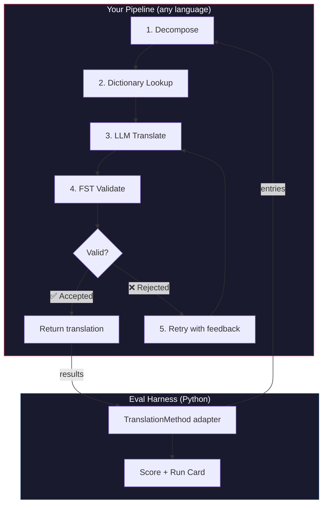
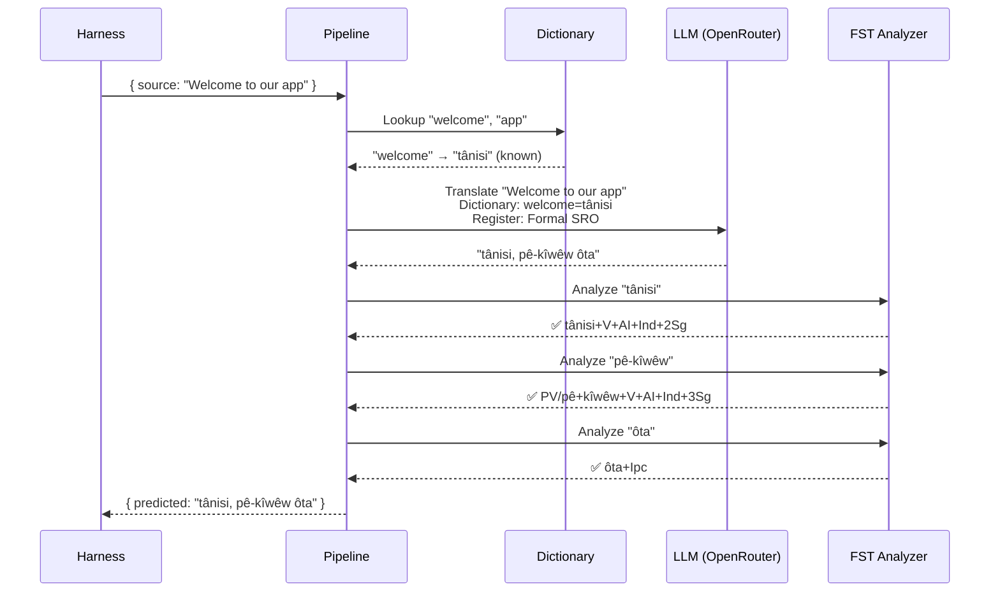
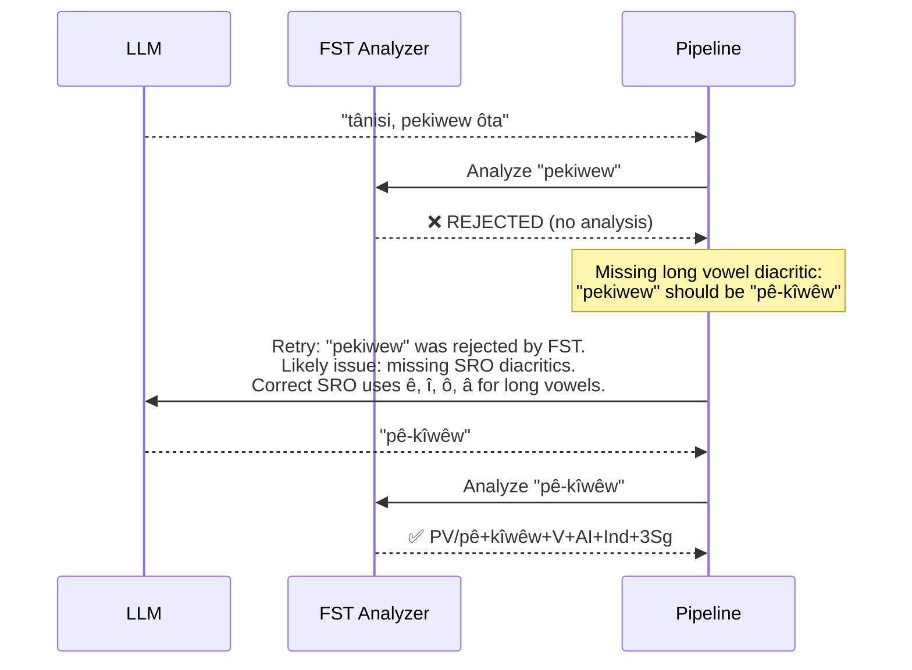

# Cookbook: FST 게이팅 번역 파이프라인

소스 텍스트를 분해하고, LLM을 통해 번역하고, 유한 상태 변환기(FST)로 출력을 검증하며, FST가 유효하지 않은 단어 형태를 거부할 때 재시도하는 다단계 번역 파이프라인을 구축해요. 그런 다음 이를 eval harness에 연결하여 점수가 어떻게 나오는지 확인해요.

**구축할 내용:** 형태론적으로 유효하지 않은 번역을 점수에 반영되기 *전에* 잡아내는 Plains Cree용 번역 파이프라인이에요.

:::info[사전 요구 사항]
- 실행 중인 FST 바이너리(예: [GiellaLT/ALTLab Plains Cree analyzer](https://github.com/giellalt/lang-crk) — GitHub 릴리스가 아닌 GiellaLT의 nightly 채널을 통해 배포됨)
- Node.js 20 이상(파이프라인용) 및 Python 3.10 이상(harness용)
- LLM 단계를 위한 OpenRouter API 키
:::

---

## 아키텍처

이 파이프라인은 여러 단계의 체인이에요. 각 단계는 특정한 역할을 가져요. 어떤 언어로든 구축할 수 있어요 — 이 예제는 JavaScript를 사용하지만, harness는 내부에 무엇이 들어있는지 신경 쓰지 않아요. harness는 경계에 있는 얇은 Python 어댑터만 볼 뿐이에요.



### 이러한 단계가 필요한 이유

| 단계 | 하는 일 | 왜 중요한가 |
|-------|-------------|---------------|
| **Decompose** | 복합 UI 문자열을 번역 가능한 세그먼트로 분해 | 다종합어는 단일 단어에 문장 전체를 인코딩해요 — LLM은 더 작은 단위가 필요해요 |
| **Dictionary Lookup** | 알려진 번역에 대해 이중 언어 사전을 확인 | LLM의 추측에 의존하는 대신 알려진 용어에 대해 올바른 용어를 강제해요 |
| **LLM Translate** | 어조 및 문법 컨텍스트와 함께 세그먼트를 LLM에 전송 | 새로운 표현을 처리하고 유창한 출력을 생성해요 |
| **FST Validate** | 형태론적 분석기를 통해 출력을 실행 | 유효하지 않은 단어 형태를 잡아내요 — FST가 단어를 거부하면, 그것은 해당 언어에서 유효한 단어 형태가 아니에요 |
| **Retry** | 거부된 단어를 FST의 오류 피드백과 함께 다시 전송 | 단어가 *왜* 잘못되었는지에 대한 구체적인 정보를 LLM에 제공해요 |

---

## 데이터 흐름

단일 항목이 파이프라인을 통과할 때 어떤 일이 일어나는지 살펴볼게요:



### FST가 거부할 때



---

## 구현

원하는 무엇이든 구축하세요. 이 예제는 JavaScript를 사용하지만, Python, Rust 또는 다른 어떤 것이든 사용할 수 있어요. harness는 신경 쓰지 않아요 — harness는 얇은 Python 어댑터(다음 섹션에 표시)와만 통신해요.

### 파이프라인

각 단계는 함수예요. 파이프라인은 이들을 체인으로 연결해요.

```javascript title="pipeline.js"
import { lookupDictionary } from './dictionary.js';
import { callLLM } from './llm.js';
import { analyzeWithFST } from './fst.js';

const MAX_RETRIES = 3;

/**
 * Translate a batch of keys through the full pipeline.
 *
 * @param {object} keys - Map of key → source string
 * @param {object} options - { sourceLang, targetLang }
 * @returns {{ translations: object, stats: object }}
 */
export async function translateBatch(keys, options) {
  const translations = {};
  const stats = { total: 0, fstAccepted: 0, retries: 0, dictionaryHits: 0 };

  for (const [key, sourceText] of Object.entries(keys)) {
    stats.total++;
    translations[key] = await translateSingle(sourceText, options, stats);
  }

  return { translations, stats };
}

/**
 * Translate a single string through all pipeline stages.
 */
async function translateSingle(sourceText, options, stats) {

  // ── Stage 1: Decompose ──────────────────────────────────
  // Split compound strings into segments the LLM can handle.
  // For UI strings this is often a no-op, but for longer content
  // it prevents the LLM from losing context in long prompts.
  const segments = decompose(sourceText);

  // ── Stage 2: Dictionary Lookup ──────────────────────────
  // Check each segment against the bilingual dictionary.
  // Known terms are forced — the LLM won't override them.
  const knownTerms = {};
  for (const segment of segments) {
    const entry = lookupDictionary(segment.toLowerCase());
    if (entry) {
      knownTerms[segment] = entry;
      stats.dictionaryHits++;
    }
  }

  // ── Stage 3: LLM Translate ──────────────────────────────
  let translation = await callLLM(sourceText, {
    ...options,
    knownTerms,
    register: 'nêhiyawêwin (Plains Cree). Use SRO orthography. '
            + 'Professional register for educational contexts.',
  });

  // ── Stage 4: FST Validate ──────────────────────────────
  // Split the translation into words and check each one.
  let { accepted, rejected } = await validateWords(translation);

  // ── Stage 5: Retry Loop ─────────────────────────────────
  // If any words were rejected, retry with FST feedback.
  let attempt = 0;
  while (rejected.length > 0 && attempt < MAX_RETRIES) {
    attempt++;
    stats.retries++;

    const feedback = rejected
      .map(w => `"${w}" was rejected by the morphological analyzer`)
      .join('; ');

    translation = await callLLM(sourceText, {
      ...options,
      knownTerms,
      register: 'nêhiyawêwin (Plains Cree). Use SRO orthography.',
      feedback: `Previous attempt had invalid words. ${feedback}. `
              + 'Use correct SRO diacritics (ê, î, ô, â for long vowels). '
              + 'Ensure verb forms match expected conjugation patterns.',
    });

    ({ accepted, rejected } = await validateWords(translation));
  }

  if (rejected.length === 0) stats.fstAccepted++;

  return translation;
}

/**
 * Decompose source text into translatable segments.
 *
 * For simple key-value UI strings, this usually returns the
 * original string as a single segment. For longer content,
 * it splits on sentence boundaries.
 */
function decompose(text) {
  // Simple sentence-boundary split. Replace with your own
  // morphological decomposition for more complex needs.
  return text
    .split(/(?<=[.!?])\s+/)
    .filter(s => s.trim().length > 0);
}

/**
 * Validate each word in a translation against the FST.
 *
 * @returns {{ accepted: string[], rejected: string[] }}
 */
async function validateWords(translation) {
  // Split on whitespace and punctuation, keeping only words
  const words = translation
    .split(/[\s,;:.!?'"()\[\]{}]+/)
    .filter(w => w.length > 0);

  const accepted = [];
  const rejected = [];

  for (const word of words) {
    const analyses = await analyzeWithFST(word);
    if (analyses.length > 0) {
      accepted.push(word);
    } else {
      rejected.push(word);
    }
  }

  return { accepted, rejected };
}
```

### FST 래퍼

FST 바이너리를 비동기 함수로 래핑하세요. 이 예제는 ALTLab의 HFST 기반 Plains Cree 분석기를 사용해요.

```javascript title="fst.js"
import { execFile } from 'node:child_process';
import { promisify } from 'node:util';

const execFileAsync = promisify(execFile);

// Path to your FST analyzer binary
const FST_PATH = process.env.FST_ANALYZER_PATH || './bin/crk-analyzer';

/**
 * Run a word through the FST morphological analyzer.
 *
 * Returns an array of analyses. Empty array = rejected.
 *
 * Example:
 *   analyzeWithFST("tânisi")
 *   → ["tânisi+V+AI+Ind+2Sg", "tânisi+V+AI+Cnj+2Sg"]
 *
 *   analyzeWithFST("pekiwew")
 *   → []  // rejected — missing diacritics
 *
 * @param {string} word - A single word in SRO orthography
 * @returns {string[]} Array of FST analyses (empty = rejected)
 */
export async function analyzeWithFST(word) {
  try {
    // HFST lookup: pipe the word to stdin, read analyses from stdout
    const { stdout } = await execFileAsync(
      FST_PATH,
      ['--quiet'],
      { input: word + '\n', timeout: 5000 }
    );

    // Parse HFST output: each line is "input\tanalysis\tweight"
    // Lines with "+?" indicate unrecognized forms
    return stdout
      .split('\n')
      .filter(line => line.includes('\t') && !line.includes('+?'))
      .map(line => line.split('\t')[1]);

  } catch (err) {
    // If the FST binary isn't available, log and reject
    console.error(`[WARN] FST analysis failed for "${word}": ${err.message}`);
    return [];
  }
}
```

### 사전 및 LLM 모듈

```javascript title="dictionary.js"
/**
 * Simple bilingual dictionary backed by a JSON file.
 *
 * In production, you'd load from the coaching data directory
 * or query itwêwina (https://itwewina.altlab.app/) via API.
 */
const DICTIONARY = {
  'hello': 'tânisi',
  'welcome': 'tânisi',
  'thank you': 'kinanâskomitin',
  'home': 'kīwēwin',
  'search': 'nānātawāpahtam',
  'settings': 'isi-nākatohkēwin',
  'help': 'nīsōhkamākēwin',
  'back': 'kīwē',
};

/**
 * @param {string} term - Lowercase English term
 * @returns {string|null} Cree translation or null
 */
export function lookupDictionary(term) {
  return DICTIONARY[term] || null;
}
```

```javascript title="llm.js"
/**
 * Call an LLM via OpenRouter for translation.
 */
const OPENROUTER_API = 'https://openrouter.ai/api/v1/chat/completions';

export async function callLLM(sourceText, options) {
  const { knownTerms = {}, register, feedback } = options;

  // Build the system prompt with register and known terms
  let systemPrompt = `You are translating English to Plains Cree.\n\n`;
  systemPrompt += `Register: ${register}\n\n`;

  if (Object.keys(knownTerms).length > 0) {
    systemPrompt += `Required terminology (use these exact translations):\n`;
    for (const [en, crk] of Object.entries(knownTerms)) {
      systemPrompt += `  "${en}" → "${crk}"\n`;
    }
    systemPrompt += '\n';
  }

  if (feedback) {
    systemPrompt += `IMPORTANT correction from previous attempt:\n${feedback}\n\n`;
  }

  systemPrompt += `Rules:\n`;
  systemPrompt += `- Use Standard Roman Orthography (SRO)\n`;
  systemPrompt += `- Use macron/circumflex for long vowels: ê, î, ô, â\n`;
  systemPrompt += `- Return ONLY the Cree translation, nothing else\n`;

  const response = await fetch(OPENROUTER_API, {
    method: 'POST',
    headers: {
      'Authorization': `Bearer ${process.env.OPENROUTER_API_KEY}`,
      'Content-Type': 'application/json',
    },
    body: JSON.stringify({
      model: 'google/gemini-2.5-pro',
      messages: [
        { role: 'system', content: systemPrompt },
        { role: 'user', content: sourceText },
      ],
      temperature: 0.2,
    }),
  });

  const json = await response.json();
  return json.choices[0].message.content.trim();
}
```

---

## Harness에 연결하기

파이프라인이 구축되었어요. 이제 leaderboard에서 벤치마크할 수 있도록 이를 eval harness에 연결해야 해요.

harness는 하나의 인터페이스로 통신해요: `TranslationMethod`. 이것은 단일 메서드를 가진 Python 프로토콜이에요. 어떤 언어로든 원하는 무엇이든 구축한 다음 — 이 얇은 래퍼만 제공하면 연결돼요.

```python title="fst_gated_process.py"
"""
TranslationMethod adapter for the FST-gated pipeline.

This thin wrapper connects your pipeline (running as a local
subprocess or HTTP server) to the eval harness. The harness
calls translate() with corpus entries. You call your pipeline.
You return results. That's it.
"""

import time
import subprocess
import json
from mt_eval_harness.config import RunConfig


class FSTGatedProcess:
    """Adapter between the eval harness and your FST-gated pipeline.

    The pipeline runs as a Node.js subprocess. This wrapper:
    1. Receives entries from the harness
    2. Sends them to the pipeline
    3. Returns structured results the harness can score
    """

    def __init__(self, pipeline_url: str = "http://localhost:3001"):
        self.pipeline_url = pipeline_url

    async def translate(
        self,
        entries: list[dict],
        config: RunConfig,
    ) -> list[dict]:
        """Translate a batch of entries through the FST-gated pipeline.

        Args:
            entries: List of corpus entries with 'id' and source text.
            config: Harness run configuration (for context).

        Returns:
            List of result dicts, one per entry.
        """
        import httpx

        results = []

        for entry in entries:
            source_text = entry.get(config.source_field, entry.get("source", ""))
            start = time.monotonic()

            try:
                # Call your pipeline — however it's running
                async with httpx.AsyncClient() as client:
                    response = await client.post(
                        f"{self.pipeline_url}/translate",
                        json={"keys": {str(entry["id"]): source_text}},
                        timeout=30.0,
                    )
                    data = response.json()
                    predicted = data["translations"][str(entry["id"])]

                elapsed = time.monotonic() - start

                results.append({
                    "id": entry["id"],
                    "predicted": predicted,
                    "latency_s": elapsed,
                    "usage": {},  # pipeline doesn't expose token counts
                    "error": None,
                    "tool_calls": [],
                    "tool_call_count": 0,
                    "metadata": data.get("meta", {}),
                })

            except Exception as err:
                results.append({
                    "id": entry["id"],
                    "predicted": "",
                    "latency_s": time.monotonic() - start,
                    "usage": {},
                    "error": str(err),
                    "tool_calls": [],
                    "tool_call_count": 0,
                    "metadata": {},
                })

        return results
```

:::tip[HTTP는 필요하지 않아요]
위 예제에서는 파이프라인이 JavaScript로 작성되어 있기 때문에 HTTP를 통해 파이프라인을 호출해요. 파이프라인이 Python으로 작성되어 있다면 직접 호출할 수 있어요 — 서버가 필요 없어요. `TranslationMethod` 래퍼는 단지 함수 경계일 뿐이에요. 그 안에서 무슨 일이 일어나는지는 여러분에게 달려 있어요.
:::

### 벤치마크 실행하기

파이프라인을 시작한 다음, harness를 실행하세요:

```bash
# Terminal 1: Start the pipeline
node server.js

# Terminal 2: Run the harness with your process
export OPENROUTER_API_KEY="sk-or-v1-..."

python -c "
import asyncio
from mt_eval_harness.config import RunConfig
from mt_eval_harness.runner import execute_run
from fst_gated_process import FSTGatedProcess

async def main():
    config = RunConfig(
        corpus_path='data/your-crk-dev-v1.json',
        source_lang='English',
        target_lang='Plains Cree (nêhiyawêwin, SRO)',
        process_name='fst-gated-v1',
    )
    process = FSTGatedProcess('http://localhost:3001')
    run_log = await execute_run(config, process=process)
    print(f'Results: {run_log.output_path}')

asyncio.run(main())
"
```

또는 CLI를 사용하여 기본 제공 baseline과 비교하세요:

```bash
mt-eval run \
  --corpus eval-amh-fra-globalvoices-test-v1 \
  --model google/gemini-2.5-pro \
  --fst-retries 3 \
  --name fst-gated-v1 \
  --publish
```

---

## 결과 이해하기

harness는 **run card** — 점수가 담긴 JSON 파일을 생성해요. 다음과 같은 내용을 보게 돼요:

```
═══════════════════════════════════════════════════
  FST-Gated Pipeline v1 — EDTeKLA Dev v1
═══════════════════════════════════════════════════

  chrF++              48.7 / 100
  Exact match         12.1%
  FST acceptance      94.4%
  Composite score     0.52  →  Functional ✓

  436 entries (textbook_dev.json) · 47 retries · $0.18 total cost
═══════════════════════════════════════════════════
```

**한눈에 알 수 있는 내용:**
- 여러분의 방법은 **Functional** 등급(0.50–0.70)이에요 — 출력이 화자에게 인식 가능하고, 주요 문법은 대체로 정확하지만, 형태론적 오류가 여전히 빈번하게 남아 있어요.
- FST가 단어의 94%를 유효한 것으로 잡아내고 있어요 — 재시도 루프가 작동하고 있어요.
- 번역의 12%가 정확히 맞아요 — 개선의 여지가 많이 있어요.

:::info[품질 등급]
| 등급 | 종합 점수 | 의미 |
|------|-----------|---------------|
| Baseline | 0.00–0.30 | 원시 LLM 출력, 대부분 형태소가 환각으로 생성됨 |
| Emerging | 0.30–0.50 | 일부 패턴은 정확하지만 신뢰할 수 없음 |
| **Functional** | **0.50–0.70** | **화자가 알아볼 수 있음. 주요 범주는 대체로 정확함.** |
| Deployable | 0.70–0.85 | 사람의 검토를 거친 초안 번역에 적합함 |
| Fluent | 0.85–1.00 | 유능한 사람의 번역에 근접함 |

전체 등급 정의는 [SCORING_SPEC §5](/docs/network/specifications/scoring#5-quality-tiers)를 참조하세요.
:::

<details>
<summary><strong>더 깊이: run card에는 무엇이 들어있나요?</strong></summary>

run card JSON은 이 평가 실행에 관한 모든 것을 담아요. 주요 섹션은 다음과 같아요:

**Scores** — harness가 계산한 모든 메트릭:
```json
{
  "scores": {
    "exact_match_rate": 0.121,
    "chrf_plus_plus": 48.7,
    "fst_acceptance_rate": 0.944,
    "composite_score": 0.52,
    "quality_tier": "functional"
  }
}
```

**Provenance** — 이러한 결과를 생성한 것:
```json
{
  "method": {
    "process_name": "fst-gated-v1",
    "model": "google/gemini-2.5-pro",
    "temperature": 0.0
  },
  "corpus": {
    "id": "edtekla-dev-v1",
    "sha256": "a1b2c3..."
  }
}
```

**항목별 결과** — 개별 점수가 있는 모든 번역으로, 여러분의 방법이 어디서 어려움을 겪는지 찾을 수 있어요:
```json
{
  "id": 42,
  "source": "The student completed the assignment",
  "reference": "ôskiniw kî-kîsîhtâw ôhi atoskêwina",
  "predicted": "ôskiniw kî-kîsîhtâw ôhi atoskêwin",
  "chrf": 89.2,
  "exact_match": false,
  "fst_accepted": true
}
```

종합 점수는 사용 가능한 메트릭의 가중 평균이며, 가중치는 [SCORING_SPEC §4](/docs/network/specifications/scoring#4-composite-score)에 정의되어 있어요. 메트릭을 사용할 수 없는 경우, 그 가중치는 나머지에 비례적으로 재분배돼요.

</details>

---

## 프로덕션에 배포하기

여러분의 방법이 leaderboard에 점수를 가지고 있어요. 이제 실제로 사용하고 싶을 거예요. 이 섹션은 [champollion](https://champollion.dev)이 호출할 수 있는 프로덕션 엔드포인트로 파이프라인을 제공하는 것에 관한 내용이에요.

:::note[이 섹션은 선택 사항이에요]
위의 모든 내용은 여러분의 방법을 구축하고 벤치마킹하는 것에 관한 내용이에요. 이 섹션은 배포에 관한 것으로, 별개의 사안이에요. 아무것도 배포하지 않고도 리더보드에 제출할 수 있어요.
:::

### HTTP 서버

[API 메서드 계약](https://champollion.dev/docs/guides/serving-a-method)을 구현하는 Express 서버로 파이프라인을 래핑하세요:

```javascript title="server.js"
import express from 'express';
import { translateBatch } from './pipeline.js';

const app = express();
app.use(express.json());

/**
 * API method contract:
 *
 * Request:  { source_locale, target_locale, method, keys: { "key": "source" } }
 * Response: { translations: { "key": "translated" }, meta: { ... } }
 */
app.post('/translate', async (req, res) => {
  const { source_locale, target_locale, method, keys } = req.body;

  // Validate request
  if (!keys || typeof keys !== 'object') {
    return res.status(400).json({ error: { message: 'Missing keys object' } });
  }

  try {
    const startTime = Date.now();
    const { translations, stats } = await translateBatch(keys, {
      sourceLang: source_locale,
      targetLang: target_locale,
    });

    res.json({
      translations,
      meta: {
        model: 'custom-pipeline/fst-gated-v1',
        method: 'decompose-lookup-translate-validate',
        elapsed_ms: Date.now() - startTime,
        fst_acceptance_rate: stats.fstAccepted / stats.total,
        retries: stats.retries,
      },
    });
  } catch (err) {
    console.error('[ERR] Pipeline failed:', err.message);
    res.status(500).json({ error: { message: err.message } });
  }
});

// Health check for connectivity verification
app.get('/health', (req, res) => res.json({ status: 'ok' }));

app.listen(3001, () => {
  console.log('FST-gated pipeline running on http://localhost:3001');
});
```

### champollion 설정

언어 쌍을 실행 중인 서비스로 지정하세요:

```json title="champollion.config.json"
{
  "version": 3,
  "inputLocale": "en",
  "pairs": {
    "en:crk": {
      "method": "api",
      "endpoint": "http://localhost:3001/translate"
    }
  },
  "languages": {
    "crk": {
      "name": "Plains Cree",
      "register": "SRO syllabics with grammatical precision."
    }
  }
}
```

```bash
# Run it
export OPENROUTER_API_KEY="sk-or-v1-..."
node server.js &
npx champollion sync
```

### 플러그인으로 패키징하기

방법이 점수를 가지게 되면, 다른 사람들이 사용할 수 있도록 패키징하세요:

```json title="crk-fst-gated-v1/method.json"
{
  "name": "crk-fst-gated-v1",
  "type": "api",
  "version": "1.0.0",
  "description": "FST-gated Plains Cree translation with morphological validation",
  "author": "Your Name",

  "config": {
    "endpoint": "https://your-server.example.com/translate"
  },

  "locales": ["crk"],

  "benchmarks": {
    "crk": {
      "date": "2026-06-01T00:00:00Z",
      "corpus_size": 436,
      "exact_match_rate": 0.12,
      "corpus_chrf": 48.7,
      "model": "google/gemini-2.5-pro",
      "harness_version": "2.0"
    }
  },

  "provenance": {
    "resources": [
      { "name": "GiellaLT/ALTLab CRK Analyzer", "license": "AGPL-3.0-or-later", "type": "fst" },
      { "name": "Wolvengrey Dictionary", "license": "none", "type": "dictionary" }
    ],
    "commercialReady": false,
    "flags": ["nc-resource"]
  }
}
```

---

## 이 패턴 확장하기

이 cookbook은 하나의 파이프라인 아키텍처를 보여줘요. 어떤 언어나 방법에도 적용할 수 있어요:

| 변형 | 변경되는 것 |
|-----------|-------------|
| **다른 FST** | 바이너리 경로를 교체하세요. [GiellaLT GitHub](https://github.com/giellalt) 또는 [Apertium GitHub](https://github.com/apertium)에서 100개 이상의 언어에 대한 사전 컴파일된 FST(`.hfstol` 또는 `lttoolbox` 바이너리 등)를 다운로드할 수 있어요. |
| **사용 가능한 FST 없음** | FST 실행 단계를 제거하고 Hugging Face의 [UniMorph 플랫 패러다임 파일](https://huggingface.co/datasets/unimorph/universal_morphologies)을 사용하여 굴절형의 정적 데이터베이스 조회 검증을 수행하세요. |
| **여러 LLM** | 모델을 체인으로 연결: 초기 초안용 빠른 모델, 수정용 추론 모델. |
| **인간 개입(Human-in-the-loop)** | 불확실한 번역을 반환하기 전에 전문가 검토를 위해 보관하는 큐 단계를 추가하세요. |
| **파인튜닝된 모델** | OpenRouter 호출을 로컬 모델(Ollama, vLLM 등)로 대체하세요. |
| **다른 언어** | 사전, FST 및 어조를 변경하세요. 아키텍처는 동일하게 유지돼요. |

파이프라인은 하나의 패턴이에요. 단계들은 서로 교체 가능해요. 여러분의 언어에 맞는 것을 구축하고, [leaderboard](https://champollion.dev/leaderboard)에서 입증하고, 배포하세요.

---

## 참고 항목

- **[평가 Harness](/docs/network/specifications/harness)** — harness 실행 및 출력 결과 해석 방법
- **[메서드 인터페이스](/docs/network/specifications/methods)** — `TranslationMethod` 프로토콜 사양
- **[리더보드 규칙](/docs/network/leaderboard/rules)** — 제출 기준 및 어뷰징 방지 정책
- **[자원이 부족한 언어 지원하기](/docs/network/community/low-resource-languages)** — 전반적인 배경 및 데이터 주권 원칙
- **[ALTLab](https://altlab.ualberta.ca/)** — Alberta Language Technology Lab (Plains Cree FST)
- **[메서드 리더보드](https://champollion.dev/leaderboard)** — 점수 제출
