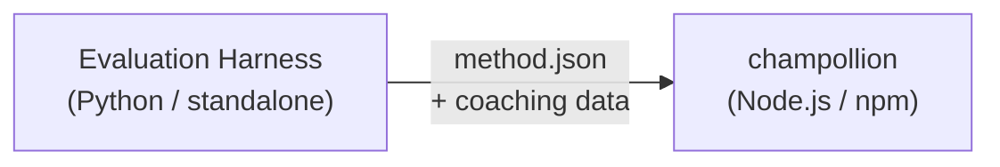

# Method Plugin 명세

> **Version**: 1.1  
> **Audience**: 플러그인 개발자  
> **Canonical Schema**: [`shared/schemas/champollion-plugin.schema.json`](https://github.com/gamedaysuits/Champollion/blob/main/cli/shared/schemas/champollion-plugin.schema.json)

## 개요

champollion은 **플러그형 method 시스템**을 사용해요. 각 언어 쌍은 서로 다른 번역 method(LLM, coached, script-converter 등)를 사용할 수 있어요. Method는 `lib/translate.js`에 등록되고 `lib/pairs.js`을 통해 쌍마다 해석돼요.

eval harness의 역할은 번역 method를 **개발, 테스트, 내보내는** 것이에요. champollion의 역할은 그것을 **소비하고 실행하는** 것이에요. 플러그인은 **데이터 전용**이에요 — 구성, coaching 콘텐츠, 벤치마크 결과요. Python 코드도 없고, harness 의존성도 없어요.

### 데이터 흐름



harness는 Python에서 method를 개발하고 테스트해요. Method가 배포 준비가 되면, harness는 `method.json` 매니페스트와 선택적인 coaching 데이터 파일을 내보내요. Champollion은 자체 내장 method 구현을 사용해 method를 설치하고 실행해요.

---

## Method Plugin 형식

method 플러그인은 선택적인 coaching 데이터 파일을 포함하는 단일 JSON 파일(`method.json`)이에요.

### `method.json` — 필수

```json
{
  "name": "french-formal-v1",
  "type": "llm-coached",
  "version": "1.0.0",
  "description": "Formally-tuned French with terminology enforcement and grammar coaching",
  "author": "Plugin Author",

  "config": {
    "model": "google/gemini-3.5-flash",
    "temperature": 0.2,
    "batchSize": 80,
    "register": "formal",
    "coachingFile": null,
    "coachingPrompt": null,
    "promptContext": null,
    "qualityTier": null
  },

  "locales": ["fr"],

  "benchmarks": {
    "fr": {
      "date": "2026-05-11T00:00:00Z",
      "corpus_size": 500,
      "exact_match_rate": 0.42,
      "corpus_chrf": 72.3,
      "corpus_bleu": 45.1,
      "model": "google/gemini-3.5-flash",
      "harness_version": "1.0.0"
    }
  },

  "provenance": {
    "resources": [],
    "commercialReady": false,
    "flags": ["license-unclear"]
  },

  "coaching": {
    "dir": "coaching"
  }
}
```

### 필드 레퍼런스

| 필드 | 타입 | 필수 | 설명 |
|-------|------|----------|-------------|
| `name` | string | ✅ | 고유한 method 식별자(kebab-case) |
| `type` | string | ✅ | Champollion method 타입: `llm`, `llm-coached`, `api`, `google-translate`, `deepl`, `microsoft-translator`, `libretranslate`, `openai`, `anthropic`, `gemini` |
| `version` | string | ✅ | Semver 버전(예: `1.0.0`) |
| `locales` | string[] | ✅ | 이 method가 대상으로 하는 로케일 코드(최소 1개) |
| `description` | string | — | 사람이 읽을 수 있는 설명 |
| `author` | string | — | 이 method를 개발/테스트한 사람 |
| `config.model` | string | — | OpenRouter 모델 식별자 |
| `config.temperature` | number | — | LLM temperature(0.0–2.0, 기본값: 0.3) |
| `config.batchSize` | number | — | API 배치당 키 수(1–200, 기본값: 80) |
| `config.register` | string \| null | — | 대상 언어 register/tone(프리셋 키 또는 자유 형식 텍스트) |
| `config.coachingFile` | string \| null | — | 자유 텍스트 coaching 프롬프트 파일 경로(프로젝트 루트 기준 상대 경로) |
| `config.coachingPrompt` | string \| null | — | 해석된 coaching 프롬프트 텍스트(런타임에 `coachingFile`에서 읽음) |
| `config.promptContext` | string \| null | — | 시스템 프롬프트에 주입되는 애플리케이션 컨텍스트(예: "E-commerce product descriptions") |
| `config.qualityTier` | string \| null | — | 벤치마크 평가에서 도출된 품질 등급(`standard`, `high`, `research`, `verified`) |
| `benchmarks` | object | — | eval harness의 로케일별 벤치마크 결과 |
| `provenance` | object | — | 라이선스 및 리소스 의존성 |
| `coaching.dir` | string | — | coaching 데이터 디렉터리의 상대 경로 |

:::info[Canonical MethodConfig Shape]
`config` 블록은 **canonical MethodConfig schema**를 사용해요 — `champollion.config.json`, harness run card, `mt-eval export-config`, 리더보드 게시/설치 전반에 사용되는 동일한 8개 필드예요. 모든 필드는 항상 존재하며, 사용되지 않는 값은 `null`이에요. 이를 통해 평가와 프로덕션 사이의 왕복 처리가 매끄럽게 이루어져요.
:::

### Benchmark 오브젝트(로케일별)

| 필드 | 타입 | 필수 | 설명 |
|-------|------|----------|-------------|
| `date` | string | ✅ | 벤치마크 실행의 ISO 8601 타임스탬프 |
| `corpus_size` | number | ✅ | 평가된 항목 수 |
| `exact_match_rate` | number | ✅ | 0.0–1.0, 정확히 일치한 비율 |
| `corpus_chrf` | number | — | chrF++ 점수(0–100) |
| `corpus_bleu` | number | — | BLEU 점수(0–100) |
| `model` | string | ✅ | eval 중 사용된 모델 |
| `harness_version` | string | ✅ | 사용된 평가 harness의 버전 |

:::info[어떤 지표가 표시되나요?]
`champollion status` 명령은 벤치마크 블록에서 **chrF++**와 **정확 일치율**을 표시해요. `corpus_bleu`는 매니페스트에서 허용되지만 현재 어떤 champollion 명령에서도 표시되거나 사용되지 않아요. [Method Leaderboard](/leaderboard)는 chrF++, 정확 일치, FST 수용률을 추적해요.
:::

---

### Provenance 오브젝트

provenance 블록은 플러그인에 번들된 리소스의 라이선스 상태를 전달해요.

| 필드 | 타입 | 기본값 | 설명 |
|-------|------|---------|-------------|
| `resources` | object[] | `[]` | `name`, `license`, `type`를 포함하는 번들 리소스 목록 |
| `commercialReady` | boolean | `false` | 플러그인이 상업적 배포에 대해 승인되었는지 여부 |
| `flags` | string[] | `["license-unclear"]` | 기계가 읽을 수 있는 상태 플래그 |

**기본 상태** — 내보낸 플러그인은 `commercialReady: false`와 `flags: ["license-unclear"]`로 배포돼요.

**승인 상태** — 라이선스가 검증되었을 때: `commercialReady: true`를 설정하고 플래그를 지워요.

---

## Coaching 데이터 형식

`type`가 `llm-coached`인 경우, 플러그인은 `coaching/` 하위 디렉터리에 coaching 데이터 파일을 포함해야 해요.

### `coaching/<locale>.json`

```json
{
  "grammar_rules": [
    "French adjectives agree in gender and number with the noun they modify",
    "Use 'vous' for formal contexts, 'tu' for informal"
  ],
  "dictionary": {
    "dashboard": "tableau de bord",
    "deployment": "déploiement",
    "settings": "paramètres"
  },
  "style_notes": "Prefer active voice. Avoid anglicisms where a native French term exists."
}
```

| 필드 | 타입 | 필수 | 설명 |
|-------|------|----------|-------------|
| `grammar_rules` | string[] | — | 이 로케일에 대한 모든 LLM 프롬프트에 주입되는 규칙 |
| `dictionary` | object | — | 용어 → 번역 맵. 일치하는 용어는 필수 용어로 주입돼요. |
| `style_notes` | string | — | 프롬프트에 추가되는 자유 형식 스타일 지침 |

---

## 디렉터리 구조

```
french-formal-v1/
  method.json                 # Method manifest with benchmarks
  coaching/
    fr.json                   # Coaching data for French
```

다중 로케일 method의 경우:

```
european-formal-v2/
  method.json                 # locales: ["fr", "de", "es", "it"]
  coaching/
    fr.json
    de.json
    es.json
    it.json
```

---

## Champollion이 플러그인을 소비하는 방식

### 설치

```bash
champollion plugin install ./french-formal-v1/
```

`.champollion/methods/french-formal-v1/`에 저장돼요.

### 구성

```json title="champollion.config.json"
{
  "pairs": {
    "en:fr": {
      "methodPlugin": "french-formal-v1"
    }
  }
}
```

:::info[병합 시맨틱]
플러그인은 *어떤* method를 사용할지(`type`)를 정의해요. 쌍 구성은 그것을 *어떻게* 실행할지(`model`, `register`, `batchSize`)를 조정해요. 쌍이 `model`를 설정하면, 플러그인의 기본값을 재정의해요.
:::

### 런타임

1. Champollion은 `.champollion/methods/french-formal-v1/`에서 `method.json`를 읽어요
2. 플러그인의 `type` 필드가 번역 method를 설정해요(예: `llm-coached`)
3. 플러그인의 `coaching/` 디렉터리에서 coaching 데이터를 로드해요
4. `config` 블록을 사용해 모델/register/temperature의 빈 부분을 채워요
5. `benchmarks` 블록은 `champollion status` 출력에 표시돼요
6. `provenance` 블록은 라이선스 플래그를 위해 `champollion provenance`에서 확인돼요

---

## Schema 검증

플러그인 매니페스트는 설치 시점에 [`shared/schemas/champollion-plugin.schema.json`](https://github.com/gamedaysuits/Champollion/blob/main/cli/shared/schemas/champollion-plugin.schema.json)에 대해 검증돼요.

IDE 자동 완성을 위해 `method.json`에서 schema를 참조하세요:

```json
{
  "$schema": "./node_modules/champollion/shared/schemas/champollion-plugin.schema.json",
  "name": "my-method-v1"
}
```

---

## 포함하지 말아야 할 것

- ❌ Python 코드나 harness 의존성 없음
- ❌ 원시 코퍼스 데이터나 run 로그 없음
- ❌ API 키나 자격 증명 없음
- ❌ harness 구성 없음
- ❌ 내부 프롬프트 템플릿 없음(그것들은 champollion의 method 구현에 있음)

플러그인은 **데이터 전용**이에요: 구성, coaching 콘텐츠, 벤치마크 결과요.

---

## 함께 보기

- [Translation Methods](/docs/guides/translation-methods) — 각 내장 method의 작동 방식
- [Configuration](/docs/getting-started/configuration) — 쌍별 및 언어별 구성
- [Serving a Method via API](/docs/guides/serving-a-method) — method를 HTTP 서비스로 호스팅하기
- [Cookbook: FST-Gated Pipeline](/docs/network/tutorials/fst-gated-pipeline) — 파이프라인 구축 및 패키징
- [MT Evaluation](/docs/network/leaderboard/rules) — 리더보드 제출을 위한 method 벤치마킹
- [Support a Low-Resource Language](/docs/network/community/low-resource-languages) — 커뮤니티 플러그인의 사용 사례
