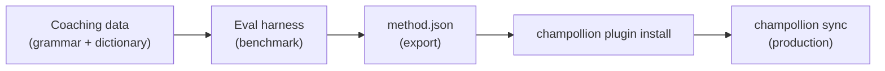

# 튜토리얼: 번역 플러그인 만들기

사용자 정의 번역 방식을 처음부터 만들고, 벤치마크한 뒤, champollion 플러그인으로 배포해요. 이는 기성 API가 지원하지 않는 새로운 언어 쌍을 추가하는 완전한 워크플로우예요.

**만들게 될 것:** 강제 용어, 문법 규칙, 벤치마크 점수를 갖춘 격식체 프랑스어용 코칭 번역 플러그인이에요.

**소요 시간:** 30~45분

**사전 요구 사항:**
- champollion 설치 (`npm install --save-dev champollion`)
- OpenRouter API 키 (`OPENROUTER_API_KEY`)
- Python 3.10+ (eval harness용)

---

## 1단계: 문제 파악하기

SaaS 대시보드를 프랑스어로 번역하고 있어요. 기본 `llm` 방식은 정확하지만 일관성 없는 번역을 만들어내요:

- 때로는 "dashboard"가 "tableau de bord"가 되고, 다른 때는 "panneau de contrôle"이 돼요
- 톤이 `tu`와 `vous` 형식 사이를 오가요
- 기술 용어가 일관성 없이 영어식으로 표기돼요

일반적인 LLM 프롬프트가 제공하지 않는 **용어 강제**와 **격식 제어**가 필요해요.

## 2단계: 코칭 데이터 만들기

언어적 요구 사항을 인코딩하는 코칭 파일을 만들어요:

```bash
mkdir -p .champollion/coaching
```

```json title=".champollion/coaching/fr.json"
{
  "grammar_rules": [
    "Always use the 'vous' form for formal register",
    "French adjectives agree in gender and number with their noun",
    "Use the present tense for UI instructions, not the imperative",
    "Preserve sentence-final punctuation style from the source"
  ],
  "dictionary": {
    "dashboard": "tableau de bord",
    "deployment": "déploiement",
    "settings": "paramètres",
    "environment variable": "variable d'environnement",
    "webhook": "webhook",
    "API key": "clé API",
    "sign in": "se connecter",
    "sign out": "se déconnecter",
    "repository": "dépôt",
    "pull request": "demande de tirage"
  },
  "style_notes": "Formal technical French. Prefer native French terms over anglicisms where established equivalents exist. Keep UI labels concise — 3 words maximum where possible."
}
```

**각 필드의 역할:**
- **`grammar_rules`** — LLM 시스템 프롬프트에 명시적 제약으로 주입돼요
- **`dictionary`** — 소스 키와 매칭돼요. 사전 용어가 나타나면 프롬프트에 "필수 용어"로 주입돼요
- **`style_notes`** — 시스템 프롬프트에 일반적인 스타일 지침으로 추가돼요

## 3단계: 언어 쌍 설정하기

champollion에게 프랑스어에 `llm-coached`를 사용하도록 알려줘요:

```json title="champollion.config.json"
{
  "version": 3,
  "inputLocale": "en",
  "localesDir": "./locales",
  "pairs": {
    "en:fr": {
      "method": "llm-coached",
      "model": "google/gemini-3.5-flash",
      "temperature": 0.2
    }
  },
  "languages": {
    "fr": {
      "register": "Formal technical French (vous-form)",
      "name": "French"
    }
  }
}
```

## 4단계: 테스트하기

```bash
npx champollion sync --dry
```

dry-run 출력을 검토해요. 다음을 확인하세요:
- ✅ 사전 용어가 일관되게 사용되고 있어요 ("panneau de contrôle"이 아니라 "tableau de bord")
- ✅ `vous` 형식이 전체에 걸쳐 사용되고 있어요
- ✅ 기술 용어가 사전과 일치해요

그런 다음 실제 동기화를 실행해요:

```bash
npx champollion sync
```

## 5단계: Eval Harness로 벤치마크하기 (선택 사항)

품질 점수를 원한다면 — 플러그인은 벤치마크 데이터와 함께 배포되기 때문에 원하게 될 거예요 — 함께 제공되는 eval harness를 사용하세요.

### Harness 설치하기

```bash
pip install mt-eval-harness
```

### 참조 코퍼스 만들기

소스 문자열과 검증된 번역이 담긴 파일을 만들어요:

```json title="corpus/french-formal.json"
[
  {
    "source": "Dashboard",
    "reference": "Tableau de bord"
  },
  {
    "source": "Sign in to your account",
    "reference": "Connectez-vous à votre compte"
  },
  {
    "source": "Your deployment is ready",
    "reference": "Votre déploiement est prêt"
  },
  {
    "source": "Environment variables",
    "reference": "Variables d'environnement"
  }
]
```

### 벤치마크 실행하기

```bash
mt-eval test \
  --corpus corpus/french-formal.json \
  --source en \
  --target fr \
  --model google/gemini-3.5-flash \
  --temperature 0.2 \
  --champollion-config champollion.config.json
```

Harness는 다음을 출력해요:
- **chrF++** — 문자 수준 F-점수 (0~100). 70 이상이면 우수해요.
- **BLEU** — N-gram 중복도 (0~100). 코칭 번역의 경우 40 이상이면 견고해요.
- **정확 일치율** — 참조와 정확히 일치하는 번역의 비율이에요.
- **COMET** — 신경망 품질 지표 (`mt-eval setup --comet`를 통해 설치한 경우).

:::tip[배포할 것을 테스트하세요]
`--champollion-config`를 사용하면 프로덕션 모델, 격식, temperature, 코칭 데이터를 `champollion.config.json`에서 직접 가져와요. 이를 통해 배포할 정확한 방식을 벤치마크하게 돼요.
:::

### 플러그인 내보내기

점수에 만족하면:

```bash
mt-eval export \
  --name french-formal-v1 \
  --report eval/logs/harness/run_report.json \
  --output ./french-formal-v1/
```

이렇게 하면 다음이 생성돼요:

```
french-formal-v1/
├── method.json          # Manifest with config + benchmarks
└── coaching/
    └── fr.json          # Your coaching data
```

## 6단계: Champollion에 플러그인 설치하기

```bash
npx champollion plugin install ./french-formal-v1/
```

이렇게 하면 플러그인이 `.champollion/methods/french-formal-v1/`로 복사돼요.

사용하도록 설정을 업데이트해요:

```json title="champollion.config.json"
{
  "pairs": {
    "en:fr": {
      "methodPlugin": "french-formal-v1"
    }
  }
}
```

## 7단계: 검증하기

```bash
# Check plugin is installed and shows benchmark scores
npx champollion status

# Run a sync with the plugin
npx champollion sync

# Audit licensing status
npx champollion provenance
```

`status` 출력에 다음이 표시돼요:

```
en → fr
  Method:    french-formal-v1 (llm-coached)
  Model:     google/gemini-3.5-flash
  Quality:   high
  chrF++:    74.2
  BLEU:      46.8
  Exact:     42%
```

## 만든 것



이제 다음을 갖추었어요:
1. **코칭 데이터** — 일관성을 강제하는 문법 규칙과 용어
2. **벤치마크 점수** — 플러그인과 함께 배포되는 정량화된 품질
3. **이식 가능한 플러그인** — `method.json` + 코칭 데이터, 어떤 머신에도 설치 가능해요
4. **프로덕션 배포** — 동기화 파이프라인에 통합됨

## 다음 단계

- **[플러그인 사양](/docs/reference/plugin-spec)** — 전체 매니페스트 형식 참조
- **[번역 방식](/docs/guides/translation-methods)** — 네 가지 방식 모두 비교
- **[저자원 언어](/docs/network/community/low-resource-languages)** — 이 패턴을 API가 지원하지 않는 언어에 적용
- **[30개 언어 번역하기](/docs/tutorials/translate-30-languages)** — 프로젝트를 전 세계 사용자로 확장
