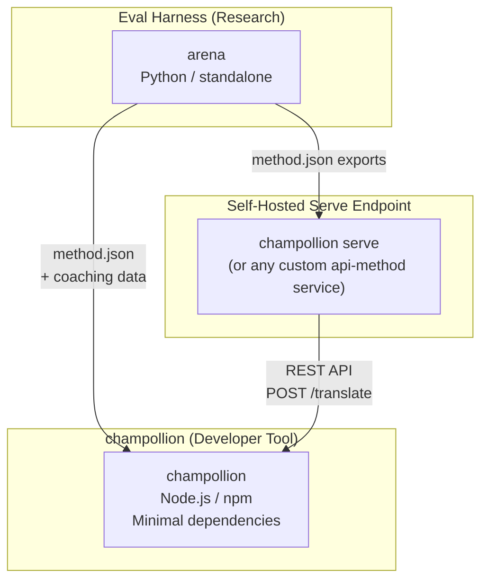
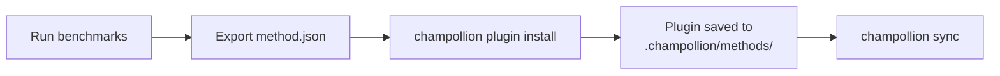
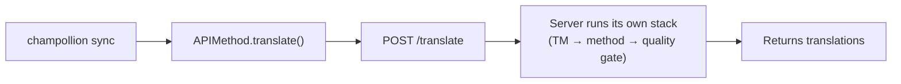
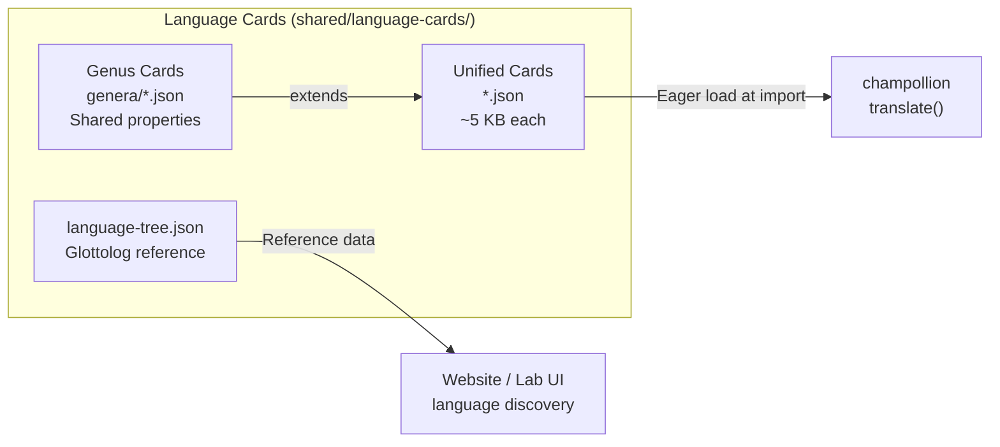

# Architectuur

Het Champollion-vertaalecosysteem bestaat uit drie onafhankelijke tools die samenwerken via goed gedefinieerde contracten. Geen van hen is tijdens het bouwen afhankelijk van de andere. Ze communiceren via een gedeeld **methode-pluginformaat** en een **REST API-contract**.

## De Drie Onderdelen



### champollion (dit project)

De source-available ontwikkelaarstool (gratis voor niet-commercieel gebruik). Vertaalt locale-bestanden met behulp van inplugbare methoden. Minimale afhankelijkheden, configuratie is optioneel, is direct klaar voor gebruik.

**Ingebouwde methoden:**
- `llm` → OpenRouter / elke LLM (200+ modellen)
- `llm-coached` → LLM + grammatica-/woordenboekbegeleiding
- `openai` → Directe OpenAI API (GPT-4o, GPT-4o-mini)
- `anthropic` → Directe Anthropic API (Claude Sonnet, Haiku, Opus)
- `gemini` → Directe Google Gemini API (Flash, Pro — gratis laag beschikbaar)
- `google-translate` → Google Cloud Translation API v2
- `deepl` → DeepL API met ondersteuning voor woordenlijsten
- `microsoft-translator` → Azure Cognitive Services Translator
- `libretranslate` → Zelf te hosten LibreTranslate (AGPL, gratis)
- `api` → Dunne doorvoer naar elk extern REST-eindpunt

### Eval Harness (begeleidend project)

Een onderzoekstool voor het ontwikkelen, testen en benchmarken van vertaalmethoden. Wanneer een methode een aanvaardbare kwaliteit bereikt, exporteert de harness een **methode-plugin** — een `method.json`-manifest en optionele begeleidingsdatabestanden.

De harness wordt nooit uitgevoerd binnen champollion. Het is een afzonderlijke tool die statische uitvoer produceert (JSON-bestanden). Champollion leest die bestanden enkel.

[→ Eval Harness op GitHub](https://github.com/gamedaysuits/Champollion)

### Zelf-gehost serve-eindpunt (`champollion serve`)

Elk champollion-project kan zijn eigen geconfigureerde vertaalstack via HTTP serveren met één commando — [`champollion serve`](/docs/guides/serving-a-method#the-zero-code-path-champollion-serve) — en elk ander project kan deze consumeren via de `api`-methode. De prompts, coachinggegevens, Translation Memory en providersleutels blijven op de infrastructuur van de eigenaar; consumenten sturen alleen bronstrings en ontvangen vertalingen. Pijplijnen die volledig buiten champollion bestaan (een FST-keten, een onderzoekssysteem) kunnen hetzelfde contract implementeren als een [aangepaste service](/docs/guides/serving-a-method). Er is geen gehoste Champollion-service — serveren is vanuit het ontwerp altijd zelf-gehost.

## Hoe Ze Verbonden Zijn

### Eval Harness → champollion (eenrichtingsexport)



**Contract**: [Pluginspecificatie](/docs/reference/plugin-spec)

### Serve-eindpunt → champollion (API tijdens runtime)



De `APIMethod` van Champollion is een **domme doorvoer**. Het verstuurt sleutels en ontvangt vertalingen terug. Het bevat geen enkele vertaallogica en geen enkele propriëtaire inhoud.

## Wat Elk Onderdeel Weet Over de Anderen

| Tool | Heeft kennis van champollion? | Heeft kennis van een serve-eindpunt? | Heeft kennis van harness? |
|------|---------------------|-------------------------------|---------------------|
| **champollion** | *(is champollion)* | Ja — `api`-methode roept het aan | Nee — leest alleen plugin-exports |
| **Serve-eindpunt** | Ja — serveert zijn verzoeken | *(is het serve-eindpunt)* | Nee — installeert geëxporteerde methoden zoals elk project |
| **Eval Harness** | Ja — exporteert plugin-formaat | Nee — methoden worden afzonderlijk geïmplementeerd | *(is de harness)* |

## Gebruikersscenario's

### Scenario 1: Gratis, zonder configuratie (de meeste gebruikers)

```bash
export OPENROUTER_API_KEY=sk-...
npx champollion sync
```

Gebruikt de ingebouwde `llm`-methode. Geen plugins, geen server, geen harness.

### Scenario 2: Google Translate als basislijn

```bash
export GOOGLE_TRANSLATE_API_KEY=AIza...
npx champollion sync
```

Gebruikt de ingebouwde `google-translate`-methode. Geen plugins vereist.

### Scenario 3: Open plugin met meegeleverde begeleiding

```bash
champollion plugin install ./french-formal-v1/
champollion sync
```

Plugin heeft `type: "llm-coached"` → champollion gebruikt de eigen OpenRouter-sleutel van de gebruiker. Begeleidingsdata is lokaal (geen serveraanroep).

### Scenario 4: Zelfbeheerde begeleiding (geen plugin, geen harness)

```json title="champollion.config.json"
{
  "pairs": {
    "en:fr": { "method": "llm-coached" }
  }
}
```

De gebruiker beheert zijn eigen grammaticaregels en woordenboek in `.champollion/coaching/fr.json`.

### Scenario 5: De geserveerde stack van een ander project consumeren

```bash
champollion plugin install ./their-project-serve/   # manifest from `champollion serve --emit-manifest`
CHAMPOLLION_API_KEY=<their bearer token> champollion sync
```

De `api`-methode van het paar POST bronstrings naar hun zelf-gehoste [`champollion serve`](/docs/guides/serving-a-method#the-zero-code-path-champollion-serve)-eindpunt; hun stack (coaching, TM, quality gate) voert de vertaling uit.

## Taalkaarten

Elke taal in champollion wordt geconfigureerd via een **Taalkaart** — een uniform JSON-bestand met registervoorinstellingen, formaliteitsregels, ondersteuningsvlaggen voor methoden, typografische conventies, genealogische classificatie en linguïstische referentiegegevens.



Kaarten worden gretig geladen bij import. Elke kaart bevat alle metadata die de vertaalengine en de ontwikkelaarsdocumentatie nodig hebben — er is geen afzonderlijke referentielaag. Kaarten worden gegenereerd uit gezaghebbende bronnen (IANA, CLDR, [Glottolog](https://glottolog.org), [WALS](https://wals.info)) met behulp van `scripts/generate-language-card.mjs` en `scripts/build-language-tree.mjs`, en vervolgens handmatig gecureerd voor linguïstische nauwkeurigheid.

## Ontwerpprincipes

1. **Geen circulaire afhankelijkheden.** De bruggen zijn eenrichtingsverkeer.
2. **Champollion is de lichtgewicht kern.** Minimale afhankelijkheden, configuratie is optioneel. Plugins en API zijn additief.
3. **IP-bescherming is architecturaal.** Bedrijfseigen technieken blijven aan de serverende kant — degene die het eindpunt draait, behoudt zijn prompts, coaching en sleutels. Het npm-pakket levert niets bedrijfseigens mee.
4. **Het plugin-formaat is het contract.** Alles stroomt via `method.json`.
5. **Elke tool heeft één taak.** Harness → methoden ontwikkelen. `champollion serve` → methoden hosten. Champollion → bestanden vertalen.

---

## Zie ook

- [Vertaalmethoden](/docs/guides/translation-methods) — hoe elke ingebouwde methode werkt
- [Pluginspecificatie](/docs/reference/plugin-spec) — het method.json-manifestformaat
- [Eval Harness](/docs/network/specifications/harness) — de begeleidende onderzoekstool
- [Een methode via API aanbieden](/docs/guides/serving-a-method) — aangepaste vertaalpipelines hosten
- [Ondersteuning voor een taal met weinig middelen](/docs/network/community/low-resource-languages) — de gebruikscase die deze architectuur heeft aangestuurd
