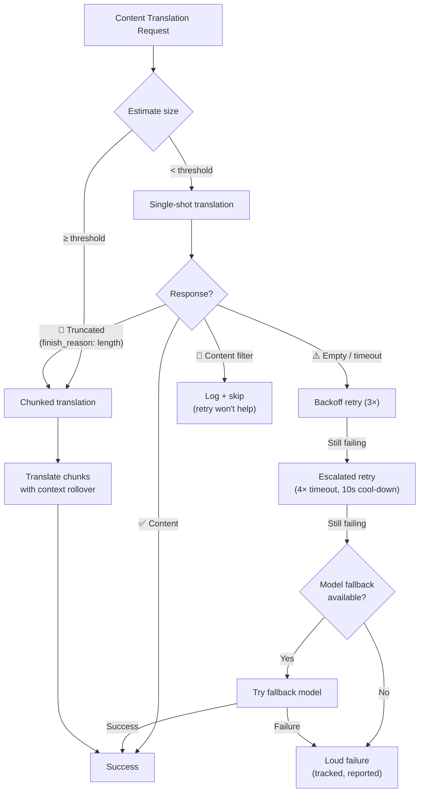

# Veerkracht bij inhoudsvertaling

Champollion's pipeline voor inhoudsvertaling (Markdown/MDX-documenten) maakt gebruik van een meerlaags veerkrachtsysteem om fouten op een beheerste manier af te handelen. Anders dan bij sleutel-waarde-vertaling — waarbij elke batch klein is en nieuwe pogingen goedkoop zijn — omvat inhoudsvertaling grote prompts en lange uitvoer die om structurele redenen kunnen mislukken, niet alleen door tijdelijke storingen.

## Het probleem

Inhoudsvertaling kent fundamenteel andere faalwijzen dan sleutel-waarde-vertaling:

| Faalwijze | Sleutel-waarde | Inhoud |
|---|---|---|
| Snelheidslimiet (429) | Veelvoorkomend, tijdelijk | Veelvoorkomend, tijdelijk |
| Time-out | Zeldzaam (kleine batches) | Veelvoorkomend (lange uitvoer) |
| Lege respons | Zeldzaam | Veelvoorkomend (uitvoerlimieten, filters) |
| Afgekapte uitvoer | N.v.t. (JSON gevalideerd) | Treedt stilzwijgend op |
| Inhoudsfilter | Uiterst zeldzaam | Mogelijk (CLI-documentatie, beveiligingsdocumentatie) |
| Modelbeperking | Nieuwe poging lost het op | Nieuwe poging lost het niet op |

De kerngedachte: **hetzelfde mislukte verzoek opnieuw proberen is geen redundantie, maar koppigheid.** Een goed veerkrachtsysteem stelt vast *waarom* iets is mislukt en past zijn aanpak dienovereenkomstig aan.

## Architectuuroverzicht



## Laag 1: Diagnostiek vóór nieuwe pogingen

Voordat wordt bepaald *hoe* een nieuwe poging wordt gedaan, inspecteert het systeem de API-respons om te begrijpen *wat* er is mislukt.

### Analyse van de beëindigingsreden

Elke LLM API geeft een `finish_reason` terug naast de gegenereerde tekst. Champollion gebruikt dit om intelligente beslissingen te nemen over nieuwe pogingen:

| `finish_reason` | Betekenis | Actie |
|---|---|---|
| `stop` + inhoud | Model heeft normaal afgerond | ✅ Resultaat accepteren |
| `stop` + leeg | Model heeft niets gegenereerd | ⚠️ Zelfde verzoek opnieuw proberen (tijdelijk) |
| `length` | Uitvoer heeft tokenlimiet bereikt | 🔶 Document automatisch opsplitsen |
| `content_filter` | Veiligheidsfilter heeft uitvoer geblokkeerd | 🔴 Vastleggen en overslaan (nieuwe poging helpt niet) |
| `null` / ontbrekend | Misvormde respons | ⚠️ Zelfde verzoek opnieuw proberen (tijdelijk) |

Dit vervangt de huidige aanpak waarbij elke fout identiek wordt behandeld met vertragingspogingen.

### Budget voor nieuwe pogingen

Het standaardbudget voor nieuwe pogingen bij tijdelijke fouten:

| Ronde | Pogingen | Time-out | Vertraging |
|---|---|---|---|
| Standaard | 4 (0→3) | 60s | 1s → 2s → 4s |
| Geëscaleerd | 4 (0→3) | 120s | 1s → 2s → 4s |
| **Totaal** | **8** | — | **~3,5 min in het slechtste geval** |

Tussen rondes in is er een afkoelperiode van 10 seconden om tijdelijke problemen te laten oplossen.

## Laag 2: Inhoud opsplitsen

Wanneer een document een drempelwaarde voor de grootte overschrijdt — of wanneer Laag 1 afgekapte uitvoer signaleert — splitst het systeem het document op in vertaalbare stukken.

Zie [Context Rollover](/docs/concepts/context-rollover#content-chunking) voor gedetailleerde configuratie van het opsplitsen. De belangrijkste punten:

### Splitsingstrategie

1. **Kopgrenzen** — `##` en `###` zijn natuurlijke grenzen voor vertaaleenheden. Elke sectie is voldoende op zichzelf staand voor onafhankelijke vertaling.
2. **Alinea als terugvaloptie** — als een enkele kopsectie de stukgrootte overschrijdt, wordt er gesplitst bij dubbele regeleinden.
3. **Harde splitsing** — laatste redmiddel voor uitzonderlijk lange alinea's (bijv. tabellen). Splitsen op zinsgrenzen.

### Context tussen stukken

Elk stuk ontvangt de laatste 2-3 alinea's van de vertaling van het *vorige stuk* als context. Dit voorkomt:
- **Terminologiedrift** — het model ziet wat het in het vorige stuk "tableau de bord" noemde
- **Verwijzingsresolutie** — antecedenten uit de vorige sectie worden meegenomen
- **Consistentie in register** — de toon die in stuk 1 is vastgesteld, blijft behouden tot en met stuk N

### Triggers voor automatisch opsplitsen

| Trigger | Gedrag |
|---|---|
| `contentChunkSize` ingesteld in configuratie | Documenten die die grootte overschrijden altijd opsplitsen |
| `finish_reason: "length"` teruggegeven | Automatisch opsplitsen als terugvaloptie (ook zonder configuratie) |
| Invoer > ~12KB (automatische detectie) | Suggestie vastleggen, maar niet afdwingen |

## Laag 3: Modelterugvalketen

Wanneer het geconfigureerde model consistent mislukt — niet tijdelijk, maar structureel — probeert het systeem alternatieve modellen. Verschillende modellen hebben verschillende contextvensters, uitvoerlimieten, veiligheidsfilters en meertalige sterktes.

### Standaard terugvalketen

```json title="champollion.config.json"
{
  "contentFallbackChain": [
    "google/gemini-2.5-flash",
    "anthropic/claude-sonnet-4"
  ]
}
```

Het geconfigureerde model wordt altijd als eerste geprobeerd. Terugvalmodellen worden alleen gebruikt nadat alle pogingsrondes (standaard + geëscaleerd) zijn uitgeput.

### Waarom meerdere architecturen

| Scenario | Primair model mislukt | Terugvalmodel slaagt |
|---|---|---|
| Vietnamees CLI-documentatie | Gemini geeft lege respons | Claude verwerkt het zonder problemen |
| Door veiligheidsfilter geblokkeerde inhoud | OpenAI blokkeert het | Gemini heeft andere filterdrempelwaarden |
| Lange gestructureerde tabellen | Model A kapt af | Model B heeft een groter uitvoervenster |

De waarde van terugval ligt in architecturale diversiteit — verschillende modelfamilies hebben verschillende faalwijzen. Een fout die structureel is voor het ene model kan triviaal zijn voor een ander.

### Reikwijdte

> Modelterugval is **uitsluitend voor inhoud**. Sleutel-waarde-batches zijn klein en mislukken vrijwel nooit structureel. Terugvalcomplexiteit toevoegen zou overengineering zijn.

## Laag 4: Foutregistratie

Wanneer er fouten optreden, worden deze door het systeem correct bijgehouden en gerapporteerd in plaats van stilzwijgend door te gaan.

### Tijdens synchronisatie

- Mislukte items tonen `[FAIL]` in de voortgangsuitvoer
- Elke fout registreert de specifieke reden (time-out, lege respons, inhoudsfilter, afkapping)
- Voltooide items worden onmiddellijk opgeslagen in het manifest (incrementele persistentie)

### Na synchronisatie

Aan het einde wordt een foutenoverzicht afgedrukt:

```
  ┌─ Content Translation Failures ─────────────────────────────────────┐
  │                                                                     │
  │  2 of 24 content translations failed:                              │
  │                                                                     │
  │  ✗ docs/reference/cli.md → vi                                      │
  │    Reason: empty response after 8 attempts + 1 fallback model      │
  │    Models tried: google/gemini-3.1-pro-preview, gemini-2.5-flash   │
  │                                                                     │
  │  ✗ docs/guides/troubleshooting.md → ar                             │
  │    Reason: content_filter (no retry — blocked by safety filter)    │
  │                                                                     │
  │  Re-run: npx champollion@latest sync                              │
  │  (22 completed translations are cached and won't re-run)           │
  └─────────────────────────────────────────────────────────────────────┘
```

### Manifest voor nieuwe pogingen

Mislukte bestanden worden weggeschreven naar `.champollion-retry.json`:

```json
{
  "failedAt": "2026-05-27T21:45:00Z",
  "files": [
    {
      "source": "docs/reference/cli.md",
      "locale": "vi",
      "reason": "empty_response",
      "attempts": 8,
      "modelsTried": ["google/gemini-3.1-pro-preview", "google/gemini-2.5-flash"]
    }
  ]
}
```

Bij de volgende `sync`-uitvoering worden alleen deze bestanden opnieuw verwerkt. Voltooide bestanden worden bewaard via het manifest met inhoudshashen (`.champollion-content.lock`).

### Afsluitcodes

| Code | Betekenis |
|---|---|
| 0 | Alle vertalingen zijn geslaagd |
| 1 | Configuratiefout, ontbrekende API-sleutel, enz. |
| 2 | Gedeeltelijke fout — sommige inhoudsvertalingen zijn mislukt |

## Configuratie

```json title="champollion.config.json"
{
  "contentChunkSize": 4000,
  "contentOverlap": 200,
  "contentFallbackChain": [
    "google/gemini-2.5-flash",
    "anthropic/claude-sonnet-4"
  ]
}
```

| Veld | Type | Standaard | Beschrijving |
|---|---|---|---|
| `contentChunkSize` | `number \| null` | `null` | Maximaal aantal tokens per inhoudsstuk. `null` = geen opsplitsing (automatisch opsplitsen alleen bij afkapping) |
| `contentOverlap` | `number` | `200` | Overlappende tokens tussen inhoudsstukken voor contextcontinuïteit |
| `contentFallbackChain` | `string[]` | `[]` | Terugvalmodellen om te proberen wanneer het geconfigureerde model structureel mislukt |

## Implementatiestatus

| Functie | Status |
|---|---|
| Diagnostiek vóór nieuwe pogingen (verwerking van finish_reason) | 🔲 Gepland |
| Inhoud opsplitsen (kop-/alineasplitsing) | 🔲 Gepland |
| Context rollover tussen stukken | 🔲 Gepland |
| Modelterugvalketen | 🔲 Gepland |
| Foutenoverzichtrapport | 🔲 Gepland |
| Manifest voor nieuwe pogingen (.champollion-retry.json) | 🔲 Gepland |
| Afsluitcode 2 bij gedeeltelijke fouten | 🔲 Gepland |
| Geëscaleerde nieuwe poging (verlengde time-out) | ✅ Geïmplementeerd (v3.3.3) |
| Pogingsnummering in berichten bij nieuwe pogingen | ✅ Geïmplementeerd (v3.3.3) |
| Expliciete foutmelding bij inhoudsfouten | ✅ Geïmplementeerd (v3.3.3) |

## Zie ook

- [Context Rollover](/docs/concepts/context-rollover) — batchconsistentie en configuratie voor het opsplitsen van inhoud
- [Hoe synchronisatie werkt](/docs/concepts/how-sync-works) — de volledige synchronisatiepipeline
- [Vertaalmethoden](/docs/guides/translation-methods) — beschikbare methoden en hun kenmerken
