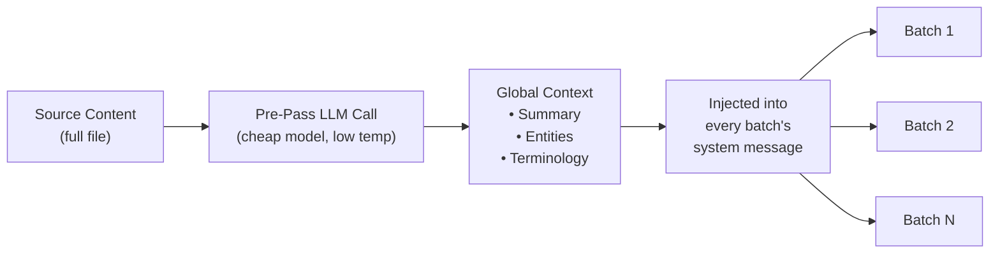

# Context Rollover Batching

Context rollover is een consistentiefunctie op documentniveau die een venster van eerdere vertalingen meeneemt naar volgende batches, waardoor het LLM "kortetermijngeheugen" heeft over batchgrenzen heen.

## Waarom Het Bestaat

Bij het vertalen van grote bestanden (100+ sleutels of lange Markdown-documenten) verdeelt champollion het werk in batches. Zonder rollover wordt elke batch onafhankelijk vertaald — het LLM heeft geen geheugen van wat het in de vorige batch heeft vertaald. Dit veroorzaakt:

- **Terminologiedrift**: Dezelfde Engelse term wordt in verschillende batches anders vertaald (bijv. "dashboard" → "tableau de bord" in batch 1, "panneau" in batch 3)
- **Coreferentiefout**: Voornaamwoorden en verwijzingen die batchgrenzen overspannen verliezen hun antecedent
- **Registerinconsistentie**: De toon kan tussen batches verschuiven (formeel → informeel → formeel)

Dit is een goed gedocumenteerd probleem in de MT-literatuur. De sliding window-aanpak wordt gevalideerd door onderzoek naar machinale vertaling op documentniveau (ACL, WMT-workshops).

## Hoe Het Werkt

### Het Sliding Window

Wanneer `contextRollover` is ingeschakeld, onderhoudt de vertaalpijplijn een venster van recent vertaalde sleutel-waardeparen. Na het voltooien van elke batch wordt een deel van de uitvoer (standaard: 20% van `batchSize`) meegenomen naar de prompt van de volgende batch als "referentievertalingen."

```
Batch 1: Translate keys 1-80         → LLM sees: system prompt + keys 1-80
Batch 2: Translate keys 81-160       → LLM sees: system prompt + [16 reference translations from batch 1] + keys 81-160
Batch 3: Translate keys 161-240      → LLM sees: system prompt + [16 reference translations from batch 2] + keys 161-240
```

De referentievertalingen worden in het gebruikersbericht ingevoegd met een duidelijk label:

```
--- Previous translations for context (do NOT re-translate these) ---
"nav.dashboard": "Tableau de bord"
"nav.settings": "Paramètres"
"header.welcome": "Bienvenue sur la plateforme"
---

{
  "content.main_heading": "Getting Started with Your Dashboard",
  ...
}
```

### Selectiestrategie

Twee modi voor het kiezen welke vertalingen worden meegenomen:

| Strategie | Gedrag | Het beste voor |
|-----------|--------|----------------|
| `tail` (standaard) | Laatste N vertalingen uit de vorige batch | Sequentiële documenten, Markdown-inhoud |
| `diverse` | Kiest vermeldingen die verschillende sleuteltypen omvatten (knoppen, koppen, beschrijvingen) | Grote JSON-bestanden met gemengde UI-elementtypen |

### Tokenbudget

Het rollover-venster verbruikt invoertokens. Champollion berekent de geschatte tokenkosten en waarschuwt als het venster meer dan 15% van het geschatte contextvenster van het model overschrijdt. De waarschuwing bevat een aanbevolen verlaging:

```
[WARN] Rollover window is ~2400 tokens (18% of model context).
       Consider reducing rolloverSize to 0.15 or lowering batchSize.
```

## Globale Context Pre-Pass

Een optionele eerste LLM-aanroep die wordt uitgevoerd **vóór** het begin van de vertaling. Het LLM analyseert de volledige broninhoud en produceert:

1. **Documentsamenvatting** — beschrijving van 2-3 zinnen van wat er wordt vertaald
2. **Benoemde entiteiten** — productnamen, technische termen en eigennamen met aanbevolen behandeling
3. **Terminologieconsistentielijst** — sleuteltermen die het LLM heeft geïdentificeerd als vereisend consistente vertaling

Deze globale context wordt ingevoegd in het **systeembericht** van elke batch, waardoor elke batch bewust is van het volledige document, ook al ziet het slechts een deel ervan.



### Pre-Pass Model

De globale contextextractie maakt gebruik van een afzonderlijke, goedkope LLM-aanroep (standaard: `google/gemini-3.5-flash` bij temperatuur 0.1), ongeacht het geconfigureerde vertaalmodel van de gebruiker. Dit is een metadataextractietaak, geen vertaaltaak — snelheid en kosten zijn belangrijker dan creatieve uitvoer.

## Inhoud Opsplitsen {#content-chunking}

Voor lange Markdown-documenten (inhoudsvertaling) kan de tekst het effectieve contextvenster van het LLM overschrijden, of het model kan de uitvoer afkappen. Inhoud opsplitsen verdeelt het document in overlappende segmenten die elk onafhankelijk worden vertaald en vervolgens opnieuw worden samengevoegd.

### Splitsstrategie

Het opsplitsen volgt een prioriteitscascade — het probeert eerst het meest semantisch betekenisvolle splitspunt:

1. **Kopgrenzen** — `##`- en `###`-markeringen creëren natuurlijke vertaaleenheden. Elke sectie is voldoende op zichzelf staand voor onafhankelijke vertaling, en koppen geven het LLM structurele context over wat het vertaalt.
2. **Alineagrenzen** — als een enkele kopsectie de chunkgrootte overschrijdt, splitsen bij dubbele regeleinden (`\n\n`). Alinea's zijn de op één na beste grens omdat ze volledige gedachten vertegenwoordigen.
3. **Zinsgrenzen** — laatste redmiddel voor extreem lange alinea's (bijv. grote tabellen, dichte proza). Splitst bij punt-spatiegrens met respect voor afkortingen.

Beveiligde blokken (codefences, shortcodes — zie [Hoe Sync Werkt](/docs/concepts/how-sync-works)) worden nooit over chunks gesplitst. Als een beveiligd blok zou worden doorgesneden, verschuift het splitspunt ervoor of erna.

### Automatische Opsplitsingstriggers

Opsplitsen wordt op twee manieren geactiveerd:

| Trigger | Gedrag |
|---------|--------|
| `contentChunkSize` ingesteld in configuratie | Splitst proactief alle documenten die dat aantal tokens overschrijden |
| Model retourneert `finish_reason: "length"` | Splitst automatisch als terugvaloptie, ook zonder configuratie |

De terugvaltrigger betekent dat opsplitsen werkt als veiligheidsnet, zelfs als u het niet configureert — als het model afkapt, probeert champollion het automatisch opnieuw met chunks.

### Configuratie

- **`contentChunkSize`**: Maximaal aantal tokens per chunk (standaard: null = volledige tekst verzenden; stel in op bijv. 4000 voor lange documenten)
- **`contentOverlap`**: Overlapping in tokens tussen chunks (standaard: 200). De overlapping zorgt voor vloeiende overgangen bij chunkgrenzen.

Wanneer opsplitsen actief is, wordt context rollover automatisch toegepast tussen chunks — de vertaalde uitvoer van de laatste alinea van de vorige chunk wordt toegevoegd aan de prompt van de volgende chunk.

```json title="champollion.config.json"
{
  "contentChunkSize": 4000,
  "contentOverlap": 200
}
```

> Voor het volledige systeem voor veerkracht bij inhoudsvertaling (diagnostisch opnieuw proberen, modelterugval, foutregistratie), zie [Inhoudsveerkracht](/docs/concepts/content-resilience).

## Configuratie

### Snel Starten

```json title="champollion.config.json"
{
  "contextRollover": true,
  "globalContext": true,
  "contentChunkSize": 4000,
  "contentOverlap": 200
}
```

### Volledige Opties

```json title="champollion.config.json (advanced)"
{
  "contextRollover": {
    "size": 0.2,
    "strategy": "tail",
    "maxTokens": null
  },
  "globalContext": {
    "model": "google/gemini-3.5-flash",
    "maxEntities": 20,
    "temperature": 0.1
  },
  "contentChunkSize": 4000,
  "contentOverlap": 200,
  "contentFallbackChain": [
    "google/gemini-2.5-flash",
    "anthropic/claude-sonnet-4"
  ]
}
```

| Veld | Type | Standaard | Beschrijving |
|------|------|-----------|--------------|
| `contextRollover` | `boolean \| object` | `false` | Sliding window rollover inschakelen |
| `contextRollover.size` | `number` | `0.2` | Fractie van `batchSize` om mee te nemen (0.0–1.0) |
| `contextRollover.strategy` | `string` | `"tail"` | Selectiestrategie: `"tail"` of `"diverse"` |
| `contextRollover.maxTokens` | `number \| null` | `null` | Harde limiet op rollover-tokenbudget |
| `globalContext` | `boolean \| object` | `false` | Globale context pre-pass inschakelen |
| `globalContext.model` | `string` | `"google/gemini-3.5-flash"` | Model voor de pre-pass-aanroep |
| `globalContext.maxEntities` | `number` | `20` | Maximaal aantal te extraheren benoemde entiteiten |
| `globalContext.temperature` | `number` | `0.1` | Temperatuur voor de pre-pass-aanroep |
| `contentChunkSize` | `number \| null` | `null` | Maximaal aantal tokens per inhouds-chunk (null = geen opsplitsing) |
| `contentOverlap` | `number` | `200` | Overlappingstokens tussen inhouds-chunks |
| `contentFallbackChain` | `string[]` | `[]` | Terugvalmodellen voor inhoudsvertaling wanneer het geconfigureerde model structureel faalt |

## Wanneer Te Gebruiken

| Scenario | Aanbeveling |
|----------|-------------|
| Kleine JSON-bestanden (< 50 sleutels) | Niet nodig — enkele batch, geen grensoverschrijdende problemen |
| Grote JSON-bestanden (100+ sleutels) | Schakel `contextRollover` in voor terminologieconsistentie |
| Lange Markdown-documenten | Schakel `contextRollover` + `contentChunkSize` + `globalContext` in |
| Technische documentatie | Schakel `globalContext` in voor entiteitsextractie |
| UI-teksten met gemengd register | Gebruik `contextRollover` met `strategy: "diverse"` |

## Implementatiestatus

| Functie | Status |
|---------|--------|
| Sliding window rollover (sleutel-waarde) | 🔲 Gepland |
| Sliding window rollover (inhoud) | 🔲 Gepland |
| Globale context pre-pass | 🔲 Gepland |
| Inhoud opsplitsen | 🔲 Gepland |
| Automatisch opsplitsen bij afkapping | 🔲 Gepland |
| `diverse` selectiestrategie | 🔲 Gepland |

## Literatuur

Deze functie is gebaseerd op gepubliceerd onderzoek naar machinale vertaling op documentniveau:

- **Sliding window-aanpak**: Gevalideerd voor het verbeteren van BLEU-, chrF- en COMET-scores bij het gebruik van LLM's voor vertaling (ACL 2023–2025 workshops over machinale vertaling op documentniveau)
- **Multi-knowledge fusion**: Het injecteren van documentsamenvatingen en entiteitslijsten als globale context verbetert de terminologieconsistentie in lange documenten
- **Context-Aware Prompting (CAP)**: Het selecteren van relevante context via aandachtsscores of semantische gelijkenis voor in-context leren

## Zie Ook

- [Inhoudsveerkracht](/docs/concepts/content-resilience) — diagnostisch opnieuw proberen, modelterugval en foutregistratie
- [Hoe Sync Werkt](/docs/concepts/how-sync-works) — de batchpijplijn die rollover uitbreidt
- [Coachinggegevens](/docs/concepts/coaching-data) — aanvullende functie voor grammatica- en woordenboekinjection
- [Vertaalgeheugen](/docs/concepts/translation-memory) — de TM-cache die naast rollover werkt
