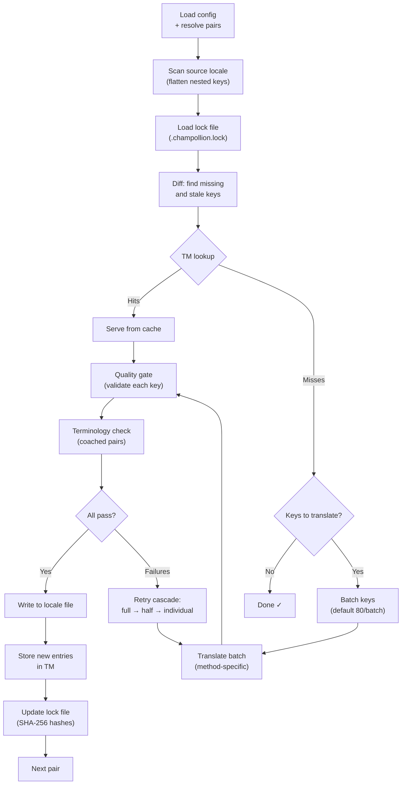

# Hoe Sync Werkt

Het `sync` commando is de kernoperatie van champollion. Dit is wat er gebeurt wanneer u `npx champollion sync` uitvoert.

## Overzicht van de Pipeline



## Stap voor Stap

### 1. Configuratieverwerking

Champollion laadt `champollion.config.json` (of detecteert instellingen automatisch). Het verwerkt:
- Bronlocale en doellocales
- De paargraph (welke bron→doel-combinaties verwerkt worden)
- Per-paar methode, model en kwaliteitsinstellingen

Voordat bestanden worden gescand, toont champollion een opstartbanner:

```
champollion v0.1.0

[INFO] Detected format: json (auto)
[INFO] Detected framework: Hugo
```

- **Versiebanner**: Toont de geïnstalleerde versie voor foutopsporing en probleemrapporten.
- **Formaatdetectie**: Rapporteert het bestandsformaat en of dit automatisch werd gedetecteerd `(auto)` of expliciet geconfigureerd `(config)`. Ondersteunt `json`, `toml` en `yaml`.
- **Frameworkdetectie**: Wanneer `contentDir` is ingesteld, wordt het framework geïdentificeerd (`Hugo`) om te bevestigen dat contentsynchronisatie actief is.

### 2. Bronscanning

Het bronlocalebestand wordt geladen en afgevlakt tot een sleutel→waarde-map:

```json
// Input (nested)
{ "hero": { "title": "Welcome", "subtitle": "Build" } }

// Flattened
{ "hero.title": "Welcome", "hero.subtitle": "Build" }
```

### 3. Wijzigingsdetectie

Champollion leest `.champollion.lock`, dat SHA-256-hashes opslaat van eerder vertaalde bronwaarden. Voor elke sleutel wordt het volgende gecontroleerd:

| Conditie | Actie |
|-----------|--------|
| Sleutel ontbreekt in doel | **Vertalen** |
| Bronhash gewijzigd sinds laatste synchronisatie | **Opnieuw vertalen** (verouderd) |
| Doelwaarde begint met `[EN]` | **Opnieuw vertalen** (verouderde terugvalmarkering) |
| Bronhash ongewijzigd, sleutel bestaat | **Overslaan** |

Dit is de reden waarom champollion alleen vertaalt wat er is gewijzigd — het vertaalt niet bij elke synchronisatie het volledige bestand opnieuw.

### 4. Batching

Sleutels worden gegroepeerd in batches (standaard: 80 sleutels/batch voor LLM, 128 voor Google Translate). Batching vermindert het aantal API-aanroepen terwijl de prompts beheersbaar blijven.

Tijdens het vertalen toont champollion een inline voortgangsbalk die na elke voltooide batch wordt bijgewerkt:

```
[INFO] fr.json — 2,847 missing
     ████████████████░░░░░░░░░░░░░░░░ 1,440/2,847 keys
```

De balk wordt weergegeven met `\r` carriage return voor in-place updates — zonder scrollen. Onderdrukt in de modi `--quiet` en `--json`.

### 4b. Vertaalgeheugen

Vóór het batchen controleert champollion de cache van het vertaalgeheugen (`.champollion/tm.json`). Sleutels waarvan de brontekst, locale en methode overeenkomen met een eerdere vertaling worden direct uit de cache geleverd — zonder API-aanroep.

```
  [TM] 142 key(s) served from cache
  Translating 3 key(s) to French (llm)... [OK]
```

Het vertaalgeheugen is het primaire mechanisme voor kostenbesparing. Wanneer u na een wijziging van één sleutel de synchronisatie opnieuw uitvoert, wordt alleen die ene sleutel vertaald, niet het volledige bestand. Zie [Vertaalgeheugen](/docs/concepts/translation-memory) voor meer informatie.

Om de cache voor één uitvoering te omzeilen: `champollion sync --no-tm`

### 5. Vertaling

Elke batch wordt naar de geconfigureerde vertaalmethode gestuurd:

- **`llm`**: Gestructureerde prompt naar OpenRouter met instructies voor register en genderbegeleiding
- **`llm-coached`**: Hetzelfde, maar met grammaticaregels, woordenboek en stijlnotities toegevoegd
- **`google-translate`**: Google Cloud Translation API v2 batchverzoek
- **`api`**: HTTP POST naar een extern eindpunt

Het systeembericht (register, genderbegeleiding, regels) is identiek voor alle batches van een bepaalde locale, wat **promptcaching** mogelijk maakt — providers zoals Anthropic en Google cachen herhaalde systeemberichten, waardoor de tokenkosten worden verlaagd.

### 6. Kwaliteitscontrole

Elke vertaling wordt gevalideerd voordat deze naar schijf wordt geschreven. Er worden vijf controles uitgevoerd:

| Controle | Wat het detecteert | Voorbeeld |
|-------|----------------|---------|
| **Leeg/blanco** | Model heeft niets geretourneerd | `""` |
| **Bronherhaling** | Model heeft de Engelse invoer geretourneerd | `"Welcome"` voor Japans |
| **Hallucinatielus** | Herhaalde trigrammen | `"Qo' Qo' Qo' Qo'"` |
| **Lengte-inflatie** | Uitvoer is 4× of meer langer dan de bron | 10-teken bron → 50-teken uitvoer |
| **Schriftconformiteit** | Verkeerd schrift voor de locale | Latijnse tekst voor Arabische locale |

Fouten worden geregistreerd met een `[GATE]` prefix. Geen stille terugvallen.

Zie [Kwaliteitscontrole](/docs/concepts/quality-gate) voor meer informatie.

### 6b. Terminologieverificatie

Voor begeleide paren met een woordenboek controleert champollion of de LLM de vereiste terminologie daadwerkelijk heeft gebruikt na de vertaling. Overtredingen worden geregistreerd als `[TERM]` waarschuwingen:

```
[TERM] en→fr: 2 term violation(s)
  • "dashboard" → expected "tableau de bord" but got "panneau"
```

Dit zijn waarschuwingen, geen blokkerende fouten — de vertaling wordt toch weggeschreven.

### 7. Herprobeercascade

Bij een JSON-parsefout of fouten op batchniveau probeert champollion het opnieuw met progressief kleinere batches:

```
Full batch (80 keys) → Failed
  └→ Half batch (40 keys) → 1 failure
      └→ Individual keys (1 each) → Isolates the problem key
```

Het herprobeerkrediet wordt begrensd door `maxRetries` (standaard: 3) om ongecontroleerde tokenuitgaven te voorkomen.

### 8. Schrijven en Vergrendelen

Geslaagde vertalingen worden naar het doellocalebestand geschreven, waarbij de oorspronkelijke neststructuur behouden blijft. Het vergrendelingsbestand wordt bijgewerkt met nieuwe SHA-256-hashes.

### 9. Verificatie

Nadat alle paren zijn verwerkt, leest champollion de geschreven localebestanden opnieuw van schijf en voert een verificatiepass uit (tenzij `--no-verify` is ingesteld). Dit detecteert het verschil tussen een geslaagde synchronisatierapportage en sleutels die in werkelijkheid onjuist zijn:

- **Sleutelpariteit** — alle bronsleutels aanwezig in elk doel
- **`[EN]` terugvalmarkeringen** — verouderde markeringen uit eerdere uitvoeringen
- **Lege vertalingen** — blanco waarden die er doorheen zijn geglipt
- **Schriftconformiteit** — niet-Latijnse locales met uitsluitend ASCII-vertalingen
- **Plaatshoudersbehoud** — ICU-plaatshouders komen overeen met de bron
- **Coderingsproblemen** — BOM-markeringen, onzichtbare tekens

Dit is ook beschikbaar als zelfstandig `champollion verify` commando voor CI-gates.

## Contentvertaling (Fase 2)

Voor Docusaurus- en Hugo-projecten voert `sync` een tweede fase uit na de vertaling van JSON-sleutels. In deze fase worden Markdown- en MDX-bestanden (documentatie, blogberichten, tutorials) vertaald met dezelfde methoden en kwaliteitscontrole.

### Hoe het werkt

1. Champollion ontdekt alle broncontentbestanden (`.md`, `.mdx`) door de content/docs-map te doorlopen
2. Voor elk bestand × locale-paar controleert het een afzonderlijk contentvergrendelingsbestand (`.champollion-content.lock`) op SHA-256-hashwijzigingen
3. Gewijzigde of ontbrekende bestanden worden verzameld in een platte werkitempool
4. De pool wordt verwerkt met **parallelle gelijktijdigheid** (standaard: 12 gelijktijdige API-aanroepen)

```
Phase 2: content (79 translations to process, 341 skipped, concurrency: 48)

    [1/79] (1%)  docs/concepts/security.md → ja [RE-TRANSLATE] (~3328s left)
    [2/79] (3%)  docs/concepts/security.md → th [RE-TRANSLATE] (~1821s left)
    ...
    [79/79] (100%) blog/v3-2-quality.md → de [OK]

  [OK] Created 79 content file(s), 341 unchanged
```

### Parallellisme

Zowel Fase 1 (JSON-sleutels) als Fase 2 (content) worden nu parallel uitgevoerd:

- **Fase 1**: Alle localevertaling worden gelijktijdig gestart (standaard: 50 gelijktijdige locales). Binnen elke locale worden API-batches ook parallel uitgevoerd (4 gelijktijdige batches). Een synchronisatie met 12 locales en 120 sleutels wordt voltooid in ~1 minuut in plaats van ~15 minuten.
- **Fase 2**: Alle bestand×locale-combinaties worden vertaald als een platte pool (standaard: 12 gelijktijdige API-aanroepen). Verschillende bestanden en verschillende locales worden gelijktijdig vertaald.

Beheer het parallellisme met `--json-concurrency`, `--content-concurrency` of `--concurrency` (stelt beide in):

```bash
# Faster JSON sync (more parallel locale translations)
npx champollion sync --json-concurrency 30

# Faster content sync (more parallel API calls)
npx champollion sync --content-concurrency 20

# Slower (gentler on rate limits)
npx champollion sync --concurrency 4
```

### Contentbeveiliging

Tijdens de vertaling beschermt champollion niet-vertaalbare content:

- **Codeblokken** (omheind en ingesprongen) worden vervangen door plaatshouders
- **Frontmatter**-velden die niet in de lijst `translatableFields` staan, worden ongewijzigd bewaard
- **Links**, afbeeldingspaden en HTML-tags worden beschermd
- **Shortcodes** en interpolatievariabelen (bijv. `{count}`, `{{.Params.title}}`) worden afgeschermd

Na de vertaling worden alle plaatshouders hersteld en gevalideerd. Als er ontbreken of beschadigd zijn, wordt de vertaling afgewezen en opnieuw geprobeerd.

## Gedeeltelijk Succes

Een mislukte batch blokkeert de rest niet. Als 9 van de 10 batches slagen, worden die 9 weggeschreven. De mislukte batch wordt geregistreerd en u kunt `sync` opnieuw uitvoeren om het opnieuw te proberen.

## Droge Run

Bekijk een voorvertoning van wat er zou veranderen zonder bestanden te schrijven:

```bash
npx champollion sync --dry-run
```

## Geforceerd Opnieuw Vertalen

Dwing specifieke sleutels opnieuw te vertalen, zelfs als ze ongewijzigd zijn:

```bash
npx champollion sync --force-keys "hero.title,nav.about"
```

## Kostenschatting

Vóór het vertalen genereert champollion een **pre-synchronisatiekostenrapport** met geschatte kosten per paar. Dit wordt automatisch uitgevoerd bij elke `sync` — u ziet het voordat er API-aanroepen worden gedaan.

```
╔══════════════════════════════════════════════════════════╗
║  Cost Estimate                                          ║
╠════════════╦═══════╦════════════╦════════════════════════╣
║ Pair       ║ Keys  ║ Est. Cost  ║ Method                 ║
╠════════════╬═══════╬════════════╬════════════════════════╣
║ en → fr    ║   142 ║ $0.07      ║ google-translate       ║
║ en → ja    ║    38 ║   —        ║ llm (model-dependent)  ║
║ en → crk   ║    38 ║   —        ║ llm-coached            ║
╚════════════╩═══════╩════════════╩════════════════════════╝
```

### Wat Wordt Geschat

Elke vertaalmethode levert zijn eigen kostenschatting:

| Methode | Kostenbasis | Nauwkeurigheid |
|--------|-----------|-----------|
| `google-translate` | Gepubliceerd tarief van Google ($20/miljoen tekens) | Nauwkeurig |
| `llm` | Varieert per OpenRouter-model | Modelafhankelijk — raadpleeg [OpenRouter-prijzen](https://openrouter.ai/models) |
| `llm-coached` | Hetzelfde als `llm` plus tokens voor begeleidingscontext | Modelafhankelijk |
| `api` | Serverdetermined | Onbekend — kan niet worden geschat zonder het eindpunt te raadplegen |

Wanneer een methode de kosten niet kan bepalen (LLM-methoden, externe API's), rapporteert champollion `—` in plaats van te gokken. Gebruik `--dry` om kostenschattingen te bekijken zonder daadwerkelijk te vertalen.

---

## Zie Ook

- [CLI-referentie — sync](/docs/reference/cli#sync) — commandovlaggen en opties
- [Vertaalgeheugen](/docs/concepts/translation-memory) — caching en kostenbesparing
- [Kwaliteitscontrole](/docs/concepts/quality-gate) — hoe vertalingen worden gevalideerd
- [Vertaalmethoden](/docs/guides/translation-methods) — hoe elke methode werkt
- [Werken met Professionele Vertalers](/docs/guides/professional-translators) — XLIFF-workflow
- [Configuratie](/docs/getting-started/configuration) — configuratiereferentie
- [CI/CD-handleiding](/docs/guides/ci-cd) — synchronisaties automatiseren in uw pipeline
