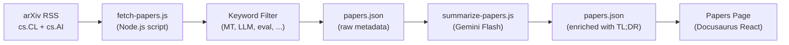

# Onderzoeksartikelen Feed

Champollion onderhoudt een samengestelde feed van wetenschappelijke artikelen over machinevertalingen en NLP van arXiv, gefilterd en samengevat voor practitioners. De feed is semi-geautomatiseerd: artikelen worden dagelijks opgehaald en gefilterd, door AI samengevat en gepubliceerd op de website.

## Waarom Deze Feed Bestaat

De vertaalpipeline van champollion is gebouwd op technieken uit gepubliceerd onderzoek — register-gestuurde prompting, coaching data-injectie, context rollover, kwaliteitspoorten. De artikelenfeed dient drie doelen:

1. **Transparantie**: Gebruikers kunnen het onderzoek zien dat aan elke functie ten grondslag ligt
2. **Ontdekking**: Nieuwe technieken gepubliceerd op arXiv kunnen toekomstige functies of gebruikersconfiguraties informeren
3. **Community**: Positioneert champollion als een onderzoeksgeïnformeerd hulpmiddel, niet zomaar een andere API-wrapper

## Architectuur



### Pipeline-stappen

#### 1. Ophalen (Dagelijks)

`scripts/fetch-papers.js` bevraagt de arXiv Atom API voor recente artikelen in:
- `cs.CL` (Computation and Language)
- `cs.AI` (Artificial Intelligence)

Geeft terug: titel, auteurs, samenvatting, arXiv ID, PDF-link, publicatiedatum, categorieën.

#### 2. Filteren

Artikelen worden gefilterd op trefwoordrelevantie. Een artikel moet overeenkomen met ten minste één primair trefwoord:

**Primaire trefwoorden** (≥1 vereist):
- `machine translation`, `neural machine translation`, `NMT`
- `LLM`, `large language model`
- `multilingual`, `cross-lingual`
- `document-level translation`
- `low-resource language`, `endangered language`
- `translation evaluation`, `BLEU`, `COMET`, `chrF`
- `tokenization`, `morphology`, `polysynthetic`
- `context window`, `sliding window`
- `prompt engineering` (in vertaalcontext)

**Boost-trefwoorden** (verhogen de relevantiescore):
- `i18n`, `internationalization`, `localization`
- `few-shot`, `in-context learning`
- `terminology`, `glossary`, `consistency`
- `quality estimation`, `hallucination`

#### 3. Samenvatten (AI-ondersteund)

`scripts/summarize-papers.js` verwerkt nieuwe (nog niet samengevatte) artikelen:

Voor elk artikel wordt de samenvatting naar Gemini 3.5 Flash gestuurd met:
```
Read this ML research abstract and produce:
1. A 2-sentence TL;DR accessible to a software developer (not a researcher)
2. A single bullet: "Why this matters for MT" — how could this technique
   improve machine translation quality, cost, or speed in production?

Abstract: {abstract}
```

De uitvoer wordt terugopgeslagen in `papers.json` naast de onbewerkte metadata.

#### 4. Publiceren

De Docusaurus-artikelenpagina (`website/src/pages/papers.js`) rendert `papers.json` als een filterbaar, gepagineerd kaartenoverzicht.

Elke kaart toont:
- **Titel** (gelinkt naar arXiv)
- **Auteurs** (eerste 3 + "et al.")
- **Datum** (gepubliceerd of laatst bijgewerkt)
- **TL;DR** (AI-gegenereerd)
- **Waarom het relevant is** (AI-gegenereerd)
- **Categorieën** (arXiv-tags)
- **PDF-link**

### Automatisering

Een GitHub Actions-workflow voert de pipeline dagelijks uit:

```yaml title=".github/workflows/fetch-papers.yml"
name: Fetch MT Research Papers
on:
  schedule:
    - cron: '0 6 * * *'  # 06:00 UTC daily
  workflow_dispatch: {}   # Manual trigger

jobs:
  fetch:
    runs-on: ubuntu-latest
    steps:
      - uses: actions/checkout@v4
      - uses: actions/setup-node@v4
        with:
          node-version: 20
      - run: node scripts/fetch-papers.js
      - run: node scripts/summarize-papers.js
        env:
          GEMINI_API_KEY: ${{ secrets.GEMINI_API_KEY }}
      - name: Commit if changed
        run: |
          git config user.name "github-actions[bot]"
          git config user.email "github-actions[bot]@users.noreply.github.com"
          git add website/src/data/papers.json
          git diff --cached --quiet || git commit -m "chore: update research papers feed"
          git push
```

## Gegevensschema

```typescript
interface Paper {
  id: string;           // arXiv ID (e.g., "2406.12345")
  title: string;
  authors: string[];
  abstract: string;
  published: string;    // ISO date
  updated: string;      // ISO date
  pdfUrl: string;
  categories: string[];
  primaryCategory: string;

  // Computed by filter
  relevanceScore: number;
  matchedKeywords: string[];

  // Computed by summarizer (null until processed)
  tldr: string | null;
  whyItMatters: string | null;
  summarizedAt: string | null;
}
```

## Bestandslocaties

| Bestand | Doel |
|------|---------|
| `scripts/fetch-papers.js` | arXiv RSS-ophaler en trefwoordfilter |
| `scripts/summarize-papers.js` | AI-samenvatting via Gemini |
| `website/src/data/papers.json` | Artikelendata (vastgelegd in repository) |
| `website/src/pages/papers.js` | Docusaurus-paginacomponent |
| `website/src/pages/papers.module.css` | Paginastijlen |
| `.github/workflows/fetch-papers.yml` | Dagelijkse automatisering |

## Implementatiestatus

| Functie | Status |
|---------|--------|
| `fetch-papers.js` (arXiv ophalen + filteren) | 🔲 Gepland |
| `summarize-papers.js` (AI-samenvatting) | 🔲 Gepland |
| Artikelenpagina (React-component) | 🔲 Gepland |
| GitHub Actions-workflow | 🔲 Gepland |
| Categorie-/trefwoordfiltering op pagina | 🔲 Gepland |
| Paginering | 🔲 Gepland |

## Zie Ook

- [Architectuur](/docs/concepts/architecture) — hoe de componenten van champollion zich tot elkaar verhouden
- [Context Rollover](/docs/concepts/context-rollover) — een functie die rechtstreeks is geïnspireerd door deze onderzoeksartikelen feed
