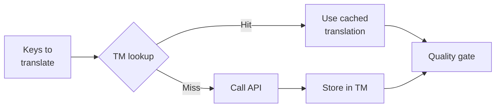

# Vertaalgeheugen

Vertaalgeheugen (TM) is de ingebouwde cachinglaag van Champollion. Het slaat elke vertaling op met de brontekst, de doeltaal en de methode als sleutel, zodat bij het opnieuw uitvoeren van `sync` alleen de API wordt aangeroepen voor sleutels die daadwerkelijk zijn gewijzigd.

## Waarom TM Bestaat

Zonder TM vertaalt elke `sync` elke gewijzigde sleutel opnieuw — zelfs als u dezelfde Engelse tekst voor dezelfde taal al eerder heeft vertaald. Veelvoorkomende situaties waarin dit geld verspilt:

| Situatie | Zonder TM | Met TM |
|----------|-----------|---------|
| Sync opnieuw uitvoeren na 1 gewijzigde sleutel (500 sleutels × 10 talen) | 5.000 API-aanroepen | 10 API-aanroepen |
| Een sleutel terugzetten naar een eerdere Engelse waarde | Volledige API-aanroep | Directe cache-treffer |
| Dezelfde zin komt voor in 3 taalbestanden | 3 × API-aanroepen | 1 API-aanroep + 2 cache-treffers |
| Dry-run → echte sync | Volledige API-aanroepen bij beide | Eerste run slaat op in cache, tweede hergebruikt |

TM is **standaard ingeschakeld** en vereist geen configuratie. Vertaingen worden automatisch gecached tijdens elke `sync` en gebruikt bij volgende uitvoeringen.

## Hoe Het Werkt

### Cachesleutel

Elke TM-vermelding heeft als sleutel een SHA-256-hash van drie waarden:

```
SHA-256( sourceValue + '\x00' + locale + '\x00' + method )
```

| Component | Waarom het in de sleutel zit |
|-----------|-------------------|
| `sourceValue` | Andere Engelse tekst → andere vertaling |
| `locale` | "Hello" wordt anders vertaald naar het Frans dan naar het Japans |
| `method` | Google Translate-uitvoer ≠ GPT-4o-uitvoer |

Het null-byte-scheidingsteken (`\x00`) voorkomt botsingen tussen `"ab" + "c"` en `"a" + "bc"`.

### Tijdens Sync



1. Voordat de vertaal-API wordt aangeroepen, verdeelt Champollion sleutels in **TM-treffers** en **TM-missers**
2. Treffers worden direct uit de cache geleverd — geen API-aanroep, geen latentie, geen kosten
3. Missers doorlopen de normale vertaalpijplijn
4. Nieuwe vertaingen van de API worden opgeslagen in TM voor toekomstige uitvoeringen
5. Alle vertaingen (gecached + nieuw) doorlopen de kwaliteitscontrole

### Opslag

TM wordt opgeslagen op `.champollion/tm.json` in uw projectmap. Het bestand gebruikt compacte JSON (zonder opmaak) om de bestandsgrootte beheersbaar te houden. Elke vermelding bevat:

| Veld | Beschrijving |
|-------|-------------|
| `t` | De vertaalde tekst |
| `ts` | ISO-8601-tijdstempel van het moment van caching |
| `l` | Code van de doeltaal (voor statistieken/filtering) |
| `m` | Naam van de vertaalmethode (voor statistieken/filtering) |

Bij 50 talen × 500 sleutels = 25.000 vermeldingen is het bestand ongeveer 2-3 MB groot.

## De Cache Beheren

### Statistieken Bekijken

```bash
champollion tm stats
```

Toont het aantal vermeldingen, de bestandsgrootte en een uitsplitsing per taal:

```
  Translation Memory — .champollion/tm.json

  Entries:      2,847
  File size:    1.2 MB
  Created:      2026-05-20
  Last entry:   2026-05-24

  By locale:
    fr       482 entries  (llm: 380, llm-coached: 102)
    de       471 entries  (llm: 471)
    ja       465 entries  (llm: 465)
```

### De Cache Wissen

```bash
# Clear everything (with confirmation prompt)
champollion tm clear

# Clear without prompt (CI environments)
champollion tm clear --yes

# Clear only one locale
champollion tm clear --locale fr
```

### TM Overslaan voor Één Uitvoering

```bash
# Force fresh API calls for all keys (useful when switching providers)
champollion sync --no-tm
```

Dit verwijdert de cache niet — het negeert de cache alleen voor deze uitvoering en slaat nieuwe resultaten niet op.

## Wanneer TM Niet Helpt

TM levert geen cache-treffer op wanneer:

- **Brontekst is gewijzigd** — de hash verandert, dus het is een misser
- **Methode is gewijzigd** — overschakelen van `llm` naar `google-translate` betekent andere cachesleutels
- **Eerste uitvoering** — koude start, nog geen vermeldingen
- **Vlag `--no-tm`** — omzeilt de cache expliciet

## Moet U `.champollion/tm.json` Committen?

**Over het algemeen niet.** TM is een lokale optimalisatie voor ontwikkelaars. Het wordt automatisch gevuld tijdens sync en is alleen nuttig bij het opnieuw uitvoeren van sync op dezelfde machine. U kunt echter overwegen het te committen als:

- Uw team een gedeelde CI-runner gebruikt die vertaingen synchroniseert
- U reproduceerbare builds wilt zonder API-aanroepen
- U vertaingen archiveert voor compliance-doeleinden

Voeg `.champollion/tm.json` toe aan `.gitignore` voor normaal gebruik.

---

## Zie Ook

- [Hoe Sync Werkt](/docs/concepts/how-sync-works) — waar TM past in de pijplijn
- [CLI-referentie — tm](/docs/reference/cli#tm) — opdrachtenoverzicht
- [CLI-referentie — sync --no-tm](/docs/reference/cli#sync) — TM omzeilen
