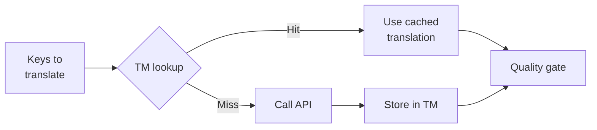

# Vertaalgeheugen

Vertaalgeheugen (TM) is de ingebouwde cachinglaag van Champollion. Het slaat elke vertaling op met de brontekst, de doeltaal en de methode als sleutel, zodat bij het opnieuw uitvoeren van `sync` alleen de API wordt aangeroepen voor sleutels die daadwerkelijk zijn gewijzigd.

## Waarom TM Bestaat

Zonder TM vertaalt elke `sync` elke gewijzigde sleutel opnieuw — zelfs als u dezelfde Engelse tekst voor dezelfde taal al eerder heeft vertaald. Veelvoorkomende situaties waarin dit geld verspilt:

| Situatie | Zonder TM | Met TM |
|----------|-----------|---------|
| Sync opnieuw uitvoeren na 1 gewijzigde sleutel (500 sleutels × 10 talen) | 5.000 API-aanroepen | 10 API-aanroepen |
| Een sleutel terugzetten naar een eerdere Engelse waarde | Volledige API-aanroep | Directe cache-treffer |
| Dezelfde zin komt voor in 3 taalbestanden | 3 × API-aanroepen | 1 API-aanroep + 2 cache-treffers |
| Dry-run → echte sync | Volledige API-aanroepen bij beide | Eerste run slaat op in cache, tweede hergebruikt |

TM is **standaard ingeschakeld** en vereist geen configuratie. Vertaingen worden automatisch gecached tijdens elke `sync` en gebruikt bij volgende uitvoeringen.

## Hoe Het Werkt

### Cachesleutel

Elke TM-vermelding heeft als sleutel een SHA-256-hash van drie waarden:

```
SHA-256( sourceValue + '\x00' + locale + '\x00' + method )
```

| Component | Waarom het in de sleutel zit |
|-----------|-------------------|
| `sourceValue` | Andere Engelse tekst → andere vertaling |
| `locale` | "Hello" wordt anders vertaald naar het Frans dan naar het Japans |
| `method` | Google Translate-uitvoer ≠ GPT-4o-uitvoer |

Het null-byte-scheidingsteken (`\x00`) voorkomt botsingen tussen `"ab" + "c"` en `"a" + "bc"`.

De `sourceValue` is de tekst waaruit de sleutel wordt vertaald, inclusief alle overige gegevens die twee identieke teksten van elkaar onderscheiden:

- **gettext-context.** Een item met een `msgctxt` wordt gecachet met zijn context: "Open" als werkwoord en "Open" als bijvoeglijk naamwoord zijn twee items.
- **Meervoudsvormen die de bron niet heeft.** i18next slaat meervouden op als sleutels met een achtervoegsel, en een doeltaal kan vormen hebben die de brontaal mist: Frans en Spaans voegen `count_many` toe, wat wordt vertaald vanuit de Engelse `count_other`-tekst. De twee sleutels sturen dezelfde tekst, maar aan het model worden verschillende vormen gevraagd (`"2 recettes"` en `"1 000 000 de recettes"`), dus krijgt elk een eigen item: `count_other` behoudt het reguliere item, en `count_many` wordt gecachet onder de tekst plus de vorm ervan. Hetzelfde geldt voor elke vorm die is vertaald vanuit de tekst van een andere categorie (Arabisch `_zero`, `_two`, `_few`, `_many`; Russisch `_few`, `_many`; rangtelwoordvormen).
- **gettext `msgid_plural` en ARB- / ICU-meervouden** zijn één bericht per sleutel (elke vorm in één waarde), dus ze vormen één item, zoals voorheen.

Vóór 0.4.0 deelde een ontleende vorm het item van de vorm waaruit deze is vertaald, en bevatte het item het antwoord dat het laatst was opgeslagen, waardoor `--redo all` één vorm naar beide sleutels kon schrijven. Een cache uit die tijd wordt tijdens het gebruik hersteld. Wanneer het gedeelde item de tekst van de ontleende vorm bevat, wordt deze verplaatst naar het eigen item van die vorm, en wordt de andere vorm opnieuw vertaald de volgende keer dat deze in de wachtrij wordt geplaatst. Anders blijft het item bij de vorm waarvan het ontleent, en wordt de ontleende vorm eenmalig naar het model gestuurd, de eerste keer dat deze in de wachtrij staat (de uitvoer meldt dit). `champollion verify` waarschuwt wanneer een ontleende vorm exact dezelfde tekst bevat als de vorm waarvan het ontleent en de cache niet aantoont dat het model het zo heeft geschreven. Sommige talen schrijven twee vormen identiek, dus dit is een waarschuwing; `--redo keys:<key>` vraagt het opnieuw.

### Tijdens Sync


```mermaid
flowchart LR
    A["Keys to\ntranslate"] --> B{"TM lookup"}
    B -->|Hit| C["Use cached\ntranslation"]
    B -->|Miss| D["Call API"]
    D --> E["Store in TM"]
    C --> F["Quality gate"]
    E --> F
```

1. Voordat de vertaal-API wordt aangeroepen, verdeelt Champollion sleutels in **TM-treffers** en **TM-missers**
2. Treffers worden direct uit de cache geleverd — geen API-aanroep, geen latentie, geen kosten
3. Missers doorlopen de normale vertaalpijplijn
4. Nieuwe vertaingen van de API worden opgeslagen in TM voor toekomstige uitvoeringen
5. Alle vertaingen (gecached + nieuw) doorlopen de kwaliteitscontrole

### Opslag

TM wordt opgeslagen op `.champollion/tm.json` in uw projectmap. Het bestand gebruikt compacte JSON (zonder opmaak) om de bestandsgrootte beheersbaar te houden. Elke vermelding bevat:

| Veld | Beschrijving |
|-------|-------------|
| `t` | De vertaalde tekst |
| `ts` | ISO-8601-tijdstempel van het moment van caching |
| `l` | Code van de doeltaal (voor statistieken/filtering) |
| `m` | Naam van de vertaalmethode (voor statistieken/filtering) |

Bij 50 talen × 500 sleutels = 25.000 vermeldingen is het bestand ongeveer 2-3 MB groot.

## De Cache Beheren

### Statistieken Bekijken

```bash
champollion tm stats
```

Toont het aantal vermeldingen, de bestandsgrootte en een uitsplitsing per taal:

```
  Translation Memory — .champollion/tm.json

  Entries:      2,847
  File size:    1.2 MB
  Created:      2026-05-20 09:14 MDT
  Last entry:   2026-05-24 17:52 MDT

  By locale:
    fr       482 entries
               380  llm · model google/gemini-3.8-flash · register formal-vous
               102  llm-coached · model google/gemini-3.8-flash · register formal-vous · coaching 3f2a9c1b
    de       471 entries
               471  llm · model google/gemini-3.8-flash · register formal-Sie
    ja       465 entries
               465  llm · model google/gemini-3.8-flash · register polite
```

De datums worden weergegeven in de lokale tijd van deze machine, met vermelding van de tijdzone (`--json`
bevat ook de opgeslagen UTC-tijdstempels als `createdAt` en `lastEntryAt`).
Elke regel onder een locale toont wat die items heeft gegenereerd: de methode, het model en
het register (en een vingerafdruk van de coachingtekst, voor elke methode waarvan
de prompt deze bevat: `llm`, `local`, `openai`, `anthropic`, `gemini`,
`llm-coached`; hiervoor wordt de eigen `coachingFile` van een paar, taal of fallback gelezen,
waarbij de tekst telt, niet het pad). Twee
modellen onder één locale duiden meestal op een modelwisseling; `champollion status`
geeft aan of de locale-bestanden zelf nu tekst van beide modellen combineren.

### De Cache Wissen

```bash
# Clear everything (with confirmation prompt)
champollion tm clear

# Clear without prompt (CI environments)
champollion tm clear --yes

# Clear only one locale
champollion tm clear --locale fr
```

### TM Overslaan voor Één Uitvoering

```bash
# Fresh API calls for everything queued (useful when debugging quality)
champollion sync --redo all --fresh     # --fresh = --no-tm
```

Dit verwijdert de cache niet en leest deze tijdens deze run niet uit — maar wat de run vertaalt (en waarvoor wordt betaald) wordt nog steeds opgeslagen, zodat de volgende run weer vanuit de cache kan werken.

## Wisselen van model

**Hoe u wisselt.** Het model is een instelling in `champollion.config.json`: bewerk `"model"` (en `"defaultMethod"` wanneer de methode ook verandert), of de eigen `"model"` van een paar in `"pairs"`. De volgende `champollion sync` gebruikt dit.

`sync --model <name>` (en `--method <name>`) geven een model op voor **slechts één run**: het bestand wordt niet gewijzigd, sync meldt dit, en de volgende reguliere `sync` gebruikt weer het geconfigureerde model. Wat die run heeft vertaald, blijft in de bestanden staan. Een reguliere sync naderhand geeft aan welke vertalingen door een ander model zijn geschreven, met beide oplossingen: behoud ze door dat model als het geconfigureerde model in te stellen (stel `"model"` hierop in — er wordt niets verzonden), of laat het geconfigureerde model ze vertalen (de redo-opdracht die wordt weergegeven, met de bijbehorende kosten). `champollion status` meldt hetzelfde. Het opnieuw uitvoeren van `champollion init` is niet nodig om te wisselen; `init --force` herschrijft alleen wat via de vlaggen wordt opgegeven, en behoudt elke andere instelling ([CLI-referentie](/docs/reference/cli#init)).

Het wisselen van model gooit uw cache niet weg. Wanneer een string geen item heeft onder het nieuwe model, hergebruikt sync de vertaling die onder het vorige model is gemaakt, zolang de methode, het register en de coaching ongewijzigd zijn. Hergebruikte items ondergaan dezelfde kwaliteitscontroles als elke andere cache-hit. Vóór de kostenraming meldt sync hoeveel vertalingen het zal hergebruiken en welk model ze heeft geschreven — dit gebeurt ook bij een dry-run, en tevens nadat de overstap is voltooid: een string die is teruggedraaid naar een tekst die alleen door het eerdere model is vertaald, krijgt de vertaling van dat model, en de run meldt dit vóór de raming.

Om het nieuwe model ze in plaats daarvan te laten vertalen (dit verstuurt de sleutels die een eerder
model heeft vertaald; wat het nieuwe model al heeft vertaald, komt nog steeds uit de
cache):

```bash
champollion sync --redo all --fresh-on-model-change
```

Op zichzelf heeft `--fresh-on-model-change` alleen invloed op sleutels die de run
sowieso vertaalt (nieuwe of gewijzigde sleutels). Na een volledige hervertaling stopt
sync met het aankondigen van de modelwisseling voor die taal. Sleutels waarvoor de antwoorden
van het nieuwe model zijn mislukt, worden vastgelegd als **in behandeling** in `.champollion.lock`: de volgende
`champollion sync` vraagt ze nogmaals op bij het nieuwe model (niet bij de cache), en
de overstap is voltooid wanneer ze klaar zijn. `champollion status` geeft een overzicht van sleutels
in behandeling, en geeft aan wanneer de bestanden tekst bevatten van een eerder model — gemengd met het
huidige model, of volledig ([Kwaliteitscontrole](/docs/concepts/quality-gate#a-redo-that-could-not-finish)).
Het weet welk model elke waarde heeft geschreven omdat sync dit vastlegt in
`.champollion.lock` (het model dat antwoordde, of het model waarvan de gecachete
vertaling werd geserveerd). Voor waarden die vóór 0.4.0 zijn geschreven, valt het terug op de
cache, en meldt het "model unknown" wanneer twee modellen dezelfde tekst hebben gecachet. Een reguliere
`champollion sync` met niets te vertalen meldt, in één regel per taal,
wanneer de bestanden zijn geschreven door een ander model dan het geconfigureerde model, met de
bovenstaande opdracht.
Een bulk-redo vervangt nooit een vertaling die handmatig door een persoon in het bestand is bewerkt
([Vertalingen bewerken](/docs/guides/professional-translators#editing-key-value-files)).

Het wijzigen van de methode, het register of de coaching levert nog steeds nieuwe vertalingen op, omdat die wijzigingen bedoeld zijn om afwijkende tekst te verkrijgen. Wanneer sleutels naar het model worden gestuurd terwijl de cache vertalingen van dezelfde tekst bevat die op een andere manier zijn gemaakt (bijvoorbeeld na het overstappen van `local` naar `llm`), meldt sync dit eenmalig per taal, met vermelding van hoe ze zijn gegenereerd — dat is de reden waarom de run toont dat er niets uit de cache is geserveerd.

Een wijziging van methode, register of coaching vertaalt op zichzelf niets opnieuw: een reguliere sync (of een dry-run) waarbij er niets nieuws te vertalen is, laat de bestanden zoals ze zijn. Dit wordt per taal gemeld: hoeveel waarden door een andere methode zijn geschreven, de redo-opdracht die ze vervangt (`champollion sync --pair en:fr --redo all`) en wat dat zou kosten.

## Wanneer TM Niet Helpt

TM levert geen cache-treffer op wanneer:

- **Brontekst gewijzigd** — de hash verandert, dus het is een cache-miss
- **Methode gewijzigd** — overstappen van `llm` naar `google-translate` betekent andere cache-sleutels
- **Register of coaching gewijzigd** — de cache-sleutel bevat deze gegevens (een modelwijziging alleen wordt hergebruikt; zie hierboven). De fallback van een paar heeft een eigen sleutel (methode, model, register, coaching): na wijziging hiervan vermelden `sync` en `status` de waarden die door de eerdere configuratie zijn geschreven en de redo-opdracht (`--redo all`; met `--fresh-on-model-change` voor uitsluitend een modelwijziging). Caches die vóór 0.4.0 zijn geschreven, namen coaching alleen op in de sleutel voor `llm-coached`; bij de eerste run worden items behouden die zijn gemaakt met de coaching die een paar op dat moment heeft
- **Geen onderdeel van de sleutel:** de woordenlijst en de grammaticaregels en stijlnotities van `llm-coached` — het bewerken hiervan vertaalt niets wat gecachet is opnieuw (`--redo keys:… --fresh` vraagt het opnieuw op)
- **`--retranslate <glob>`** — de opgegeven inhoudsbestanden worden bewust opnieuw vertaald
- **Eerste run** — koude start, nog geen items aanwezig
- **`--no-tm` / `--fresh`** — omzeilt expliciet de cache
- **Een sleutel in behandeling** — een sleutel die een redo niet kon afronden, wordt opnieuw bij het model opgevraagd en niet vanuit de cache geserveerd

De cache bepaalt nooit of een sleutel in de *wachtrij wordt geplaatst*: een ongewijzigde sleutel waarvan de vertaling al in het bestand staat, wordt vóór elke lookup overgeslagen (dit telt niet als een cache-hit). En een sleutel die door de kwaliteitscontrole voor een model is geweigerd, wordt bij een reguliere sync niet opnieuw naar dat model gestuurd — er zou immers opnieuw worden gefactureerd voor hetzelfde antwoord ([tegengehouden](/docs/concepts/quality-gate#refused-keys-are-held-back)); de cache wordt er nog wel voor geraadpleegd.

## Moet U `.champollion/tm.json` Committen?

**Over het algemeen niet.** TM is een lokale optimalisatie voor ontwikkelaars. Het wordt automatisch gevuld tijdens sync en is alleen nuttig bij het opnieuw uitvoeren van sync op dezelfde machine. U kunt echter overwegen het te committen als:

- Uw team een gedeelde CI-runner gebruikt die vertaingen synchroniseert
- U reproduceerbare builds wilt zonder API-aanroepen
- U vertaingen archiveert voor compliance-doeleinden

Voeg `.champollion/tm.json` toe aan `.gitignore` voor normaal gebruik.

---

## Zie ook

- [Hoe Sync Werkt](/docs/concepts/how-sync-works) — waar TM past in de pijplijn
- [CLI-referentie — tm](/docs/reference/cli#tm) — opdrachtenoverzicht
- [CLI-referentie — sync --no-tm](/docs/reference/cli#sync) — TM omzeilen
