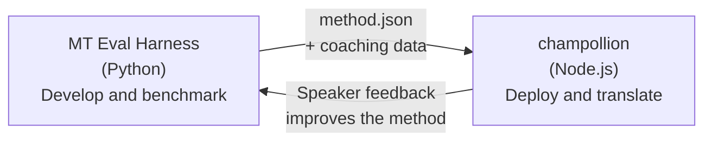

# De Eval Harness Bridge

champollion en de MT Eval Harness zijn twee afzonderlijke tools die samen één ecosysteem vormen. De harness is de plek waar vertaalmethoden **bewezen** worden. Champollion is de plek waar bewezen methoden **ingezet** worden. Ze zijn verbonden via een gedeeld pluginformaat.



## De Stroom: Onderzoek → Productie

### 1. Bouw een methode in de harness

Elke Python-klasse die `async translate(entries, config) → [{id, predicted}]` implementeert, kan worden aangesloten op de harness. De harness maakt niet uit wat er intern gebeurt — een aangestuurde LLM, een op maat getraind model, deterministische regels, wat dan ook.

### 2. Benchmark het

De harness beoordeelt uw methode aan de hand van een gestandaardiseerd corpus met reproduceerbare meetwaarden: chrF++, FST-acceptatie (voor morfologisch rijke talen), morfologische nauwkeurigheid en semantische scoring.

### 3. Exporteer als plugin

Wanneer uw methode een aanvaardbare kwaliteit bereikt, verpakt u deze als een champollion-plugin — een `method.json`-manifest met optionele coachingdata.

:::info[Export CLI is gepland]
Momenteel maakt u het method.json-manifest handmatig aan. Het commando `mt-eval export` zal dit automatiseren. Zie de [Method Interface](/docs/network/specifications/methods) voor het volledige plug-informaat.
:::

### 4. Installeer in champollion

```bash
champollion plugin install ./my-method-plugin/
```

### 5. Vertaal echte inhoud

```bash
champollion sync
```

Uw gebenchmarkte methode produceert nu echte vertalingen in productie.

## De Stroom: Productie → Onderzoek

Geïmplementeerde vertalingen worden beoordeeld door tweetalige sprekers. Hun feedback brengt systematische fouten aan het licht (verkeerde tijdspatronen, ontbrekend vocabulaire, onnatuurlijke formuleringen). De onderzoeker werkt de methode bij in de harness, benchmarkt opnieuw, exporteert opnieuw en implementeert opnieuw. Het systeem leert van gebruik.

## Het Pluginformaat

Het `method.json`-manifest is het contract tussen de twee tools:

```json
{
  "name": "crk-coached-v3",
  "type": "llm-coached",
  "version": "3.0.0",
  "description": "Coached LLM translation for Plains Cree",
  "locales": ["crk"],
  "config": {
    "model": "google/gemini-3.5-flash",
    "temperature": 0.3
  },
  "benchmarks": {
    "crk": {
      "composite_score": 0.67,
      "fst_acceptance": 0.82,
      "corpus_size": 150
    }
  }
}
```

Zie de [Pluginspecificatie](/docs/reference/plugin-spec) voor het volledige formaat.

## Wat Gebouwd Is vs. Gepland

| Component | Status |
|-----------|--------|
| TranslationMethod-protocol | ✅ Gebouwd |
| Harness benchmark-runner | ✅ Gebouwd |
| method.json-pluginformaat | ✅ Gebouwd |
| `champollion plugin install/remove/list` | ✅ Gebouwd |
| Laden van coachingdata | ✅ Gebouwd |
| `mt-eval export` CLI | 🔲 Gepland |
| Community-reviewinterface | 🔲 Gepland |
| Cryptografische testset-evaluatie | 🔲 Gepland |

## Verder lezen

- [Vertaalmethoden](/docs/guides/translation-methods) — alle beschikbare methoden en hoe ze werken
- [Plugin-specificatie](/docs/reference/plugin-spec) — het method.json-formaat
- [Een methode aanbieden via API](/docs/guides/serving-a-method) — een methode server-side hosten
- [Datasoevereiniteit](/docs/network/sovereignty/data-sovereignty) — datasoevereiniteit, CARE en cryptografische bescherming
- [Voor MT-onderzoekers](/docs/network/leaderboard/rules) — de documentatie van de eval harness
