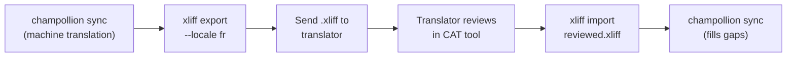

# Werken met professionele vertalers

Champollion genereert machinevertalingen, maar sommige projecten vereisen menselijke beoordeling — regelgevende inhoud, merksensitieve teksten of kritieke UI-elementen. Met de XLIFF-workflow kunt u vertalingen exporteren voor professionele beoordeling en ze naadloos terugimporteren.

## Wat is XLIFF?

XLIFF (XML Localization Interchange File Format) is het industriestandaard uitwisselingsformaat voor vertaaltools. Elk professioneel CAT-tool (Computer-Assisted Translation) ondersteunt het:

- **memoQ** — importeer XLIFF, beoordeel in context, exporteer het beoordeelde bestand
- **SDL Trados Studio** — native XLIFF-ondersteuning
- **Phrase (Memsource)** — upload XLIFF-opdrachten voor vertaalteams
- **Smartling** — XLIFF-ingestie-pipeline
- **OmegaT** — gratis/open-source CAT-tool met XLIFF-ondersteuning

Champollion genereert XLIFF 1.2 (de universeel ondersteunde versie) in plaats van 2.0+ voor maximale toolcompatibiliteit.

## De workflow



### Stap 1: Machinevertalingen genereren

Voer `sync` eerst uit om een basismachinevvertaling te verkrijgen:

```bash
champollion sync
```

### Stap 2: XLIFF exporteren

Exporteer het bron- en doelpaar als XLIFF:

```bash
champollion xliff export --locale fr
```

Dit schrijft `.champollion/xliff/fr.xliff` met daarin:
- Elke bronsleutel met de bijbehorende Engelse waarde
- De huidige machinevvertaling (indien aanwezig) als de `<target>`
- Sleutels zonder vertalingen gemarkeerd als `state="new"`

```xml
<trans-unit id="hero.title" xml:space="preserve">
  <source>Welcome to our platform</source>
  <target state="translated">Bienvenue sur notre plateforme</target>
</trans-unit>
```

### Stap 3: Naar de vertaler sturen

Stuur het `.xliff`-bestand naar uw vertaler of upload het naar uw CAT-platform. De vertaler ziet bron en doel naast elkaar en kan:

- Machinevertalingen bewerken
- Ontbrekende vertalingen aanvullen
- Kwaliteitsproblemen markeren
- Eigen vertaalgeheugen en terminologielijsten toepassen

### Stap 4: Beoordeeld bestand importeren

Wanneer de vertaler het beoordeelde `.xliff` terugbezorgt, importeert u het als volgt:

```bash
# Preview what will change
champollion xliff import .champollion/xliff/fr.xliff --dry

# Apply changes
champollion xliff import .champollion/xliff/fr.xliff
```

Uitvoer:
```
  ✓ Imported 142 translations for fr
    Updated:    23 (changed from existing)
    Added:      0 (new keys)
    Unchanged:  119
    Written to: locales/fr.json
```

### Stap 5: Ontbrekende vertalingen aanvullen

Als er na het exporteren van de XLIFF nieuwe sleutels zijn toegevoegd, voert u `sync` uit om deze te vertalen:

```bash
champollion sync
```

Champollion vertaalt alleen sleutels die nog ontbreken — beoordeelde vertalingen uit de XLIFF-import blijven behouden.

## Tips

### Aangepaste paden exporteren

```bash
# Export to a specific directory
champollion xliff export --locale ja --out ./for-review/

# Export with a specific filename
champollion xliff export --locale de --out ./review/german.xliff
```

### Meerdere talen

Exporteer elke taal afzonderlijk:

```bash
for locale in fr de ja ko; do
  champollion xliff export --locale $locale
done
```

### Versiebeheer

Voeg `.champollion/xliff/` toe aan `.gitignore` — XLIFF-bestanden zijn tijdelijke artefacten, geen projectbronbestanden:

```gitignore
.champollion/xliff/
```

### Wanneer XLIFF gebruiken versus gewoon `sync`

| Scenario | Aanbeveling |
|----------|---------------|
| Interne app, 90%+ kwaliteit acceptabel | Gewoon `sync` — machinevvertaling volstaat |
| Gebruikersgerichte marketingteksten | Exporteer XLIFF voor menselijke beoordeling |
| Juridische/regelgevende inhoud | Exporteer XLIFF — menselijke beoordeling vereist |
| 50+ talen, krappe deadline | `sync` eerst, XLIFF-export alleen voor de top 5 talen |
| Vertaler gebruikt al een CAT-tool | XLIFF is het meest natuurlijke overdrachtsformaat |

---

## Zie ook

- [CLI-referentie — xliff](/docs/reference/cli#xliff) — opdrachtenoverzicht
- [Vertaalgeheugen](/docs/concepts/translation-memory) — beoordeelde vertalingen cachen
- [Vertaalmethoden](/docs/guides/translation-methods) — opties voor machinevvertaling
