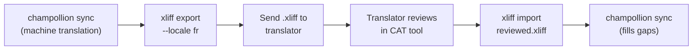

# Werken met professionele vertalers

Champollion genereert machinevertalingen, maar sommige projecten vereisen menselijke beoordeling — regelgevende inhoud, merksensitieve teksten of kritieke UI-elementen. Met de XLIFF-workflow kunt u vertalingen exporteren voor professionele beoordeling en ze naadloos terugimporteren.

XLIFF dekt de **stringbestanden** (sleutels en waarden) van uw app. Vertaalde **Markdown** (nieuwsbrieven, blogberichten, documentatiepagina's) wordt anders beoordeeld: de beoordelaar bewerkt het vertaalde `.md`-bestand rechtstreeks, en synchronisatie behoudt deze bewerkingen. Zie [Vertaalde Markdown beoordelen](#reviewing-translated-markdown) hieronder.

## Wat is XLIFF?

XLIFF (XML Localization Interchange File Format) is het industriestandaard uitwisselingsformaat voor vertaaltools. Elk professioneel CAT-tool (Computer-Assisted Translation) ondersteunt het:

- **memoQ** — importeer XLIFF, beoordeel in context, exporteer het beoordeelde bestand
- **SDL Trados Studio** — native XLIFF-ondersteuning
- **Phrase (Memsource)** — upload XLIFF-opdrachten voor vertaalteams
- **Smartling** — XLIFF-ingestie-pipeline
- **OmegaT** — gratis/open-source CAT-tool met XLIFF-ondersteuning

Champollion genereert XLIFF 1.2 (de universeel ondersteunde versie) in plaats van 2.0+ voor maximale toolcompatibiliteit.

## De workflow


```mermaid
flowchart LR
    A["champollion sync\n(machine translation)"] --> B["xliff export\n--locale fr"]
    B --> C["Send .xliff to\ntranslator"]
    C --> D["Translator reviews\nin CAT tool"]
    D --> E["xliff import\nreviewed.xliff"]
    E --> F["champollion sync\n(fills gaps)"]
```

### Stap 1: Machinevertalingen genereren

Voer `sync` eerst uit om een basismachinevvertaling te verkrijgen:

```bash
champollion sync
```

### Stap 2: XLIFF exporteren

Exporteer het bron- en doelpaar als XLIFF:

```bash
champollion xliff export --locale fr
```

Dit schrijft `.champollion/xliff/fr.xliff` met daarin:
- Elke bronsleutel met de bijbehorende Engelse waarde
- De huidige machinevvertaling (indien aanwezig) als de `<target>`
- Sleutels zonder vertalingen gemarkeerd als `state="new"`

```xml
<trans-unit id="hero.title" xml:space="preserve">
  <source>Welcome to our platform</source>
  <target state="translated">Bienvenue sur notre plateforme</target>
</trans-unit>
```

### Stap 3: Naar de vertaler sturen

Stuur het `.xliff`-bestand naar uw vertaler of upload het naar uw CAT-platform. De vertaler ziet bron en doel naast elkaar en kan:

- Machinevertalingen bewerken
- Ontbrekende vertalingen aanvullen
- Kwaliteitsproblemen markeren
- Eigen vertaalgeheugen en terminologielijsten toepassen

### Stap 4: Beoordeeld bestand importeren

Wanneer de vertaler het beoordeelde `.xliff` terugbezorgt, importeert u het als volgt:

```bash
# Preview what will change
champollion xliff import .champollion/xliff/fr.xliff --dry

# Apply changes
champollion xliff import .champollion/xliff/fr.xliff
```

Uitvoer:
```
  ✓ Imported 142 translations for fr
    Updated:    23 (changed from existing)
    Added:      0 (new keys)
    Unchanged:  119
    Written to: locales/fr.json
```

### Stap 5: Ontbrekende vertalingen aanvullen

Als er na het exporteren van de XLIFF nieuwe sleutels zijn toegevoegd, voert u `sync` uit om deze te vertalen:

```bash
champollion sync
```

Champollion vertaalt alleen sleutels die nog ontbreken — beoordeelde vertalingen uit de XLIFF-import blijven behouden.

## Tips

### Aangepaste paden exporteren

```bash
# Export to a specific directory
champollion xliff export --locale ja --out ./for-review/

# Export with a specific filename
champollion xliff export --locale de --out ./review/german.xliff
```

### Meerdere talen

Exporteer elke taal afzonderlijk:

```bash
for locale in fr de ja ko; do
  champollion xliff export --locale $locale
done
```

### Versiebeheer

Voeg `.champollion/xliff/` toe aan `.gitignore` — XLIFF-bestanden zijn tijdelijke artefacten, geen projectbronbestanden:

```gitignore
.champollion/xliff/
```

### Wanneer XLIFF gebruiken versus gewoon `sync`

| Scenario | Aanbeveling |
|----------|---------------|
| Interne app, 90%+ kwaliteit acceptabel | Gewoon `sync` — machinevvertaling volstaat |
| Gebruikersgerichte marketingteksten | Exporteer XLIFF voor menselijke beoordeling |
| Juridische/regelgevende inhoud | Exporteer XLIFF — menselijke beoordeling vereist |
| 50+ talen, krappe deadline | `sync` eerst, XLIFF-export alleen voor de top 5 talen |
| Vertaler gebruikt al een CAT-tool | XLIFF is het meest natuurlijke overdrachtsformaat |

## Vertalingen bewerken in de locale-bestanden {#editing-key-value-files}

Een beoordelaar kan een vertaling ook rechtstreeks in een locale-bestand (`messages/fr.json`, `locale/fr/LC_MESSAGES/django.po`, `app_fr.arb`, …) corrigeren en committen. Champollion legt in `.champollion.lock` een vingerafdruk vast van elke waarde die het wegschrijft. Een waarde die niet meer overeenkomt, is gewijzigd door een persoon, en synchronisatie beschouwt deze als handmatig bewerkt:

| Wat er wordt uitgevoerd | Wat er gebeurt met de bewerkte waarde |
|-----------|----------------------------------|
| Een reguliere `sync`, het Engels ongewijzigd | Onaangeroerd (zoals voorheen). |
| `sync --redo all` / `--force`, een modelwissel (`--redo all --fresh-on-model-change`), of het opnieuw proberen van sleutels die na een redo in behandeling zijn gebleven | **Behouden.** De run vermeldt hoeveel er zijn behouden en welke, en hoe u er een vervangt: `--redo keys:<key>`. |
| `sync --redo keys:<key>` met vermelding van de sleutel | Vervangen — u hebt expliciet om die sleutel gevraagd. De bewerkte formulering wordt eerst weergegeven. |
| De **Engelse brontekst van die sleutel wijzigt** | Opnieuw vertaald (de bewerking was voor de oude tekst). De bewerkte formulering wordt weergegeven zodat deze opnieuw kan worden toegepast, en toegevoegd aan `.champollion-replaced-edits.jsonl` in de hoofdmap van het project. |

`.champollion-replaced-edits.jsonl` is een door Git gevolgd bestand naast de lockfile (de cachemap `.champollion/` is per machine en wordt genegeerd door Git): één JSON-regel per vervangen bewerking, met de locale, het bestand, de sleutel, de bewerkte formulering, waarom deze is vervangen en de nieuwe brontekst. Commit dit bestand samen met de lockfile — het is het enige exemplaar van die formulering. `champollion status` geeft aan hoeveel items het bevat.

Waarden die zijn geschreven voordat deze registratie bestond, of door een andere tool, hebben geen vingerafdruk. Een dergelijke waarde telt alleen als afkomstig van Champollion wanneer de vertaalcache exact die tekst voor de sleutel bevat; anders wordt deze behandeld als het werk van een persoon en behouden bij bulk-redo's (de run noemt ze als waarden waarvan geen registratie bestaat dat Champollion ze heeft geschreven). Waarden die zijn geïmporteerd met `champollion xliff import` zijn het werk van een persoon en worden op dezelfde manier behouden.

## Vertaalde Markdown beoordelen {#reviewing-translated-markdown}

Inhoudsbestanden uit een `contentDir` (bijvoorbeeld `newsletters/2026-10.md` → `newsletters/2026-10.crk.md`) hebben geen XLIFF-export. De beoordelaar werkt in het vertaalde bestand zelf:

1. Voer `champollion sync` uit en commit de vertalingen samen met `.champollion-content.lock`.
2. De beoordelaar bewerkt het vertaalde bestand, hetzij een alinea of een vertaald front-matterveld zoals `title`, en commit dit.
3. Bij latere synchronisaties worden de bewerkingen behouden. Als de Engelse brontekst in andere alinea's wijzigt, blijven de alinea's van de beoordelaar woord voor woord behouden en worden alleen de gewijzigde alinea's vertaald. De run toont `kept the edits made by hand to …`.

Er zijn twee uitzonderingen, en synchronisatie waarschuwt voor beide. Als de Engelse alinea die de beoordelaar heeft gecorrigeerd ook wijzigt, wordt die alinea opnieuw vertaald en wordt de formulering van de beoordelaar weergegeven zodat deze opnieuw kan worden toegepast. Als de beoordelaar alinea's heeft toegevoegd of verwijderd en de brontekst daarna wijzigt, blijft het bestand zoals het is en wordt het bij elke synchronisatie vermeld, totdat iemand het handmatig bijwerkt.

Om de bewerkingen te verwerpen en terug te keren naar machinevertaling, geeft u het bestand op: `champollion sync --redo files:2026-10.md`. De volledige regels zijn te vinden in [Inhoudsvertaling](/docs/guides/content-translation#reviewing-and-editing-translations).

---

## Zie ook

- [CLI-referentie — xliff](/docs/reference/cli#xliff) — commandoreferentie
- [Vertaalgeheugen](/docs/concepts/translation-memory) — beoordeelde vertalingen cachen
- [Vertaalmethoden](/docs/guides/translation-methods) — opties voor machinevertaling
- [Inhoudsvertaling](/docs/guides/content-translation) — Markdown vertalen en hoe bewerkingen van beoordelaars behouden blijven
- [Quality Gate](/docs/concepts/quality-gate#refused-keys-are-held-back) — sleutels die door de gate zijn geweigerd, en sleutels die na een redo in behandeling zijn gebleven
