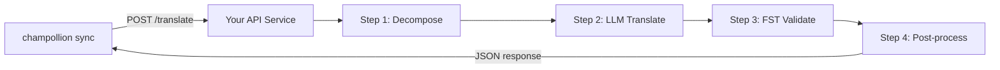

# Een Aangepaste Methode als API Aanbieden

De **`api`-methode** van champollion stelt u in staat om elk vertaalpaar te koppelen aan een extern HTTP-eindpunt. Zo integreert u pipelines die te complex zijn voor een enkele LLM-prompt — morfologische analysatoren, eindige-toestandstransducers (FST's), meerstaps-LLM-ketens, of elke aangepaste onderzoeksmethode die u heeft ontwikkeld.

Er zijn twee manieren om een dergelijk eindpunt op te zetten:

1. **`champollion serve`** — één commando dat de geconfigureerde stack van uw bestaande champollion-project (methode, registers, coaching, Translation Memory, quality gate) achter dit contract serveert. Geen servercode. Zie [het pad zonder code](#the-zero-code-path-champollion-serve).
2. **Een aangepaste service** — schrijf uw eigen HTTP-server die het contract implementeert, voor pijplijnen die zich volledig buiten champollion bevinden.

## Waarom een API-service?

Sommige vertaalpipelines kunnen niet worden uitgevoerd binnen een eenvoudige prompt-responscyclus:

| Pipelinestap | Voorbeeld |
|---|---|
| **Morfologische decompositie** | Polysynthetische woorden opsplitsen in morfemen vóór vertaling |
| **FST-validatie** | Uitvoer afwijzen die fonologische of morfologische regels schendt |
| **Meerstaps-LLM-ketens** | Genereer → verifieer → corrigeer-cycli met verschillende modellen |
| **Woordenboekraadpleging** | Een samengesteld tweetalig woordenboek raadplegen midden in de pipeline |
| **Mens in de lus** | Onzekere vertalingen in de wachtrij plaatsen voor beoordeling door een expert |

De `api`-methode behandelt uw pipeline als een zwarte doos — champollion stuurt bronreeksen, uw service retourneert vertalingen. Wat er binnenin gebeurt, is geheel aan u.

## Architectuur



## Het pad zonder code: `champollion serve`

Als uw pijplijn al een champollion-project is — een geconfigureerde methode (LLM, gecoacht of een engine), registers, coachingbestanden, Translation Memory en de deterministische quality gate — hoeft u helemaal geen server te schrijven. `champollion serve` zet **uw eigen geconfigureerde stack** op achter exact het contract dat hieronder wordt beschreven:

```bash
# Owner side — run from the project whose champollion.config.json defines the stack
CHAMPOLLION_SERVE_TOKEN=$(openssl rand -hex 24) npx champollion serve
# [OK] champollion serve listening on http://127.0.0.1:1822/translate
```

Elk verzoek doorloopt dezelfde pijplijn die `champollion sync` gebruikt:

- **Translation Memory** — strings die het TM al bevat, worden gratis vanuit de cache geserveerd, zonder uw upstream-provider aan te spreken. Door de gate gevalideerde API-resultaten worden in de cache opgeslagen voor het volgende verzoek.
- **Quality gate** — elke reactie wordt deterministisch gevalideerd (herhaling, lengteverhouding, scriptnaleving, bronecho). Fouten komen terug als gestructureerde fouten per sleutel (HTTP 207/422) — nooit als stilzwijgend verslechterde uitvoer.
- **Cost guard** — `--max-cost-per-request` en `--max-session-cost` weigeren verzoeken waarvan de *geschatte* upstream-kosten uw limieten overschrijden, voordat er een provider-aanroep wordt gedaan. Methoden met onbekende prijzen worden ook onder een limiet geweigerd: onbekend is niet gratis. Verzoeken die door het TM worden gedekt, kosten gegarandeerd $0 en worden altijd doorgelaten.

De server bindt standaard aan `127.0.0.1`: iedereen die de poort kan bereiken, kan uw upstream API-budget besteden, dus het blootstellen ervan is een expliciete beslissing — `--bind 0.0.0.0` plus een sterk bearer-token. `--no-auth` wordt alleen geaccepteerd in combinatie met een loopback-bind. Een snelheidslimiet per IP en een limiet voor de verzoekgrootte zijn standaard ingeschakeld; zie `champollion serve --help`.

### Wijs er een consument naar

Genereer het plug-in-manifest dat consumenten installeren (één commando aan elke kant):

```bash
# Owner side
champollion serve --emit-manifest --endpoint https://translate.example.org
# [OK] Wrote ./my-project-serve/method.json
```

```bash
# Consumer side
champollion plugin install ./my-project-serve
```

```json title="champollion.config.json (consumer)"
{
  "pairs": {
    "en:crk": { "methodPlugin": "my-project-serve" }
  }
}
```

```bash
CHAMPOLLION_API_KEY=<the server's bearer token> champollion sync
```

De `api`-methode van de consument stuurt bronstrings via POST naar uw server; uw stack vertaalt, valideert (gates) en slaat op in de cache; de `qualityTier` van het manifest is een eerlijke doorgeefluik van uw geconfigureerde paren (het meest conservatieve niveau wanneer deze verschillen). Uw prompts, coachinggegevens en provider-sleutels verlaten uw machine nooit.

De rest van deze gids behandelt het schrijven van een **aangepaste** service — handig wanneer uw pijplijn geen champollion-project is (een Python FST-keten, een op maat gemaakt onderzoekssysteem). Het wire-contract is in beide gevallen identiek.

## Uw Service Instellen

Uw API-service moet één eindpunt implementeren dat JSON accepteert en retourneert:

### Aanvraagformaat

champollion verzendt exact deze JSON-body (zie [api.js](https://github.com/gamedaysuits/Champollion/blob/main/cli/lib/methods/api.js)):

```json
POST /translate
Content-Type: application/json
Authorization: Bearer <CHAMPOLLION_API_KEY>

{
  "source_locale": "en",
  "target_locale": "crk",
  "method": "crk-coached-v1",
  "keys": {
    "greeting": "Hello, welcome to our app",
    "farewell": "Goodbye and thanks"
  }
}
```

| Veld | Type | Beschrijving |
|-------|------|-------------|
| `source_locale` | string | BCP 47-brontalcode |
| `target_locale` | string | BCP 47-doeltalcode |
| `method` | string | Pluginnaam of `"default"` |
| `keys` | object | Koppeling van sleutel → te vertalen bronreeks |
```

### Response Format

Your service must return a `translations` object. An optional `meta` object can include cost and diagnostic info:

```json
{
  "translations": {
    "greeting": "tânisi, pê-kîwêw ôta",
    "farewell": "ekosi mâka, kinanâskomitin"
  },
  "meta": {
    "model": "my-custom-pipeline/v1",
    "cost_usd": 0.0042,
    "method": "decompose-translate-validate"
  }
}
```

| Field | Type | Required | Description |
|-------|------|----------|-------------|
| `translations` | object | ✅ | Map of key → translated string |
| `meta` | object | — | Optional metadata |
| `meta.cost_usd` | number | — | If present, displayed in champollion's output |
| `errors` | object | — | For partial success (HTTP 207): map of key → `{ message }` |

### Minimal Express Server

```javascript
import express from 'express';

const app = express();
app.use(express.json());

/**
 * champollion API-contract:
 *
 * Aanvraag:  { source_locale, target_locale, method, keys: { "key": "source" } }
 * Antwoord: { translations: { "key": "translated" }, meta: { ... } }
 */
app.post('/translate', async (req, res) => {
  const { source_locale, target_locale, method, keys } = req.body;

  const translations = {};

  for (const [key, source] of Object.entries(keys)) {
    // --- Uw pipeline komt hier ---
    // Stap 1: Morfologische decompositie
    const morphemes = await decompose(source, source_locale);

    // Stap 2: LLM-vertaling met context
    const draft = await llmTranslate(morphemes, target_locale);

    // Stap 3: FST-validatie
    const validated = await fstValidate(draft, target_locale);

    // Stap 4: Nabewerking (normalisatie van orthografie, enz.)
    translations[key] = await postProcess(validated);
  }

  res.json({
    translations,
    meta: {
      model: 'my-custom-pipeline/v1',
      method: 'decompose-translate-validate',
    },
  });
});

app.listen(3001, () => {
  console.log('Translation API running on http://localhost:3001');
});
```

## Configuring champollion

Point a translation pair at your running service in `champollion.config.json`:

```json
{
  "inputLocale": "en",
  "pairs": {
    "en:crk": {
      "method": "api",
      "endpoint": "http://localhost:3001/translate",
      "register": "Formal Plains Cree. Use SRO orthography."
    }
  }
}
```

Then run sync as usual:

```bash
npx champollion sync
```

champollion will POST your source strings to the endpoint and write the returned translations to `crk.json`.

## Case Study: Plains Cree Pipeline

:::info[Under Development]
The Plains Cree pipeline described below is **under active development** and is not yet running in production. Details here reflect the current design direction and may change as the project evolves.
:::

The **arena** project demonstrates this pattern. Its Plains Cree pipeline uses:

1. **Morphological decomposition** — Break polysynthetic Cree words into translatable morpheme chains
2. **LLM translation** — Context-enriched GPT-4o translation with coaching data (SRO orthography rules, register instructions)
3. **FST validation** — Finite-state transducer checks that outputs conform to Cree phonological rules
4. **Confidence scoring** — Each translation gets a confidence score based on FST pass rate and dictionary coverage

The entire pipeline runs as a single HTTP endpoint that champollion calls via the `api` method.

### Running Evaluations

After translating, you can evaluate output quality using the harness directly:

```bash
# Kloon de testomgeving
git clone https://github.com/gamedaysuits/Champollion.git
cd Champollion/arena
pip install -e .

# Voer de evaluatie uit tegen een echt, niet-gebundeld corpus
mt-eval run --corpus eval-amh-fra-globalvoices-test-v1 --model gemini-pro --yes
```

This produces structured evaluation records with chrF++, BLEU, and exact match scores that can be used as regression baselines.

## Authentication

If your API requires authentication, set the `apiKey` field or use an environment variable:

```json
{
  "pairs": {
    "en:crk": {
      "method": "api",
      "endpoint": "https://my-mt-service.example.com/translate",
      "apiKey": "${CRK_API_KEY}"
    }
  }
}
```

## Data Sovereignty

The `api` method is particularly important for **Indigenous language communities**. By self-hosting the translation pipeline, a community keeps full control over:

- **Proprietary coaching data** — register instructions, orthography rules, and domain glossaries never leave community infrastructure.
- **Linguistic resources** — curated dictionaries, FST grammars, and elder-verified translations remain under community ownership.
- **Access policies** — the community decides who can call the endpoint and under what terms.

This design follows the direction of [Indigenous data-sovereignty principles](/docs/network/community/low-resource-languages#data-sovereignty-principles) — community ownership and control of language data: sensitive language data stays governed by the community rather than a third-party platform.

:::tip
Combine the `api` method with a private deployment (e.g., a community-hosted VM or on-prem server) for the strongest data-sovereignty posture. `champollion serve` gives a community exactly this self-hosting posture without writing any server code — coaching data, provider keys, and the Translation Memory all stay on community infrastructure. See [Support a Low-Resource Language](/docs/network/community/low-resource-languages) for a full walkthrough.
:::

## Cost Estimation

The `api` method returns `null` for cost estimation by default — your service controls pricing. If you want to provide cost transparency, have your API return a `cost` field in the metadata:

```json
{
  "translations": { "...": "..." },
  "metadata": {
    "cost": {
      "estimatedCost": 0.0042,
      "currency": "USD",
      "source": "my-service-pricing"
    }
  }
}
```

## Aanbevolen Werkwijzen

1. **Retourneer lege reeksen bij fouten** — Retourneer de bronreeks niet als een "vertaling." Retourneer `""` en de kwaliteitspoort van champollion zal dit opvangen. De sleutel wordt overgeslagen en opnieuw geprobeerd bij de volgende synchronisatie.
2. **Voeg betrouwbaarheidsscores toe** — Als uw pipeline de kwaliteit kan inschatten, retourneer deze dan in de metadata. Dit helpt bij kwaliteitscontrole.
3. **Implementeer gezondheidscontroles** — Voeg een `GET /health`-eindpunt toe zodat champollion de verbinding kan verifiëren voordat een grote synchronisatie wordt gestart.
4. **Beperk de doorvoer op een elegante manier** — Als uw pipeline doorvoerlimieten heeft, retourneer dan `429`-statuscodes. Het batchsysteem van champollion zal terugschakelen.
5. **Log alles** — Meerstaps-pipelines kunnen stilzwijgend falen. Log de invoer en uitvoer van elke stap voor foutopsporing.

## Licentieverlening

Het `api`-methodepatroon is volledig open — er zijn geen licentiebeperkingen op het inpakken van uw eigen vertaalpipeline als een HTTP-service. De `arena`-evaluatieomgeving is gelicentieerd onder AGPL-3.0-or-later (met een §7-uitzondering voor eval-standaard-plugins); u kunt deze bestuderen en erop voortbouwen onder die voorwaarden.

## Zie ook

- [Vertaalmethoden](/docs/guides/translation-methods) — overzicht van elke ingebouwde methode (`openai`, `google`, `api`, enz.)
- [Plug-in-specificatie](/docs/reference/plugin-spec) — volledig schema voor `champollion.config.json` inclusief `api`-methodevelden
- [Ondersteun een taal met weinig middelen](/docs/network/community/low-resource-languages) — end-to-end gids voor talen met weinig middelen, inclusief datasoevereiniteitsprincipes
- [Architectuur](/docs/concepts/architecture) — hoe de synchronisatielus, batching en methode-dispatch van champollion werken
- [MT-evaluatie](/docs/network/leaderboard/rules) — evaluatiemethodologie, statistieken en het indieningsproces voor het scorebord
- [Methodescorebord](/leaderboard) — live kwaliteitsranglijsten voor methoden en talenparen
