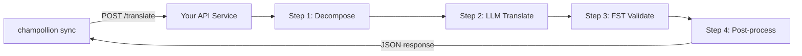

# Een Aangepaste Methode als API Aanbieden

De **`api`-methode** van champollion stelt u in staat om elk vertaalpaar te koppelen aan een extern HTTP-eindpunt. Zo integreert u pipelines die te complex zijn voor een enkele LLM-prompt — morfologische analysatoren, eindige-toestandstransducers (FST's), meerstaps-LLM-ketens, of elke aangepaste onderzoeksmethode die u heeft ontwikkeld.

Er zijn twee manieren om een dergelijk eindpunt op te zetten:

1. **`champollion serve`** — één commando dat de geconfigureerde stack van uw bestaande champollion-project (methode, registers, coaching, Translation Memory, quality gate) via dit contract aanbiedt. Geen servercode nodig. Zie [het pad zonder code](#the-zero-code-path-champollion-serve).
2. **Een aangepaste service** — schrijf uw eigen HTTP-server die het contract implementeert, voor pipelines die volledig buiten champollion draaien.

## Waarom een API-service?

Sommige vertaalpipelines kunnen niet worden uitgevoerd binnen een eenvoudige prompt-responscyclus:

| Pipelinestap | Voorbeeld |
|---|---|
| **Morfologische decompositie** | Polysynthetische woorden opsplitsen in morfemen vóór vertaling |
| **FST-validatie** | Uitvoer afwijzen die fonologische of morfologische regels schendt |
| **Meerstaps-LLM-ketens** | Genereer → verifieer → corrigeer-cycli met verschillende modellen |
| **Woordenboekraadpleging** | Een samengesteld tweetalig woordenboek raadplegen midden in de pipeline |
| **Mens in de lus** | Onzekere vertalingen in de wachtrij plaatsen voor beoordeling door een expert |

De `api`-methode behandelt uw pipeline als een zwarte doos — champollion stuurt bronreeksen, uw service retourneert vertalingen. Wat er binnenin gebeurt, is geheel aan u.

## Architectuur


```mermaid
graph LR
    A[champollion sync] -->|POST /translate| B[Your API Service]
    B --> C[Step 1: Decompose]
    C --> D[Step 2: LLM Translate]
    D --> E[Step 3: FST Validate]
    E --> F[Step 4: Post-process]
    F -->|JSON response| A
```

## Het pad zonder code: `champollion serve`

Als uw pipeline al een champollion-project is — een geconfigureerde methode (LLM, coached of een engine), registers, coachingbestanden, Translation Memory en de deterministische quality gate — hoeft u helemaal geen server te schrijven. `champollion serve` stelt **uw eigen geconfigureerde stack** beschikbaar achter exact het hieronder beschreven contract:

```bash
# Owner side — run from the project whose champollion.config.json defines the stack
CHAMPOLLION_SERVE_TOKEN=$(openssl rand -hex 24) npx champollion serve
# [OK] champollion serve listening on http://127.0.0.1:1822/translate
```

Elk verzoek doorloopt dezelfde pipeline die `champollion sync` gebruikt:

- **Translation Memory** — strings die het TM al bevat, worden gratis vanuit de cache geleverd, zonder uw upstream-provider te benaderen. Door de gate gevalideerde API-resultaten worden gecachet voor het volgende verzoek.
- **Quality gate** — elke respons wordt deterministisch gevalideerd (herhaling, lengteverhouding, schriftsysteemconformiteit, bronecho). Fouten worden geretourneerd als gestructureerde fouten per sleutel (HTTP 207/422) — nooit als stilletjes verslechterde uitvoer.
- **Cost guard** — `--max-cost-per-request` en `--max-session-cost` weigeren verzoeken waarvan de *geschatte* upstream-kosten uw limieten overschrijden, nog voordat er een aanroep naar een provider wordt gedaan. Methoden met onbekende tarieven worden onder een limiet eveneens geweigerd: onbekend is niet gratis. Verzoeken die door het TM worden gedekt, kosten aantoonbaar $0 en worden altijd goedgekeurd.

De server bindt standaard aan `127.0.0.1`: iedereen die de poort kan bereiken, kan uw upstream-API-budget verbruiken. Het openstellen ervan is dus een expliciete beslissing — `--bind 0.0.0.0` plus een sterk bearer-token. `--no-auth` wordt alleen geaccepteerd in combinatie met een loopback-binding. Een snelheidslimiet per IP-adres en een limiet op de verzoekgrootte zijn standaard ingeschakeld; zie `champollion serve --help`.

### Een consumer hiernaar laten verwijzen

Genereer het plugin-manifest dat consumers installeren (één commando aan weerszijden):

```bash
# Owner side
champollion serve --emit-manifest --endpoint https://translate.example.org
# [OK] Wrote ./my-project-serve/method.json
```

```bash
# Consumer side
champollion plugin install ./my-project-serve
```

```json title="champollion.config.json (consumer)"
{
  "pairs": {
    "en:crk": { "methodPlugin": "my-project-serve" }
  }
}
```

```bash
CHAMPOLLION_API_KEY=<the server's bearer token> champollion sync
```

De `api`-methode van de consumer verstuurt bronstrings via een POST-verzoek naar uw server; uw stack vertaalt, controleert met de gate en cachet; de `qualityTier` van het manifest is een getrouwe doorgifte van uw geconfigureerde paren (het meest conservatieve niveau wanneer deze verschillen). Uw prompts, coachinggegevens en providersleutels verlaten uw machine nooit.

De rest van deze handleiding behandelt het schrijven van een **aangepaste** service — handig wanneer uw pipeline geen champollion-project is (een Python FST-keten, een specifiek onderzoekssysteem). Het wire-contract is in beide gevallen identiek.

## Uw Service Instellen

Uw API-service moet één eindpunt implementeren dat JSON accepteert en retourneert:

### Aanvraagformaat

champollion verzendt exact deze JSON-body (zie [api.js](https://github.com/gamedaysuits/Champollion/blob/main/cli/lib/methods/api.js)):

```json
POST /translate
Content-Type: application/json
Authorization: Bearer <CHAMPOLLION_API_KEY>

{
  "source_locale": "en",
  "target_locale": "crk",
  "method": "my-project-serve",
  "keys": {
    "greeting": "Hello, welcome to our app",
    "farewell": "Goodbye and thanks"
  }
}
```

| Veld | Type | Beschrijving |
|-------|------|-------------|
| `source_locale` | string | BCP 47-brontaalcode |
| `target_locale` | string | BCP 47-doeltaalcode |
| `method` | string | Pluginnaam of `"default"` |
| `keys` | object | Map van sleutel → te vertalen bronstring |
| `instructions` | object | Alleen wanneer het eindpunt `"acceptsInstructions": true` declareert: sleutel → notities per sleutel (welke meervoudsvormen een bericht nodig heeft, feedback van een herhaalde quality-gate-poging) |
| `text_format` | string | `"markdown"` voor Markdown-documenttekst (zie hieronder); ontbreekt voor applicatiestrings |

### Responsindeling

Uw service moet een `translations`-object retourneren. Een optioneel `meta`-object kan kosten- en diagnostische informatie bevatten:

```json
{
  "translations": {
    "greeting": "<the greeting, translated>",
    "farewell": "<the farewell, translated>"
  },
  "meta": {
    "model": "my-custom-pipeline/v1",
    "cost_usd": 0.0042,
    "method": "decompose-translate-validate"
  }
}
```

| Veld | Type | Vereist | Beschrijving |
|-------|------|----------|-------------|
| `translations` | object | ✅ | Map van sleutel → vertaalde string |
| `meta` | object | — | Optionele metagegevens |
| `meta.cost_usd` | number | — | Indien aanwezig, weergegeven in de uitvoer van champollion |
| `errors` | object | — | Voor gedeeltelijk succes (HTTP 207): map van sleutel → `{ message }` |

### Minimale Express-server

```javascript
import express from 'express';

const app = express();
app.use(express.json());

/**
 * champollion API contract:
 *
 * Request:  { source_locale, target_locale, method, keys: { "key": "source" } }
 * Response: { translations: { "key": "translated" }, meta: { ... } }
 */
app.post('/translate', async (req, res) => {
  const { source_locale, target_locale, method, keys } = req.body;

  const translations = {};

  for (const [key, source] of Object.entries(keys)) {
    // --- Your pipeline goes here ---
    // Step 1: Morphological decomposition
    const morphemes = await decompose(source, source_locale);

    // Step 2: LLM translation with context
    const draft = await llmTranslate(morphemes, target_locale);

    // Step 3: FST validation
    const validated = await fstValidate(draft, target_locale);

    // Step 4: Post-processing (orthography normalization, etc.)
    translations[key] = await postProcess(validated);
  }

  res.json({
    translations,
    meta: {
      model: 'my-custom-pipeline/v1',
      method: 'decompose-translate-validate',
    },
  });
});

app.listen(3001, () => {
  console.log('Translation API running on http://localhost:3001');
});
```

## Champollion configureren

Laat een vertaalpaar verwijzen naar uw actieve service in `champollion.config.json`:

```json
{
  "inputLocale": "en",
  "pairs": {
    "en:crk": {
      "method": "api",
      "endpoint": "http://localhost:3001/translate",
      "register": "Formal Plains Cree. Use SRO orthography."
    }
  }
}
```

Voer vervolgens de synchronisatie zoals gebruikelijk uit:

```bash
npx champollion sync
```

champollion stuurt uw bronstrings via een POST-verzoek naar het eindpunt en schrijft de geretourneerde vertalingen naar `crk.json`.

### Volgt uw eindpunt instructies op?

Geef dit aan met `"acceptsInstructions"` voor het paar (of op het hoogste niveau van de `method.json` van de plugin):

- **`false`** — een getraind NMT-model, zoals een model dat wordt geserveerd door `nmt-forge serve`, vertaalt tekst en niets anders; wanneer het twee keer wordt gevraagd, geeft het hetzelfde antwoord. Wanneer de quality gate een van de antwoorden weigert, vraagt champollion dit **niet** opnieuw (dat zou een verspilde aanroep zijn); het beoordeelt het eerste antwoord zoals een tweede antwoord zou worden beoordeeld (een naam die ongewijzigd is gelaten wordt geaccepteerd) en stuurt de rest naar de `fallback` van het paar.
- **`true`** — een LLM achter uw eindpunt kan notities per sleutel gebruiken: verzoeken bevatten een `instructions`-object, en een geweigerde sleutel wordt opnieuw opgevraagd met de feedback van de gate.
- **niet ingesteld** — champollion kan dit niet bepalen. Een geweigerde sleutel wordt nog één keer opgevraagd zonder feedback, en de uitvoer meldt dat het eindpunt deze mogelijk negeert.

```json
{
  "pairs": {
    "en:crk": {
      "method": "api",
      "endpoint": "http://127.0.0.1:8378/translate",
      "acceptsInstructions": false,
      "fallback": { "method": "llm-coached" }
    }
  }
}
```

De fallback is hier een gehost model. Gebruik in plaats daarvan `"fallback": { "method": "local", "model": "<your local model>" }` om alles op deze machine te houden (zie [Fallback-methode](/docs/getting-started/configuration#fallback) om te bepalen wanneer u welke gebruikt).

## Casestudy: Plains Cree-pipeline

:::info[In ontwikkeling]
De hieronder beschreven Plains Cree-pipeline is **actief in ontwikkeling** en draait nog niet in productie. De details hier weerspiegelen de huidige ontwerprichting en kunnen veranderen naarmate het project vordert.
:::

Het **arena**-project demonstreert dit patroon. De Plains Cree-pipeline hiervan maakt gebruik van:

1. **Morfologische decompositie** — Splits polysynthetische Cree-woorden op in vertaalbare morfeemketens
2. **LLM-vertaling** — Met context verrijkte GPT-4o-vertaling met coachinggegevens (SRO-orthografieregels, registerinstructies)
3. **FST-validatie** — Finite-state transducer controleert of de uitvoer voldoet aan de fonologische regels van het Cree
4. **Betrouwbaarheidsscore** — Elke vertaling krijgt een betrouwbaarheidsscore op basis van het FST-slaagpercentage en de dekking in het woordenboek

De volledige pipeline draait als één HTTP-eindpunt dat champollion aanroept via de `api`-methode.

### Evaluaties uitvoeren

Na het vertalen kunt u de uitvoerkwaliteit rechtstreeks evalueren met de harness:

```bash
# Clone the harness
git clone https://github.com/gamedaysuits/Champollion.git
cd Champollion/arena
python3 -m pip install -e .

# Run the evaluation against a real, non-bundled corpus
mt-eval run --corpus eval-amh-fra-globalvoices-test-v1 --model google/gemini-3.1-pro-preview --yes
```

Dit levert gestructureerde evaluatieresultaten op met chrF++-, BLEU- en exact-match-scores die kunnen worden gebruikt als regressie-baselines.

## Authenticatie

Als uw API authenticatie vereist, geef dan de naam op van de omgevingsvariabele die
het token bevat bij het paar (`"${VAR}"`, gelezen uit de omgeving of `.env.local`),
of stel `CHAMPOLLION_API_KEY` in. Champollion stuurt alleen dat token naar het
eindpunt — nooit de sleutel van een andere provider. Een loopback-eindpunt (`nmt-forge
serve`, `champollion serve`) heeft er geen nodig.

```json
{
  "pairs": {
    "en:crk": {
      "method": "api",
      "endpoint": "https://my-mt-service.example.com/translate",
      "apiKey": "${CRK_API_KEY}"
    }
  }
}
```

Inhoud (Markdown-teksten) verloopt via hetzelfde contract: elk blok is een sleutel
(`segment.<N>`, of `body` voor een hele pagina) en het verzoek bevat
`"text_format": "markdown"`, zodat een server documenttekst kan onderscheiden van applicatie-
strings. Servers die het veld niet kennen, kunnen het negeren.

## Datasoevereiniteit

De `api`-methode is bijzonder belangrijk voor **inheemse taalgemeenschappen**. Door de vertaalpipeline zelf te hosten, behoudt een gemeenschap de volledige controle over:

- **Eigen coachinggegevens** — registerinstructies, orthografieregels en domeinglossaria verlaten de infrastructuur van de gemeenschap nooit.
- **Taalkundige bronnen** — samengestelde woordenboeken, FST-grammatica's en door oudsten geverifieerde vertalingen blijven eigendom van de gemeenschap.
- **Toegangsbeleid** — de gemeenschap bepaalt wie het eindpunt kan aanroepen en onder welke voorwaarden.

Dit ontwerp volgt de richting van de [principes van inheemse datasoevereiniteit](/docs/network/community/low-resource-languages#data-sovereignty-principles) — eigenaarschap van en controle over taalgegevens door de gemeenschap: gevoelige taalgegevens blijven onder het beheer van de gemeenschap in plaats van een extern platform.

:::tip
Combineer de `api`-methode met een besloten implementatie (bijvoorbeeld een door de gemeenschap gehoste virtuele machine of on-premise server) voor de sterkste positie op het gebied van datasoevereiniteit. `champollion serve` biedt een gemeenschap precies deze self-hostingpositie zonder enige servercode te hoeven schrijven — coachinggegevens, providersleutels en het Translation Memory blijven allemaal binnen de infrastructuur van de gemeenschap. Zie [Ondersteun een taal met weinig bronnen](/docs/network/community/low-resource-languages) voor een volledige handleiding.
:::

## Kostenschatting

De `api`-methode retourneert standaard `null` voor kostenraming — uw service bepaalt de tarieven. Als u kostentransparantie wilt bieden, laat uw API dan een `cost`-veld in de metagegevens retourneren:

```json
{
  "translations": { "...": "..." },
  "metadata": {
    "cost": {
      "estimatedCost": 0.0042,
      "currency": "USD",
      "source": "my-service-pricing"
    }
  }
}
```

## Aanbevolen Werkwijzen

1. **Retourneer geen vertaling bij fouten** — Retourneer de bronstring niet als een "vertaling". Laat de sleutel weg uit `translations` (of meld deze onder `errors` met HTTP 207): de sleutel wordt overgeslagen en bij de volgende synchronisatie opnieuw opgevraagd. Een antwoord dat door de quality gate wordt geweigerd — een lege string, een echo van de bron — wordt onthouden, en een normale synchronisatie stuurt die sleutel niet opnieuw naar uw eindpunt totdat iemand deze expliciet opgeeft met `--redo keys:` (het zou immers hetzelfde antwoord in rekening brengen).
2. **Neem betrouwbaarheidsscores op** — Als uw pipeline de kwaliteit kan inschatten, retourneer dit dan in de metagegevens. Dit helpt bij kwaliteitsaudits.
3. **Implementeer statuscontroles** — Voeg een `GET /health`-eindpunt toe zodat champollion de verbinding kan verifiëren voordat een grote synchronisatie wordt gestart.
4. **Hanteer snelheidslimieten netjes** — Als uw pipeline doorvoerlimieten heeft, retourneer dan `429`-statuscodes. Het batchsysteem van champollion zal wachten en vertragen.
5. **Log alles** — Pipelines met meerdere stappen kunnen stilzwijgend mislukken. Log de invoer en uitvoer van elke stap voor foutopsporing.

## Licentieverlening

Het `api`-methodepatroon is volledig open — er zijn geen licentiebeperkingen op het inpakken van uw eigen vertaalpipeline als een HTTP-service. De `arena`-evaluatieomgeving is gelicentieerd onder AGPL-3.0-or-later (met een §7-uitzondering voor eval-standaard-plugins); u kunt deze bestuderen en erop voortbouwen onder die voorwaarden.

## Zie ook

- [Vertaalmethoden](/docs/guides/translation-methods) — overzicht van elke ingebouwde methode (`openai`, `google`, `api`, etc.)
- [Plugin-specificatie](/docs/reference/plugin-spec) — volledig schema voor `champollion.config.json` inclusief de methodevelden van `api`
- [Ondersteun een taal met weinig bronnen](/docs/network/community/low-resource-languages) — complete handleiding voor talen met weinig bronnen, inclusief principes voor datasoevereiniteit
- [Architectuur](/docs/concepts/architecture) — hoe de synchronisatielus, batchverwerking en methode-afhandeling van champollion werken
- [MT-evaluatie](/docs/network/leaderboard/rules) — evaluatiemethodologie, statistieken en de inzendprocedure voor de ranglijst
- [Methode-ranglijst](/leaderboard) — actuele kwaliteitsranglijsten voor methoden en taalparen
