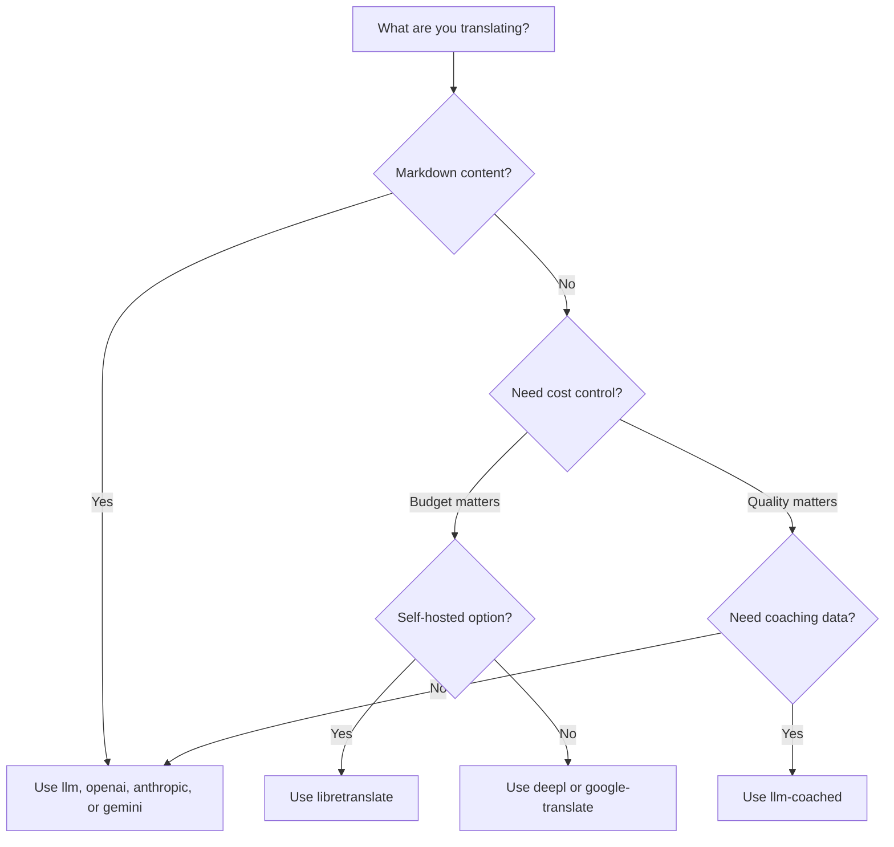

# Vertaalmethoden

Champollion ondersteunt meerdere vertaalmethoden. Elk talenpaar kan een andere methode gebruiken — u bent niet gebonden aan één aanpak voor uw gehele project.

## Methodevergelijking

### LLM-providers

Kwaliteitsgericht, Markdown-bewust, coaching-compatibel. Het meest geschikt voor inhoudsrijke projecten.

| Methode | Sleutel | Wat het doet |
|--------|-----|-------------|
| `llm` (standaard) | `OPENROUTER_API_KEY` | LLM via OpenRouter — 200+ modellen, automatische routering |
| `llm-coached` | `OPENROUTER_API_KEY` | LLM + grammaticaregels, woordenboeken, stijlnotities |
| `openai` | `OPENAI_API_KEY` | Directe OpenAI API (gpt-4o, gpt-4o-mini) |
| `anthropic` | `ANTHROPIC_API_KEY` | Directe Anthropic API (Claude Sonnet, Haiku, Opus) |
| `gemini` | `GEMINI_API_KEY` | Directe Google Gemini API (Flash, Pro) — gratis laag |

### Traditionele MT

Snelheid- en kostengericht. Het meest geschikt voor sleutel-waardeparen met hoog volume.

| Methode | Sleutel | Wat het doet |
|--------|-----|-------------|
| `google-translate` | `GOOGLE_TRANSLATE_API_KEY` | Google Cloud Translation API v2 (194 talen) |
| `deepl` | `DEEPL_API_KEY` | DeepL API met glossary-ondersteuning (33 talen) |
| `microsoft-translator` | `MICROSOFT_TRANSLATOR_API_KEY` | Azure Cognitive Services Translator (135 talen) |
| `libretranslate` | *(zelf gehost)* | Zelf gehoste LibreTranslate (AGPL, gratis) |
| `tilde` | `TILDE_API_KEY` | Tilde MT — in de EU ontwikkelde engines, sterk in Baltische en Europese talen |
| `translated` | `LARA_ACCESS_KEY_ID` + `LARA_ACCESS_KEY_SECRET` | Translated's Lara — professionele adaptieve MT (200 talen) |

### Infrastructuur

| Methode | Sleutel | Wat het doet |
|--------|-----|-------------|
| `api` | *(per provider)* | Dunne HTTP-client voor elk REST-vertaaleindpunt |

## Beslisboom



---

## `llm` — LLM-vertaling (standaard)

Vertaalt via elk LLM op [OpenRouter](https://openrouter.ai). Dit is de standaardmethode en de meest veelzijdige.

**Hoe het werkt:**
1. Groepeert sleutels in batches (standaard 80/batch) met register- en contextinstructies
2. Verzendt naar OpenRouter als een gestructureerde prompt
3. Parseert de JSON-respons
4. Valideert elke vertaling via de [kwaliteitspoort](/docs/concepts/quality-gate)
5. Schrijft geslaagde vertalingen weg, probeert mislukkingen opnieuw of verwerpt ze

**Wanneer te gebruiken:** De meeste projecten. Met name inhoudsrijke sites met Markdown, waarbij codeblokken en shortcodes afgeschermd moeten worden.

**Configuratie:**

```json
{
  "defaultMethod": "llm",
  "model": "google/gemini-3.5-flash"
}
```

## `llm-coached` — Begeleide LLM-vertaling

Hetzelfde als `llm`, maar met grammaticaregels, terminologiewoordenboeken en stijlnotities die in elke prompt worden ingevoegd.

**Hoe het werkt:**
1. Laadt coachinggegevens uit `.champollion/coaching/<locale>.json` of de `coaching/`-map van een plugin
2. Voegt grammaticaregels, woordenboektermen en stijlnotities in de systeemprompt in
3. Woordenboektermen die overeenkomen met bronsleutels worden opgenomen als verplichte terminologie
4. De vertaling verloopt zoals bij `llm`, waarbij coachinggegevens voor extra precisie zorgen

**Wanneer te gebruiken:** Talen met weinig middelen, domeinspecifieke terminologie (juridisch, medisch), formele registers, of elk geval waarbij de generieke LLM-uitvoer niet precies genoeg is.

**Indeling van coachinggegevens:**

```json title=".champollion/coaching/fr.json"
{
  "grammar_rules": [
    "French adjectives agree in gender and number with the noun they modify",
    "Use 'vous' for formal contexts, 'tu' for informal"
  ],
  "dictionary": {
    "dashboard": "tableau de bord",
    "deployment": "déploiement",
    "settings": "paramètres"
  },
  "style_notes": "Prefer active voice. Avoid anglicisms where a native French term exists."
}
```

Zie ook: [Handleiding voor talen met weinig middelen](/docs/network/community/low-resource-languages)

---

## `openai` — Directe OpenAI API

Vertaalt rechtstreeks via de OpenAI Chat Completions API. Geen OpenRouter als tussenpersoon — uw sleutel, uw account, uw gebruiksdashboard.

**Modellen:** `gpt-4o` (standaard), `gpt-4o-mini`

**Functies:**
- ✅ Markdown-bewust (inhoudsvertaling)
- ✅ Coachingondersteuning (grammaticaregels, woordenboekoverrides, stijlnotities)
- ✅ JSON-modus voor gestructureerde sleutel-waarde-uitvoer
- ✅ Exponentiële terugval met nieuwe pogingen

**Configuratie:**

```json
{
  "pairs": {
    "en:fr": { "method": "openai", "model": "gpt-4o-mini" }
  }
}
```

```bash
export OPENAI_API_KEY=sk-proj-...
```

Verkrijg uw sleutel via [platform.openai.com/api-keys](https://platform.openai.com/api-keys).

## `anthropic` — Directe Anthropic API

Vertaalt rechtstreeks via de Anthropic Messages API. Gebruikt de parameter `system` voor coachinggegevens, waardoor Anthropic's promptcaching mogelijk wordt.

**Modellen:** `claude-sonnet-4-6` (standaard), `claude-haiku-4-5`, `claude-opus-4-7`

**Functies:**
- ✅ Markdown-bewust (inhoudsvertaling)
- ✅ Coachingondersteuning (grammaticaregels, woordenboekoverrides, stijlnotities)
- ✅ Systeempromptcaching (amortiseert coachingkosten over batches)
- ✅ Exponentiële terugval met nieuwe pogingen

**Configuratie:**

```json
{
  "pairs": {
    "en:ja": { "method": "anthropic", "model": "claude-haiku-4-5" }
  }
}
```

```bash
export ANTHROPIC_API_KEY=sk-ant-...
```

Verkrijg uw sleutel via [console.anthropic.com](https://console.anthropic.com/settings/keys).

## `gemini` — Directe Google Gemini API

Vertaalt rechtstreeks via de Google Gemini `generateContent` API. **Gratis laag beschikbaar** — het beste startpunt zonder kosten.

**Modellen:** `gemini-2.5-flash` (standaard), `gemini-2.5-pro`

**Functies:**
- ✅ Markdown-bewust (inhoudsvertaling)
- ✅ Coachingondersteuning (grammaticaregels, woordenboekoverrides, stijlnotities)
- ✅ JSON-responsmodus via `responseMimeType`
- ✅ Gratis laag (royaal dagelijks quotum)
- ✅ Exponentiële terugval met nieuwe pogingen

**Configuratie:**

```json
{
  "pairs": {
    "en:ko": { "method": "gemini", "model": "gemini-2.5-pro" }
  }
}
```

```bash
export GEMINI_API_KEY=AI...
```

Verkrijg uw sleutel via [aistudio.google.com/apikey](https://aistudio.google.com/apikey).

### Modelvalidatie {#model-validation}

De directe LLM-providers (`openai`, `anthropic`, `gemini`) valideren uw modelreeks bij het eerste gebruik. Dit onderschept drie categorieën fouten:

**Verkeerd methodeformaat** — Een OpenRouter-stijl modelpad gebruiken bij een directe provider:

```
[WARN] OpenAI: model "google/gemini-3.5-flash" looks like an OpenRouter path.
       Direct providers use bare model names (e.g., "gpt-4o").
       To use OpenRouter models, set method to 'llm' instead.
```

**Verkeerde provider** — Een model van een geheel andere provider gebruiken:

```
[WARN] Gemini: model "claude-sonnet-4-6" is an Anthropic model.
       This provider (gemini) cannot serve Anthropic models.
       Use --method anthropic or set "method": "anthropic" in config.
```

**Verouderd of verkeerd gespeld model** — Bij de eerste API-aanroep haalt champollion de actuele modellijst van de provider op en controleert uw model daartegen:

```
[WARN] Gemini: model "gemini-1.5-flash" not found in available models.
       Similar models: gemini-2.0-flash, gemini-2.5-flash, gemini-2.5-pro
       The API call will proceed — the provider will give the final verdict.
```

:::note[Dit zijn waarschuwingen, geen fouten]
Modelvalidatie registreert waarschuwingen maar blokkeert de API-aanroep niet. De provider-API geeft het definitieve oordeel — een toekomstige modelnaam kan overeenkomen met een ander patroon, en we willen niet afhankelijk zijn van heuristieken.
:::

---

## `google-translate` — Google Cloud Translation API

Directe integratie met Google Cloud Translation API v2. Gebruikt de REST API — geen SDK, geen serviceaccount. Alleen de API-sleutel.

**Wanneer te gebruiken:** Grote volumes van key-value stringparen waarbij snelheid en kosten belangrijker zijn dan nuance. Ondersteunt standaard 194 talen ([gepubliceerde lijst van Google](https://docs.cloud.google.com/translate/docs/languages)).

**Beperkingen:**
- ⚠️ **Geen Markdown-bewustzijn.** Beschadigt codeblokken, shortcodes en interpolatievariabelen.
- Geen register-/tooncontrole
- Geen coaching of terminologiehandhaving

```bash
npx champollion sync --method google-translate
```

:::tip[Automatische detectie]
Als alleen `GOOGLE_TRANSLATE_API_KEY` is ingesteld (geen OpenRouter-sleutel), schakelt champollion automatisch over naar Google Translate. Er is geen configuratiewijziging vereist.
:::

## `deepl` — DeepL API

Directe integratie met de DeepL-vertaal-API. Ondersteunt woordenlijsten voor consistente terminologie.

**Wanneer te gebruiken:** Europese talen waarbij DeepL uitblinkt (Duits, Frans, Spaans, Nederlands, Pools, enz.). Woordenlijstondersteuning zorgt voor consistente terminologie zonder coachinggegevens.

**Functies:**
- ✅ Automatische detectie van gratis/pro-eindpunt (achtervoegsel `:fx` op gratis sleutels)
- ✅ Aanmaken en beheren van woordenlijsten
- ✅ Formaliteitsniveaucontrole
- ⚠️ **Geen Markdown-bewustzijn** — alleen sleutel-waardeparen

**Configuratie:**

```json
{
  "pairs": {
    "en:de": { "method": "deepl" }
  }
}
```

```bash
export DEEPL_API_KEY=your-key-here
```

Verkrijg uw sleutel via [deepl.com/pro-api](https://www.deepl.com/pro-api).

## `microsoft-translator` — Azure Cognitive Services

Directe integratie met Microsoft Translator Text API v3.

**Wanneer te gebruiken:** Enterprise-omgevingen met bestaande Azure-infrastructuur. Ondersteunt 135 talen, waaronder enkele die Google Translate niet dekt (Tibetaans, Faeröers, Inuktitut en andere).

**Functies:**
- ✅ Tot 100 segmenten per verzoek (hoge doorvoer)
- ✅ Optionele regieparameter voor latentieoptimalisatie
- ⚠️ **Geen Markdown-bewustzijn** — alleen sleutel-waardeparen
- ⚠️ **Geen inhoudsvertaling** — alleen sleutel-waardeparen

**Configuratie:**

```json
{
  "pairs": {
    "en:ar": { "method": "microsoft-translator" }
  }
}
```

```bash
export MICROSOFT_TRANSLATOR_API_KEY=your-key
export MICROSOFT_TRANSLATOR_REGION=global  # optional
```

Verkrijg uw sleutel via de [Azure Portal](https://portal.azure.com) → Cognitive Services → Translator.

## `libretranslate` — Zelf gehoste vertaling

Zelf gehoste open-source vertaling met LibreTranslate. Draait lokaal of op uw eigen infrastructuur — geen API-kosten, volledige gegevenssouvereiniteit.

**Wanneer te gebruiken:** Projecten die offline vertaling, naleving van gegevensprivacy (AVG) of kostenloze werking vereisen. Bijzonder nuttig voor CI-pipelines die niet afhankelijk mogen zijn van externe API's.

**Functies:**
- ✅ Zelf gehost — geen externe API-aanroepen
- ✅ Gratis en open source (AGPL-3.0)
- ✅ Docker-implementatie beschikbaar
- ⚠️ **Geen Markdown-bewustzijn** — alleen sleutel-waardeparen
- ⚠️ **Geen inhoudsvertaling** — alleen sleutel-waardeparen
- ⚠️ Kwaliteit varieert per taalpaar

**Installatie:**

```bash
# Run LibreTranslate locally with Docker
docker run -d -p 5000:5000 libretranslate/libretranslate

# Configure (optional — defaults to localhost:5000)
export LIBRETRANSLATE_API_URL=http://localhost:5000/translate
```

```json
{
  "pairs": {
    "en:es": { "method": "libretranslate" }
  }
}
```

---

## `api` — Externe vertaal-API

Een dunne HTTP-client voor door de gemeenschap gehoste of IP-beschermde vertaaleindpunten. Champollion verzendt sleutels en ontvangt vertalingen terug — het bevat geen vertaallogica.

**Wanneer te gebruiken:** Wanneer vertaalmethoden server-side worden gehost (bijv. bedrijfseigen coachinggegevens, fijn afgestemde modellen, FST-pipelines die niet gedistribueerd kunnen worden).

```json
{
  "pairs": {
    "en:crk": {
      "method": "api",
      "endpoint": "https://api.example.com/v1/translate",
      "apiKey": "your-key"
    }
  }
}
```

:::note[Door de gemeenschap beheerde vertaling (soevereiniteits-aspirant)]
De `api` methode is de brug naar **door de gemeenschap gehoste vertaling onder beheer van de gemeenschap (soevereiniteits-aspirant)**. Inheemse en minderheidstaalgemeenschappen kunnen hun eigen vertaaleindpunten hosten — waardoor trainingsdata, gefinetunede modellen en taalkundig IP onder beheer van de gemeenschap blijven — terwijl Champollion hiermee verbinding maakt als een thin client.

Zie [Ondersteuning van een taal met weinig middelen](/docs/network/community/low-resource-languages) voor de volledige handleiding voor gemeenschapshosting, en [Een methode via API aanbieden](/docs/guides/serving-a-method) voor de eindpuntvereisten.
:::

---

## Configuratie per taalpaar

De werkelijke kracht ligt in het combineren van methoden per taalpaar:

```json title="champollion.config.json"
{
  "version": 3,
  "pairs": {
    "en:fr": { "method": "deepl" },
    "en:ja": { "method": "openai", "model": "gpt-4o" },
    "en:ko": { "method": "gemini" },
    "en:ar": { "method": "microsoft-translator" },
    "en:crk": { "methodPlugin": "crk-coached-v1" }
  }
}
```

Dit vertaalt Frans via DeepL (woordenlijstondersteuning), Japans via OpenAI (kwaliteit), Koreaans via Gemini (gratis laag), Arabisch via Microsoft Translator (dekking) en Plains Cree via een begeleide plugin (gespecialiseerd).

## Plugins

Plugins zijn vooraf verpakte vertaalrecepten voor specifieke taalparen. Het zijn JSON-manifesten — geen code — die champollion vertellen welke methode gebruikt moet worden, met welke instellingen, en welke kwaliteit is gebenchmarkt.

:::tip[Van evaluatieomgeving naar productie met één opdracht]
Plugins die zijn ontwikkeld en bewezen in de [evaluatieomgeving](/docs/network/specifications/harness) kunnen direct worden geïnstalleerd — de methode die u daar valideert, wordt hier ingezet met één enkel `plugin install`-commando. Zie [MT-evaluatie](/docs/network/leaderboard/rules) voor de volledige evaluatieworkflow.
:::

```bash
champollion plugin install ./french-formal-v1/
champollion plugin list
champollion plugin remove french-formal-v1
```

Zie de [Pluginspecificatie](/docs/reference/plugin-spec) voor het volledige manifestformaat.

---

## Wisselen van provider

Wisselt u van methode? Het modelformaat en de omgevingsvariabele veranderen — hier is het overzicht:

### OpenRouter → Directe provider

```diff title="champollion.config.json"
 {
   "pairs": {
     "en:fr": {
-      "method": "llm",
-      "model": "openai/gpt-4o"
+      "method": "openai",
+      "model": "gpt-4o"
     }
   }
 }
```

```diff title="Environment variables"
- export OPENROUTER_API_KEY=sk-or-v1-...
+ export OPENAI_API_KEY=sk-proj-...
```

**Belangrijkste verschillen:**
- OpenRouter gebruikt het formaat `provider/model` (bijv. `openai/gpt-4o`). Directe providers gebruiken kale modelnamen (bijv. `gpt-4o`).
- Elke directe provider heeft zijn eigen omgevingsvariabele (`OPENAI_API_KEY`, `ANTHROPIC_API_KEY`, `GEMINI_API_KEY`).
- Als u het verkeerde modelformaat gebruikt, waarschuwt champollion u — zie [Modelvalidatie](#model-validation).

### Directe provider → OpenRouter

```diff title="champollion.config.json"
 {
   "pairs": {
     "en:ja": {
-      "method": "anthropic",
-      "model": "claude-sonnet-4-6"
+      "method": "llm",
+      "model": "anthropic/claude-sonnet-4-6"
     }
   }
 }
```

:::tip[Wanneer OpenRouter versus Direct gebruiken]
**Gebruik OpenRouter** wanneer u tussen modellen wilt wisselen zonder omgevingsvariabelen te wijzigen, of wanneer u toegang wilt tot meer dan 200 modellen via één enkele sleutel. **Gebruik directe providers** wanneer u eenvoudigere facturering, lagere latentie (geen tussenpersoon) of toegang tot providerspecifieke functies wilt, zoals de promptcaching van Anthropic.
:::

---

## Kostenvergelijking

Geschatte kosten per 1.000 vertaalde sleutels (aanname: ~10 tokens per sleutel, 80 sleutels per batch):

| Methode | Kosten / 1K sleutels | Snelheid | Kwaliteit | Het meest geschikt voor |
|--------|----------------|-------|---------|----------|
| `gemini` (Flash) | **Gratis** (binnen laag) | Snel | Goed | Beginnen, persoonlijke projecten |
| `google-translate` | ~$0,02 | Snelst | Voldoende | Hoog volume, Europese talen |
| `deepl` | ~$0,02 | Snel | Goed | Europese talen, terminologie |
| `microsoft-translator` | ~$0,01 | Snel | Voldoende | Azure-omgevingen, brede taaldekking |
| `libretranslate` | **Gratis** (zelf gehost) | Varieert | Redelijk | Geïsoleerde omgevingen, AVG, CI-pipelines |
| `gemini` (Pro) | ~$0,07 | Gemiddeld | Zeer goed | Kwaliteitsgevoelig, gratis quotum |
| `openai` (GPT-4o-mini) | ~$0,01 | Snel | Goed | Budget-LLM |
| `openai` (GPT-4o) | ~$0,10 | Gemiddeld | Zeer goed | Kwaliteitsgevoelig |
| `anthropic` (Haiku) | ~$0,01 | Snel | Goed | Budget-LLM |
| `anthropic` (Sonnet) | ~$0,10 | Gemiddeld | Zeer goed | Kwaliteitsgevoelig |
| `anthropic` (Opus) | ~$0,50 | Langzaam | Uitstekend | Maximale kwaliteit |
| `llm` (OpenRouter) | Varieert per model | Varieert | Varieert | Modelvergelijking, experimenteren |

:::note[Dit zijn schattingen]
De werkelijke kosten zijn afhankelijk van de lengte van uw brontekst, de batchgrootte en prijswijzigingen bij providers. Raadpleeg de actuele prijspagina van elke provider voor exacte tarieven.
:::

---

## Zie ook

- [Ondersteunde talen](/docs/reference/supported-languages)
- [Coachinggegevens](/docs/concepts/coaching-data)
- [Ondersteuning van een taal met weinig middelen](/docs/network/community/low-resource-languages)
- [Pluginspecificatie](/docs/reference/plugin-spec)
- [Een methode via API aanbieden](/docs/guides/serving-a-method)
- [Kwaliteitspoort](/docs/concepts/quality-gate)
- [Architectuur](/docs/concepts/architecture)
- [Probleemoplossing](/docs/guides/troubleshooting) — modelfouten, API-problemen

