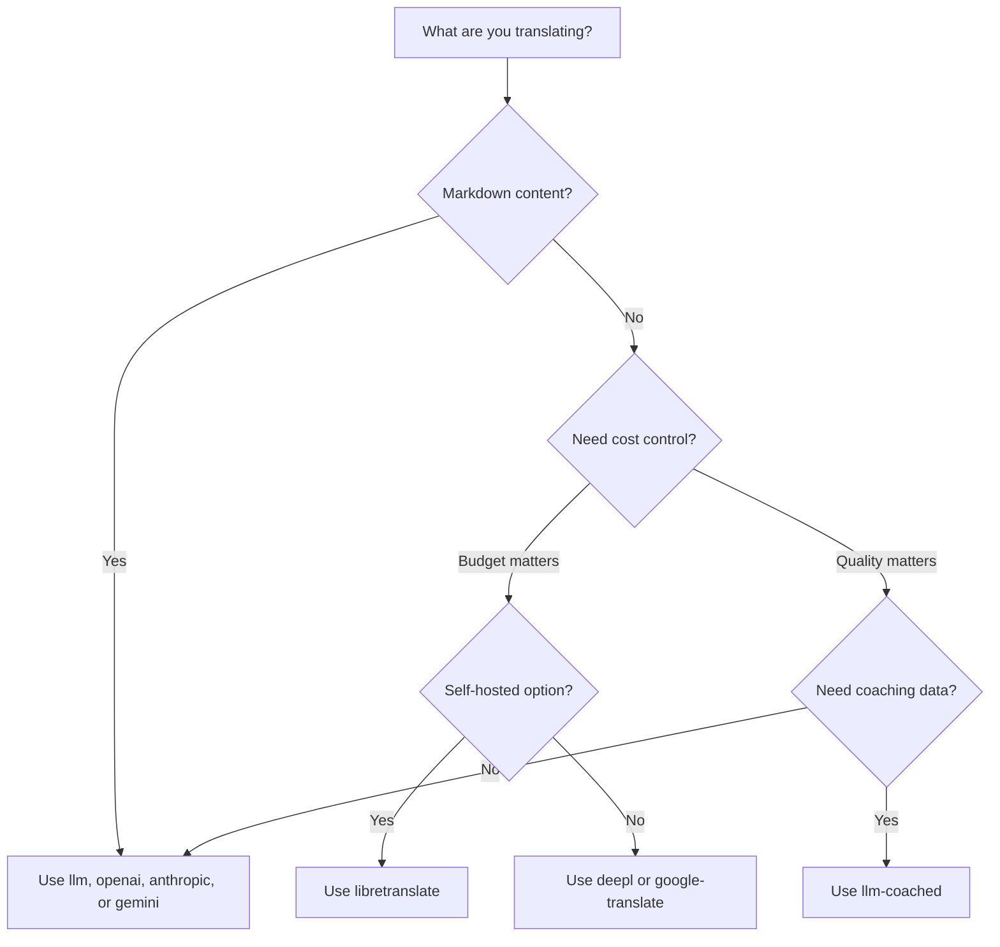

# Vertaalmethoden

Champollion ondersteunt meerdere vertaalmethoden. Elk talenpaar kan een andere methode gebruiken — u zit niet vast aan één aanpak voor uw hele project.

## Methodevergelijking

### LLM-providers

Kwaliteitsgericht, Markdown-bewust, coaching-compatibel. Het meest geschikt voor inhoudsrijke projecten.

| Methode | Sleutel | Wat het doet |
|--------|-----|-------------|
| `llm` (standaard) | `OPENROUTER_API_KEY` | LLM via OpenRouter — 200+ modellen, automatische routering |
| `llm-coached` | `OPENROUTER_API_KEY` | LLM + grammaticaregels, woordenboeken, stijlinstructies |
| `openai` | `OPENAI_API_KEY` | Directe OpenAI-API (gpt-4o, gpt-4o-mini) |
| `anthropic` | `ANTHROPIC_API_KEY` | Directe Anthropic-API (Claude Sonnet, Haiku, Opus) |
| `gemini` | `GEMINI_API_KEY` | Directe Google Gemini-API (Flash, Pro) — gratis tier |
| `local` | *(geen)* | Een model op uw eigen machine of server: Ollama, vLLM, LM Studio, llama.cpp of een model dat u hebt getraind met `nmt-forge`. Tekst verlaat uw infrastructuur nooit |

### Traditionele MT

Snelheid- en kostengericht. Het meest geschikt voor sleutel-waardeparen met hoog volume.

| Methode | Sleutel | Wat het doet |
|--------|-----|-------------|
| `google-translate` | `GOOGLE_TRANSLATE_API_KEY` | Google Cloud Translation API v2 (194 talen) |
| `deepl` | `DEEPL_API_KEY` | DeepL-API met woordenlijstondersteuning (33 talen) |
| `microsoft-translator` | `MICROSOFT_TRANSLATOR_API_KEY` | Azure Cognitive Services Translator (135 talen) |
| `libretranslate` | *(zelf-gehost)* | Zelf-gehoste LibreTranslate (AGPL, gratis) |
| `tilde` | `TILDE_API_KEY` | Tilde MT — in de EU ontwikkelde engines, sterk in Baltische en Europese talen |
| `translated` | `LARA_ACCESS_KEY_ID` + `LARA_ACCESS_KEY_SECRET` | Lara van Translated — professionele adaptieve MT (200 talen) |

### Infrastructuur

| Methode | Sleutel | Wat het doet |
|--------|-----|-------------|
| `api` | *(per provider)* | Dunne HTTP-client voor elk REST-vertaaleindpunt |

## Beslisboom


```mermaid
flowchart TD
    A["What are you translating?"] --> B{"Markdown content?"}
    B -->|Yes| C["Use llm, openai, anthropic, or gemini"]
    B -->|No| D{"Need cost control?"}
    D -->|Budget matters| E{"Self-hosted option?"}
    D -->|Quality matters| F{"Need coaching data?"}
    E -->|Yes| G["Use libretranslate"]
    E -->|No| H["Use deepl or google-translate"]
    F -->|Yes| I["Use llm-coached"]
    F -->|No| C
```

---

## `llm` — LLM-vertaling (standaard)

Vertaalt via elk LLM op [OpenRouter](https://openrouter.ai). Dit is de standaardmethode en de meest veelzijdige.

**Hoe het werkt:**
1. Groepeert sleutels in batches (standaard 80/batch) met register- en contextinstructies
2. Verzendt naar OpenRouter als een gestructureerde prompt
3. Parseert de JSON-respons
4. Valideert elke vertaling via de [kwaliteitspoort](/docs/concepts/quality-gate)
5. Schrijft geslaagde vertalingen weg, probeert mislukkingen opnieuw of verwerpt ze

**Wanneer te gebruiken:** De meeste projecten. Met name inhoudsrijke sites met Markdown, waarbij codeblokken en shortcodes afgeschermd moeten worden.

**Configuratie:**

```json
{
  "defaultMethod": "llm",
  "model": "google/gemini-3.8-flash"
}
```

## `llm-coached` — Begeleide LLM-vertaling

Hetzelfde als `llm`, maar met grammaticaregels, terminologiewoordenboeken en stijlnotities die in elke prompt worden ingevoegd.

**Hoe het werkt:**
1. Laadt coachinggegevens uit `.champollion/coaching/<locale>.json` of de `coaching/`-map van een plugin
2. Voegt grammaticaregels, woordenboektermen en stijlnotities in de systeemprompt in
3. Woordenboektermen die overeenkomen met bronsleutels worden opgenomen als verplichte terminologie
4. De vertaling verloopt zoals bij `llm`, waarbij coachinggegevens voor extra precisie zorgen

**Wanneer te gebruiken:** Talen met weinig middelen, domeinspecifieke terminologie (juridisch, medisch), formele registers, of elk geval waarbij de generieke LLM-uitvoer niet precies genoeg is.

**Indeling van coachinggegevens:**

```json title=".champollion/coaching/fr.json"
{
  "grammar_rules": [
    "French adjectives agree in gender and number with the noun they modify",
    "Use 'vous' for formal contexts, 'tu' for informal"
  ],
  "dictionary": {
    "dashboard": "tableau de bord",
    "deployment": "déploiement",
    "settings": "paramètres"
  },
  "style_notes": "Prefer active voice. Avoid anglicisms where a native French term exists."
}
```

Zie ook: [Handleiding voor talen met weinig middelen](/docs/network/community/low-resource-languages)

---

## `openai` — Directe OpenAI API

Vertaalt rechtstreeks via de OpenAI Chat Completions API. Geen OpenRouter als tussenpersoon — uw sleutel, uw account, uw gebruiksdashboard.

**Modellen:** `gpt-5.4-mini-2026-03-17` (standaard — een gedateerde momentopname), of elk exact model-ID dat OpenAI vermeldt

**Functies:**
- ✅ Markdown-bewust (vertaling van inhoud)
- ✅ Dezelfde prompt als `llm` — stijlniveau, genderrichtlijnen, promptcontext, beschermde termen, richtlijnen voor `coachingFile` en de glossariumtermen van elke batch ([zie hieronder](#one-prompt-every-llm-method))
- ✅ JSON-modus voor gestructureerde sleutel-waarde-uitvoer
- ✅ Exponentiële backoff met nieuwe pogingen

**Configuratie:**

```json
{
  "pairs": {
    "en:fr": { "method": "openai", "model": "gpt-4o-mini" }
  }
}
```

```bash
export OPENAI_API_KEY=sk-proj-...
```

Verkrijg uw sleutel via [platform.openai.com/api-keys](https://platform.openai.com/api-keys).

## `local` — Uw eigen model (Ollama, vLLM, LM Studio, een getraind model)

Vertaalt met elk model achter een **OpenAI-compatibel** eindpunt dat u
beheert: Ollama, vLLM, LM Studio, de server van llama.cpp of een model dat u hebt getraind met
`nmt-forge`. Er is geen API-sleutel nodig en er wordt geen tekst naar derden verzonden. Dit is
de methode om te gebruiken voor gevoelige tekst en degene waarmee u een model inzet dat u
zelf hebt gebouwd.

```json
{ "defaultMethod": "local", "model": "llama3.1" }
```

```bash
# Optional: only if your server is not at Ollama's default address
export LOCAL_API_BASE=http://localhost:11434/v1
npx champollion sync --method local
```

Het eindpunt wordt in deze volgorde uitgelezen: `LOCAL_API_BASE`, `OPENAI_API_BASE`,
`OPENAI_BASE_URL` en vervolgens de standaardwaarde van Ollama: `http://localhost:11434/v1`. Wanneer het
eindpunt zich op deze machine bevindt (`localhost`, `127.0.0.1`, `::1`), worden de kosten
weergegeven als **$0 API-kosten (draait op deze machine)** — er is geen API-factuur; uw
eigen hardware en stroom worden niet meegerekend — en `--max-cost` laat de uitvoering
doorgaan. Elk ander eindpunt (Groq, Together, een server op uw netwerk) wordt
gerapporteerd als **onbekend**, nooit $0, omdat de tool niet kan weten welke kosten
in rekening worden gebracht, waardoor `--max-cost` weigert in plaats van te gokken. In `--json` bevat de
schattingsrij `"estimatedCost": 0, "local": true` voor het eerste geval
en `"estimatedCost": null` voor het tweede. (Een proxy op deze machine die
doorstuurt naar een betaalde API — LiteLLM, een gateway — wordt stroomopwaarts gefactureerd, wat
Champollion niet kan zien: reserveer daarvoor aldaar budget.)

Vóór het vertalen controleert sync of er een server antwoordt op het eindpunt. Als
dat niet het geval is, stopt een run die gegevens zou verzenden nog voordat er iets wordt verstuurd
(exit `1`), onder vermelding van het adres. Een run die niets verzendt — er staat niets
in de wachtrij, of elke sleutel in de wachtrij is afkomstig uit de cache, zoals bij het opnieuw uitvoeren van reeds
vertaalde tekst — waarschuwt dat de server offline is en gaat door. Op een CI-runner
(`CI` of `GITHUB_ACTIONS` ingesteld) stopt een server die niet antwoordt elke run, zelfs een run
waarbij niets in de wachtrij staat, zodat een workflow die nog steeds `local` gebruikt mislukt bij de eerste
push in plaats van pas wanneer een string verandert ([CI-handleiding](/docs/guides/ci-cd)).

De methode `openai` accepteert dezelfde `OPENAI_API_BASE` / `OPENAI_BASE_URL`
override om met een sleutel elke OpenAI-compatibele provider (Groq, Together, …) te
bereiken.

## `anthropic` — Directe Anthropic API

Vertaalt rechtstreeks via de Anthropic Messages API. De instructies worden meegegeven in de parameter `system`, wat Anthropic's promptcaching mogelijk maakt.

**Modellen:** `claude-sonnet-4-6` (standaard), `claude-haiku-4-5`, `claude-opus-4-7`

**Functies:**
- ✅ Markdown-bewust (vertaling van inhoud)
- ✅ Dezelfde prompt als `llm` — stijlniveau, genderrichtlijnen, promptcontext, beschermde termen, richtlijnen voor `coachingFile` en de glossariumtermen van elke batch ([zie hieronder](#one-prompt-every-llm-method))
- ✅ Caching van systeemprompts (spreidt de instructies uit over batches)
- ✅ Exponentiële backoff met nieuwe pogingen

**Configuratie:**

```json
{
  "pairs": {
    "en:ja": { "method": "anthropic", "model": "claude-haiku-4-5" }
  }
}
```

```bash
export ANTHROPIC_API_KEY=sk-ant-...
```

Verkrijg uw sleutel via [console.anthropic.com](https://console.anthropic.com/settings/keys).

## `gemini` — Directe Google Gemini API

Vertaalt rechtstreeks via de Google Gemini `generateContent` API. **Gratis laag beschikbaar** — het beste startpunt zonder kosten.

**Modellen:** `gemini-3.8-flash` (standaard), of elk exact model-ID dat Google vermeldt

**Functies:**
- ✅ Markdown-bewust (vertaling van inhoud)
- ✅ Dezelfde prompt als `llm` — stijlniveau, genderrichtlijnen, promptcontext, beschermde termen, richtlijnen voor `coachingFile` en de glossariumtermen van elke batch ([zie hieronder](#one-prompt-every-llm-method))
- ✅ JSON-responsmodus via `responseMimeType`
- ✅ Gratis tier (ruim dagelijks quotum)
- ✅ Exponentiële backoff met nieuwe pogingen

**Configuratie:**

```json
{
  "pairs": {
    "en:ko": { "method": "gemini", "model": "gemini-2.5-pro" }
  }
}
```

```bash
export GEMINI_API_KEY=AI...
```

Verkrijg uw sleutel via [aistudio.google.com/apikey](https://aistudio.google.com/apikey).

### Eén prompt, elke LLM-methode {#one-prompt-every-llm-method}

`llm`, `openai`, `anthropic`, `gemini` en `local` sturen dezelfde instructies
voor hetzelfde project; alleen de bestemming van het verzoek verschilt. Het systeembericht
bevat het stijlniveau, de genderrichtlijnen van de taal, uw `promptContext`,
uw `protectedTerms` en uw `coachingFile`-tekst; het bericht van elke batch
bevat de glossariumtermen die het bevat (de `dictionary` in
`.champollion/coaching/<locale>.json`), de instructies per sleutel (meervoudsvormen,
gettext-context, beschrijvingen) en de strings. Bekijk het zelf —
er wordt niets verzonden:

```bash
npx champollion sync --dry --method local --show-prompt
```

De grammaticaregels en stijlinstructies uit het coachingbestand worden gelezen door `llm-coached`,
bij elke provider: `{ "method": "llm-coached", "provider": "openai" }`.

### Modelnamen {#model-names}

Een directe provider ontvangt zijn eigen naam voor een model. Een ID in OpenRouter-stijl
wordt gemapt wanneer de provider over dat model beschikt: `openai/gpt-5.5` → `gpt-5.5` op `openai`,
`anthropic/claude-haiku-4.5` → `claude-haiku-4-5` op `anthropic`,
`google/gemini-3.8-flash` → `gemini-3.8-flash` op `gemini`. Een ID waarvoor de provider
geen model heeft, stopt de run voordat er iets wordt verzonden:

```
[ERR] sync failed: en:fr: model "google/gemini-3.8-flash" (from the top-level "model") is an OpenRouter model id
      — openai calls OpenAI directly, which has no model by that name. Use an OpenAI model (e.g. --model gpt-4o),
      --method gemini (its name for it: "gemini-3.8-flash") or --method llm to run it through OpenRouter.
```

`local`, en `openai` gericht op een andere server met `OPENAI_API_BASE`, verzenden
de naam zoals u deze hebt geschreven — die server bepaalt wat deze betekent.

### Alleen exacte slugs {#exact-slugs}

Elk model wordt aangeduid met zijn exacte slug, bij elke methode: `google/gemini-3.8-flash`
op OpenRouter, de eigen exacte naam van een directe provider (`gpt-5.5`) op `openai`. Geen
enkele korte naam verwijst naar een model, en een dynamisch ID (de router-ID's `~vendor/…`
van OpenRouter, elke `…-latest`- of `:latest`-naam) wordt eveneens geweigerd: deze verwijst
naar het model waar de provider vandaag naar wijst, waardoor tijdens een run niet vastgesteld kan worden welk
model heeft vertaald. Beide stoppen de run voordat er iets wordt verzonden:

```
[ERR] sync failed: "gemini-flash" (from --model) is not a model id — Champollion takes exact model slugs only,
      no aliases. Did you mean google/gemini-3.8-flash (what "gemini-flash" used to stand for)? List models:
      https://openrouter.ai/models (OpenRouter slugs), or champollion models --method <gemini|openai|anthropic>
      (a direct provider's own names).
```

### Modelvalidatie {#model-validation}

De directe LLM-providers (`openai`, `anthropic`, `gemini`) controleren uw modelnaam ook bij het eerste gebruik (niet wanneer ze via `OPENAI_API_BASE` met een andere server communiceren). Dit ondervangt twee categorieën fouten:

**Verkeerde provider** — Een model van een geheel andere provider gebruiken:

```
[WARN] Gemini: model "claude-sonnet-4-6" is an Anthropic model.
       This provider (gemini) cannot serve Anthropic models.
       Use --method anthropic or set "method": "anthropic" in config.
```

**Verouderd of verkeerd gespeld model** — Bij de eerste API-aanroep haalt champollion de actuele modellijst van de provider op en controleert uw model daartegen:

```
[WARN] Gemini: model "gemini-1.5-flash" not found in available models.
       Similar models: gemini-2.0-flash, gemini-2.5-flash, gemini-2.5-pro
       The API call will proceed — the provider will give the final verdict.
```

:::note[Dit zijn waarschuwingen, geen fouten]
Modelvalidatie registreert waarschuwingen maar blokkeert de API-aanroep niet. De provider-API geeft het definitieve oordeel — een toekomstige modelnaam kan overeenkomen met een ander patroon, en we willen niet afhankelijk zijn van heuristieken.
:::

---

## `google-translate` — Google Cloud Translation API

Directe integratie met Google Cloud Translation API v2. Gebruikt de REST API — geen SDK, geen serviceaccount. Alleen de API-sleutel.

**Wanneer te gebruiken:** Sleutel-waarde-stringparen met een hoog volume waarbij snelheid en kosten belangrijker zijn dan nuance. Ondersteunt standaard 194 talen ([gepubliceerde lijst van Google](https://docs.cloud.google.com/translate/docs/languages)).

**Beperkingen:**
- ⚠️ **Geen Markdown-bewustzijn.** Beschadigt codeblokken, shortcodes en interpolatievariabelen.
- Geen register-/tooncontrole
- Geen coaching of terminologiehandhaving

```bash
npx champollion sync --method google-translate
```

:::tip[Automatische detectie]
Als alleen `GOOGLE_TRANSLATE_API_KEY` is ingesteld (geen OpenRouter-sleutel), schakelt champollion automatisch over naar Google Translate. Er is geen configuratiewijziging vereist.
:::

## `deepl` — DeepL API

Directe integratie met de DeepL-vertaal-API. Ondersteunt woordenlijsten voor consistente terminologie.

**Wanneer te gebruiken:** Europese talen waarbij DeepL uitblinkt (Duits, Frans, Spaans, Nederlands, Pools, enz.). Woordenlijstondersteuning zorgt voor consistente terminologie zonder coachinggegevens.

**Functies:**
- ✅ Automatische detectie van gratis/pro-eindpunt (achtervoegsel `:fx` op gratis sleutels)
- ✅ Aanmaken en beheren van woordenlijsten
- ✅ Formaliteitsniveaucontrole
- ⚠️ **Geen Markdown-bewustzijn** — alleen sleutel-waardeparen

**Configuratie:**

```json
{
  "pairs": {
    "en:de": { "method": "deepl" }
  }
}
```

```bash
export DEEPL_API_KEY=your-key-here
```

Verkrijg uw sleutel via [deepl.com/pro-api](https://www.deepl.com/pro-api).

## `microsoft-translator` — Azure Cognitive Services

Directe integratie met Microsoft Translator Text API v3.

**Wanneer te gebruiken:** Enterprise-omgevingen met bestaande Azure-infrastructuur. Ondersteunt 135 talen, waaronder enkele die niet door Google Translate worden ondersteund (Tibetaans, Faeröers, Inuktitut en andere).

**Functies:**
- ✅ Tot 100 segmenten per verzoek (hoge doorvoer)
- ✅ Optionele regieparameter voor latentieoptimalisatie
- ⚠️ **Geen Markdown-bewustzijn** — alleen sleutel-waardeparen
- ⚠️ **Geen inhoudsvertaling** — alleen sleutel-waardeparen

**Configuratie:**

```json
{
  "pairs": {
    "en:ar": { "method": "microsoft-translator" }
  }
}
```

```bash
export MICROSOFT_TRANSLATOR_API_KEY=your-key
export MICROSOFT_TRANSLATOR_REGION=global  # optional
```

Verkrijg uw sleutel via de [Azure Portal](https://portal.azure.com) → Cognitive Services → Translator.

## `libretranslate` — Zelf gehoste vertaling

Zelf gehoste open-source vertaling met LibreTranslate. Draait lokaal of op uw eigen infrastructuur — geen API-kosten, volledige gegevenssouvereiniteit.

**Wanneer te gebruiken:** Projecten die offline vertaling, naleving van gegevensprivacy (AVG) of kostenloze werking vereisen. Bijzonder nuttig voor CI-pipelines die niet afhankelijk mogen zijn van externe API's.

**Functies:**
- ✅ Zelf gehost — geen externe API-aanroepen
- ✅ Gratis en open source (AGPL-3.0)
- ✅ Docker-implementatie beschikbaar
- ⚠️ **Geen Markdown-bewustzijn** — alleen sleutel-waardeparen
- ⚠️ **Geen inhoudsvertaling** — alleen sleutel-waardeparen
- ⚠️ Kwaliteit varieert per taalpaar

**Installatie:**

```bash
# Run LibreTranslate locally with Docker
docker run -d -p 5000:5000 libretranslate/libretranslate

# Configure (optional — defaults to localhost:5000)
export LIBRETRANSLATE_API_URL=http://localhost:5000/translate
```

```json
{
  "pairs": {
    "en:es": { "method": "libretranslate" }
  }
}
```

---

## `api` — Externe vertaal-API

Een dunne HTTP-client voor door de gemeenschap gehoste of IP-beschermde vertaaleindpunten. Champollion verzendt sleutels en ontvangt vertalingen terug — het bevat geen vertaallogica.

**Wanneer te gebruiken:** Wanneer vertaalmethoden server-side worden gehost (bijv. bedrijfseigen coachinggegevens, fijn afgestemde modellen, FST-pipelines die niet gedistribueerd kunnen worden).

```json
{
  "pairs": {
    "en:crk": {
      "method": "api",
      "endpoint": "https://api.example.com/v1/translate",
      "apiKey": "your-key"
    }
  }
}
```

:::note[Door de gemeenschap beheerde vertaling (gericht op soevereiniteit)]
De methode `api` is de brug naar **door de gemeenschap gehoste vertaling onder gemeenschapsbeheer (gericht op soevereiniteit)**. Gemeenschappen van inheemse talen en minderheidstalen kunnen hun eigen vertaaleindpunten hosten — waardoor coachingdata, gefinetunede modellen en taalkundig intellectueel eigendom onder beheer van de gemeenschap blijven — terwijl Champollion er als een thin client verbinding mee maakt.

Zie [Ondersteuning van een taal met weinig middelen](/docs/network/community/low-resource-languages) voor de volledige handleiding voor gemeenschapshosting, en [Een methode via API aanbieden](/docs/guides/serving-a-method) voor de eindpuntvereisten.
:::

---

## Configuratie per taalpaar

De werkelijke kracht ligt in het combineren van methoden per taalpaar:

```json title="champollion.config.json"
{
  "version": 3,
  "pairs": {
    "en:fr": { "method": "deepl" },
    "en:ja": { "method": "openai", "model": "gpt-4o" },
    "en:ko": { "method": "gemini" },
    "en:ar": { "method": "microsoft-translator" },
    "en:crk": { "method": "llm-coached" }
  }
}
```

Dit vertaalt Frans via DeepL (woordenlijstondersteuning), Japans via OpenAI (kwaliteit), Koreaans via Gemini (gratis tier), Arabisch via Microsoft Translator (dekking) en Plains Cree via de gecoachte LLM-methode, met door u aangeleverde grammaticaregels en een woordenboek.

## Fallback — een tweede methode voor één paar {#fallback}

Eén methode dekt zelden alles af. Een klein model dat u zelf hebt getraind kan de meeste zinnen goed vertalen en toch `{name}`-placeholders weglaten, meervouden breken of "Home" in een hele zin veranderen. Wijs het paar een `fallback` toe:

```json title="champollion.config.json"
{
  "pairs": {
    "en:crk": {
      "method": "api",
      "endpoint": "http://127.0.0.1:8378/translate",
      "fallback": { "method": "llm-coached", "model": "google/gemini-3.8-flash" }
    }
  }
}
```

Wanneer er niets van uw machines mag vertrekken, gebruik dan in plaats daarvan een model dat u zelf draait als fallback: `"fallback": { "method": "local", "model": "<your local model>" }` (een OpenAI-compatibele server op deze machine; [`local`](#local--your-own-model-ollama-vllm-lm-studio-a-trained-model)). Een gehost model is meestal het sterkere second opinion en wordt gefactureerd per verzoek; `local` houdt de tekst op locatie tegen $0 API-kosten.

Uw model vertaalt eerst. De sleutels die de kwaliteitscontrole weigert en de Markdown-blokken die het weglaat of beschadigt, gaan eenmalig naar de fallback en doorlopen dezelfde controle. Alles wat door geen van beide methoden wordt vertaald, blijft onvertaald, net zoals zonder fallback. `sync` toont een `[FALLBACK]`-regel per paar waarin staat hoeveel er naar de fallback zijn gegaan en hoeveel het er heeft hersteld. `--method` en `--model` wijzigen de eigen methode van het paar, nooit de fallback. Met `--max-cost` wordt elke fallback-batch vooraf geprijsd en overgeslagen als deze het limietbedrag zou overschrijden. Details: [Fallback-methode](/docs/getting-started/configuration#fallback).

## Plugins

Plugins zijn vooraf verpakte vertaalrecepten voor specifieke taalparen. Het zijn JSON-manifesten — geen code — die champollion vertellen welke methode gebruikt moet worden, met welke instellingen, en welke kwaliteit is gebenchmarkt.

:::tip[Van evaluatieomgeving naar productie met één opdracht]
Plugins die zijn ontwikkeld en bewezen in de [evaluatieomgeving](/docs/network/specifications/harness) kunnen direct worden geïnstalleerd — de methode die u daar valideert, wordt hier ingezet met één enkel `plugin install`-commando. Zie [MT-evaluatie](/docs/network/leaderboard/rules) voor de volledige evaluatieworkflow.
:::

```bash
champollion plugin install ./french-formal-v1/
champollion plugin list
champollion plugin remove french-formal-v1
```

Zie de [Pluginspecificatie](/docs/reference/plugin-spec) voor het volledige manifestformaat.

---

## Wisselen van provider

Wisselt u van methode? Het modelformaat en de omgevingsvariabele veranderen — hier is het overzicht:

### OpenRouter → Directe provider

```diff title="champollion.config.json"
 {
   "pairs": {
     "en:fr": {
-      "method": "llm",
-      "model": "openai/gpt-4o"
+      "method": "openai",
+      "model": "gpt-4o"
     }
   }
 }
```

```diff title="Environment variables"
- export OPENROUTER_API_KEY=sk-or-v1-...
+ export OPENAI_API_KEY=sk-proj-...
```

**Belangrijkste verschillen:**
- OpenRouter gebruikt het formaat `provider/model` (bijv. `openai/gpt-4o`). Directe providers gebruiken kale modelnamen (bijv. `gpt-4o`).
- Elke directe provider heeft zijn eigen omgevingsvariabele (`OPENAI_API_KEY`, `ANTHROPIC_API_KEY`, `GEMINI_API_KEY`).
- Als u het verkeerde modelformaat gebruikt, waarschuwt champollion u — zie [Modelvalidatie](#model-validation).

### Directe provider → OpenRouter

```diff title="champollion.config.json"
 {
   "pairs": {
     "en:ja": {
-      "method": "anthropic",
-      "model": "claude-sonnet-4-6"
+      "method": "llm",
+      "model": "anthropic/claude-sonnet-4.6"
     }
   }
 }
```

:::tip[Wanneer OpenRouter versus Direct gebruiken]
**Gebruik OpenRouter** wanneer u tussen modellen wilt wisselen zonder omgevingsvariabelen te wijzigen, of wanneer u toegang wilt tot meer dan 200 modellen via één enkele sleutel. **Gebruik directe providers** wanneer u eenvoudigere facturering, lagere latentie (geen tussenpersoon) of toegang tot providerspecifieke functies wilt, zoals de promptcaching van Anthropic.
:::

---

## Kostenvergelijking

Geschatte kosten per 1.000 vertaalde sleutels (aanname: ~10 tokens per sleutel, 80 sleutels per batch):

| Methode | Kosten / 1K sleutels | Snelheid | Kwaliteit | Het meest geschikt voor |
|--------|----------------|-------|---------|----------|
| `gemini` (Flash) | **Gratis** (binnen laag) | Snel | Goed | Beginnen, persoonlijke projecten |
| `google-translate` | ~$0,02 | Snelst | Voldoende | Hoog volume, Europese talen |
| `deepl` | ~$0,02 | Snel | Goed | Europese talen, terminologie |
| `microsoft-translator` | ~$0,01 | Snel | Voldoende | Azure-omgevingen, brede taaldekking |
| `libretranslate` | **Gratis** (zelf gehost) | Varieert | Redelijk | Geïsoleerde omgevingen, AVG, CI-pipelines |
| `gemini` (Pro) | ~$0,07 | Gemiddeld | Zeer goed | Kwaliteitsgevoelig, gratis quotum |
| `openai` (GPT-4o-mini) | ~$0,01 | Snel | Goed | Budget-LLM |
| `openai` (GPT-4o) | ~$0,10 | Gemiddeld | Zeer goed | Kwaliteitsgevoelig |
| `anthropic` (Haiku) | ~$0,01 | Snel | Goed | Budget-LLM |
| `anthropic` (Sonnet) | ~$0,10 | Gemiddeld | Zeer goed | Kwaliteitsgevoelig |
| `anthropic` (Opus) | ~$0,50 | Langzaam | Uitstekend | Maximale kwaliteit |
| `llm` (OpenRouter) | Varieert per model | Varieert | Varieert | Modelvergelijking, experimenteren |

:::note[Dit zijn schattingen]
De werkelijke kosten zijn afhankelijk van de lengte van uw brontekst, de batchgrootte en prijswijzigingen bij providers. Raadpleeg de actuele prijspagina van elke provider voor exacte tarieven.
:::

---

## Zie ook

- [Ondersteunde talen](/docs/reference/supported-languages)
- [Coachinggegevens](/docs/concepts/coaching-data)
- [Ondersteuning van een taal met weinig middelen](/docs/network/community/low-resource-languages)
- [Pluginspecificatie](/docs/reference/plugin-spec)
- [Een methode via API aanbieden](/docs/guides/serving-a-method)
- [Kwaliteitspoort](/docs/concepts/quality-gate)
- [Architectuur](/docs/concepts/architecture)
- [Probleemoplossing](/docs/guides/troubleshooting) — modelfouten, API-problemen
