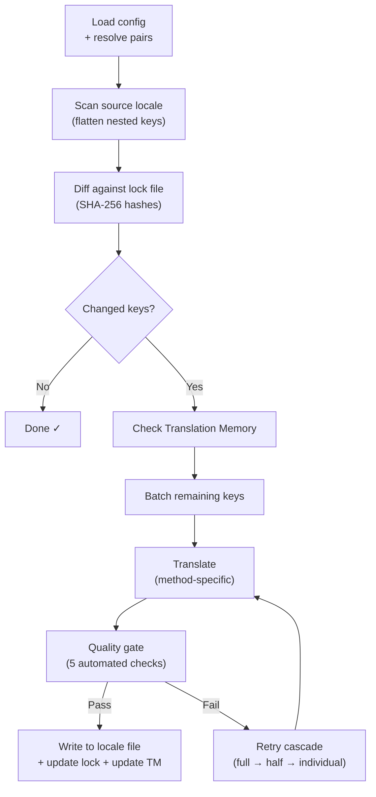

# Hoe champollion Werkt

champollion vertaalt de localisatiebestanden van uw applicatie met één opdracht. Hier volgt een beschrijving van wat er achter de schermen gebeurt.

## De Pipeline

Wanneer u `npx champollion sync` uitvoert, doorloopt champollion een pipeline van zes fasen:



**Belangrijke ontwerpbeslissingen:**

- **Wijzigingsdetectie via SHA-256-hashes.** Champollion houdt elke bronwaarde bij met een hash in `.champollion.lock`. Wanneer u een Engelse tekst bijwerkt, wordt alleen die sleutel opnieuw vertaald. Dit is de reden waarom `sync` snel is bij herhaalde uitvoeringen — het verricht minimale arbeid.

- **Caching via vertaalgeheugen.** Voordat er een API-aanroep wordt gedaan, controleert champollion `.champollion/tm.json` op gecachede vertalingen (geïndexeerd op brontekst + taal + methode). Bij een typische hersynchronisatie na het wijzigen van één sleutel komen 142 sleutels uit de cache en raakt 1 sleutel de API.

- **Kwaliteitscontrole vóór het wegschrijven.** Elke vertaling doorloopt vijf geautomatiseerde controles (leeg, bronecho, hallucinatieherhaling, lengte-inflatie, scriptnaleving) voordat uw bestanden worden aangepast. Fouten worden gelogd en nooit stilzwijgend geaccepteerd.

- **Herhalingscascade bij fouten.** Als een batch mislukt (JSON-parsefout, API-time-out), probeert champollion het opnieuw met progressief kleinere batches: volledig → half → individueel. Dit isoleert de problematische sleutel zonder de rest te blokkeren.

## Vertaalmethoden

Champollion ondersteunt meerdere vertaalmethoden, elk geschikt voor verschillende scenario's. De belangrijkste zijn:

| Methode | Werking | Het meest geschikt voor |
|--------|-------------|----------|
| **`llm`** | Gestructureerde prompt naar elk OpenRouter-model | Goed gedocumenteerde talen |
| **`llm-coached`** | Dezelfde prompt + grammaticaregels, woordenboek en stijlnotities | Talen waarbij LLM's voorspelbare fouten maken |
| **`google-translate`** | Batchverzoek via de Google Cloud Translation API | Talen met veel bronmateriaal en goede GT-ondersteuning |
| **`api`** | HTTP POST naar uw eigen eindpunt | Aangepaste pipelines, door de gemeenschap beheerde modellen |

Methoden worden per taalpaar geconfigureerd. U kunt `google-translate` gebruiken voor Frans, maar `llm-coached` voor Plains Cree — elk paar krijgt de methode die er het beste bij past.

## Coachinggegevens

Voor `llm-coached`-paren geven coachinggegevens het LLM expliciete taalkundige kennis: grammaticaregels, verplichte terminologie en stijlvoorkeuren. Dit wordt als gestructureerde context in elke prompt opgenomen.

```json title="coaching/crk.json"
{
  "grammar_rules": ["Animate nouns take different plural forms than inanimate nouns"],
  "dictionary": {"welcome": "ᑕᓂᓯ", "settings": "ᐃᑕᐢᑌᐘᐃᓇ"},
  "style_notes": "Use Standard Roman Orthography (SRO) unless explicitly configured otherwise."
}
```

Coachinggegevens zijn het primaire mechanisme voor het verbeteren van de vertaalkwaliteit zonder een model te fine-tunen. Pas de regels aan → voer de synchronisatie opnieuw uit → beoordeel het resultaat. Iteratie verloopt onmiddellijk.

## Plugins

Plugins zijn vooraf verpakte vertaalrecepten voor specifieke taalparen. Het zijn JSON-manifesten — geen code — die champollion vertellen welke methode gebruikt moet worden, met welke instellingen, en welke kwaliteit is gebenchmarkt.

```bash
champollion plugin install ./crk-coached-v3/
champollion sync   # uses the installed plugin for en→crk
```

Plugins overbruggen de kloof tussen onderzoek en productie: een methode die goed scoort in het [Network](/arena) kan worden verpakt als plugin en hier worden ingezet.

## Het Grotere Geheel

champollion is de ene helft van een tweedelig ecosysteem:

- **[het Network](/arena)** — waar vertaalmethoden worden **ontwikkeld en bewezen** met reproduceerbare benchmarking
- **champollion** — waar bewezen methoden worden **ingezet** om echte inhoud te vertalen

De [Eval Harness Bridge](/docs/guides/bridge) verbindt de twee. Een methode die zich in het Network bewijst, wordt hier ingezet. Feedback van sprekers uit de productieomgeving verbetert de volgende versie.

---

## Meer Verdieping

- [Hoe synchronisatie werkt](/docs/concepts/how-sync-works) — gedetailleerde stapsgewijze beschrijving van de pipeline
- [Kwaliteitscontrole](/docs/concepts/quality-gate) — de vijf geautomatiseerde controles
- [Vertaalgeheugen](/docs/concepts/translation-memory) — caching en kostenbesparing
- [Vertaalmethoden](/docs/guides/translation-methods) — gedetailleerde methodevergelijking
- [Architectuur](/docs/concepts/architecture) — overzicht van het systeemontwerp
