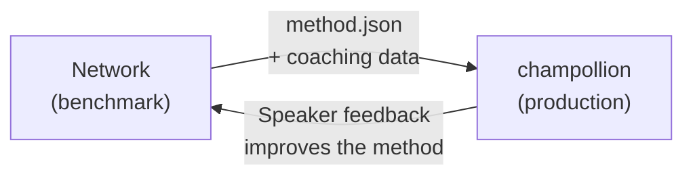

# Implementeren in Productie

U heeft bewezen dat het werkt in het Netwerk. Nu kunt u het implementeren.

Het Netwerk is bedoeld voor O&O — het bouwen, benchmarken en vergelijken van vertaalmethoden. **Productie-implementatie** verloopt via [champollion](https://champollion.dev), de ontwikkelaargerichte vertaal-CLI. Ze zijn verbonden via een gedeeld plug-informaat.



---

## Het Implementatietraject

### 1. Exporteer Uw Methode als een Plugin

Maak een `method.json`-manifest aan dat uw benchmarkresultaten bevat:

```json
{
  "name": "french-formal-v1",
  "type": "llm-coached",
  "version": "1.0.0",
  "description": "Formal-register French (example manifest; the benchmark values are illustrative)",
  "locales": ["fr"],
  "config": {
    "model": "google/gemini-2.5-flash",
    "temperature": 0.3
  },
  "benchmarks": {
    "fr": {
      "corpus_chrf": 72.3,
      "exact_match_rate": 0.42,
      "corpus_size": 500
    }
  }
}
```

Voeg eventuele coachingdata (grammaticaregels, woordenboeken) toe naast het manifest.

### 2. Installeren in Champollion

```bash
champollion plugin install ./french-formal-v1/
```

### 3. Configureer Uw Taalpaar

```json title="champollion.config.json"
{
  "pairs": {
    "en:fr": { "methodPlugin": "french-formal-v1" }
  }
}
```

### 4. Vertaal Echte Inhoud

```bash
npx champollion sync
```

Uw gebenchmarkte methode produceert nu echte vertalingen in productie.

---

## Voor Inheemse Talen

Methoden die inheemse taalgemeenschappen bedienen vereisen **toestemming van de gemeenschap** vóór implementatie in productie. Principes van inheemse datasoevereiniteit — eigenaarschap en controle over taaldata door de gemeenschap — bepalen hoe vertaalmethoden worden ontwikkeld, geëvalueerd en geïmplementeerd.

Geen enkele score maakt een methode geschikt voor productie — geen hoge chrF++, en geen drempelwaarde voor prijzen. Deze wordt pas geïmplementeerd **als en wanneer** het bestuursorgaan van de taalgemeenschap toestemming geeft, nadat sprekers van de taal de uitvoer ervan hebben beoordeeld.

Zie [Gegevenssouvereiniteit](/docs/network/sovereignty/data-sovereignty) en [Eigendomsoverdracht](/docs/network/sovereignty/ownership-transfer) voor het volledige governancekader.

---

## Zie ook

- [The Eval Harness Bridge](https://champollion.dev/docs/guides/bridge) — gedetailleerde doorloop van de Netwerk→champollion-pijplijn
- [Plugin Specification](https://champollion.dev/docs/reference/plugin-spec) — het method.json-manifestformaat
- [champollion Agent Guide](https://champollion.dev/docs/guides/agent-guide) — hoe u champollion gebruikt voor vertaling
