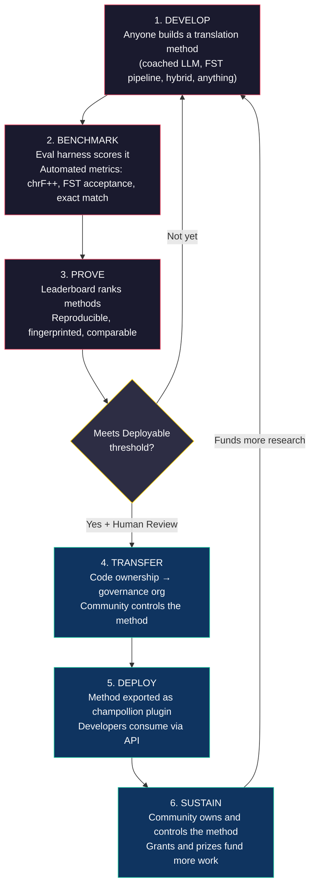
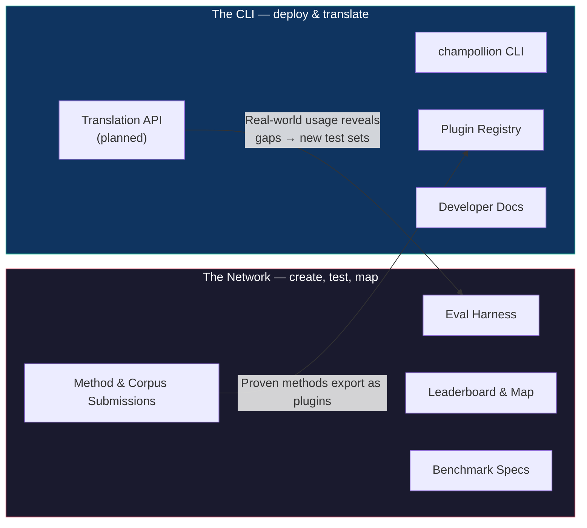
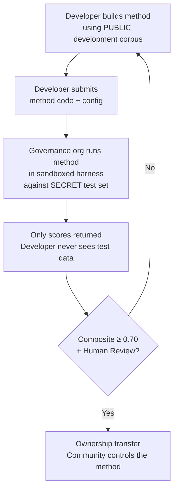

# Hoe het netwerk werkt: Bouwen, testen, ontwikkelen, implementeren

> **Samenvatting.** Automatische vertaling voor de onderbediende talen van de wereld is geen probleem van modeltraining — het is een *infrastructuurprobleem*. Geen enkel model, laboratorium of bedrijf zal dit oplossen. Dit document beschrijft een platformarchitectuur die de wereldwijde gemeenschap van ML-engineers, taalkundigen en moedertaalsprekers transformeert in een gedistribueerd onderzoekslaboratorium: iedereen kan een vertaalmethode bouwen, het netwerk test of deze werkt — inclusief tegen evaluatiegegevens in beheer van de gemeenschap die het platform nooit te zien krijgt — en methoden die werken, worden eigendom van de gemeenschappen wier talen zij bedienen. Het mechanisme is open, collaboratieve methodeontwikkeling in combinatie met flexibele, door beheerders vastgestelde voorwaarden — een combinatie die in de praktijk nog steeds zeldzaam is, en degene die dit probleem volgens ons vereist.

---

> [!IMPORTANT]
> **Reikwijdte.** Dit platform evalueert **formele geschreven tekstvertaling** — documenten, educatief materiaal, officiële communicatie, UI-strings. Het is geen chatbot, real-time tolk of conversatiesysteem voor onbeperkte domeinen. Het leaderboard rangschikt vertaalmethoden tegen gecureerde parallelle corpora in specifieke tekstdomeinen (zie [Benchmark Specification §2.7](/docs/network/specifications/benchmark#27-domain) voor de domeintaxonomie). MT is infrastructuur voor taalrevitalisatie, geen vervanging ervan. Kinderen leren taal van mensen, niet van machines.

### Huidige domeindekking

Het bord is **live en wordt gevuld** — runs worden er continu op gepubliceerd, en
iedereen kan er meer toevoegen. De onderstaande tabel toont welke openbare referentiecorpora
per domein worden *ondersteund*; het [leaderboard](/leaderboard) bevat de live
ranglijsten.
Corpora worden tijdens runtime van de bron opgehaald en worden hier nooit gehost.

| Domein | Referentiecorpus | Status | Opmerkingen |
|--------|------------------|--------|-------|
| Nieuws / journalistiek | Global Voices (OPUS) | Ondersteund — open voor inzendingen | 493 talenparen, CC BY 3.0 |
| Alledaags / gemengd (geschreven) | Tatoeba | Ondersteund — open voor inzendingen | 874 talenparen, CC BY 2.0 |
| Educatief / leerboek | EdTeKLA (Plains Cree) | Alleen onderzoek — **niet gerangschikt**; evaluatie via externe model-API vereist toestemming | Aangepaste CC BY-NC-SA van EdTeKLA (soevereiniteitsgebonden, niet-commercieel); uitgesloten van het leaderboard, prijzen en API/commerciële trajecten |
| Verhalend / literair | — | Gepland | Nog geen uitvoerbaar corpus gekoppeld |
| Religieus / schriftuurlijk | FLORES+ (Bijbeldomein) | Gekoppeld, alleen relatief | Uitvoerbaar corpus; HOGE contaminatie, dus alleen relatief — wordt nooit gebruikt voor officiële scores |
| Gesproken / real-time | — | Buiten bereik | Dit systeem evalueert geschreven tekst, geen spraak |
| Technisch / wetenschappelijk | — | Toekomst | Vereist domeinspecifieke terminologievalidatie |

## Waar het netwerk voor dient

Voor de techniek, de missie. Het Champollion Network rust op vier verbintenissen:

1. **Creëren en vertrouwen van vertaaltestsets.** Voor de meeste talen is het schaarse, waardevolle element niet nog een model — het is een *betrouwbare* testset: door mensen geschreven, domeineerlijk en versiegebonden. Het netwerk bestaat om die testsets te creëren en ze betrouwbaar te maken.
2. **Het vakgebied navigeerbaar maken.** Wie wat kan vertalen, hoe goed elke methode is voor elk soort tekst, en waar de hiaten zitten — gepresenteerd als een openbare kaart, niet verborgen in verspreide papers en pdf's.
3. **Elke methode is welkom — mens en machine.** Wij zijn pragmatici met een voorkeur voor oplossingen. Een professionele vertaler, een op regels gebaseerd systeem, een gecoachte LLM, een gefinetuned model — allemaal zijn ze eersterangs. Het gaat ons erom dat talen vertaald worden, niet om welke tool wint.
4. **Gebouwd *met* gemeenschappen, nooit gescrapet — en soevereiniteit is ononderhandelbaar.** Taalgegevens zijn biometrische gegevens (biodata); de mensen die een corpus leveren, hebben de sleutels ervan in handen, evenals van alles wat daartegen wordt gemeten.

Alles hieronder — de cyclus, het harness, het leaderboard, de implementatiebrug — staat in dienst van die vier verbintenissen.

---

## 1. Het probleem: Machine Translation ≠ Machine Learning

Automatische vertaling (Machine Translation) voor talen met weinig bronnen (low-resource languages, LRL's) wordt vaak geframed als een machine learning-probleem: verzamel gegevens, train een model, implementeer. Deze framing is onjuist, en de fout heeft grote gevolgen — het stuurt financiering, talent en infrastructuur in de richting van een aanpak die structureel niet kan werken voor de meerderheid van de talen in de wereld.

### 1.1 Waarom de ML-framing faalt

De standaard ML-pijplijn voor MT vereist drie dingen: grote parallelle corpora, gevalideerde evaluatiebenchmarks en een implementatietraject. Voor de 194 talen op de Cloud Translation-lijst van Google en de 200 die door NLLB-200 worden gedekt, bestaan alle drie. Voor de ~1.200 talen in de long tail van OMT-1600 — onze berekening: de 1.600 die het dekt minus de 400+ waarvan de auteurs melden dat de modellen ze "voldoende goed begrijpen" — bestaan er evaluatiegegevens, maar de kwaliteit ligt meestal onder bruikbare drempelwaarden, de modelgewichten zijn niet openbaar beschikbaar en er is geen implementatiepijplijn. Voor de resterende ~5.400+ bestaat geen van deze drie.

| Vereiste | Talen met veel bronnen (High-Resource Languages) | OMT-1600 Long Tail (~1.200 LRL's) | Resterende ~5.400 talen |
|-------------|------------------------|-------------------------------|---------------------------|
| **Parallelle corpora** | Miljoenen zinsparen (Europarl, UN Corpus, OpenSubtitles) | Bitext uit het Bijbeldomein, webscrapes, synthetische backtranslation. Geen door de gemeenschap gecureerde gegevens. | Honderden tot enkele duizenden, als die er al zijn |
| **Evaluatiebenchmarks** | WMT, FLORES, NTREX — gestandaardiseerd, reproduceerbaar | BOUQuET (Bijbeldomein), met-BOUQuET. Geen morfologische validatie. Geen onafhankelijke evaluatie. | Geen standaardbenchmarks; ad-hoc evaluatie |
| **Implementatietraject** | Google Translate, DeepL, Azure — commerciële API's | Modelgewichten niet vrijgegeven. Geen CLI, geen plug-insysteem, geen door de gemeenschap te implementeren API. | Niets. Geen API, geen product, geen markt. |

De ML-aanpak werkt wanneer de gegevens bestaan om op te trainen en de markt bestaat om in te implementeren. OMT-1600 heeft de eerste voorwaarde aanzienlijk uitgebreid — maar uitbreiding zonder onafhankelijke kwaliteitsverificatie, morfologische validatie of gemeenschapsbestuur is uitbreiding zonder vertrouwen. Het probleem is niet alleen "we hebben een beter model nodig" — het is "we hebben infrastructuur nodig die bewijst dat het model werkt, onder voorwaarden die de gemeenschap beheert."

### 1.2 Wat MT voor LRL's daadwerkelijk vereist

Vertaling voor onderbediende talen is niet in de eerste plaats een trainingsprobleem. Het is een **method engineering**-probleem — de uitdaging om beschikbare middelen (LLM's, morfologische tools, gemeenschapskennis, taalkundige regels) samen te voegen tot werkende vertaalpijplijnen, en vervolgens met rigoureuze evaluatie te bewijzen dat ze werken.

Het onderscheid is belangrijk:

| Dimensie | ML-aanpak | Method Engineering-aanpak |
|-----------|------------|---------------------------|
| **Kernactiviteit** | Een model trainen op gegevens | Tools, prompts en taalkundige kennis combineren in een pijplijn |
| **Knelpunt** | Volume van parallelle gegevens | Technische creativiteit + evaluatie-infrastructuur |
| **Wie kan bijdragen** | Teams met GPU-clusters en datasets | Iedereen met een API-sleutel, een woordenboek en een idee |
| **Evaluatie** | BLEU/chrF op achtergehouden testsets | Morfologische validatie + menselijke beoordeling + geautomatiseerde metrieken |
| **Implementatie** | Het model serveren | De methode verpakken als een plug-in |

Moderne LLM's bevatten al latente kennis van veel talen met weinig bronnen — genoeg om output te produceren die er plausibel *uitziet*. Het probleem is dat deze output vaak morfologisch ongeldig is (het model hallucineert woordvormen die niet in de taal bestaan). De technische uitdaging is: hoe extraheert u wat de LLM weet, valideert u dit tegen de taalkundige realiteit en verpakt u het resultaat voor productiegebruik?

Dit is de reden waarom we **methoden** benchmarken, geen modellen. Een methode is het volledige recept: modelselectie + prompt engineering + toolgebruik + pre/post-processing + coachinggegevens + retry-strategieën. Twee teams die hetzelfde model met verschillende methoden gebruiken, zullen verschillende scores behalen. Dat is precies het punt.

### 1.3 Waarom polysynthetische talen alles ontwrichten

Veel van de meest onderbediende talen ter wereld zijn **polysynthetisch** — ze coderen hele zinnen in enkele woorden via productieve morfologische processen. Neem bijvoorbeeld het Plains Cree-woord:

> **ê-kî-nitawi-kîskinwahamâkosiyân**
> *"toen ik naar school was gegaan"*

Eén woord. Het codeert tijd (verleden), richting (gaan naar), de stam (leren), de wijs (passief/reflexief) en de persoon (eerste persoon enkelvoud). Het Engels heeft zes woorden nodig voor wat het Cree in één woord uitdrukt.

Dit ontwricht standaard MT op elk niveau:

- **Tokenisatie** — BPE en SentencePiece versnipperen polysynthetische woorden in betekenisloze fragmenten, omdat ze zijn ontworpen voor concatenatieve morfologie.
- **Hallucinatie** — LLM's produceren plausibel ogende tekenreeksen die geen geldige woorden zijn. Een niet-spreker kan het verschil niet zien. Zonder morfologische validatie zijn hallucinaties onzichtbaar.
- **Evaluatie** — Metrieken op woordniveau (BLEU) bestraffen de natuurlijke buigingsvariatie die fundamenteel is voor hoe deze talen werken. Metrieken op karakterniveau (chrF++) zijn beter, maar nog steeds onvoldoende zonder structurele validatie.

De oplossing is geen groter model of meer trainingsgegevens. Het is **infrastructuur die hallucinaties opvangt voordat ze gebruikers bereiken** — morfologische analysatoren (FST's) die definitief kunnen zeggen: "dit is geen woord in deze taal."

---

## 2. Waarom bestaande benaderingen niet werken

### 2.1 Commerciële MT

Commerciële vertaaldiensten hebben van oudsher geoptimaliseerd voor marktvolume. Meta's OMT-1600 (maart 2026) vertegenwoordigt een aanzienlijke verschuiving — 1.600 talen in één systeem. Maar voor de ~1.200 in de long tail (onze berekening: 1.600 minus de 400+ waarvan de auteurs melden dat de modellen ze "voldoende goed begrijpen"), ligt de kwaliteit onder bruikbare drempelwaarden, zijn de modelgewichten niet beschikbaar en is er geen implementatiepijplijn. Het structurele prikkelprobleem is geëvolueerd: Big Tech kan nu modellen bouwen voor LRL's, maar zonder onafhankelijke evaluatie, morfologische validatie of gemeenschapsbestuur lost dekking alleen het probleem niet op.

### 2.2 Academisch onderzoek

Academisch MT-onderzoek richt zich overweldigend op talenparen met veel bronnen, omdat daar de trainingsgegevens, gedeelde taken en publicatieplatforms te vinden zijn. Onderzoekers die aan paren met weinig bronnen werken, hebben moeite om te publiceren, moeite om rekenkracht te financieren en moeite om te implementeren — omdat er geen implementatie-infrastructuur voor LRL's bestaat.

### 2.3 Eenmalige competities

U zou een Kaggle-competitie kunnen organiseren: "Engels→Plains Cree, de beste chrF++ wint $10.000." Dit is wat er dan gebeurt:

1. Iemand wint, dient een notebook in, int de prijs en gaat naar huis.
2. Het notebook verstoft in het archief van Kaggle. Niemand implementeert het. Niemand onderhoudt het.
3. De testset wordt uiteindelijk gepubliceerd — voor altijd gecontamineerd.
4. De bestuursorganisatie heeft haar taalkundige gegevens geüpload naar de infrastructuur van Google onder de servicevoorwaarden van Google, zonder echte controle over de levenscyclus.
5. Geen implementatiebrug. Een winnend notebook is geen werkende API.

Een eenmalige beloning trekt premiejagers aan. Een doorlopend leaderboard met gemeenschapsbestuur creëert blijvende betrokkenheid.

### 2.4 Fine-tuning

Het finetunen van een open model op parallelle tekst is de voor de hand liggende ML-aanpak. Maar voor de meeste LRL's is het parallelle corpus dat nodig is voor fine-tuning precies de data die niet bestaat — en het creëren ervan vereist dezelfde tweetalige sprekers en betrokkenheid van de gemeenschap die de fine-tuning juist zou moeten vervangen. U kunt uzelf niet uit een dataschaarsteprobleem redden met een techniek die data vereist.

---

## 3. De oplossing: Collaboratieve methodeontwikkeling met soevereine evaluatie

Het platform draait de traditionele aanpak om: in plaats van dat één team één model bouwt, **bouwt en test de wereldwijde gemeenschap samen vertaalmethoden**, het netwerk verifieert wat werkt, en methoden die werken worden in productie genomen waarbij de taalgemeenschap het eigendom en de controle behoudt.

### 3.1 De volledige cyclus

Elke fase heeft een specifieke functie:

| Fase | Wat er gebeurt | Wie er profiteert |
|-------|-------------|--------------|
| **Ontwikkelen (Develop)** | Een onderzoeker, student of hobbyist bouwt een vertaalmethode met behulp van welke tools ze maar willen — LLM-prompting, FST-pijplijnen, woordenboeken, gefinetunede modellen, op regels gebaseerde systemen of hybriden | De bijdrager leert, experimenteert, publiceert |
| **Benchmarken (Benchmark)** | Het evaluatie-harness scoort de methode tegen een gestandaardiseerd corpus met reproduceerbare metrieken. Elke run produceert een [run card](/docs/network/specifications/benchmark#3-run-card-schema) — een volledig verslag van wat er is getest en hoe het presteerde | Onderzoekers krijgen reproduceerbare, vergelijkbare resultaten |
| **Bewijzen (Prove)** | Resultaten verschijnen op het openbare leaderboard. Methoden worden gerangschikt, vergeleken en onderzocht. De gemeenschap ziet wat werkt en wat niet | Iedereen krijgt inzicht in de state-of-the-art |
| **Overdragen (Transfer)** | Voor inheemse talen worden methoden die de drempelwaarde voor implementatie bereiken (samengestelde score ≥ 0,70) EN de menselijke validatie doorstaan, qua code-eigendom overgedragen aan de bestuursorganisatie van de taalgemeenschap | De gemeenschap wordt volledig eigenaar van de methode — code, gewichten en implementatiebeslissingen |
| **Implementeren (Deploy)** | De methode wordt geëxporteerd als een [champollion](https://github.com/gamedaysuits/Champollion)-plug-in die de gemeenschap op haar eigen infrastructuur kan draaien. Ontwikkelaars consumeren vertalingen zonder de onderliggende methode te hoeven begrijpen | Ontwikkelaars krijgen vertalingen voor talen die commerciële API's niet bedienen |
| **Onderhouden (Sustain)** | Subsidies en gesponsorde prijzen — waar het project actief naar op zoek is; het is momenteel zelffinancierend — betalen voor meer corpora, sprekersvalidatie en onderzoek. Champollion is niet-commercieel en neemt geen deel van wat een gemeenschap verdient aan een asset dat zij bezit | Betaald corpuswerk en methoden in eigendom van de gemeenschap overleven elke individuele subsidie |

### 3.2 Waarom open samenwerking werkt

Open deelname is niet incidenteel — het is het mechanisme. Dit is waarom:

**Diversiteit aan benaderingen.** De beste methode voor Engels→Plains Cree is misschien een FST-gecontroleerde gecoachte LLM. De beste voor Engels→Quechua is misschien een pijplijn aangevuld met een woordenboek. De beste voor Engels→Inuktitut is misschien een gefinetuned model dat is gebootstrapt vanuit het Nunavut Hansard-corpus. Geen enkel team of benadering zal domineren over alle talen heen. Het leaderboard onthult welke *soorten* benaderingen werken voor welke *soorten* talen — een meta-resultaat dat op zichzelf al een onderzoeksbijdrage is.

**Blijvende betrokkenheid.** Een leaderboard is nooit af. Er is altijd een betere methode om te bouwen. Elke inzending doneert rekenkracht en intellectuele inspanning aan het probleem. In tegenstelling tot een eenmalige subsidie, genereert het open, doorlopende proces een aanhoudende onderzoeksinvestering vanuit de wereldwijde gemeenschap.

**Lage instapdrempel.** U heeft een API-sleutel, een woordenboek en een idee nodig. Het evaluatie-harness is open source. Het corpusformaat is eenvoudige JSON. Een student taalkunde kan zich meten met een goed gefinancierd laboratorium — en het soms beter doen, omdat domeinkennis (het begrijpen van de taal) zwaarder kan wegen dan rekenkracht.

**Implementatiebrug.** Dezelfde methode die goed scoort in het harness, wordt met één configuratiewijziging in productie genomen. "Bewijs het hier, implementeer het daar." Dit is de kloof die Kaggle, WMT shared tasks en academische publicaties niet overbruggen.

### 3.3 De platformarchitectuur

champollion.dev is **één hub met twee gezichten**. Dezelfde site host het Network — waar testsets worden gecreëerd, methoden worden geëvalueerd en resultaten in kaart worden gebracht — en de CLI, waar bewezen methoden in echte projecten worden geïmplementeerd. Ze delen één domein, één set documentatie en één datalaag; de onderstaande labels beschrijven twee *rollen*, niet twee sites.

**Het [Network](/docs/network/)** is de proeftuin. De doelgroep bestaat uit vertalers, taalkundigen, gemeenschappen en onderzoekers. Alles draait hier om het creëren van testsets, het evalueren van methoden daartegen — mens of machine — en het in kaart brengen van waar de hiaten zitten.

**De [CLI](https://champollion.dev)** is de implementatiekant. De doelgroep bestaat uit ontwikkelaars die vertalingen nodig hebben voor hun apps. Ze hoeven niet te begrijpen hoe een methode werkt — ze roepen deze gewoon aan.

De brug tussen de twee gezichten is de **methode**: gecreëerd en vertrouwd op het Network, verpakt voor implementatie via de CLI, en — voor gemeenschapstalen — in eigendom van de gemeenschap.

---

## 4. Soevereine evaluatie: Waarom de infrastructuur ertoe doet

De evaluatie-infrastructuur is geen technisch detail — het is de kern van het soevereiniteitsmodel. Standaardevaluatie (upload uw testset naar een gedeeld platform) werkt niet voor inheemse talen omdat het de controle over de taalkundige gegevens uit handen geeft.

### 4.1 Het soevereiniteitsmechanisme

De ontwikkelaar krijgt de gouden standaard evaluatiegegevens nooit te zien. Ze ontwikkelen tegen een openbaar ontwikkelingscorpus en dienen vervolgens hun methodecode in bij de bestuursorganisatie, die deze in een sandbox uitvoert tegen de geheime testset. Alleen scores komen terug. Dit is niet alleen beveiliging — het is gebouwd in de richting van de **Inheemse datasoevereiniteitsprincipes** — eigenaarschap en zeggenschap van de gemeenschap over taaldata. Of het daaraan voldoet, is niet aan ons om te bepalen: die beslissing ligt bij de betrokken gemeenschappen.

### 4.2 Waarom dit niet op het platform van iemand anders kan draaien

Op Kaggle uploadt de bestuursorganisatie haar taalkundige gegevens naar de infrastructuur van Google onder de servicevoorwaarden van Google. Ze kunnen de toegang niet op hun eigen tijdlijn intrekken. Ze kunnen geen aangepaste juridische voorwaarden (zoals eigendomsoverdracht) aan inzendingen koppelen. Ze hebben geen cryptografische garantie dat de gegevens niet voor andere doeleinden zullen worden gebruikt. Datasoevereiniteit betekent dat de gemeenschap het evaluatie-eindpunt beheert, de sleutels in handen heeft en het kan afsluiten.

---

## 5. Evaluatiefilosofie: Microeval en LYSS

Standaard MT-metrieken (BLEU, chrF++, COMET) zijn ontworpen om te generaliseren over talen heen. Die algemeenheid is hun kracht — en hun blinde vlek. Voor polysynthetische talen scoort een morfologisch ongeldig woord dat karakter-n-grammen deelt met de referentie goed op chrF++, maar zou door elke spreker als wartaal worden herkend.

**Microeval-ontwikkeling** betekent het bouwen van evaluatiemetrieken die zijn afgestemd op specifieke talen met behulp van de best beschikbare taalkundige tools. Het framework heet **LYSS** (Linguistically-informed Yield & Structural Scoring):

| Component | Wat het meet | Tool | Status |
|-----------|-----------------|------|--------|
| **LYSS-fst** | Morfologische geldigheid | Finite-state transducer | ✅ Geïmplementeerd (Plains Cree) |
| **LYSS-eq** | Taalkundige equivalentie | Door taalkundigen gecureerde variantregels | ✅ Geïmplementeerd (Plains Cree) |
| **LYSS-sem** | Semantisch behoud | Taalspecifieke semantische modellen | ✅ Geïmplementeerd (Plains Cree) |

De universele metrieken (chrF++, BLEU) dienen als basislijnen en als de primaire signalen voor talen zonder LYSS-tooling. Waar taalspecifieke tools bestaan, dragen LYSS-componenten het scoregewicht — omdat de dingen die voor elke taal het belangrijkst zijn, de dingen zijn die alleen taalspecifieke tools kunnen meten.

Voor de volledige LYSS-specificatie en de logica van de samengestelde score, zie [SCORING_SPEC.md §4](/docs/network/specifications/scoring#4-composite-score).

> [!WARNING]
> **Vergelijkbaarheid tussen runs.** Bij het vergelijken van runs met verschillende beschikbaarheid van metrieken (bijv. de ene run heeft FST-scores, de andere niet), zijn de samengestelde scores niet direct vergelijkbaar. De samengestelde score normaliseert naar beschikbare metrieken, maar een run die op 5 metrieken is geëvalueerd, bevat meer informatie dan een run die op 2 is geëvalueerd. Het leaderboard geeft de metriekdekking voor elke invoer aan.

---

## 6. Wie hiermee gediend is

### Voor ML-engineers & onderzoekers

Een open leaderboard met gestandaardiseerde benchmarks voor talenparen die door geen enkele shared task worden gedekt. Reproduceer elk resultaat met het evaluatie-harness. Publiceer uw methode. Verbeter de topscore. Elke inzending is via een vingerafdruk (fingerprint) gekoppeld aan een specifieke configuratie en datasetversie — geen ambiguïteit over wat er is getest.

### Voor taalgemeenschappen

Eigendom van en controle over vertaaltechnologie die voor uw taal is gebouwd. De competitieve dynamiek betekent dat meerdere teams tegelijkertijd aan uw taal werken — u profiteert van allemaal en bent eigenaar van het resultaat. Het voordeel vloeit voort uit eigendom, naamsvermelding, capaciteit en datavoorwaarden die de gemeenschap beheert — nooit een omzetaandeel: Champollion is niet-commercieel en neemt geen deel van wat een gemeenschap verdient aan een asset dat zij bezit.

### Voor financiers & subsidiebeoordelaars

Transparante, reproduceerbare metrieken om onderzoeksvoorstellen voor vertalingen te evalueren. Meetbare resultaten die verder gaan dan publicaties: kwaliteitsmetrieken in de loop van de tijd, taaldekking, corpora gebouwd en geregistreerd onder beheer van stewards, betaalde sprekersuren geleverd aan gemeenschappen. Een succesvolle methode wordt een asset in eigendom van de gemeenschap dat draait op een open evaluatie-infrastructuur — de impact van de subsidie wordt versterkt door herbruikbare methoden en openbare benchmarks, in plaats van te eindigen wanneer de financiering stopt.

### Voor ontwikkelaars

Vertaling voor talen die door geen enkele commerciële API worden bediend. Eén CLI-commando (`npx champollion sync`) vertaalt uw locale-bestanden met behulp van door de gemeenschap bewezen methoden. Gebruik Google Translate voor Frans, een gecoachte LLM voor Plains Cree en een community-API voor Quechua — allemaal in hetzelfde project, allemaal met dezelfde interface.

### Voor studenten

Een open uitdaging met impact in de echte wereld. Bouw een vertaalmethode voor een onderbediende taal, benchmark deze en publiceer uw resultaten. De infrastructuur is gratis, de datasets zijn open en het maakt het leaderboard niet uit of u aan een top-10 universiteit studeert of vanaf een computer in de bibliotheek werkt.

---

## 7. Sociale en technische context

### 7.1 Taalrevitalisatie versnelt

Inspanningen voor taalrevitalisatie groeien wereldwijd. Immersiescholen, taalnesten in de gemeenschap en digitale archiveringsprojecten breiden zich uit over inheemse gemeenschappen in Canada, de Verenigde Staten, Australië, Nieuw-Zeeland en Noord-Europa. Deze inspanningen hebben technologie nodig — specifiek vertaaltechnologie die de soevereiniteit van de gemeenschap over taalkundige gegevens respecteert.

### 7.2 LLM's hebben de basislijn veranderd

Vóór 2023 vereiste het bouwen van enige MT-capaciteit voor een polysynthetische taal aanzienlijke NLP-expertise, training van aangepaste modellen en grote budgetten voor rekenkracht. Moderne LLM's hebben de basislijn veranderd: een goed opgestelde prompt met coachinggegevens en morfologische validatie kan voor sommige talenparen bruikbare vertalingen opleveren — zonder dat er training nodig is. Dit verlaagt de instapdrempel voor methodeontwikkeling drastisch. Het probleem is verschoven van "hoe bouwen we een model?" naar "hoe bouwen we een pijplijn die valideert en corrigeert wat het model produceert?"

### 7.3 Open, reproduceerbare meting

Openbare, gedeelde evaluatie heeft de manier veranderd waarop het vakgebied leert wat werkt. De Chatbot Arena, LMSYS en het Hugging Face Open LLM Leaderboard lieten zien dat open, reproduceerbare meting — iedereen kan het uitvoeren, iedereen kan het controleren — echte vooruitgang sneller aan het licht brengt dan gesloten, zelfgerapporteerde claims. We nemen die les over, niet de toernooicultuur, en richten deze op vertaling voor de duizenden talen waar commerciële MT ofwel niet bestaat, ofwel niet onafhankelijk is geverifieerd. Het doel is een gedeelde, controleerbare kaart van wat werkt voor welke talen en welke soorten tekst — geen ranglijst van wie wie heeft verslagen.

### 7.4 Inheemse datasoevereiniteit is ononderhandelbaar

De Inheemse datasoevereiniteitsprincipes — eigenaarschap en zeggenschap van de gemeenschap over taaldata —, de CARE-principes (Collective Benefit, Authority to Control, Responsibility, Ethics) en kaders zoals Te Mana Raraunga (Māori Data Sovereignty) zijn geen optionele toevoegingen — het zijn structurele vereisten voor elke technologie die inheemse taalkundige bronnen raakt. Onze evaluatie-infrastructuur is gebouwd om architecturaal aan te sluiten bij deze principes, niet alleen in beleidsverklaringen — en of het daaraan voldoet, is een beslissing die bij de gemeenschappen ligt, niet bij ons.

---

## 8. Spanningen en beperkingen {#8-tensions-and-limitations}

Dit project gebruikt een westers mechanisme — competitieve benchmarking — om kennissystemen te dienen die vaak gemeenschappelijk, relationeel en door ouderen (Elders) geleid zijn. Die spanning is reëel en moet worden benoemd, niet worden opgelost door beweringen.

**Benchmarking vs. gemeenschappelijke kennis.** Leaderboards rangschikken individuen en optimaliseren numerieke scores. Inheemse kennistradities benadrukken relationele autoriteit, gemeenschappelijke correctie en op relaties gebaseerde legitimiteit. We kunnen niet beweren deze kennissystemen te dienen terwijl we een platform bouwen waarvan het kernmechanisme individuele competitieve optimalisatie is. De soevereiniteitsarchitectuur (§4) — waarbij gemeenschappen eigenaar zijn van methoden, de evaluatie controleren en beslissen wat er wordt geïmplementeerd — is ons structurele antwoord, maar het neemt de spanning niet weg. Een leaderboard blijft een leaderboard.

**Wat we eraan doen.** Het platform ondersteunt team- en gemeenschapsinzendingen naast individuele inzendingen. Het leaderboard presenteert resultaten als "huidige state-of-the-art" in plaats van "wie er wint". De bestuursorganisatie — niet de leaderboard-score — bepaalt wat er wordt geïmplementeerd. Geen enkele geautomatiseerde score geeft een ontwikkelaar ergens recht op; de gemeenschap beslist. En we onderhouden een doorlopende adviserende feedbackloop met partnergemeenschappen over de vraag of de framing en prikkelstructuur van het platform hen dient. Als dat niet zo is, veranderen we het.

**MT is geen revitalisatie.** Vertaling zet tekst om tussen talen. Revitalisatie creëert nieuwe sprekers. Een perfect MT-systeem lost het overdrachtsprobleem, het prestigeprobleem of het pedagogische probleem niet op. Het kan zelfs de illusie wekken dat "de computer de taal kan spreken", wat de urgentie voor menselijke overdracht ondermijnt. We bouwen MT als infrastructuur — conceptvertalingen voor post-editing, morfologische tools voor apps om talen te leren, politieke invloed voor gemeenschappen die diensten in hun taal eisen — niet als vervanging voor intergenerationele overdracht. De gemeenschap bepaalt of, wanneer en hoe de technologie wordt ingezet.

Deze sectie bestaat omdat deze spanningen werden geïdentificeerd in een op verzoek geschreven kritiek (mei 2026) en we ons ertoe hebben verbonden ze publiekelijk te benoemen in plaats van ze te verbergen in interne documenten.

> [!NOTE]
> **Leaderboard-scores zijn geautomatiseerde proxy's.** Alle scores die op het leaderboard worden weergegeven, zijn geautomatiseerde metingen die onder gecontroleerde omstandigheden door het evaluatie-harness zijn berekend. Ze geven de relatieve prestaties van de methode aan, maar vormen geen kwaliteitsgaranties. Door de gemeenschap gevalideerde methoden worden afzonderlijk gemarkeerd. Geen enkele geautomatiseerde score geeft een ontwikkelaar recht op implementatie — de bestuursorganisatie neemt die beslissing.

---

## 9. Huidige status

### Wat er vandaag bestaat

- **champollion** — de CLI-tool. Meerdere vertaalmethoden, configuratie per paar, kwaliteitscontroles (quality gates) en ondersteuning voor de gangbare locale-bestandsformaten.
- **MT Eval Harness** — Werkend evaluatieframework. chrF++, FST-acceptatie en exact match-metrieken geïmplementeerd. Run card-schema afgerond. Fingerprinting en integriteitsverificatie werken.
- **EDTeKLA Dev v1** — Plains Cree evaluatiecorpus (aangepaste CC BY-NC-SA van EdTeKLA — soevereiniteitsgebonden, niet-commercieel), afkomstig van de EdTeKLA-onderzoeksgroep van de University of Alberta. Uitgesloten van het leaderboard, prijzen en het API/commerciële traject (niet-commerciële licentie); het aantal invoeren wordt eenmalig vermeld op de [Evaluation Datasets-pagina](/docs/network/leaderboard/datasets#edtekla-development-set-v1).
- **FLORES+ Devtest** — 1.012 zinnen × 870 gecatalogiseerde talenparen (CC BY-SA 4.0).
- **Network-website** — Op Docusaurus gebaseerde documentatiesite met leaderboard, specificaties, tutorials en soevereiniteitskader.
- **Benchmark Specification** — [Canonieke specificatie](/docs/network/specifications/benchmark) die het corpusschema, het run card-formaat en het evaluatieprotocol definieert. Voor definities van metrieken, samengestelde gewichten en kwaliteitsniveaus, zie [SCORING_SPEC.md](/docs/network/specifications/scoring).

### Wat is de volgende stap

| Fase | Wat | Status |
|-------|------|--------|
| Basislijn-sweep | 12 modellen × 3 temperaturen × 2 coachingconfiguraties op EDTeKLA | ⏸ Toestemming vereist — wacht op de vastgelegde toestemming van de rechthebbende voor evaluatie via externe model-API |
| Samengestelde score | Implementatie van gewogen metrieken in harness | ✅ Voltooid |
| Semantische score | Score gewogen op basis van oordeel (verdict) van CrkSemanticMetric (evaluatiestandaard) | ✅ Voltooid |
| Morfologische nauwkeurigheid | Score per morfeem tegen gouden standaard analyse | 🔲 Gepland |
| Equivalente match | Matching van variantklassen via CrkLinterMetric (evaluatiestandaard) | ✅ Voltooid |
| Champollion API | API voor methoden in eigendom van de gemeenschap | 🔲 Gepland |
| Tweede taal | Uitbreiden naar een tweede talenpaar (Inuktitut, Quechua of Sámi) | 🔲 Gepland |

---

## 10. Aan de slag

**Bouw een methode:** Kloon het [evaluatie-harness](https://github.com/gamedaysuits/Champollion), voer een basislijnexperiment uit en kijk waar u op het leaderboard belandt.

**Draag een corpus bij:** Als u een onderbediende taal spreekt, zijn zelfs 50 gecureerde vertaalparen genoeg om een nieuw leaderboard-traject te openen. Zie [Voor taalgemeenschappen](/docs/network/community/for-language-communities).

**Implementeer vertalingen:** Installeer [champollion](https://github.com/gamedaysuits/Champollion) en vertaal uw app met `npx champollion sync`.

**Financier de inspanning:** Zie [Het economische model](/docs/network/sovereignty/economic-model) voor kostenkaders en duurzaamheidsprognoses.

---

## Zie ook

- **[Benchmark Specification](/docs/network/specifications/benchmark)** — corpusformaat, run card-schema, evaluatieprotocol, soevereiniteit
- **[Scoring Specification](/docs/network/specifications/scoring)** — metrieken, samengestelde gewichten, kwaliteitsniveaus, kosten-/snelheidsformules
- **[het Network](/arena)** — de R&D-proeftuin
- **[champollion](https://github.com/gamedaysuits/Champollion)** — het implementatieplatform
- **[Support a Low-Resource Language](/docs/network/community/low-resource-languages)** — diepgaande blik op polysynthetische MT-uitdagingen en -benaderingen

---

*Dit document is het startpunt voor iedereen die voor het eerst met het project in aanraking komt. Voor de volledige technische specificatie, zie [BENCHMARK_SPEC.md](/docs/network/specifications/benchmark) (protocol) en [SCORING_SPEC.md](/docs/network/specifications/scoring) (metrieken).*
