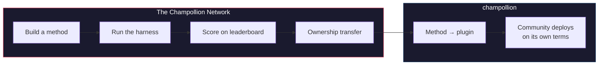

# Het Champollion Netwerk

> **Samenvatting.** Het Champollion Netwerk is een open infrastructuur om vertaaltestsets te *creëren en te vertrouwen* voor zoveel mogelijk talenparen — gebouwd *met* professionals en gemeenschappen, nooit van hen gescrapet — en om het hele vakgebied navigeerbaar te maken: wie kan wat vertalen, hoe goed is elke methode voor elk type tekst, en waar bevinden zich de hiaten. Elke methode is welkom, zowel menselijk als machinaal. U kunt ook een methode bouwen en indienen, en zien hoe deze scoort ten opzichte van echte corpora. Voor de talen waarvan gemeenschappen data leveren, is soevereiniteit ononderhandelbaar: de mensen die een corpus leveren, beheren de sleutels ervan en van alles wat daartegen wordt gemeten.

Deze sectie is de thuisbasis van de kaart. De onderliggende pagina's leggen uit hoe het
netwerk van gemeten paren wordt opgebouwd ([Hoe het Netwerk
Werkt](/docs/network/how-it-works)), waarom de openbare werkrij rangschikt wat het
rangschikt ([Waarom de Wachtrij](/docs/network/perspectives/why-the-queue) en de
[Wachtrijconstructie-specificatie](/docs/network/specifications/queue-construction)),
en hoe de sterkte van een verbinding wordt berekend
([Verbindingssterkte](/docs/network/specifications/connection-strength)).
Als u beslist of u het project überhaupt wilt vertrouwen, begin dan met
[Eerlijke Beperkingen](/docs/network/honest-limitations); als u al weet
wat u wilt bouwen, vindt u de ingang bij
[Wat Champollion Is](/docs/what-is-champollion).

**Het draait op twee soorten benchmarks.** *Openbare benchmarks* gebruiken open datasets om elke methode goedkoop en open in kaart te brengen en te rangschikken — het basisniveau van gescrapete/open data, waarbij het risico op contaminatie wordt vermeld. *Soevereine benchmarks* zijn de gouden standaard: geheime testsets die taalgemeenschappen creëren, bezitten en beheren, en die Champollion **nooit ziet** — blind geëvalueerd, en alleen wanneer de gemeenschap daarvoor toestemming geeft. De infrastructuur zelf is source-available en wordt door één partij beheerd; wat toebehoort aan een gemeenschap zijn de testsets voor hun taal en de methoden die daarvoor zijn gebouwd.

:::info[Lancerings-/startfase]
Het Netwerk is jong maar live: het leaderboard bevat echte gepubliceerde runs
en staat open voor inzendingen van iedereen. Voor wat we precies wel en nog niet
claimen — verificatie, validatie door de gemeenschap, held-out evaluatie — zie
**[Eerlijke Beperkingen](/docs/network/honest-limitations)**.
:::

---

## Het Probleem

De Cloud Translation-service van Google vermeldt 194 talen ([Gepubliceerde lijst van Google](https://docs.cloud.google.com/translate/docs/languages)). Meta's NLLB-200 dekt er 200, en OMT-1600 (maart 2026) claimt er 1.600. Er worden er meer dan 7.000 gesproken op aarde. Voor de ~1.200 talen in de long tail van OMT-1600 — onze berekening: de 1.600 die het dekt minus de 400+ waarvan de auteurs rapporteren dat de modellen ze "voldoende goed begrijpen" — zijn de modelgewichten niet beschikbaar, ligt de kwaliteit onder bruikbare drempelwaarden, en is de evaluatie uitgevoerd met teksten uit het bijbeldomein en standaard machinemetrics — geen morfologische validatie, geen onafhankelijke tests, geen bestuur door de gemeenschap. Voor de resterende ~5.400 talen produceert geen enkel pretrained model enige output.

Big Tech investeert nu in LRL-dekking — maar dekking zonder onafhankelijke kwaliteitsverificatie, morfologische validatie of bestuur door de gemeenschap is dekking zonder vertrouwen. De sprekers die vertaaltools het hardst nodig hebben, zijn dezelfde gemeenschappen voor wie de kans het kleinst is dat deze worden gebouwd.

**Het Netwerk bestaat om dat te veranderen.** Het biedt de infrastructuur om testsets te creëren, elke methode daartegen te evalueren — menselijk of machinaal — en de resultaten in kaart te brengen, voor elke taal, met reproduceerbare scores, open inzendingen en bestuur door de gemeenschap over wie de data en de resultaten beheert.

Taaldata is *biodata*. Net als genetische of gezondheidsdata draagt een taal de identiteit en relaties in zich van de mensen die haar spreken, en kan deze niet zinvol worden geanonimiseerd — dus de mensen die een corpus leveren, beheren de sleutels ervan, en van alles wat daartegen wordt gemeten. Soevereiniteit is hier geen achteraf toegevoegde functie; het is het fundament waarop de rest is gebouwd.

---

## Hoe Het Werkt

1. **U bouwt een vertaalmethode** — gecoachte LLM, fine-tuned model, FST-gated pipeline, of iets anders dat vertalingen produceert.
2. **De harness benchmarkt het** — gestandaardiseerde metrics (chrF++, exact match, FST-acceptatie), gefingerprint naar een specifieke Git-commit.
3. **Resultaten verschijnen op het leaderboard** — live en open voor inzendingen; elke gepubliceerde run is reproduceerbaar en vergelijkbaar.
4. **Wanneer een methode werkt, wordt het eigendom overgedragen** — voor inheemse talen wordt de code van de methode overgedragen aan de bestuursorganisatie van de gemeenschap.
5. **De gemeenschap implementeert het — of en hoe zij dat willen.** De methode wordt geëxporteerd als een [champollion](https://champollion.dev) plug-in en kan volledig op de infrastructuur van de gemeenschap draaien. Champollion neemt geen deel van wat het daar opbrengt.

**Bouw het hier. Implementeer het daar.**

:::tip[Kraak een taal, win, geef het terug]
Dit is met opzet een ML-benchmarking operatie — competitie is hoe moeilijke paren
worden opgelost. We nodigen ML-onderzoekers en elke bekwame bouwer uit om de beste
methode te bouwen voor een specifiek moeilijk paar, **een premie te winnen wanneer er een openstaat**, *en* de
resulterende methode te overhandigen aan de soevereiniteitsorganisatie die eigenaar is van die taal. De
competitieve energie is echt; deze is gericht op de missie, niet op het beklimmen van een
leaderboard omwille van het leaderboard zelf. Zie de [Prijzenspecificatie](/docs/network/specifications/prizes).
:::

---

## Voor Wie Dit Is

| U bent... | Het netwerk biedt u... |
|---|---|
| **ML-engineer / onderzoeker** | Gestandaardiseerde benchmarks, reproduceerbare scores, een gedeeld corpus om tegen te testen |
| **Taalkundige** | Een framework om grammaticaregels en woordenboeken om te zetten in testbare methoden |
| **Professionele / menselijke vertaler** | Een plek om uw diensten te registreren en gevonden te worden — menselijke vertaling is hier een eersterangs methode, vermeld en gebenchmarkt naast de machines, geen bijzaak |
| **Lid van een taalgemeenschap** | Bestuur over hoe de methoden voor uw taal worden ontwikkeld en geïmplementeerd |
| **Financier / subsidiebeoordelaar** | Transparante, reproduceerbare metrics om onderzoeksvoorstellen voor vertalingen te evalueren |
| **Student** | Een open uitnodiging met echte impact — bouw een methode, draag uw resultaten bij |

---

## Ondersteunde referentiecorpora

**Het bord is live en bevindt zich nog in een vroeg stadium** — de eerste sweeps zijn gepubliceerd en
er volgen er meer naarmate bijdragers wachtrij-items uitvoeren. Wat volgt is geen
leaderboard; het is de set van openbare referentiecorpora waartegen een inzending vandaag
kan worden gescoord. Corpora worden hier nooit gehost: de harness haalt referenties op van de
upstream bron tijdens runtime en scoort tegen de vers opgehaalde data.

### Global Voices (OPUS) — nieuwsdomein
- **Dekking:** 493 talenparen gecatalogiseerd en uitvoerbaar (bijv. `eval-amh-fra-globalvoices-test-v1`, Amhaars → Frans)
- **Licentie:** CC BY 3.0
- **Bron:** [Global Voices via OPUS](https://opus.nlpl.eu/)

### Tatoeba — conversatie / gemengd domein
- **Dekking:** 874 talenparen gecatalogiseerd en uitvoerbaar (bijv. `eval-afr-eng-tatoeba-dev-v1`, Afrikaans → Engels)
- **Licentie:** CC BY 2.0
- **Bron:** [Tatoeba-gemeenschap](https://tatoeba.org)

:::note[EdTeKLA is uitsluitend voor onderzoek — geen ranking-benchmark]
Het EdTeKLA Plains Cree-corpus (*Cree: Language of the Plains*) draagt
[EdTeKLA's **aangepaste** CC BY-NC-SA](https://github.com/EdTeKLA/IndigenousLanguages_Corpora)
— soevereiniteitsgerichte, niet-commerciële voorwaarden (het basistekstboek zelf is CC
BY-NC-ND 4.0). Het is **uitgesloten van alle rangschikkingen** — het komt niet in aanmerking voor
het leaderboard, enige prijs, of de API/commerciële trajecten — en externe
model-API-evaluatie ervan is **toestemmingsgebonden**: de harness weigert om
de tekst naar model-API's van derden te sturen, tenzij de expliciete toestemming van de
rechthebbende is vastgelegd (lokale evaluatie blijft mogelijk).

FLORES+ **is** hier gekoppeld en uitvoerbaar (870 gecatalogiseerde paren, bijv.
`eval-flores-devtest-v1-amh-fra`), maar het heeft een **HOGE contaminatie** — openbare,
gecrawlde evaluatiedata die frontier-modellen zeer waarschijnlijk al hebben gezien.
Het is daarom **uitsluitend relatief**: bruikbaar om methoden direct met elkaar te vergelijken, maar
**nooit gerapporteerd als een absolute kwaliteitsbenchmark**, en het is **alleen voor test- /
illustratiedoeleinden**. Een FLORES+-resultaat telt nooit als een kwaliteitsscore en wordt
nooit gebruikt als een schakel in de keten op de [vertaalkaart](https://champollion.dev).
Zie [Eerlijke Beperkingen](/docs/network/honest-limitations) voor wat we precies
wel en niet claimen.
:::

---

## De Enige Regel

:::danger[Train niet op evaluatiedata]
Methoden die zijn blootgesteld aan de benchmarkdataset — als trainingsdata, few-shot voorbeelden, woordenboekvermeldingen of promptmateriaal — worden **gediskwalificeerd**. Fine-tune op wat u maar wilt. Alleen niet op de testset.
:::

---

## Volgende Stappen

- **[Een Methode Indienen](/docs/network/getting-started/submit-a-method)** — hoe u uw eerste benchmark-run indient
- **[Benchmarkspecificatie](/docs/network/specifications/benchmark)** — het volledige experimentprotocol
- **[Leaderboard-regels](/docs/network/leaderboard/rules)** — indieningscriteria en anti-gamingbeleid
- **[Databeheer](/docs/network/sovereignty/data-sovereignty)** — corpora blijven bij hun beheerders; elke licentie wordt gerespecteerd
- **[Hoe het Werk Wordt Gefinancierd](/docs/network/sovereignty/economic-model)** — niet-commercieel en momenteel zelfgefinancierd; financiers gezocht, en de bestemming van elke dollar wordt gepubliceerd

**[→ Bekijk het Leaderboard](https://champollion.dev/leaderboard)**
