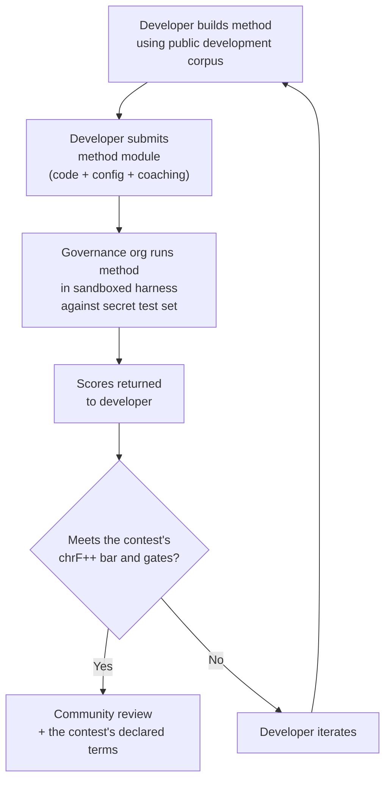

# Benchmarkspecificatie

> **Samenvatting.** Dit document definieert het evaluatieprotocol voor het Champollion-ecosysteem voor MT-evaluatie: corpusindeling (§2), runkaartschema (§3), benchmarkprotocol (§6), vereisten voor menselijke validatie (§7), soevereiniteitsmechanismen (§8), scorebord- en inzendingmodel (§9), kostenkader (§10) en uitbreidbaarheid naar nieuwe talen (§11). Voor de manier waarop runs worden gescoord (de leidende chrF++-metriek, de standaardmetrieken daarnaast, de diagnostische gegevens) en voor formules van kosten-/snelheidsmetrieken, zie `SCORING_SPEC.md` — de centrale bron van waarheid voor alle scoringslogica. Dit document verwijst naar SCORING_SPEC voor die details in plaats van deze te dupliceren.


---

## 1. Principes

### 1.1 Talen zijn biodata

Een taal is geen neutraal testmateriaal. Net als genetische of gezondheidsgegevens is taaldata **biodata**: het draagt de identiteit, verwantschap en relaties van de mensen die het spreken, en het kan niet zinvol worden geanonimiseerd — verwijder de metadata en de taal codeert nog steeds wie haar mensen zijn. De consequentie voor deze specificatie is concreet: de mensen die een corpus aanleveren, bezitten de sleutels daartoe, en tot alles wat daartegen wordt gemeten. Soevereiniteit (§8) is daarom geen aanvulling op het protocol; het is een voorwaarde ervoor, en elk ander principe hieronder opereert daarbinnen.

### 1.2 Geautomatiseerde metrieken zijn benaderingen

Elke metriek die in dit document is gedefinieerd, wordt door een machine berekend. chrF++, FST-acceptatie, morfologische nauwkeurigheid, semantische gelijkenis — het zijn allemaal geautomatiseerde benaderingen van vertaalkwaliteit. Ze zijn nuttig voor snelle iteratie, systematische vergelijking en het detecteren van regressies. Ze zijn **geen vervanging voor menselijk oordeel**.

De evaluatiehiërarchie:

```
Automated metrics (run cards, benchmarks)
    ↓ proxy for
Human review (bilingual speakers validate output)
    ↓ proxy for
Actual utility (does this help a language community?)
```

Geen enkele geautomatiseerde score, hoe hoog ook, kan een vloeiende spreker vervangen die de uitvoer leest en bevestigt dat deze correct, natuurlijk en cultureel gepast is. Daarom draagt geen enkele automatische score een kwaliteitslabel (§5): automatische metrieken zijn nuttig om de voortgang te volgen, maar op zichzelf nooit voldoende.

### 1.3 Methoden, niet modellen

We benchmarken **methoden**, niet modellen. Een model is één component. Een methode is het volledige recept: modelselectie, promptontwerp, toolgebruik, voor- en naverwerking, coachingdata, herhaalpogingsstrategieën, alles. Twee teams die hetzelfde model gebruiken met verschillende methoden zullen verschillende scores behalen. Dat is het punt.

### 1.4 Reproduceerbaarheid

Elk benchmarkresultaat moet reproduceerbaar zijn. De run card (§3) legt de volledige configuratie van een experiment vast. De vingerafdruk (§3.5) identificeert de experimentele opzet. De run card-hash (§3.6) verifieert de integriteit van het resultaat. Iedereen met dezelfde methode, hetzelfde corpus en dezelfde configuratie zou scores moeten behalen binnen ±2% (rekening houdend met niet-determinisme van LLM-sampling bij temperatuur > 0).

### 1.5 Geen synthetische evaluatiedata

**Dit project genereert, gebruikt of onderschrijft geen synthetische evaluatiedata.** Alle corpora moeten afkomstig zijn van authentieke, door mensen geschreven tekst — gepubliceerde vertalingen, leerboeken, tweetalige documenten of uitgelokte vertalingen van vloeiende sprekers.

LLM's mogen helpen bij:
- Zinuitlijning (het vinden van parallelle passages in bestaande tweetalige teksten)
- Formaatconversie (het omzetten van gepubliceerd materiaal naar het corpusschema)
- Metadataverrijking (het voorstellen van moeilijkheidsniveaus, registerlabels)
- Het voorstellen van bronzinnen voor menselijke vertaling (§11.3 — de vertaalstap is altijd menselijk)

LLM's mogen **nooit** referentievertalingen of evaluatieparen genereren.

**We zijn ontwikkelingsneutraal ten aanzien van trainingsdata.** Als een methode-ontwikkelaar synthetische trainingsdata, terugvertaling of data-augmentatie in zijn methode gebruikt, is dat zijn keuze — we evalueren de uitvoer, niet het trainingsproces. Meta's OMT-1600 gebruikt ongeveer 270 miljoen synthetische parallelle zinnen die via terugvertaling zijn gegenereerd. We hebben geen bezwaar tegen methoden die op deze manier zijn getraind. We testen uitsluitend op menselijke curatie.

> **Waarom geen bijbeltekst voor evaluatie?** OMT-1600 evalueert 1.560 van 1.600 talen op bijbeldomein-tekst (Meta AI, *Omnilingual MT*, arXiv:2603.16309, 2026). Bijbelvertalingen hebben een archaïsch register, liturgisch vocabulaire en formulaïsche zinsstructuur. Onze evaluatiecorpora zijn afkomstig van door de gemeenschap gecureerde, domein-diverse tekst — gezondheid, juridisch, onderwijs, overheid, conversationeel en technische domeinen (zie §2.7). Dit is een bewuste ontwerpkeuze. Gemeenschappen hebben vertaling nodig voor de domeinen waar ze daadwerkelijk leven en werken, niet voor één religieus register. Een methode die goed scoort op Genesis 1:1 zegt u vrijwel niets over de prestaties op een agenda van een bandraad of een intakeformulier van een kliniek.

---

## 2. Corpusschema

Een corpus is een gecureerde verzameling parallelle tekstparen met gestructureerde metadata. Het is de grondwaarheid waartegen alle methoden worden gemeten.

### 2.1 Dataset-envelop

De structuur op het hoogste niveau van een corpusbestand:

```json
{
  "dataset": {
    "id": "edtekla-dev-v1",
    "version": "1.0",
    "language_pair": "EN→CRK",
    "source_language": "en",
    "target_language": "crk",
    "created": "2026-05-01",
    "license": "LicenseRef-EdTeKLA-Modified-CC-BY-NC-SA-4.0",
    "provenance": ["gold_standard", "textbook"]
  },
  "entries": [ ... ]
}
```

| Veld | Type | Vereist | Beschrijving |
|------|------|---------|--------------|
| `id` | string | ✅ | Unieke dataset-identifier, gebruikt in run cards en leaderboard |
| `version` | string | ✅ | Semantische versie. Verhogen maakt eerdere run card-vergelijkingen ongeldig |
| `language_pair` | string | ✅ | Weergavelabel (bijv. `EN→CRK`) |
| `source_language` | string | ✅ | BCP 47-brontalcode |
| `target_language` | string | ✅ | BCP 47-doeltalcode |
| `created` | string | ✅ | ISO 8601-aanmaakdatum |
| `license` | string | ✅ | SPDX-licentie-identifier |
| `provenance` | string[] | ✅ | Lijst van herkomstlabels die in vermeldingen worden gebruikt |

### 2.2 Vermeldingsschema

Elke vermelding in het corpus vertegenwoordigt één vertaaluitdaging:

```json
{
  "id": 42,
  "source": "I see the dog",
  "reference": "niwâpamâw atim",
  "segment": "gold_standard",
  "difficulty": 2,
  "provenance": "gold_standard",
  "register": "conversational",
  "context": "declaration",
  "morphological_analysis": "ni-wâpam-âw atim | 1sg-see.TA-3sg.DIR dog.AN",
  "notes": "Animate noun (atim); direct form because speaker is proximate",
  "variant_class": "simple-ta-direct"
}
```

| Veld | Type | Vereist | Beschrijving |
|-------|------|----------|-------------|
| `id` | integer | ✅ | Unieke identificatie binnen het corpus |
| `source` | string | ✅ | Brontekst in de brontaal |
| `reference` | string | ✅ | Referentieweergave volgens gouden standaard in de doeltaal |
| `segment` | string | 📎 | Corpuspartitie: `gold_standard`, `held_out`, `development` of `diagnostic` |
| `difficulty` | integer | 📎 | Moeilijkheidsgraad 1–5 (zie §2.4) |
| `provenance` | string | 📎 | Oorsprong van dit item (zie §2.5) |
| `register` | string | 📎 | Register/formaliteitsniveau (zie §2.6) |
| `context` | string | 📎 | Communicatieve functie (zie §2.6) |
| `domain` | string | 📎 | Toepassingsdomein uit de taxonomie van 16 codes (zie §2.7). Moet een van de volgende zijn: `conv`, `ecommerce`, `edu`, `financial`, `gov`, `legal`, `literary`, `marketing`, `medical`, `news`, `religious`, `scientific`, `subtitles`, `support`, `tech`, `ui`. Gevalideerd bij opbouw. |
| `morphological_analysis` | string | ❌ | Morfologische analyse volgens gouden standaard |
| `notes` | string | ❌ | Opmerkingen van de vertaler, dialectvarianten, dubbelzinnigheidsmarkeringen |
| `variant_class` | string | ❌ | Klassenlabel dat acceptabele vertaalvarianten groepeert |

> **📎 = AANBEVOLEN.** De harness verwerkt ontbrekende optionele velden probleemloos via standaardwaarden. Corpora van derden hoeven per item alleen `id`, `source` en `reference` aan te leveren.


### 2.3 Corpussegmenten

Het corpus is verdeeld in segmenten met verschillende toegangsniveaus:

| Segment | Doel | Toegang | Minimale omvang |
|---------|------|---------|----------------|
| `development` | Methode-ontwikkeling en iteratie. Ontwikkelaars gebruiken deze vrij. | **Openbaar** | 30 vermeldingen |
| `diagnostic` | Gerichte tests voor specifieke taalkundige verschijnselen. | **Openbaar** | 10 vermeldingen |
| `gold_standard` | Officiële benchmarkevaluatie. Leaderboard-scores komen hieruit. | **Geheim** — beheerd door de governance-organisatie | 50 vermeldingen |
| `held_out` | Gereserveerd voor toekomstige evaluatie. Nooit gebruikt totdat geactiveerd. | **Geheim** — beheerd door de governance-organisatie | 10 vermeldingen |

> **Huidige staat:** Alleen het `development`-segment bestaat in meegeleverde datasets. De segmenten `diagnostic`, `gold_standard` en `held_out` zijn gedefinieerd voor toekomstig gebruik naarmate corpora groeien.

De segmenten `gold_standard` en `held_out` zijn volledig geheim. Zowel de bronzinnen als de referentievertalingen worden bewaard op door de governance-organisatie beheerde infrastructuur. Methode-ontwikkelaars zien nooit de vragen of de antwoorden. Zie §8 voor het soevereiniteitsmechanisme.

### 2.4 Moeilijkheidsniveaus

| Niveau | Beschrijving | Voorbeelden |
|--------|-------------|-------------|
| 1 — Basiswoordenschat | Losse woorden, veelgebruikte begroetingen, getallen | "hello" → "tânisi", "dog" → "atim" |
| 2 — Eenvoudige zinnen | Onderwerp-werkwoord of SVO, tegenwoordige tijd | "I see the dog" → "niwâpamâw atim" |
| 3 — Matige complexiteit | Verleden/toekomstige tijd, bezittelijke vormen, animaatheid | "I saw his dog yesterday" |
| 4 — Complexe morfologie | Obviatie, passieve stem, conjunctvolgorde, betrekkelijke bijzinnen | "the woman whose son went to the store" |
| 5 — Gevorderd | Meerdere bijzinnen, formeel register, ceremonieel, idiomatisch | Volledig alinea met registerpassende toon |

Een goed samengesteld corpus moet vermeldingen bevatten over alle vijf moeilijkheidsniveaus, met een nadruk op niveaus 2–4 waar de meeste vertaaluitdagingen in de praktijk vallen.

### 2.5 Herkomstlabels

Elke vermelding moet de oorsprong aangeven:

| Label | Betekenis |
|-------|----------|
| `gold_standard` | Geverifieerd door vloeiende sprekers |
| `textbook` | Afkomstig uit gepubliceerd educatief materiaal |
| `elicited` | Geproduceerd via gestructureerde ontlokingssessies |
| `corpus` | Geëxtraheerd uit een parallel corpus |

> **Opmerking:** In de praktijk zijn herkomstwaarden vrije tekstreeksen. De bovenstaande labels zijn conventies, geen gevalideerde enum — datasets mogen andere beschrijvende herkomstreeksen gebruiken.

### 2.6 Register en context

**Register** beschrijft de formaliteit en sociale context:

| Register | Beschrijving |
|----------|-------------|
| `conversational` | Alledaags spraakgebruik tussen gelijken |
| `formal` | Officiële of institutionele taal |
| `technical` | Domeinspecifiek vocabulaire |
| `ceremonial` | Traditioneel of sacraal taalgebruik |
| `educational` | Taalleermateriaal |

**Context** beschrijft de communicatieve functie:

> 🔲 **Gepland.** Het veld `context` is gedefinieerd in het schema maar nog niet ingevuld in huidige datasets. Het is gereserveerd voor toekomstige corpusverrijking.

| Context | Beschrijving |
|---------|-------------|
| `greeting` | Sociale begroeting of afscheid |
| `declaration` | Feitelijke bewering |
| `question` | Vraagzin |
| `instruction` | Opdracht of aanwijzing |
| `narrative` | Verhalen vertellen of beschrijven |
| `label` | UI-label, knoptekst of koptekst |
| `error` | Foutmelding of waarschuwing |

### 2.7 Domein {#27-domain}

**Domein** beschrijft de praktische gebruikssituatie — het type inhoud dat wordt vertaald. Dit staat los van register en context:

- **Register** beantwoordt: *Hoe formeel is dit?*
- **Context** beantwoordt: *Wat doet deze zin?*
- **Domein** beantwoordt: *Voor welke sector/gebruikssituatie is dit?*

Een juridisch contract (domein: `legal`) kan formeel zijn (register: `formal`) en een verklaring bevatten (context: `declaration`). Een transcript van een juridische chatbot (domein: `legal`) kan conversationeel zijn (register: `conversational`) en vragen bevatten (context: `question`). Hetzelfde domein, maar een ander register en een andere context.

| Domeincode | Beschrijving | Typische gebruikers |
|------------|-------------|---------------------|
| `ui` | Softwareinterfaceteksten | App-ontwikkelaars, lokalisatieteams |
| `legal` | Contracten, statuten, gerechtelijke stukken, immigratiedocumenten | Advocatenkantoren, rechtbanken, compliance-teams, IE-advocaten |
| `medical` | Klinische aantekeningen, geneesmiddelenlabels, patiëntcommunicatie, onderzoeksprotocollen | Ziekenhuizen, farmacie, klinische onderzoeken, patiëntportalen |
| `financial` | Bankieren, verzekeringen, regelgevende aangiften, auditrapportages | Banken, verzekeraars, toezichthouders, auditors |
| `edu` | Leerboeken, curricula, lesplannen, academisch materiaal | Scholen, universiteiten, leerboekuitgevers |
| `ecommerce` | Productbeschrijvingen, recensies, marktplaatsaanbiedingen | Online retailers, marktplaatsverkopers |
| `marketing` | Advertentieteksten, merkboodschappen, campagnes, slogans | Reclamebureaus, merkteams |
| `gov` | Beleidsdocumenten, regelgeving, openbare kennisgevingen, wetgeving | Overheidsinstanties, compliance-teams |
| `scientific` | Onderzoeksartikelen, samenvattingen, methodologie, subsidieaanvragen | Onderzoekers, tijdschriften, subsidieverstrekkers |
| `religious` | Schriftteksten, liturgische teksten, theologisch commentaar | Geloofsgemeenschappen, liturgische uitgevers |
| `support` | FAQ's, foutmeldingen, probleemoplossingsgidsen, chatbotscripts | SaaS-bedrijven, helpdesks |
| `subtitles` | Film-, tv-, streaming- en gamedialogen | Streamingplatforms, studio's, gamingbedrijven |
| `news` | Journalistiek, persberichten, redactionele stukken, nieuwsberichten | Mediaorganisaties, persbureaus |
| `literary` | Fictie, poëzie, narratief, culturele teksten | Uitgevers, organisaties voor cultureel behoud |
| `conv` | Informele conversatie, sociale media, berichten | Consumenten-apps, sociale platforms |
| `tech` | API-documentatie, handleidingen, technische specificaties, technische gidsen | Documentatieteams, technische organisaties |

> **Domeinspecifieke benchmarks.** De algemene benchmark evalueert een methode over alle domeinen. Maar het netwerk ondersteunt ook **domeingefiltreerde benchmarks** — waarbij scores alleen worden berekend op vermeldingen die zijn getagd met een specifiek domein. Hiermee kunnen gebruikers de vraag beantwoorden: "Welke methode is het beste voor het vertalen van juridische documenten naar het Frans?" versus "Welke methode heeft de beste algemene Franse score?"
>
> Domeingefiltreerde leaderboard-ranglijsten stellen gebruikers in staat methoden te vergelijken binnen één gebruikssituatie. Verschillende methoden presteren verschillend per domein — een methode die is verfijnd op juridische terminologie kan veel hoger scoren op juridische tekst dan op conversationele tekst. Het netwerk helpt gebruikers de methode te vinden die het beste werkt voor hun specifieke gebruikssituatie.

> **Toekomst: Netwerkassistent.** Een conversationele assistent die gebruikers helpt hun MT-gebruikssituatie te beschrijven (domein, taalpaar, kwaliteitsvereisten) en relevante door de gemeenschap gevalideerde methoden uit het leaderboard toont — bijvoorbeeld "welke methode scoort het hoogst op medisch-domein EN→JA-benchmarks?" — is een navigatiehulpmiddel dat we overwegen, afhankelijk van voldoende domein-getagde evaluatiedata en methodediversiteit.

---

## 3. Run card-schema {#3-run-card-schema}

De run card is de atomaire eenheid van evaluatie. Het is een op zichzelf staand JSON-document dat de volledige configuratie en resultaten van één evaluatierun vastlegt: één methode, één model, één configuratie, één dataset.

Elke run card legt drie dimensies vast:
- **Kwaliteit** — hoe goed zijn de vertalingen?
- **Kosten** — hoeveel heeft het gekost om ze te produceren?
- **Snelheid** — hoe lang heeft het geduurd?

### 3.1 Velden op het hoogste niveau

| Veld | Type | Beschrijving |
|-------|------|-------------|
| `run_id` | string | UUID v4 gegenereerd bij de start van de run |
| `harness_version` | string | Semantische versie van de harness (bijv. `2.0`) |
| `timestamp` | string | ISO 8601 UTC-tijdstempel van wanneer de run is gestart |
| `elapsed_seconds` | number | Totale verstreken tijd (wall-clock) van de volledige run |
| `score_caveats` | array | Alleen aanwezig wanneer iets de scores nuanceert: een lijst met `{kind, source, severity, message, …}`-objecten, bijv. een testset waarvan de rijen nagenoeg identieke tegenhangers in de trainingsgegevens hebben, uitvoer die veel langer of veel korter is dan de referenties, uitvoer die de bron kopieert, of één uitvoer die voor veel verschillende bronnen wordt gegeven. Ter informatie: dit wijzigt nooit een score en wordt getoond naast de leidende chrF++-score waar de scores ook staan. Zie [Run Card-specificatie](/docs/network/specifications/run-card#score_caveats) |

### 3.2 Methodeconfiguratie

Deze velden definiëren de experimentele opzet — wat er is getest en hoe.

| Veld | Type | Vereist | Beschrijving |
|------|------|---------|--------------|
| `model_slug` | string | ✅ | Model-identifier (bijv. `google/gemini-2.5-flash`) |
| `model_id` | string | ❌ | Opgeloste model-identifier teruggegeven door de API |
| `condition` | string | ✅ | Experimentlabel (bijv. `baseline`, `coached-v3`, `few-shot`) |
| `temperature` | number | ✅ | Samplingtemperatuur |
| `system_prompt_sha256` | string | ✅ | SHA-256-hash van de volledige systeemprompt |
| `system_prompt_used` | string | ✅ | De volledige systeemprompttekst |
| `coaching_data_sha256` | string | ❌ | SHA-256-hash van het coachingdatabestand, indien gebruikt |
| `fst_version` | string | ❌ | Versie van de FST-analysator, indien gebruikt |
| `tools_enabled` | string[] | ❌ | Lijst van tools beschikbaar voor de methode |
| `batch_size` | number | ❌ | Vermeldingen per gelijktijdige API-batch |
| `max_retries` | number | ❌ | Maximale herhaalpogingen bij FST-afwijzing, indien van toepassing |

:::info[Gepubliceerde runkaarten bevatten method_config]
Wanneer een runkaart naar het scorebord wordt gepubliceerd (via `mt-eval publish`), bevat deze ook een `method_config`-blok met de canonieke MethodConfig van 8 velden (`model`, `temperature`, `batchSize`, `register`, `coachingFile`, `coachingPrompt`, `promptContext`, `qualityTier` — allemaal camelCase; `qualityTier` is op een nieuwe kaart altijd null, aangezien kwaliteitsniveaus zijn uitgefaseerd). Dit maakt import zonder reconstructie mogelijk: `champollion leaderboard --install` leest `method_config` rechtstreeks en schrijft dit weg als een plug-inmanifest. De bovenstaande telemetrievelden (§3.2) registreren wat de harness heeft waargenomen; `method_config` registreert wat de ontwikkelaar heeft bedoeld.
:::

### 3.3 Datasetreferentie

| Veld | Type | Beschrijving |
|------|------|-------------|
| `dataset.id` | string | Dataset-identifier |
| `dataset.version` | string | Datasetversie |
| `dataset.language_pair` | string | Weergavelabel |
| `dataset.sha256` | string | SHA-256-hash van de inhoud van het datasetbestand |
| `dataset.entry_count` | number | Aantal geëvalueerde vermeldingen |

De SHA-256 van de dataset koppelt het resultaat aan een specifieke versie van de data. Als de dataset verandert, zijn oude run cards niet meer vergelijkbaar.

### 3.4 Scores (kwaliteit)

Geaggregeerde metrieken voor de volledige run. Alle kwaliteitsmetrieken zijn **geautomatiseerd** — zie §1.2.

| Veld | Type | Beschrijving |
|-------|------|-------------|
| `scores.total` | number | Totaal geëvalueerde items |
| `scores.exact_matches` | number | Items waarbij de uitvoer exact overeenkwam met de referentie |
| `scores.exact_match_rate` | number | 0.0–1.0 |
| `scores.equivalent_matches` | number | Items die overeenkomen met een acceptabele variant |
| `scores.equivalent_match_rate` | number | 0.0–1.0 |
| `scores.fst_accepted` | number | Uitvoerwoorden die de FST-analysator heeft geaccepteerd, opgeteld over alle items (een aantal woorden, geen aantal items) |
| `scores.fst_acceptance_rate` | number | 0.0–1.0, het gemiddelde van de acceptatiepercentages per item (geaccepteerde woorden van elk item ÷ het aantal woorden); `null` indien geen FST geconfigureerd |
| `scores.morphological_accuracy` | number | 0.0–1.0, FST-afgeleid (overeenkomend met lemma), `null` indien geen FST / geen op lemma overeenkomende woorden. Ter advisering tot activatie — zie Scoringspecificatie §2.2 |
| `scores.morph_coverage` | number | 0.0–1.0, fractie van analyseerbare voorspelde woorden die op lemma overeenkomen met de referentie (geeft aan hoe schaars `morphological_accuracy` is) |
| `scores.chrf_plus_plus` | number | **De leidende en rangschikkende metriek:** chrF++ op corpusniveau (0–100). Het 95%-bootstrap-BI is `scores.confidence_intervals.corpus_chrf` en de sacreBLEU-handtekening is `scores.sacrebleu_signatures.chrf` |
| `scores.scoring_standard` | string | `"standard/1"` op elke nieuwe kaart. Afwezig op kaarten die vóór de standaard zijn gepubliceerd, welke worden gelezen als `legacy-composite` |
| `scores.primary_metric` | string | `"chrf_plus_plus"` |
| `scores.spbleu` | number | spBLEU (FLORES-200 SentencePiece), getoond naast chrF++ |
| `scores.sacrebleu_signatures` | object | Handtekening van elke berekende sacreBLEU-metriek (`chrf`, `chrf_plain`, `bleu`, `spbleu`, `ter`) |
| `scores.semantic_score` | number | Semantische gelijkenis op basis van embeddings (0.0–1.0) |
| `scores.ter` | number | Translation Edit Rate (0–∞, lager is beter) |
| `scores.length_ratio` | number | gem(len(voorspeld)/len(referentie)), ideaal = 1.0 |
| `scores.code_switching_rate` | number | 0.0–1.0, fractie van items met lekkage van de brontaal |
| `scores.hallucination_rate` | number | 0.0–1.0, fractie van items met gehallucineerde inhoud |
| `scores.terminology_adherence` | number | 0.0–1.0, naleving van woordenlijsttermen (`null` indien geen woordenlijst) |
| `scores.tokens_per_second` | number | total_tokens / elapsed_seconds |
| `scores.entries_per_minute` | number | vertaalde items per minuut |
| `scores.composite` | number \| null | **Uitgefaseerd.** `null` op elke nieuwe kaart; een verouderde kaart behoudt zijn opgeslagen samengestelde score, getoond als "legacy composite (retired)". Zie SCORING_SPEC §4 |
| `scores.quality_tier` | string \| null | **Uitgefaseerd.** `null` op elke nieuwe kaart. Zie SCORING_SPEC §5 |
| `scores.cost_adjusted` | number \| null | **Uitgefaseerd** samen met de samengestelde score; `null` op elke nieuwe kaart |
| `scores.errors` | number | Items die zijn mislukt (API-fout, time-out, enz.) |
| `scores.by_difficulty` | object | Scores uitgesplitst naar moeilijkheidsniveau |
| `scores.by_provenance` | object | Scores uitgesplitst naar herkomsttag |
| `scores.by_domain` | object | ✅ Geïmplementeerd — Scores uitgesplitst naar domein (§2.7). Maakt op domein gefilterde scorebordrangschikking mogelijk. Berekend door tester.py en doorgegeven via publish.py. |

### 3.5 Totalen (kosten)

| Veld | Type | Beschrijving |
|------|------|-------------|
| `totals.prompt_tokens` | number | Totaal aantal invoertokens over alle API-aanroepen |
| `totals.completion_tokens` | number | Totaal aantal uitvoertokens |
| `totals.reasoning_tokens` | number | Tokens gebruikt voor chain-of-thought (0 voor de meeste modellen) |
| `totals.cached_tokens` | number | Tokens geserveerd vanuit de promptcache van de provider |
| `totals.total_cost_usd` | number | Totale kosten in USD |
| `totals.cost_per_entry_usd` | number | `total_cost_usd / entry_count` |
| `totals.cost_per_source_char` | number | USD per bronkarakter — vergelijkbaar over talen heen |

### 3.6 Timing (snelheid)

| Veld | Type | Beschrijving |
|------|------|-------------|
| `elapsed_seconds` | number | Wandkloktijd van de volledige run (op het hoogste niveau) |
| `scores.avg_latency_seconds` | number | Gemiddelde responstijd per vermelding |
| `scores.median_latency_seconds` | number | Mediane responstijd per vermelding |
| `scores.p95_latency_seconds` | number | 95e percentiel responstijd per vermelding |

### 3.7 Resultaten per vermelding

Elke vermelding in de `results[]`-array registreert één vertaling. Gegevens per vermelding worden opgeslagen in de `run_card_entries`-tabel (migratie 005) met gedenormaliseerde LYSS-uitspraken (migratie 006).

| Veld | Type | Beschrijving |
|------|------|-------------|
| `entry_id` | string | Komt overeen met `entries[].id` in het corpus |
| `source` | string | Brontekst die is vertaald |
| `expected` | string | Goudstandaard referentievertaling |
| `raw_predicted` | string \| null | Ruwe modeluitvoer vóór naverwerking |
| `predicted` | string | Werkelijke uitvoer van de methode (naverwerkt) |
| `segment` | string | Segment-identifier (bijv. zinsindex) |
| `difficulty` | string \| null | Moeilijkheidsniveau uit het corpus |
| `domain` | string | Domeinlabel uit het corpus (§2.7) |
| `exact_match` | boolean | Of de uitvoer exact overeenkwam met de referentie |
| `chrf_score` | number \| null | chrF++ op zinsniveau (0–100) |
| `bleu_score` | number \| null | BLEU op zinsniveau (0–100) |
| `latency_s` | number \| null | Responstijd in seconden |
| `cost_usd` | number \| null | Kosten in USD voor deze vermelding |
| `tool_call_count` | integer | Aantal gebruikte tool-aanroepen (0 als geen) |
| `error` | string \| null | Foutmelding als deze vermelding is mislukt |
| `plugin_metrics` | object | Volledige plugin-uitvoer per vermelding (JSONB) |
| `fst_valid` | boolean \| null | GiellaLT FST heeft de voorspelling geaccepteerd (gedenormaliseerde LYSS-fst) |
| `equivalent_match` | boolean \| null | CRK-linter heeft structurele equivalentie bevestigd (gedenormaliseerde LYSS-eq) |
| `semantic_verdict` | string \| null | LYSS-sem-uitspraak: `VALID`, `MISMATCH`, `UNKNOWN`, `ERROR` |
| `code_switching_detected` | boolean \| null | Brontaaltokens gedetecteerd in uitvoer |
| `hallucination_detected` | boolean \| null | Gefabriceerde inhoud gedetecteerd in uitvoer |


### 3.8 Vingerafdruk

Een reproduceerbaar identificatiemiddel. Twee runs met identieke vingerafdrukken hebben dezelfde experimentele opzet gebruikt.

De vingerafdruk is de SHA-256-hash van de canonieke JSON (gesorteerde sleutels) van:
- `dataset.sha256`
- `model_slug`
- `condition`
- `system_prompt_sha256`
- `temperature`
- `harness_version`
- `batch_size`
- `tools_enabled`

> **Waarom 8 componenten?** Batchgrootte en tool-aanroepen beïnvloeden de uitvoerkwaliteit wezenlijk en moeten worden opgenomen in de identiteit. Twee runs met verschillende batchgroottes of verschillende ingeschakelde tools zijn verschillende experimentele opzetten, zelfs als alle andere parameters overeenkomen.

**Versie 2 (harness 0.2.0 en later)** voegt vijf componenten toe:
- `api_provider`: het kanaal waar de tekst doorheen is gegaan (OpenRouter, de eigen API van een leverancier, een lokaal eindpunt; de id van een MT-engine; voor een methode-plug-in `local` onder `--attest-local-transport`, anders `method-plugin`). Runlogs van plug-ins en engines die zijn geschreven voordat dit werd gecorrigeerd vermelden `openrouter`, een standaardwaarde waar ze nooit doorheen zijn gestuurd; bij publicatie wordt ook voor hen de gecorrigeerde waarde vastgelegd, wat hun versie 2-identiteit verandert — bewust, aangezien de oude waarde onjuist was
- `endpoint_host_sha256`: de SHA-256 van de host van het eindpunt, nooit de onbewerkte URL, die interne hostnamen of inloggegevens kan bevatten
- `max_tokens`
- `method_version`: de versie van de methodekaart, anders de versie die `method.json` van een methode-plug-in declareert
- `method_sha256`: de hash van de uitgevoerde bundel, voor een methode die door een contest-node is uitgevoerd, anders de hash over de bestanden van een methode-plug-in (`method.json` en de bijbehorende `.py`-bestanden)

Een run van een **methode-plug-in** (`mt-eval run --method <plugin dir>`) voegt er nog twee toe:
- `method_model`: het model dat aan de plug-in is meegegeven met `-m/--model` (de plug-in leest dit als `config.method_model`), of `null` wanneer er geen is opgegeven
- `method_dependencies_sha256`: de SHA-256 van de `dependencies`-lijst die de `method.json` van de plug-in declareert (canonieke JSON), of `null` wanneer deze niets declareert

Zonder deze deelde dezelfde plug-in die op twee verschillende modellen werd uitgevoerd één identiteit. Harness 0.2.0 voegt ze vóór de release toe, zodat de identiteit van een plug-in-run hier eenmalig verandert; geen enkel ander type run wordt beïnvloed.

Een run van een MT-engine die een model uitvoert dat deze **krijgt toegewezen** (`mt-eval run --method local-model -m <model>`) voegt er eveneens twee toe:
- `method_model`: het model dat is geladen — de Hugging Face-id ervan of de naam van de modelmap
- `method_model_sha256`: voor een map de SHA-256 over een lijst van de bestanden in de stijl van `sha256sum` (één `<sha256>  <relative path>`-regel per bestand, gesorteerd op pad, punt-mappen weggelaten); voor een Hugging Face-id de revisie die is geladen

Twee modellen via dezelfde engine zijn twee experimenten. Een `local-model`-runlog die geen model noemt (eerdere 0.2.0-builds gaven `-m` niet door aan de engine, die vervolgens een fallback-model uitvoerde, `Helsinki-NLP/opus-mt-en-es`) kan niet aangeven wat de cijfers heeft geproduceerd: `mt-eval publish` weigert deze en `contest qualify` zal hier geen ontvangstbewijs van aanmaken.

Onder versie 1 deelde hetzelfde model dat via twee verschillende kanalen werd aangeroepen één identiteit, en omdat een gepubliceerde kaart onveranderlijk is, werd de tweede van de twee geweigerd als een duplicaat. De runkaart legt `fingerprint.version` vast. Een runlog van een eerdere harness behoudt versie 1, zodat het opnieuw publiceren ervan de oorspronkelijke identiteit reproduceert.

Twee runs met identieke vingerafdrukken zouden vergelijkbare resultaten moeten opleveren. Verschillen zijn te wijten aan API-niet-determinisme (temperatuur > 0) of modelupdates aan de providerzijde.

### 3.9 Run card-hash

De SHA-256-hash van de volledige run card-JSON (waarbij het veld `run_card_hash` zelf is ingesteld op `""` tijdens het hashen). Dit is het manipulatiedetectiezegel. Als een veld verandert, wordt de hash ongeldig.

---

## 4. Geautomatiseerde metrieken

Alle metrieken in dit gedeelte worden door een machine berekend. Zie §1.2.

### 4.1 Metriekdefinities

| Metriek | Status | Wat het meet | Bereik |
|--------|--------|-----------------|-------|
| **chrF++** | ✅ Geïmplementeerd | F-score van karakter-n-grammen. Werkt op karakterniveau, waardoor het robuuster is dan metrieken op woordniveau (BLEU) voor morfologisch rijke talen waarin woorden lang en sterk verbogen zijn. Berekend door sacrebleu. | 0–100 (oorspronkelijke schaal). **De leidende en rangschikkende metriek**, gepubliceerd met het bijbehorende 95%-BI en de sacreBLEU-handtekening. |
| **FST acceptance rate** | ✅ Geïmplementeerd (diagnostisch) | Fractie van voorspelde woorden die door de morfologische analysator (GiellaLT HFST) worden geaccepteerd als geldige vormen in de doeltaal. Een woord dat door de FST wordt geaccepteerd, is een echt, structureel geldig woord — geen hallucinatie. | 0.0–1.0 |
| **Exact match** | ✅ Geïmplementeerd (diagnostisch) | Fractie van voorspellingen die na Unicode-normalisatie exact overeenkomen met de referentie. Strikt maar eenduidig — nuttig als controle van de bovengrens. | 0.0–1.0 |
| **Morphological accuracy** | ✅ Geïmplementeerd (diagnostisch) | FST-afgeleid en op lemma afgestemd: voor elk voorspeld woord waarvan de stam in de referentie voorkomt, of de verbuiging overeenkomt. Fijnmaziger dan FST-acceptatie — een woord kan FST-geldig zijn maar de verkeerde verbuiging hebben (juiste stam, verkeerde tijd). Vereist een FST-analysator, geen spellingcontrolerende acceptor; zie SCORING_SPEC §2.2. | 0.0–1.0 |
| **Equivalent match** | ⚡ Gedeeltelijk (diagnostisch) | Fractie die overeenkomt met een acceptabele variant van de referentie — rekening houdend met woordvolgorde, dialectverschillen en orthografische conventies. Momenteel geïmplementeerd voor CRK via `CrkLinterMetric` van de CRK-evaluatiestandaard (in `eval_standards/crk/`); automatisch geladen via de `evalMetrics`-declaratie van de CRK-taalkaart. Generieke implementatie vereist `variants[]` per item in het corpus. | 0.0–1.0 |
| **Semantic score** | ⚡ Gedeeltelijk (diagnostisch) | Behoud van betekenis ongeacht de oppervlaktevorm. Momenteel geïmplementeerd voor CRK via `CrkSemanticMetric` van de CRK-evaluatiestandaard (in `eval_standards/crk/`, op oordeel gewogen proxy). Universele cosinusovereenkomst op basis van embeddings is gepland — zie SCORING_SPEC §2.3. | 0.0–1.0 |

### 4.2 De leidende metriek en de standaard daarnaast

Runs worden gescoord onder scoringsstandaard `standard/1`, op de manier waarop WMT, FLORES-200 en de gedeelde taken van AmericasNLP MT-evaluaties rapporteren:

- **Eén leidende en rangschikkende metriek:** chrF++ op corpusniveau met het bijbehorende 95%-bootstrap-betrouwbaarheidsinterval en de sacreBLEU-handtekening, geschreven als `chrF++ 47.5 [45.9, 49.0]`.
- **De andere standaardmetrieken daarnaast, nooit vermengd:** BLEU, spBLEU, TER en COMET indien berekend (met de model-id).
- **Diagnostische gegevens afzonderlijk gerapporteerd:** exacte overeenkomst, FST-acceptatie, morfologische nauwkeurigheid, gelijkwaardige overeenkomst, semantische score, codewisseling, hallucinatie, terminologie, schrijfstijl en elk scorevoorbehoud. Ze verklaren een score; ze zijn er nooit zelf een.
- **"Beter" wordt bepaald door een gepaarde significantietoets** op chrF++ ([Significantie](/docs/network/specifications/significance)), niet door twee getallen te vergelijken.

**De volledige definitie staat in `SCORING_SPEC.md`** ([Hoe runs worden gescoord](/docs/network/specifications/scoring#how-runs-are-scored)). De code van de harness weerspiegelt dit in `mt_eval_harness/scoring.py`.

> **Waarom geen BLEU als leidende metriek?** BLEU werkt op woordniveau en bestraft morfologische variatie. Bij polysynthetische talen kan een enkel woord een volledige bijzin zijn — BLEU zou kleine verbuigingsverschillen behandelen als volledige missers. chrF++ gaat hier beter mee om door op karakterniveau te werken. BLEU wordt daarnaast gerapporteerd. Zie SCORING_SPEC bijlage A.

### 4.3 De uitgefaseerde samengestelde score

Vóór de standaard werden runs gerangschikt op basis van een gewogen combinatie van chrF++, exacte overeenkomst, FST-acceptatie, morfologische nauwkeurigheid en gedragsmetrieken. Deze is **uitgefaseerd**: nieuwe kaarten publiceren `composite: null` en `cost_adjusted: null`. Het kon worden gemanipuleerd — een ongetraind model dat voor elke invoer één geldige Noord-Samische zin herhaalde, scoorde 0,6244 met een chrF++ van 5,5 — en een mengeling van signalen die voor verschillende talen iets anders betekenen, is niet te interpreteren. Verouderde kaarten behouden hun opgeslagen samengestelde score en blijven verifieerbaar; zie [SCORING_SPEC §4](/docs/network/specifications/scoring#4-composite-score).

---

## 5. Kwaliteitsniveaus (uitgefaseerd) {#5-quality-tiers}

**Geen enkele automatische score draagt een kwaliteitslabel.** De kwaliteitsniveaus (Baseline, Emerging, Functional, Deployable, Fluent) die van de samengestelde score werden afgeleid, zijn hiermee uitgefaseerd: nieuwe kaarten publiceren `quality_tier: null` en geen enkele uitvoer drukt een niveau af. Een label als "functioneel" bij een automatische score claimt iets dat alleen sprekers kunnen bevestigen — en de uitgefaseerde niveaus noemden een systeem dat voor elke invoer één zin herhaalde "functioneel". Kwaliteit wordt gecertificeerd door menselijke validatie (§7). Verouderde kaarten slaan nog steeds een niveau op; [SCORING_SPEC §5](/docs/network/specifications/scoring#5-quality-tiers) behoudt de oude drempelwaarden uitsluitend zodat die kaarten kunnen worden gelezen.

---

## 6. Benchmarkprotocol

Een **benchmark** is de systematische productie van run cards over een gedeclareerde parameterruimte op een gegeven dataset. Het is geen enkele run — het is een gestructureerde verkenning van hoe verschillende configuraties presteren.

### 6.1 Wat een benchmark oplevert

Een benchmark produceert een **matrix van run cards** — één voor elke combinatie van parameterwaarden. De matrix maakt veelzijdige vergelijking mogelijk over:

- **Kwaliteit** — chrF++ met het bijbehorende BI, de andere standaardmetrieken en diagnostische gegevens
- **Kosten** — totale kosten en kosten per item voor elke configuratie
- **Snelheid** — totale verstreken tijd (wall-clock) en latentie per item

Er is geen enkele "benchmarkscore". De benchmark is de volledige matrix. Verschillende belanghebbenden hechten waarde aan verschillende facetten: een onderzoeker zoekt naar een significante chrF++-verbetering, een implementatie-engineer optimaliseert voor kosten per item, een taalgemeenschap beoordeelt de kwaliteit.

### 6.2 Parameterruimte

Een benchmark declareert welke parameters worden gepermuteerd:

| As | Typische waarden | Doel |
|----|-----------------|------|
| `model` | 4–12 modellen (frontier + middenniveau + budget) | Hoe belangrijk is modelcapaciteit? |
| `temperature` | 0,0, 0,3, 0,7 | Helpt of schaadt samplingrandomheid? |
| `prompt_version` | 2–3 promptstrategieën | Hoe gevoelig is de methode voor promptontwerp? |
| `coaching_config` | met/zonder coachingdata | Verbetert het injecteren van taalkundige kennis de uitvoer? |
| `tool_config` | met/zonder FST, met/zonder woordenboek | Verbeteren taalkundige tools de uitvoer? |

De volledige permutatiruimte:
```
runs = |models| × |temperatures| × |prompts| × |coaching| × |tools|
```

Een typische initiële benchmark: 12 modellen × 3 temperaturen × 2 prompts × 2 coaching = 144 runs.

### 6.3 Basislijn versus methode-evaluatie

Een benchmark dient twee afzonderlijke doelen:

**Basislijnbepaling** — het in kaart brengen van het landschap met naïeve benaderingen. "Wat kunnen bestaande modellen voor deze taal zonder taalspecifieke engineering?" Dit stelt de lat. De basislijnmatrix vertelt u: welke modellen het minst hallucineren, welke temperaturen de meest consistente uitvoer produceren, of coachingdata überhaupt helpt, waar alle modellen uniform falen (wat harde taalkundige problemen onthult).

**Methode-evaluatie** — het testen van een specifieke ontworpen methode. "Verslaat mijn FST-gated coached pipeline de basislijnen?" De run card van de methode wordt vergeleken met de basislijnmatrix. Een methode is interessant wanneer ze de beste basislijn overtreft — wanneer engineering waarde toevoegt boven naïeve modelaanroepen.

Beide activiteiten produceren run cards met hetzelfde schema. Het onderscheid zit in de intentie en de parameterruimte: basislijnen permuteerden over modellen en configuraties; methode-evaluatie test één methode tegen de beste configuraties.

### 6.4 Ontwikkeling versus goudstandaard-evaluatie

Methode-ontwikkelaars itereren vrij tegen de corpussegmenten `development` en `diagnostic`. Dit is informeel — geen beperkingen, geen inzendingen, geen betrokkenheid van de governance-organisatie. De ontwikkelaar leert wat werkt.

Officiële leaderboard-scores komen uitsluitend van `gold_standard`-evaluatie. Dit is formeel:
1. De ontwikkelaar dient zijn volledige, uitvoerbare methode in (code + configuratie + coachingdata)
2. De governance-organisatie voert het uit in een sandbox-harness tegen de geheime testset
3. Alleen scores worden teruggegeven

Zie §8 voor het volledige soevereiniteitsmechanisme.

---

## 7. Menselijke validatie {#7-human-validation}

Geautomatiseerde metrieken zijn benaderingen. Menselijke validatie is de grondwaarheid.

### 7.1 Wat menselijke beoordeling opvangt dat metrieken missen

- **Morfologisch geldig maar semantisch onjuist** — de FST accepteert het woord, chrF++ is hoog, maar de vertaling betekent iets anders
- **Cultureel ongepast** — de vertaling is technisch correct maar gebruikt een register of framing die een gemeenschap zou afwijzen
- **Gehallusineerde plausibiliteit** — de uitvoer lijkt op de doeltaal voor een niet-spreker maar is onzin voor een vloeiende spreker
- **Acceptabele maar niet-gemarkeerde variatie** — de uitvoer is correct maar de geautomatiseerde metrieken markeren het als onjuist omdat het een dialectale variant gebruikt die niet in de referentie staat

### 7.2 De validatiepoort

Geen enkele methode kan bruikbaar worden genoemd zonder menselijke validatie die bevestigt dat tweetalige sprekers het erover eens zijn dat de uitvoer bruikbaar is. Dit is geen formaliteit — dit is de essentie. De geautomatiseerde metrieken bestaan om het volume aan uitvoer dat menselijke beoordeling vereist te verminderen. Ze kunnen deze niet vervangen.

### 7.3 Gemeenschapsbeoordelingsprotocol

> 🔲 **Gepland**: De gemeenschapsbeoordelingsinterface is nog niet live. Dit gedeelte beschrijft het beoogde proces.

1. Een methode wordt voorgedragen voor beoordeling — door de ontwikkelaar ervan, of omdat deze voldeed aan de automatische drempelwaarden van een contest (een chrF++-ondergrens en eventuele diagnostische filters die de contest heeft vastgelegd)
2. Een steekproef van de uitvoer (gestratificeerd naar moeilijkheidsniveau) wordt voorgelegd aan tweetalige sprekers
3. Sprekers beoordelen elke vertaling op een schaal: **afwijzen** (reject), **strekking** (gist — betekenis is duidelijk maar formulering is verkeerd), **acceptabel** (acceptable — correct met kleine problemen), **uitstekend** (excellent — niet te onderscheiden van menselijke vertaling)
4. De governance-organisatie beoordeelt de samengevoegde beoordelingen
5. Als de gemeenschap de methode accepteert, gaat deze door naar wat de vastgelegde prijsvoorwaarden van de contest bepalen (§8.3) en naar implementatie

De beoordeling heeft een minimale vorm voordat deze de **Community Validated**-tier (§9.4) kan verlenen: de gestratificeerde steekproef omvat **ten minste 30 vermeldingen**, **ten minste 2 beoordelaars** — beiden gekwalificeerd volgens het eigen protocol van de gemeenschap — en **ten minste 70%** van de vermeldingen moet voldoen aan de acceptatienorm van de gemeenschap. De tier wordt uitsluitend verleend door de community-runs zelf te testen, naar eigen goeddunken, en degradatie is symmetrisch: hetzelfde protocol uitgevoerd als steekproefaudit verwijdert de tier even openbaar als deze werd toegekend.

---

## 8. Soevereiniteit

Evaluatiedatasets bevatten gecureerde taalkundige kennis die toebehoort aan de taalgemeenschap. Dit gedeelte definieert het technische en juridische kader voor de bescherming van die data.

### 8.1 Het probleem

Conventionele benchmarks publiceren testsets openlijk. Eenmaal gepubliceerd kan de data niet worden teruggetrokken. Voor inheemse en minderheidstaalgemeenschappen creëert dit een extractieve dynamiek — taaldata wordt gebruikt zonder voortdurende toestemming. In navolging van Dheins pragmatische visie op biodata-soevereiniteit behandelen we taaldata als een "kwikzilverachtige hulpbron met onkenbaar potentieel" die dynamisch, relationeel bestuur vereist.

### 8.2 Sandbox-uitvoering

Het primaire handhavingsmechanisme: de ontwikkelaar draagt zijn methodemodule over, de governance-organisatie voert het uit tegen de volledig geheime testset op hun eigen infrastructuur, en alleen scores worden teruggegeven. De ontwikkelaar ziet nooit de bronzinnen of de referentievertalingen.



De stroom:
1. **Ontwikkelingscorpus is openbaar.** Geen beperkingen op de segmenten `development` en `diagnostic`.
2. **Testset volgens gouden standaard is volledig geheim.** Zowel bronzinnen als referentieweergaven bevinden zich op infrastructuur die door de governance wordt beheerd.
3. **Om een officiële score te krijgen, overhandigt u uw methode.** De governance-organisatie voert deze uit in een sandbox. Alleen scores komen terug.
4. **De governance-organisatie beschikt al over de methode.** De inzending IS het model of de methode; bezit is wat een soevereine score überhaupt mogelijk maakt. Wat er daarna mee gebeurt, wordt bepaald door de vastgelegde prijsvoorwaarden van de contest (§8.3).
5. **Inzending vereist instemming met de voorwaarden.** Altijd met de voorwaarden voor methode-inzending, en — wanneer de contest prijsvoorwaarden vastlegt — een expliciete acceptatie daarvan, via hash (§8.3).
6. **De governance-organisatie beheert de toegang volledig.** Ze kunnen evaluatie op elk moment weigeren of intrekken. Dynamische toestemming.
7. **Versleuteling in rust is diepteverdediging (defense-in-depth).** De primaire handhaving is architecturaal.

### 8.3 Wat er daarna met een methode gebeurt {#8-3-method-transfer}

Eén ding is structureel en niet onderhandelbaar: een soevereine evaluatie betekent dat de governance-organisatie **fysiek bezit heeft van wat er is uitgevoerd** — het model of de methode heeft diens node bereikt om überhaupt te kunnen worden gescoord. Alles buiten bezit betreft **de vastgelegde prijsvoorwaarden van de contest**, gekozen door de host en gepubliceerd voordat iemand deelneemt.

Die voorwaarde is een van de drie, per contest vastgelegd: `pass_to_holders` (de methode gaat over naar de soevereine benchmarkhouders, die deze scoren en in ieder geval behouden), `retain_ip` (de ontwikkelaar behoudt het eigendom; de host bewaart hoogstens een verzegeld exemplaar voor auditdoeleinden) of `release_open` (de ontwikkelaar behoudt het eigendom maar moet de methode onder een open licentie publiceren, en die vrijgave is de prijsvoorwaarde). Wat elke optie in detail inhoudt — wat er wordt behouden, of rechten overgaan, waarvoor de host het mag gebruiken, wanneer een vrijgave vereist is — vloeit voort uit de optie, en hoe elk daarvan vóór een uitbetaling wordt geverifieerd staat in de [Prijzenspecificatie §1.3](/docs/network/specifications/prizes#1-3-declared-terms). Een contest die geen prijsvoorwaarden vastlegt, heeft geen prijs en niets met betrekking tot de inzending gaat over.

**In alle gevallen behoudt de ontwikkelaar:**
- Naamsvermelding en erkenning (naam blijft op het scorebord staan)
- Het recht om over de methode te publiceren
- Het recht om de methode voor andere taalparen te gebruiken

**Wat de governance-organisatie verkrijgt**, is precies wat de eigen vastgelegde voorwaarden bepalen — variërend van "niets; het artefact is na het scoren verwijderd" tot een volledige overdracht met het recht om de methode voor hun taal te gebruiken, aan te passen, te distribueren, te gelde te maken en in sublicentie te geven. Het behalen van de vastgelegde drempelwaarden van de contest (een chrF++-ondergrens en eventuele diagnostische filters) tegen de gouden-standaardevaluatie en het doorstaan van menselijke validatie (§7) maakt een methode *in aanmerking komend voor een prijs*; het draagt op zichzelf geen rechten over.

### 8.4 Vereisten voor de governance-organisatie

Om als sleutelbeheerder voor een taalbenchmark te dienen:

1. **De taalgemeenschap vertegenwoordigen** — aantoonbare relatie met sprekers en culturele autoriteiten
2. **Capaciteit voor sleutelbeheer** — technische bekwaamheid om cryptografische sleutels te beheren
3. **Toewijding aan de beschikbaarheid van evaluaties** — de benchmark moet evalueerbaar blijven
4. **Deelnamevoorwaarden publiceren** — duidelijke documentatie van waarmee ontwikkelaars akkoord gaan
5. **Werken volgens erkende principes van datasoevereiniteit** — gemeenschapseigendom van en controle over taalgegevens, CARE of gelijkwaardig

### 8.5 Principes van datasoevereiniteit en CARE dienen

**Wat de gemeenschap bezit.** De taalgegevens zijn eigendom van de gemeenschap, en de governance-organisatie beheert de evaluatie-infrastructuur waarop deze worden gemeten. Die organisatie beslist wie mag inzenden en onder welke voorwaarden, en sandbox-uitvoering is de manier waarop de beslissing wordt *gehandhaafd* in plaats van louter verklaard. De gemeenschap heeft onbeperkte toegang tot haar eigen gegevens, tot de resultaten en tot de methoden die ervoor zijn ontwikkeld. De verzegelde testset verlaat nooit de eigen infrastructuur van de governance-organisatie; versleuteling in rust is de tweede verdedigingslinie daarachter.

**CARE-principes.**

| Principe | Implementatie |
|-----------|---------------|
| **Collectief voordeel (Collective Benefit)** | De host stelt de prijsvoorwaarden vast, zodat een gemeenschap die wil dat inzendingen haar ten goede komen precies dat kan eisen — en de methode en alles wat deze opbrengt behoudt; het platform neemt in geen geval een aandeel. |
| **Zeggenschap (Authority to Control)** | Sandbox-uitvoering is de technische implementatie. |
| **Verantwoordelijkheid (Responsibility)** | Ontwikkelaars aanvaarden verantwoordelijkheid via deelnamevoorwaarden. |
| **Ethiek (Ethics)** | Gemeenschapsrechten boven het gemak van de onderzoeker. |

### 8.6 Afhankelijkheidsklassen en het sandbox-netwerkbeleid

Sandbox-uitvoering (§8.2) en eigendomsoverdracht (§8.3) zijn beide afhankelijk van het precies weten wat een methode nodig heeft tijdens uitvoering. De [Methode-interfacespecificatie](/docs/network/specifications/methods#method-validity-and-dependency-classes) definieert vijf **afhankelijkheidsklassen** — S (op zichzelf staand), O (open extern), A1 (vervangbare LLM-inferentie), A2 (niet-vervangbare externe API), X (gesloten) — en het afhankelijkheidsmanifest dat elke methode moet declareren. Dit gedeelte legt vast hoe het sandbox-netwerkbeleid deze afdwingt.

**Standaard-weigering van uitgaand verkeer.** De sandboxspecificatie vereist dat methodecontainers standaard geen netwerktoegang hebben. Dit is geen firewallregel — de specificatie verwijdert het netwerk uit de uitvoeringsomgeving, zodat een niet-gedeclareerde netwerkafhankelijkheid faalt op de architectuurlaag, niet de beleidslaag. Klasse S- en O-methoden draaien volledig vanuit artefacten die in de inzending zijn opgenomen (klasse O-artefacten worden vastgezet en gespiegeld bij inzending).

**De LLM-gateway (🔲 gepland).** De meeste methoden roepen LLM's aan, dus de sandboxspecificatie definieert precies één uitzondering voor uitgaand verkeer: een **LLM-gateway** beheerd door de evaluatie-infrastructuur. De gateway:

- verzoeken voor inferentie doorstuurt naar een **expliciete allowlist van vastgezette (pinned) modellen** — de model-id's die zijn vastgelegd in het manifest en de runkaart van de methode;
- **elk verzoek en antwoord registreert** in het append-only, hash-chained auditlogboek, zodat gatewayverkeer kan worden gecontroleerd op pogingen tot data-exfiltratie voordat scores worden vrijgegeven;
- het *enige* netwerkpad is — er is geen algemene egress, geen DNS, geen andere eindpunten.

Dit is wat klasse A1-methoden evalueerbaar maakt zonder de verifieerbaarheidsgaranties van §8.2 op te geven — maar het is een echte afweging, en de specificatie benoemt dit duidelijk: het vertalen van een geheime bronzin via een extern model **onthult die bronzin aan de modelprovider**. Referentievertalingen verlaten het systeem nooit (ze worden bewaard door de harness, buiten de container; zie §8.2), en de methode zelf kan nog steeds niets exfiltreren buiten wat de gelogde, op de allowlist staande inferentieaanroepen bevatten. Of die begrensde openbaarmaking acceptabel is voor een gegeven corpus is een beslissing van de beheerder: het autoriseren van een klasse A1-evaluatie betekent het bewust autoriseren ervan, per run, zoals elk ander gebruik van de data.

**Status.** De netwerkgeïsoleerde **sandbox voor methode-uitvoering is geïmplementeerd** voor door organisatoren beheerde contests (geleverd op 2026-07-08; zie [Eerlijke beperkingen](/docs/network/honest-limitations) voor wat er precies wel en niet is gebouwd). De **LLM-gateway is gespecificeerd maar nog niet gebouwd.** Totdat de gateway operationeel is, kunnen alleen Klasse S- en O-methoden gouden-standaardscores produceren; Klasse A1-methoden blijven in principe verkiesbaar voor prijzen (zie [Prijzenspecificatie §1.6](/docs/network/specifications/prizes)), maar kunnen nog niet worden geëvalueerd op basis van geheime segmenten. Klasse A2-afhankelijkheden kunnen de sandbox helemaal niet betreden totdat de rechthebbende toestemming verleent — het artefact moet toestemming hebben om in de sandbox te *bestaan* voordat er überhaupt een netwerkvraagstuk ontstaat.

---

## 9. Leaderboard en inzending

### 9.1 Inzendingsvereisten

Een geldige inzending voor het **scorebord** is een volledige runkaart (§3) met alle
vereiste velden en een herleidbare gegevenssetreferentie. Dat is alles wat
`mt-eval publish` verzendt, en uw code blijft van u.

Een **soevereine** (`gold_standard`) inzending is iets anders — het is het model
of de methode zelf, en deze moet het volgende bevatten:

1. De methodecode — volledig uitvoerbaar, met installatie-instructies — of het
   model, als declaratieve gewichten
2. Alle afhankelijkheden, meegeleverd (vendored) — coachingdata, woordenboeken, FST-binaries, prompts
3. Een kostenrapport
4. Een beschrijving van de aanpak en de beperkingen van de methode

Zie §9.5 en de [handleiding voor soevereine contests](/docs/network/sovereignty/run-a-sovereign-contest).

### 9.2 Legitimiteitscriteria

1. **Geen training op evaluatiedata.** Methoden mogen niet zijn blootgesteld aan `gold_standard`- of `held_out`-vermeldingen. (Architecturaal afgedwongen — u kunt niet trainen op data die u nooit heeft gezien.)
2. **Gebruik van ontwikkelingsdata declareren.** Het gebruik van `development`-vermeldingen voor few-shot-prompting is toegestaan maar moet worden gedeclareerd.
3. **Reproduceerbaarheid.** De governance-organisatie moet opnieuw kunnen uitvoeren en scores behalen binnen ±2%.
4. **Generalisatie.** Methoden moeten werken op ongeziene vermeldingen, niet alleen op gememoriseerde voorbeelden.

### 9.3 Anti-gaming

1. **Variantklasse-linting** — verdacht perfecte prestaties op vermeldingen met bekende varianten worden gemarkeerd
2. **Corpusrotatie** — de governance-organisatie kan vermeldingen zonder kennisgeving tussen segmenten roteren
3. **Gemeenschapsbeoordeling** — de menselijke validatiepoort (§7) vangt methoden op die metrieken manipuleren maar slechte uitvoer produceren

### 9.4 Verificatieniveaus

Verificatieniveaus beschrijven **wie het resultaat heeft gevalideerd**. (Ze staan los van de uitgefaseerde kwaliteitsniveaus, §5.)

| Niveau | Betekenis | Hoe behaald |
|------|---------|--------------|
| **Self-benchmarked** | Ontwikkelaar heeft de harness uitgevoerd en de runkaart ingezonden | `mt-eval publish` tegen het `development`-segment |
| **Champollion Verified** | Het project heeft uw ingezonden uitvoer opnieuw gescoord tegen het met sha vastgezette referentiecorpus en uw score gereproduceerd | Publiceer een runkaart; de re-score-batch van de beheerders promoveert deze wanneer de score wordt gereproduceerd. Het opnieuw *uitvoeren* van de methode is een afzonderlijke laag die nog niet is gebouwd |
| **Community Validated** | Tweetalige sprekers van de doeltaal, gekwalificeerd volgens het eigen protocol van de gemeenschap, hebben een gestratificeerde steekproef van de uitvoer beoordeeld (≥30 items, ≥2 beoordelaars) en ≥70% voldeed aan de norm van de gemeenschap. Alleen toegekend door de eigen tests van de gemeenschap; degradatie door steekproefsgewijze audit verloopt symmetrisch | Dien methodecode in bij de governance-organisatie (§8.2); zij voeren deze uit tegen `gold_standard` en de uitvoer doorstaat de menselijke validatie (§7) |


### 9.5 Gelaagd inzendingsmodel

Het inzendingsmechanisme is afhankelijk van het corpussegment waartegen u evalueert:

| Segment | Inzendingstraject | Verificatie | Methodecode vereist? |
|---------|----------------|-------------|----------------------|
| `development` | Selfservice: voer de harness uit, publiceer de runkaart met `mt-eval publish` | Self-benchmarked | Nee — u behoudt uw code |
| `development` | De re-score-batch van de beheerders leidt uw score opnieuw af uit uw ingezonden uitvoer tegen het met sha vastgezette corpus | Champollion Verified | Nee — uitvoer wordt opnieuw gescoord, de methode wordt niet opnieuw uitgevoerd |
| `gold_standard` | Overhandig het model of de methode aan de governance-organisatie; hun node voert deze uit | Champollion Verified (de node heeft gescoord). Pas **Community Validated** als de gemeenschap vervolgens haar eigen beoordeling uitvoert (§7) — een dergelijke beoordeling is nog niet uitgevoerd | Ja — de inzending wordt ingediend en bewaard voor de run |

Het selfservicetraject (ontwikkelingssegment) kent geen beperkingen. Het soevereine traject (segment volgens gouden standaard) vereist volledige inzending van de methode omdat de ontwikkelaar de testset nooit te zien krijgt: de enige manier om een score te verkrijgen, is dat de eigen node van de governance-organisatie de methode uitvoert. Wat de organisatie er vervolgens mee mag doen, wordt bepaald door de vastgelegde prijsvoorwaarden van de contest (§8.3).

### 9.6 Methodeklassen

Methoden worden geclassificeerd naar type. De canonieke enum is gedefinieerd in de harness-codebase (`VALID_METHOD_CLASSES` in `config.py`):

| Klasse | Beschrijving |
|--------|-------------|
| `raw-llm` | Directe LLM-aanroep zonder taalspecifieke engineering |
| `coached-llm` | LLM met coachingdata (voorbeelden, grammaticanotities, woordenboekitems) |
| `pipeline` | Meerstaps-pipeline (bijv. vertalen → FST valideren → opnieuw proberen) |
| `custom-plugin` | Aangepaste `TranslationMethod`-plugin |
| `api` | Externe vertaal-API (Google Translate, DeepL, enz.) |
| `human` | Menselijke vertaler als basislijn |

### 9.7 Leaderboard-velden

| Veld | Beschrijving |
|-------|-------------|
| Rang | Positie op basis van chrF++ op die evaluatieset |
| Methodenaam | Door de ontwikkelaar gekozen identificator |
| chrF++ | De leidende metriek: chrF++ op corpusniveau (0–100) met het bijbehorende 95%-BI en de sacreBLEU-handtekening (§4.2) |
| BLEU / spBLEU / TER / COMET | Standaardmetrieken naast de leidende metriek (COMET indien berekend, met model-id) |
| FST-acceptatie | Diagnostisch: percentage morfologische geldigheid (0.0–1.0) |
| Exacte overeenkomst | Diagnostisch: percentage strikte overeenkomst (0.0–1.0) |
| Semantische score | Diagnostisch: behoud van betekenis (0.0–1.0) — 🔲 indien beschikbaar |
| Scorevoorbehouden | Getoond naast de leidende metriek wanneer een van toepassing is |
| Kosten per item | USD per corpusitem |
| Snelheid | Gem. latentie per item (seconden) |
| Methodeklasse | Uit de enum van §9.6 |
| Model | Gebruikte LLM/engine |
| Verificatieniveau | Wie heeft gevalideerd (§9.4) |
| Datum | Wanneer geëvalueerd |

> [!NOTE]
> **Alle scores die op het leaderboard worden weergegeven, zijn geautomatiseerde proxymeetwaarden.** Ze geven de relatieve methodeprestaties aan onder gecontroleerde omstandigheden, maar vormen geen kwaliteitsgaranties. Door de gemeenschap gevalideerde methoden worden afzonderlijk gemarkeerd via de kolom Verificatieniveau. Zie [SCORING_SPEC.md](/docs/network/specifications/scoring) voor methodologische details.

---

## 10. Kostenraamwerk {#10-cost-framework}

### 10.1 Kosten per run

```
run_cost = entries × api_calls_per_entry × cost_per_api_call
```

Typische kosten per run voor een corpus van 150 vermeldingen:

| Methode | Model | Geschatte kosten |
|---------|-------|-----------------|
| Naïeve LLM | Gemini 2.5 Flash | $0,15–0,30 |
| Coached LLM | Gemini 2.5 Flash | $0,30–0,60 |
| FST-gated (3 herhaalpogingen) | Gemini 2.5 Flash | $0,45–1,20 |
| Naïeve LLM | Claude Sonnet 4 | $0,45–0,90 |
| Coached LLM | GPT-4.1 | $0,60–1,50 |

### 10.2 Benchmarkkosten (sweep)

```
sweep_cost = Σ run_cost(i)   for each parameter combination i
```

Typische sweep: 12 modellen × 3 temperaturen × 2 prompts × 2 coaching = 144 runs bij ~$0,50 gemiddeld = **~$72 per sweep**.

### 10.3 Kosten per taal voor oprichting

| Component | Kostenbereik | Opmerkingen |
|-----------|-------------|-------------|
| Sprekervergoeding (corpus) | $2.500–6.000 | 50–150 vermeldingen à $50–65/uur |
| Sprekervergoeding (beoordeling) | $500–1.500 | Beoordeling van methode-uitvoer |
| Rekenkracht (benchmark-sweeps) | $100–500 | Meerdere sweeps tijdens ontwikkeling |
| Rekenkracht (doorlopend leaderboard) | $50–200/jaar | Uitvoeren van ingediende methoden |
| Infrastructuur (sandbox) | $200–500/jaar | Evaluatie-infrastructuur van de governance-organisatie |
| **Totale oprichtingskosten** | **$3.350–8.500** | |

### 10.4 Programmaschaal

| Schaal | Jaarlijkse kosten | Opmerkingen |
|--------|------------------|-------------|
| 1 taal (onderhoud) | $1.000–3.000 | Na oprichting |
| 5 talen (oprichting + onderhoud) | $25.000–65.000 | Eerste jaar |
| 10 talen (stabiele toestand) | $15.000–40.000 | Per jaar na oprichting |

---

## 11. Uitbreiden naar nieuwe talen {#11-extending-to-new-languages}

### 11.1 Minimumvereisten

1. **50+ vermeldingen** in het `gold_standard`-segment
2. **30+ vermeldingen** in het `development`-segment
3. **10+ vermeldingen** in het `diagnostic`-segment gericht op specifieke taalkundige verschijnselen
4. **Herkomst** voor elke vermelding
5. **Moeilijkheidsverdeling** — ten minste 3 van 5 niveaus
6. **Registerverdeling** — ten minste 2 registers
7. **Gemeenschapstoestemming** — gedocumenteerde instemming van de taalgemeenschap

### 11.2 Optioneel maar waardevol

- **Morfologische FST-analysator** — maakt de krachtigste metriek voor polysynthetische talen mogelijk
- **Tweetalig woordenboek** — maakt op woordenboeken gebaseerde methoden mogelijk, vermindert hallucinatie
- **Morfologische analyse volgens gouden standaard** — maakt de metriek voor morfologische nauwkeurigheid mogelijk
- **Variantklassen** — maakt de metriek voor gelijkwaardige overeenkomst en linting tegen manipulatie (anti-gaming) mogelijk
- **Governance-organisatie** — maakt cryptografische soevereiniteit mogelijk, en is de partij die de prijsvoorwaarden vastlegt

### 11.3 Het agent-ondersteunde pad

> 🔲 **Gepland**: Agent-ondersteunde corpuscreatie is een toekomstige mogelijkheid.

Voor talen zonder uitgebreide bestaande bronnen:

1. Een agent genereert kandidaat-bronzinnen over moeilijkheidsniveaus en registers
2. Een tweetalige spreker vertaalt ze (deze stap is altijd menselijk)
3. De agent stelt morfologische analyse voor (gevalideerd door FST indien beschikbaar, anders door de spreker)
4. De agent formatteert alles in het corpusschema
5. Een taalkundige of spreker beoordeelt het definitieve corpus

Dit vermindert de spreektijd van ~80 uur tot ~30–40 uur per taal.

---

*Deze specificatie is een levend document. Naarmate we benchmarks voor meer talen opzetten, zullen we leren wat werkt en dienovereenkomstig verfijnen. Het doel is rigoureus genoeg om geloofwaardig te zijn, flexibel genoeg om nuttig te zijn, en open genoeg zodat iedereen kan deelnemen — op de voorwaarden van de gemeenschap.*
