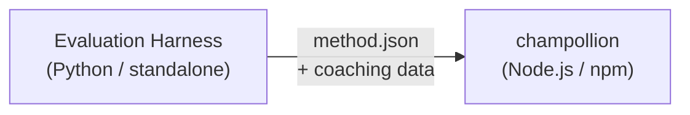

# Specificatie van de Methode-Plugin

> **Versie**: 1.1
> **Doelgroep**: Plugin-ontwikkelaars
> **Canoniek Schema**: [`shared/schemas/champollion-plugin.schema.json`](https://github.com/gamedaysuits/Champollion/blob/main/cli/shared/schemas/champollion-plugin.schema.json)

## Overzicht

champollion maakt gebruik van een **pluggable methodesysteem**. Elk taalpaar kan een andere vertaalmethode gebruiken (LLM, coached, script-converter, enz.). Methoden worden geregistreerd in `lib/translate.js` en per paar opgelost via `lib/pairs.js`.

De taak van de eval-harness is het **ontwikkelen, testen en exporteren** van vertaalmethoden. De taak van champollion is het **consumeren en uitvoeren** ervan. De plugin is **uitsluitend data** — configuratie, coaching-inhoud en benchmarkresultaten. Geen Python-code, geen harness-afhankelijkheden.

### Gegevensstroom



De harness ontwikkelt en test methoden in Python. Wanneer een methode gereed is voor implementatie, exporteert de harness een `method.json`-manifest en optionele coaching-databestanden. Champollion installeert en voert de methode uit met behulp van zijn eigen ingebouwde methode-implementaties.

---

## Formaat van de Methode-Plugin

Een methode-plugin bestaat uit één JSON-bestand (`method.json`) met optionele coaching-databestanden.

### `method.json` — Verplicht

```json
{
  "name": "french-formal-v1",
  "type": "llm-coached",
  "version": "1.0.0",
  "description": "Formally-tuned French with terminology enforcement and grammar coaching",
  "author": "Plugin Author",

  "config": {
    "model": "google/gemini-3.5-flash",
    "temperature": 0.2,
    "batchSize": 80,
    "register": "formal",
    "coachingFile": null,
    "coachingPrompt": null,
    "promptContext": null,
    "qualityTier": null
  },

  "locales": ["fr"],

  "benchmarks": {
    "fr": {
      "date": "2026-05-11T00:00:00Z",
      "corpus_size": 500,
      "exact_match_rate": 0.42,
      "corpus_chrf": 72.3,
      "corpus_bleu": 45.1,
      "model": "google/gemini-3.5-flash",
      "harness_version": "1.0.0"
    }
  },

  "provenance": {
    "resources": [],
    "commercialReady": false,
    "flags": ["license-unclear"]
  },

  "coaching": {
    "dir": "coaching"
  }
}
```

### Veldreferentie

| Veld | Type | Verplicht | Beschrijving |
|-------|------|----------|-------------|
| `name` | string | ✅ | Unieke methode-identifier (kebab-case) |
| `type` | string | ✅ | Champollion-methodetype: `llm`, `llm-coached`, `api`, `google-translate`, `deepl`, `microsoft-translator`, `libretranslate`, `openai`, `anthropic`, `gemini` |
| `version` | string | ✅ | Semver-versie (bijv. `1.0.0`) |
| `locales` | string[] | ✅ | Welke localecodes deze methode als doel heeft (minimaal 1) |
| `description` | string | — | Leesbare beschrijving voor mensen |
| `author` | string | — | Wie deze methode heeft ontwikkeld/getest |
| `config.model` | string | — | OpenRouter-modelidentifier |
| `config.temperature` | number | — | LLM-temperatuur (0,0–2,0, standaard: 0,3) |
| `config.batchSize` | number | — | Sleutels per API-batch (1–200, standaard: 80) |
| `config.register` | string \| null | — | Register/toon van de doeltaal (vooringestelde sleutel of vrije tekst) |
| `config.coachingFile` | string \| null | — | Pad naar het vrije-tekst coaching-promptbestand (relatief ten opzichte van de projectroot) |
| `config.coachingPrompt` | string \| null | — | Opgeloste coaching-prompttekst (gelezen uit `coachingFile` tijdens uitvoering) |
| `config.promptContext` | string \| null | — | Toepassingscontext die in de systeemprompt wordt ingevoegd (bijv. "E-commerce productbeschrijvingen") |
| `config.qualityTier` | string \| null | — | Kwaliteitsniveau op basis van benchmarkevaluatie (`standard`, `high`, `research`, `verified`) |
| `benchmarks` | object | — | Benchmarkresultaten per locale afkomstig van de eval-harness |
| `provenance` | object | — | Licentie- en resource-afhankelijkheden |
| `coaching.dir` | string | — | Relatief pad naar de coaching-datamap |

:::info[Canonieke MethodConfig-structuur]
Het `config`-blok maakt gebruik van het **canonieke MethodConfig-schema** — dezelfde 8 velden die worden gebruikt in `champollion.config.json`, harness-runcards, `mt-eval export-config` en leaderboard-publicatie/-installatie. Alle velden zijn altijd aanwezig; ongebruikte waarden zijn `null`. Dit garandeert probleemloze uitwisseling tussen evaluatie en productie.
:::

### Benchmarkobject (per locale)

| Veld | Type | Verplicht | Beschrijving |
|-------|------|----------|-------------|
| `date` | string | ✅ | ISO 8601-tijdstempel van de benchmarkrun |
| `corpus_size` | number | ✅ | Aantal geëvalueerde vermeldingen |
| `exact_match_rate` | number | ✅ | 0,0–1,0, aandeel exacte overeenkomsten |
| `corpus_chrf` | number | — | chrF++-score (0–100) |
| `corpus_bleu` | number | — | BLEU-score (0–100) |
| `model` | string | ✅ | Model gebruikt tijdens de evaluatie |
| `harness_version` | string | ✅ | Versie van de gebruikte evaluatieharness |

:::info[Welke statistieken worden weergegeven?]
Het `champollion status`-commando geeft **chrF++** en de **exacte-overeenkomstrate** uit het benchmarkblok weer. `corpus_bleu` wordt geaccepteerd in het manifest, maar wordt momenteel niet weergegeven of gebruikt door enig champollion-commando. Het [Methode-leaderboard](/leaderboard) houdt chrF++, exacte overeenkomst en FST-acceptatierate bij.
:::

---

### Provenanceobject

Het provenance-blok communiceert de licentiestatus van de gebundelde resources van de plugin.

| Veld | Type | Standaard | Beschrijving |
|-------|------|---------|-------------|
| `resources` | object[] | `[]` | Lijst van gebundelde resources met `name`, `license` en `type` |
| `commercialReady` | boolean | `false` | Of de plugin is goedgekeurd voor commerciële distributie |
| `flags` | string[] | `["license-unclear"]` | Machineleesbare statusvlaggen |

**Standaardstatus** — geëxporteerde plugins worden geleverd met `commercialReady: false` en `flags: ["license-unclear"]`.

**Goedgekeurde status** — wanneer de licentie is geverifieerd: stel `commercialReady: true` in en verwijder de vlaggen.

---

## Formaat van Coaching-data

Als `type` gelijk is aan `llm-coached`, dient de plugin coaching-databestanden op te nemen in de submap `coaching/`.

### `coaching/<locale>.json`

```json
{
  "grammar_rules": [
    "French adjectives agree in gender and number with the noun they modify",
    "Use 'vous' for formal contexts, 'tu' for informal"
  ],
  "dictionary": {
    "dashboard": "tableau de bord",
    "deployment": "déploiement",
    "settings": "paramètres"
  },
  "style_notes": "Prefer active voice. Avoid anglicisms where a native French term exists."
}
```

| Veld | Type | Verplicht | Beschrijving |
|-------|------|----------|-------------|
| `grammar_rules` | string[] | — | Regels die in elke LLM-prompt voor deze locale worden ingevoegd |
| `dictionary` | object | — | Term → vertaalkaart. Overeenkomende termen worden ingevoegd als verplichte terminologie. |
| `style_notes` | string | — | Vrije stijlinstructies die aan de prompt worden toegevoegd |

---

## Mapstructuur

```
french-formal-v1/
  method.json                 # Method manifest with benchmarks
  coaching/
    fr.json                   # Coaching data for French
```

Voor methoden met meerdere locales:

```
european-formal-v2/
  method.json                 # locales: ["fr", "de", "es", "it"]
  coaching/
    fr.json
    de.json
    es.json
    it.json
```

---

## Hoe Champollion Plugins Verwerkt

### Installatie

```bash
champollion plugin install ./french-formal-v1/
```

Wordt opgeslagen in `.champollion/methods/french-formal-v1/`.

### Configuratie

```json title="champollion.config.json"
{
  "pairs": {
    "en:fr": {
      "methodPlugin": "french-formal-v1"
    }
  }
}
```

:::info[Samenvoegingssemantiek]
De plugin definieert *welke* methode gebruikt wordt (`type`). De paarconfiguratie stelt in *hoe* deze wordt uitgevoerd (`model`, `register`, `batchSize`). Als het paar `model` instelt, overschrijft dit de standaardwaarde van de plugin.
:::

### Uitvoering

1. Champollion leest `method.json` uit `.champollion/methods/french-formal-v1/`
2. Het veld `type` van de plugin stelt de vertaalmethode in (bijv. `llm-coached`)
3. Laadt coaching-data uit de map `coaching/` van de plugin
4. Gebruikt het `config`-blok om ontbrekende waarden voor model/register/temperatuur aan te vullen
5. Het `benchmarks`-blok wordt weergegeven in de uitvoer van `champollion status`
6. Het `provenance`-blok wordt gecontroleerd door `champollion provenance` op licentiëringsvlaggen

---

## Schemavalidatie

Plugin-manifesten worden bij installatie gevalideerd aan de hand van [`shared/schemas/champollion-plugin.schema.json`](https://github.com/gamedaysuits/Champollion/blob/main/cli/shared/schemas/champollion-plugin.schema.json).

Verwijs naar het schema in uw `method.json` voor automatisch aanvullen in de IDE:

```json
{
  "$schema": "./node_modules/champollion/shared/schemas/champollion-plugin.schema.json",
  "name": "my-method-v1"
}
```

---

## Wat NIET op te nemen

- ❌ Geen Python-code of harness-afhankelijkheden
- ❌ Geen ruwe corpusdata of uitvoeringslogboeken
- ❌ Geen API-sleutels of inloggegevens
- ❌ Geen harness-configuratie
- ❌ Geen interne promptsjablonen (die bevinden zich in de methode-implementaties van champollion)

De plugin is **uitsluitend data**: configuratie, coaching-inhoud en benchmarkresultaten.

---

## Zie ook

- [Vertaalmethoden](/docs/guides/translation-methods) — hoe elke ingebouwde methode werkt
- [Configuratie](/docs/getting-started/configuration) — configuratie per paar en per taal
- [Een methode via API aanbieden](/docs/guides/serving-a-method) — methoden hosten als HTTP-services
- [Kookboek: FST-Gated Pipeline](/docs/network/tutorials/fst-gated-pipeline) — een pipeline bouwen en verpakken
- [MT-evaluatie](/docs/network/leaderboard/rules) — methoden benchmarken voor indiening op het leaderboard
- [Ondersteuning van een taal met weinig resources](/docs/network/community/low-resource-languages) — de use case voor community-plugins
