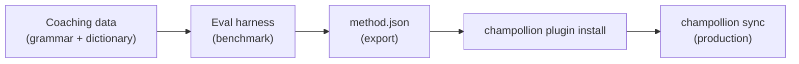

# Tutorial: Bouw een Vertaalplugin

Bouw een aangepaste vertaalmethode van nul af aan, benchmark deze, en implementeer hem als een champollion-plugin. Dit is de volledige workflow voor het toevoegen van een nieuw taalpaar dat geen kant-en-klare API ondersteunt.

**Wat u bouwt:** Een gecoachte vertaalplugin voor formeel Frans met afgedwongen terminologie, grammaticaregels en benchmarkscores.

**Tijd:** 30–45 minuten

**Vereisten:**
- champollion geïnstalleerd (`npm install --save-dev champollion`)
- Een OpenRouter API-sleutel (`OPENROUTER_API_KEY`)
- Python 3.10+ (voor de evaluatieomgeving)

---

## Stap 1: Identificeer het Probleem

U vertaalt een SaaS-dashboard naar het Frans. De standaard `llm`-methode produceert correcte maar inconsistente vertalingen:

- Soms wordt "dashboard" "tableau de bord," andere keren "panneau de contrôle"
- De toon wisselt tussen de `tu`- en `vous`-vorm
- Technische termen worden inconsistent geanglicaniseerd

U hebt **terminologiehandhaving** en **registercontrole** nodig die de generieke LLM-prompt niet biedt.

## Stap 2: Maak Coachingdata Aan

Maak een coachingbestand aan dat uw taalkundige vereisten vastlegt:

```bash
mkdir -p .champollion/coaching
```

```json title=".champollion/coaching/fr.json"
{
  "grammar_rules": [
    "Always use the 'vous' form for formal register",
    "French adjectives agree in gender and number with their noun",
    "Use the present tense for UI instructions, not the imperative",
    "Preserve sentence-final punctuation style from the source"
  ],
  "dictionary": {
    "dashboard": "tableau de bord",
    "deployment": "déploiement",
    "settings": "paramètres",
    "environment variable": "variable d'environnement",
    "webhook": "webhook",
    "API key": "clé API",
    "sign in": "se connecter",
    "sign out": "se déconnecter",
    "repository": "dépôt",
    "pull request": "demande de tirage"
  },
  "style_notes": "Formal technical French. Prefer native French terms over anglicisms where established equivalents exist. Keep UI labels concise — 3 words maximum where possible."
}
```

**Wat elk veld doet:**
- **`grammar_rules`** — Wordt als expliciete beperkingen in de LLM-systeemprompt ingevoegd
- **`dictionary`** — Wordt vergeleken met bronsleutels; wanneer een woordenboekterm voorkomt, wordt deze als "vereiste terminologie" in de prompt ingevoegd
- **`style_notes`** — Wordt als algemene stijlrichtlijnen aan de systeemprompt toegevoegd

## Stap 3: Configureer het Taalpaar

Geef champollion de opdracht `llm-coached` te gebruiken voor Frans:

```json title="champollion.config.json"
{
  "version": 3,
  "inputLocale": "en",
  "localesDir": "./locales",
  "pairs": {
    "en:fr": {
      "method": "llm-coached",
      "model": "google/gemini-3.5-flash",
      "temperature": 0.2
    }
  },
  "languages": {
    "fr": {
      "register": "Formal technical French (vous-form)",
      "name": "French"
    }
  }
}
```

## Stap 4: Test Het

```bash
npx champollion sync --dry
```

Bekijk de dry-run-uitvoer. Controleer of:
- ✅ Woordenboektermen consistent worden gebruikt ("tableau de bord," niet "panneau de contrôle")
- ✅ De `vous`-vorm doorlopend wordt gebruikt
- ✅ Technische termen overeenkomen met uw woordenboek

Voer vervolgens de echte synchronisatie uit:

```bash
npx champollion sync
```

## Stap 5: Benchmark met de Evaluatieomgeving (Optioneel)

Als u kwaliteitsscores wilt — en dat wilt u, omdat plugins worden geleverd met benchmarkdata — gebruik dan de bijbehorende evaluatieomgeving.

### Installeer de Evaluatieomgeving

```bash
pip install mt-eval-harness
```

### Maak een Referentiecorpus Aan

Maak een bestand aan met bronreeksen en bekende goede vertalingen:

```json title="corpus/french-formal.json"
[
  {
    "source": "Dashboard",
    "reference": "Tableau de bord"
  },
  {
    "source": "Sign in to your account",
    "reference": "Connectez-vous à votre compte"
  },
  {
    "source": "Your deployment is ready",
    "reference": "Votre déploiement est prêt"
  },
  {
    "source": "Environment variables",
    "reference": "Variables d'environnement"
  }
]
```

### Voer de Benchmark Uit

```bash
mt-eval test \
  --corpus corpus/french-formal.json \
  --source en \
  --target fr \
  --model google/gemini-3.5-flash \
  --temperature 0.2 \
  --champollion-config champollion.config.json
```

De evaluatieomgeving geeft als uitvoer:
- **chrF++** — F-score op tekenniveau (0–100). Boven 70 is sterk.
- **BLEU** — N-gram-overlap (0–100). Boven 40 is solide voor gecoachte vertaling.
- **Exacte overeenkomstpercentage** — Het aandeel vertalingen dat exact overeenkomt met de referentie.
- **COMET** — Neurale kwaliteitsmetriek (indien geïnstalleerd via `mt-eval setup --comet`).

:::tip[Test Wat U Implementeert]
Het gebruik van `--champollion-config` importeert uw productiemodel, register, temperatuur en coachingdata rechtstreeks vanuit uw `champollion.config.json`. Dit zorgt ervoor dat u precies de methode benchmarkt die u gaat implementeren.
:::

### Exporteer de Plugin

Zodra u tevreden bent met de scores:

```bash
mt-eval export \
  --name french-formal-v1 \
  --report eval/logs/harness/run_report.json \
  --output ./french-formal-v1/
```

Dit maakt aan:

```
french-formal-v1/
├── method.json          # Manifest with config + benchmarks
└── coaching/
    └── fr.json          # Your coaching data
```

## Stap 6: Installeer de Plugin in Champollion

```bash
npx champollion plugin install ./french-formal-v1/
```

Dit kopieert de plugin naar `.champollion/methods/french-formal-v1/`.

Werk uw configuratie bij om deze te gebruiken:

```json title="champollion.config.json"
{
  "pairs": {
    "en:fr": {
      "methodPlugin": "french-formal-v1"
    }
  }
}
```

## Stap 7: Verifieer

```bash
# Check plugin is installed and shows benchmark scores
npx champollion status

# Run a sync with the plugin
npx champollion sync

# Audit licensing status
npx champollion provenance
```

De `status`-uitvoer toont:

```
en → fr
  Method:    french-formal-v1 (llm-coached)
  Model:     google/gemini-3.5-flash
  Quality:   high
  chrF++:    74.2
  BLEU:      46.8
  Exact:     42%
```

## Wat U Heeft Gebouwd



U beschikt nu over:
1. **Coachingdata** — Grammaticaregels en terminologie die consistentie afdwingen
2. **Benchmarkscores** — Gekwantificeerde kwaliteit die met de plugin wordt meegeleverd
3. **Een draagbare plugin** — `method.json` + coachingdata, installeerbaar op elke machine
4. **Productie-implementatie** — Geïntegreerd in uw synchronisatiepipeline

## Volgende Stappen

- **[Pluginspecificatie](/docs/reference/plugin-spec)** — Volledige referentie voor het manifestformaat
- **[Vertaalmethoden](/docs/guides/translation-methods)** — Vergelijk alle vier de methoden
- **[Talen met Beperkte Middelen](/docs/network/community/low-resource-languages)** — Pas dit patroon toe op talen zonder API-ondersteuning
- **[Vertaal 30 Talen](/docs/tutorials/translate-30-languages)** — Schaal uw project op naar een wereldwijd publiek
