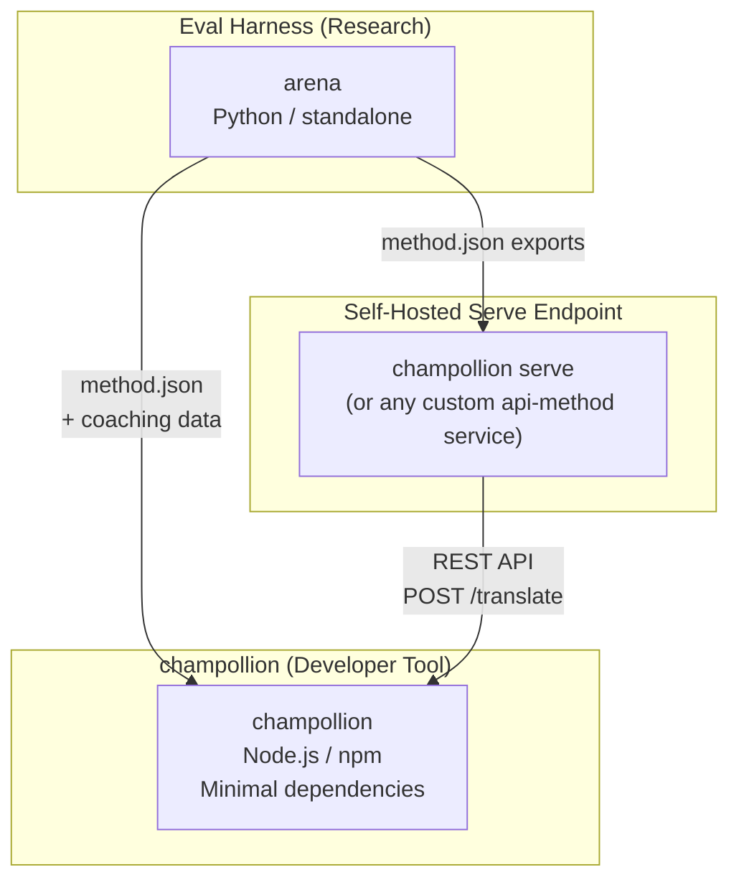
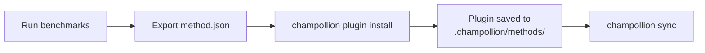
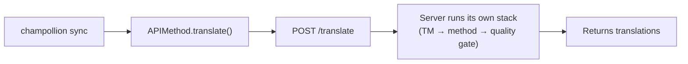
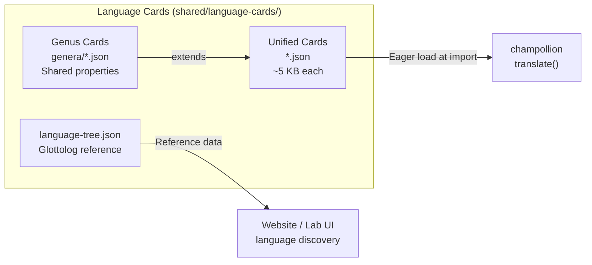

# Arquitetura

O ecossistema de tradução Champollion é composto por três ferramentas independentes que trabalham juntas através de contratos bem definidos. Nenhuma delas depende da outra em tempo de build. Elas se comunicam através de um **formato de plugin de método** compartilhado e um **contrato de API REST**.

## As Três Peças



### champollion (este projeto)

A ferramenta de desenvolvedor com código-fonte disponível (gratuita para uso não comercial). Traduz arquivos de localização usando métodos conectáveis. Dependências mínimas, configuração opcional, funciona de imediato.

**Métodos integrados:**
- `llm` → OpenRouter / qualquer LLM (200+ modelos)
- `llm-coached` → LLM + coaching de gramática/dicionário
- `openai` → API OpenAI direto (GPT-4o, GPT-4o-mini)
- `anthropic` → API Anthropic direto (Claude Sonnet, Haiku, Opus)
- `gemini` → API Google Gemini direto (Flash, Pro — camada gratuita disponível)
- `google-translate` → Google Cloud Translation API v2
- `deepl` → DeepL API com suporte a glossário
- `microsoft-translator` → Azure Cognitive Services Translator
- `libretranslate` → LibreTranslate auto-hospedado (AGPL, gratuito)
- `api` → Tubo fino para qualquer endpoint REST remoto

### Eval Harness (projeto complementar)

Uma ferramenta de pesquisa para desenvolver, testar e fazer benchmark de métodos de tradução. Quando um método atinge qualidade aceitável, o harness exporta um **plugin de método** — um manifesto `method.json` e arquivos de coaching opcionais.

O harness nunca é executado dentro do champollion. É uma ferramenta separada que produz saída estática (arquivos JSON). Champollion apenas lê esses arquivos.

[→ Eval Harness no GitHub](https://github.com/gamedaysuits/Champollion)

### Endpoint de serviço auto-hospedado (`champollion serve`)

Qualquer projeto champollion pode servir sua própria stack de tradução configurada via HTTP com um comando — [`champollion serve`](/docs/guides/serving-a-method#the-zero-code-path-champollion-serve) — e qualquer outro projeto pode consumi-la através do método `api`. Os prompts, dados de coaching, Memória de Tradução e chaves de provedor permanecem na infraestrutura do proprietário; os consumidores apenas enviam strings de origem e recebem traduções. Pipelines que vivem inteiramente fora do champollion (uma cadeia FST, um sistema de pesquisa) podem implementar o mesmo contrato como um [serviço personalizado](/docs/guides/serving-a-method). Não há serviço Champollion hospedado — o serviço é sempre auto-hospedado, por design.

## Como Eles Se Conectam

### Eval Harness → champollion (exportação unidirecional)



**Contrato**: [Especificação de Plugin](/docs/reference/plugin-spec)

### Endpoint de serviço → champollion (API em tempo de execução)



O `APIMethod` do Champollion é um **tubo burro**. Ele envia chaves e recebe traduções de volta. Contém zero lógica de tradução e zero conteúdo proprietário.

## O Que Cada Peça Sabe Sobre as Outras

| Ferramenta | Conhece o champollion? | Conhece um endpoint de serviço? | Conhece o harness? |
|------|---------------------|-------------------------------|---------------------|
| **champollion** | *(é o champollion)* | Sim — o método `api` o chama | Não — apenas lê as exportações do plugin |
| **Endpoint de serviço** | Sim — atende às suas requisições | *(é o endpoint de serviço)* | Não — instala métodos exportados como qualquer projeto |
| **Eval Harness** | Sim — exporta o formato de plugin | Não — métodos implantados separadamente | *(é o harness)* |

## Cenários de Usuário

### Cenário 1: Gratuito, zero-config (maioria dos usuários)

```bash
export OPENROUTER_API_KEY=sk-...
npx champollion sync
```

Usa o método `llm` integrado. Sem plugins, sem servidor, sem harness.

### Cenário 2: Baseline Google Translate

```bash
export GOOGLE_TRANSLATE_API_KEY=AIza...
npx champollion sync
```

Usa o método `google-translate` integrado. Sem plugins necessários.

### Cenário 3: Plugin aberto com coaching incluído

```bash
champollion plugin install ./french-formal-v1/
champollion sync
```

Plugin tem `type: "llm-coached"` → champollion usa a chave OpenRouter do usuário. Dados de coaching são locais (sem chamada de servidor).

### Cenário 4: Coaching DIY (sem plugin, sem harness)

```json title="champollion.config.json"
{
  "pairs": {
    "en:fr": { "method": "llm-coached" }
  }
}
```

Usuário mantém suas próprias regras de gramática e dicionário em `.champollion/coaching/fr.json`.

### Cenário 5: Consumir a stack servida de outro projeto

```bash
champollion plugin install ./their-project-serve/   # manifest from `champollion serve --emit-manifest`
CHAMPOLLION_API_KEY=<their bearer token> champollion sync
```

O método `api` do par faz um POST das strings de origem para o seu endpoint [`champollion serve`](/docs/guides/serving-a-method#the-zero-code-path-champollion-serve) auto-hospedado; a stack deles (coaching, TM, quality gate) faz a tradução.

## Cartões de Idioma

Cada idioma no champollion é configurado através de um **Cartão de Idioma** — um arquivo JSON unificado contendo presets de registro, regras de formalidade, sinalizadores de suporte de método, convenções tipográficas, classificação genealógica e dados de referência linguística.



Os cartões são carregados antecipadamente na importação. Cada cartão contém todos os metadados que o mecanismo de tradução e a documentação do desenvolvedor precisam — não há camada de referência separada. Os cartões são gerados a partir de fontes autoritárias (IANA, CLDR, [Glottolog](https://glottolog.org), [WALS](https://wals.info)) usando `scripts/generate-language-card.mjs` e `scripts/build-language-tree.mjs`, depois curados manualmente para precisão linguística.

## Princípios de Design

1. **Sem dependências circulares.** As pontes são de mão única.
2. **Champollion é o núcleo leve.** Dependências mínimas, configuração opcional. Plugins e API são aditivos.
3. **A proteção de IP é arquitetural.** Técnicas proprietárias permanecem no lado do serviço — quem executa o endpoint mantém seus prompts, coaching e chaves. O pacote npm não envia nada proprietário.
4. **O formato do plugin é o contrato.** Tudo flui através de `method.json`.
5. **Cada ferramenta tem um trabalho.** Harness → desenvolver métodos. `champollion serve` → hospedar métodos. Champollion → traduzir arquivos.

---

## Veja Também

- [Métodos de Tradução](/docs/guides/translation-methods) — como cada método integrado funciona
- [Especificação de Plugin](/docs/reference/plugin-spec) — o formato do manifesto method.json
- [Eval Harness](/docs/network/specifications/harness) — a ferramenta de pesquisa complementar
- [Servindo um Método via API](/docs/guides/serving-a-method) — hospedando pipelines de tradução customizados
- [Suportar um Idioma de Baixos Recursos](/docs/network/community/low-resource-languages) — o caso de uso que impulsionou esta arquitetura
