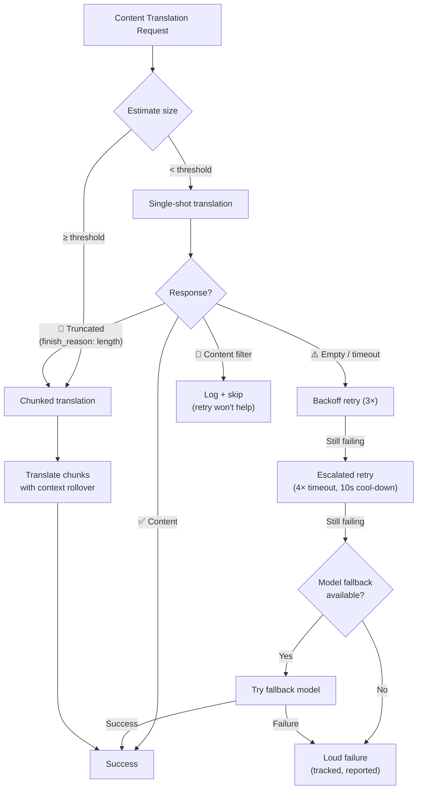

# Resiliência na Tradução de Conteúdo

O pipeline de tradução de conteúdo do Champollion (documentos Markdown/MDX) usa um sistema de resiliência em múltiplas camadas para lidar com falhas de forma elegante. Diferentemente da tradução de chave-valor — onde cada lote é pequeno e as tentativas são baratas — a tradução de conteúdo envolve prompts grandes e saídas longas que podem falhar por razões estruturais, não apenas transitórias.

## O Problema

A tradução de conteúdo tem modos de falha fundamentalmente diferentes da tradução de chave-valor:

| Modo de Falha | Chave-Valor | Conteúdo |
|---|---|---|
| Limite de taxa (429) | Comum, transitório | Comum, transitório |
| Timeout | Raro (lotes pequenos) | Comum (saída longa) |
| Resposta vazia | Raro | Comum (limites de saída, filtros) |
| Truncamento de saída | N/A (JSON validado) | Acontece silenciosamente |
| Filtro de conteúdo | Extremamente raro | Possível (docs CLI, docs de segurança) |
| Limitação do modelo | Retry corrige | Retry não vai corrigir |

O insight principal: **tentar novamente a mesma requisição que falhou não é redundância, é teimosia.** Um sistema de resiliência apropriado identifica *por que* algo falhou e muda sua abordagem de acordo.

## Visão Geral da Arquitetura



## Camada 1: Retry com Diagnóstico em Primeiro Lugar

Antes de decidir *como* tentar novamente, o sistema inspeciona a resposta da API para entender *o que* falhou.

### Análise do Finish Reason

Toda API de LLM retorna um `finish_reason` junto com o texto gerado. O Champollion usa isso para tomar decisões inteligentes de retry:

| `finish_reason` | Significado | Ação |
|---|---|---|
| `stop` + conteúdo | Modelo completou normalmente | ✅ Aceitar resultado |
| `stop` + vazio | Modelo não gerou nada | ⚠️ Tentar novamente (transitório) |
| `length` | Saída atingiu limite de tokens | 🔶 Auto-dividir o documento |
| `content_filter` | Filtro de segurança bloqueou saída | 🔴 Registrar e pular (retry não vai ajudar) |
| `null` / ausente | Resposta malformada | ⚠️ Tentar novamente (transitório) |

Isso substitui a abordagem atual de tratar toda falha de forma idêntica com retries com backoff.

### Orçamento de Retry

O orçamento padrão de retry para falhas transitórias:

| Rodada | Tentativas | Timeout | Backoff |
|---|---|---|---|
| Padrão | 4 (0→3) | 60s | 1s → 2s → 4s |
| Escalado | 4 (0→3) | 120s | 1s → 2s → 4s |
| **Total** | **8** | — | **~3.5 min pior caso** |

Entre rodadas, um cool-down de 10 segundos permite que problemas transitórios se resolvam.

## Camada 2: Divisão de Conteúdo

Quando um documento excede um limite de tamanho — ou quando a Camada 1 sinaliza truncamento de saída — o sistema divide o documento em chunks de tamanho traduzível.

Veja [Context Rollover](/docs/concepts/context-rollover#content-chunking) para configuração detalhada de chunking. Os pontos principais:

### Estratégia de Divisão

1. **Limites de heading** — `##` e `###` são limites naturais de unidades de tradução. Cada seção é auto-contida o suficiente para tradução independente.
2. **Fallback de parágrafo** — se uma única seção de heading exceder o tamanho do chunk, dividir em quebras duplas de linha.
3. **Divisão forçada** — último recurso para parágrafos extremamente longos (ex: tabelas). Dividir em limites de sentença.

### Contexto Entre Chunks

Cada chunk recebe os últimos 2-3 parágrafos da *tradução do chunk anterior* como contexto. Isso previne:
- **Desvio de terminologia** — o modelo vê o que chamou de "tableau de bord" no chunk anterior
- **Resolução de pronome** — antecedentes da seção anterior se propagam
- **Consistência de registro** — o tom estabelecido no chunk 1 persiste através do chunk N

### Triggers de Auto-Chunking

| Trigger | Comportamento |
|---|---|
| `contentChunkSize` definido na config | Sempre dividir docs que excedem esse tamanho |
| `finish_reason: "length"` retornado | Auto-dividir como fallback (mesmo sem config) |
| Input > ~12KB (auto-detectar) | Registrar sugestão, mas não forçar |

## Camada 3: Cadeia de Fallback de Modelo

Quando o modelo configurado falha consistentemente — não transitoriamente, mas estruturalmente — o sistema tenta modelos alternativos. Diferentes modelos têm diferentes janelas de contexto, limites de saída, filtros de segurança e forças multilíngues.

### Cadeia de Fallback Padrão

```json title="champollion.config.json"
{
  "contentFallbackChain": [
    "google/gemini-2.5-flash",
    "anthropic/claude-sonnet-4"
  ]
}
```

O modelo configurado é sempre tentado primeiro. Modelos de fallback são usados apenas após todas as rodadas de retry (padrão + escalado) serem esgotadas.

### Por Que Múltiplas Arquiteturas

| Cenário | Modelo Primário Falha | Modelo Fallback Sucede |
|---|---|---|
| Docs CLI em vietnamita | Gemini retorna vazio | Claude lida bem |
| Conteúdo filtrado por segurança | OpenAI bloqueia | Gemini tem limites de filtro diferentes |
| Tabelas estruturadas longas | Modelo A trunca | Modelo B tem janela de saída maior |

O valor do fallback é diversidade arquitetural — diferentes famílias de modelos têm diferentes modos de falha. Uma falha que é estrutural para um modelo pode ser trivial para outro.

### Escopo

> Fallback de modelo é **apenas para conteúdo**. Lotes de chave-valor são pequenos e quase nunca falham estruturalmente. Adicionar complexidade de fallback lá seria over-engineering.

## Camada 4: Contabilização de Falhas

Quando falhas ocorrem, o sistema as rastreia e relata adequadamente em vez de continuar silenciosamente.

### Durante Sync

- Itens falhados mostram `[FAIL]` na saída de progresso
- Cada falha registra a razão específica (timeout, resposta vazia, filtro de conteúdo, truncamento)
- Itens completados são salvos no manifest imediatamente (persistência incremental)

### Após Sync

Um resumo de falhas é impresso no final:

```
  ┌─ Content Translation Failures ─────────────────────────────────────┐
  │                                                                     │
  │  2 of 24 content translations failed:                              │
  │                                                                     │
  │  ✗ docs/reference/cli.md → vi                                      │
  │    Reason: empty response after 8 attempts + 1 fallback model      │
  │    Models tried: google/gemini-3.1-pro-preview, gemini-2.5-flash   │
  │                                                                     │
  │  ✗ docs/guides/troubleshooting.md → ar                             │
  │    Reason: content_filter (no retry — blocked by safety filter)    │
  │                                                                     │
  │  Re-run: npx champollion@latest sync                              │
  │  (22 completed translations are cached and won't re-run)           │
  └─────────────────────────────────────────────────────────────────────┘
```

### Manifest de Retry

Arquivos falhados são escritos em `.champollion-retry.json`:

```json
{
  "failedAt": "2026-05-27T21:45:00Z",
  "files": [
    {
      "source": "docs/reference/cli.md",
      "locale": "vi",
      "reason": "empty_response",
      "attempts": 8,
      "modelsTried": ["google/gemini-3.1-pro-preview", "google/gemini-2.5-flash"]
    }
  ]
}
```

Na próxima execução de `sync`, apenas esses arquivos são reprocessados. Arquivos completados são preservados via manifest de hash de conteúdo (`.champollion-content.lock`).

### Códigos de Saída

| Código | Significado |
|---|---|
| 0 | Todas as traduções tiveram sucesso |
| 1 | Erro de configuração, chave de API ausente, etc. |
| 2 | Falha parcial — algumas traduções de conteúdo falharam |

## Configuração

```json title="champollion.config.json"
{
  "contentChunkSize": 4000,
  "contentOverlap": 200,
  "contentFallbackChain": [
    "google/gemini-2.5-flash",
    "anthropic/claude-sonnet-4"
  ]
}
```

| Campo | Tipo | Padrão | Descrição |
|---|---|---|---|
| `contentChunkSize` | `number \| null` | `null` | Máximo de tokens por chunk de conteúdo. `null` = sem chunking (auto-chunks apenas em truncamento) |
| `contentOverlap` | `number` | `200` | Tokens de sobreposição entre chunks de conteúdo para continuidade de contexto |
| `contentFallbackChain` | `string[]` | `[]` | Modelos de fallback para tentar quando o modelo configurado falha estruturalmente |

## Status de Implementação

| Funcionalidade | Status |
|---|---|
| Retry com diagnóstico em primeiro lugar (parsing de finish_reason) | 🔲 Planejado |
| Divisão de conteúdo (split de heading/parágrafo) | 🔲 Planejado |
| Context rollover entre chunks | 🔲 Planejado |
| Cadeia de fallback de modelo | 🔲 Planejado |
| Relatório de resumo de falhas | 🔲 Planejado |
| Manifest de retry (.champollion-retry.json) | 🔲 Planejado |
| Código de saída 2 para falhas parciais | 🔲 Planejado |
| Retry de escalação (timeout estendido) | ✅ Implementado (v3.3.3) |
| Mensagens de retry numeradas por tentativa | ✅ Implementado (v3.3.3) |
| Falha ruidosa em erros de conteúdo | ✅ Implementado (v3.3.3) |

## Veja Também

- [Context Rollover](/docs/concepts/context-rollover) — consistência de batching e configuração de chunking de conteúdo
- [Como Sync Funciona](/docs/concepts/how-sync-works) — o pipeline de sync completo
- [Métodos de Tradução](/docs/guides/translation-methods) — métodos disponíveis e suas características
