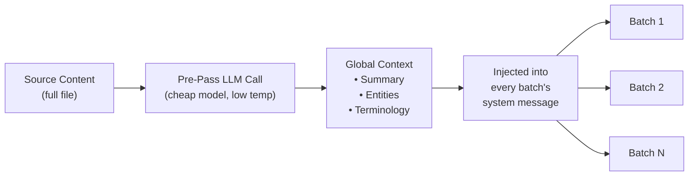

# Rollover de Contexto em Lotes

O rollover de contexto é um recurso de consistência de tradução em nível de documento que carrega uma janela de traduções anteriores para lotes subsequentes, dando ao LLM "memória de curto prazo" através dos limites dos lotes.

## Por Que Existe

Ao traduzir arquivos grandes (100+ chaves ou documentos Markdown longos), o champollion divide o trabalho em lotes. Sem rollover, cada lote é traduzido independentemente — o LLM não tem memória do que traduziu no lote anterior. Isso causa:

- **Desvio de terminologia**: O mesmo termo em inglês é traduzido de forma diferente entre lotes (ex: "dashboard" → "tableau de bord" no lote 1, "panneau" no lote 3)
- **Falha de correferência**: Pronomes e referências que atravessam limites de lotes perdem seu antecedente
- **Inconsistência de registro**: O tom pode mudar entre lotes (formal → informal → formal)

Este é um problema bem documentado na literatura de MT. A abordagem de janela deslizante é validada por pesquisas em tradução automática em nível de documento (ACL, workshops WMT).

## Como Funciona

### A Janela Deslizante

Quando `contextRollover` está ativado, o pipeline de tradução mantém uma janela de pares chave-valor traduzidos recentemente. Após cada lote ser concluído, uma porção de sua saída (padrão: 20% de `batchSize`) é carregada para o prompt do próximo lote como "traduções de referência".

```
Batch 1: Translate keys 1-80         → LLM sees: system prompt + keys 1-80
Batch 2: Translate keys 81-160       → LLM sees: system prompt + [16 reference translations from batch 1] + keys 81-160
Batch 3: Translate keys 161-240      → LLM sees: system prompt + [16 reference translations from batch 2] + keys 161-240
```

As traduções de referência são injetadas na mensagem do usuário com um rótulo claro:

```
--- Previous translations for context (do NOT re-translate these) ---
"nav.dashboard": "Tableau de bord"
"nav.settings": "Paramètres"
"header.welcome": "Bienvenue sur la plateforme"
---

{
  "content.main_heading": "Getting Started with Your Dashboard",
  ...
}
```

### Estratégia de Seleção

Dois modos para escolher quais traduções carregar adiante:

| Estratégia | Comportamento | Melhor Para |
|----------|----------|----------|
| `tail` (padrão) | Últimas N traduções do lote anterior | Documentos sequenciais, conteúdo Markdown |
| `diverse` | Seleciona entradas cobrindo diferentes tipos de chave (botões, títulos, descrições) | Arquivos JSON grandes com tipos de elementos de UI mistos |

### Orçamento de Tokens

A janela de rollover consome tokens de entrada. O Champollion calcula o custo aproximado de tokens e avisa se a janela exceder 15% da janela de contexto estimada do modelo. O aviso inclui uma redução sugerida:

```
[WARN] Rollover window is ~2400 tokens (18% of model context).
       Consider reducing rolloverSize to 0.15 or lowering batchSize.
```

## Pré-Passagem de Contexto Global

Uma chamada LLM de primeira passagem opcional que é executada **antes** da tradução começar. O LLM analisa o conteúdo de origem completo e produz:

1. **Resumo do Documento** — descrição de 2-3 frases do que está sendo traduzido
2. **Entidades Nomeadas** — nomes de produtos, termos técnicos e nomes próprios com tratamento sugerido
3. **Lista de Consistência de Terminologia** — termos-chave que o LLM identificou como exigindo tradução consistente

Este contexto global é injetado na **mensagem do sistema** de cada lote, dando a cada lote consciência do documento completo mesmo que veja apenas uma fatia.



### Modelo de Pré-Passagem

A extração de contexto global usa uma chamada LLM separada e barata (padrão: `google/gemini-3.5-flash` com temperatura 0.1) independentemente do modelo de tradução configurado pelo usuário. Esta é uma tarefa de extração de metadados, não uma tarefa de tradução — velocidade e custo importam mais do que saída criativa.

## Chunking de Conteúdo {#content-chunking}

Para documentos Markdown longos (tradução de conteúdo), o corpo pode exceder a janela de contexto efetiva do LLM, ou o modelo pode truncar sua saída. O chunking de conteúdo divide o documento em segmentos sobrepostos que são cada um traduzidos independentemente, depois remontados.

### Estratégia de Divisão

O chunking segue uma cascata de prioridades — tenta o ponto de divisão semanticamente mais significativo primeiro:

1. **Limites de títulos** — marcadores `##` e `###` criam unidades de tradução naturais. Cada seção é autossuficiente o bastante para tradução independente, e títulos dão ao LLM contexto estrutural sobre o que está traduzindo.
2. **Limites de parágrafos** — se uma única seção de título exceder o tamanho do chunk, divida em quebras duplas de linha (`\n\n`). Parágrafos são o próximo melhor limite porque representam pensamentos completos.
3. **Limites de sentenças** — último recurso para parágrafos extremamente longos (ex: tabelas grandes, prosa densa). Divide em limites de ponto-espaço respeitando abreviações.

Blocos protegidos (cercas de código, shortcodes — veja [Como Sync Funciona](/docs/concepts/how-sync-works)) nunca são divididos entre chunks. Se um bloco protegido seria cortado, o ponto de divisão se move antes ou depois dele.

### Gatilhos de Auto-Chunking

O chunking é ativado de duas formas:

| Gatilho | Comportamento |
|---------|----------|
| `contentChunkSize` definido na config | Faz chunking proativo de todos os docs excedendo essa contagem de tokens |
| Modelo retorna `finish_reason: "length"` | Auto-chunks como fallback, mesmo sem config |

O gatilho de fallback significa que o chunking funciona como uma rede de segurança mesmo se você não configurar — se o modelo truncar, o champollion automaticamente tenta novamente com chunks.

### Configuração

- **`contentChunkSize`**: Máximo de tokens por chunk (padrão: null = enviar corpo completo; defina para ex: 4000 para documentos longos)
- **`contentOverlap`**: Sobreposição em tokens entre chunks (padrão: 200). A sobreposição garante transições suaves nos limites dos chunks.

Quando o chunking está ativo, o context rollover se aplica automaticamente entre chunks — a saída traduzida do último parágrafo do chunk anterior é adicionada ao prompt do próximo chunk.

```json title="champollion.config.json"
{
  "contentChunkSize": 4000,
  "contentOverlap": 200
}
```

> Para o sistema completo de resiliência de tradução de conteúdo (retry diagnóstico, fallback de modelo, contabilidade de falhas), veja [Resiliência de Conteúdo](/docs/concepts/content-resilience).

## Configuração

### Início Rápido

```json title="champollion.config.json"
{
  "contextRollover": true,
  "globalContext": true,
  "contentChunkSize": 4000,
  "contentOverlap": 200
}
```

### Opções Completas

```json title="champollion.config.json (advanced)"
{
  "contextRollover": {
    "size": 0.2,
    "strategy": "tail",
    "maxTokens": null
  },
  "globalContext": {
    "model": "google/gemini-3.5-flash",
    "maxEntities": 20,
    "temperature": 0.1
  },
  "contentChunkSize": 4000,
  "contentOverlap": 200,
  "contentFallbackChain": [
    "google/gemini-2.5-flash",
    "anthropic/claude-sonnet-4"
  ]
}
```

| Campo | Tipo | Padrão | Descrição |
|-------|------|---------|-------------|
| `contextRollover` | `boolean \| object` | `false` | Ativar rollover de janela deslizante |
| `contextRollover.size` | `number` | `0.2` | Fração de `batchSize` a carregar adiante (0.0–1.0) |
| `contextRollover.strategy` | `string` | `"tail"` | Estratégia de seleção: `"tail"` ou `"diverse"` |
| `contextRollover.maxTokens` | `number \| null` | `null` | Limite máximo no orçamento de tokens de rollover |
| `globalContext` | `boolean \| object` | `false` | Ativar pré-passagem de contexto global |
| `globalContext.model` | `string` | `"google/gemini-3.5-flash"` | Modelo para a chamada de pré-passagem |
| `globalContext.maxEntities` | `number` | `20` | Máximo de entidades nomeadas a extrair |
| `globalContext.temperature` | `number` | `0.1` | Temperatura para a chamada de pré-passagem |
| `contentChunkSize` | `number \| null` | `null` | Máximo de tokens por chunk de conteúdo (null = sem chunking) |
| `contentOverlap` | `number` | `200` | Tokens de sobreposição entre chunks de conteúdo |
| `contentFallbackChain` | `string[]` | `[]` | Modelos de fallback para tradução de conteúdo quando o modelo configurado falha estruturalmente |

## Quando Usar

| Cenário | Recomendação |
|----------|---------------|
| Arquivos JSON pequenos (< 50 chaves) | Não necessário — lote único, sem problemas de limite |
| Arquivos JSON grandes (100+ chaves) | Ativar `contextRollover` para consistência de terminologia |
| Documentos Markdown longos | Ativar `contextRollover` + `contentChunkSize` + `globalContext` |
| Documentação técnica | Ativar `globalContext` para extração de entidades |
| Strings de UI com registro misto | Usar `contextRollover` com `strategy: "diverse"` |

## Status de Implementação

| Recurso | Status |
|---------|--------|
| Rollover de janela deslizante (chave-valor) | 🔲 Planejado |
| Rollover de janela deslizante (conteúdo) | 🔲 Planejado |
| Pré-passagem de contexto global | 🔲 Planejado |
| Chunking de conteúdo | 🔲 Planejado |
| Auto-chunking em truncação | 🔲 Planejado |
| Estratégia de seleção `diverse` | 🔲 Planejado |

## Literatura

Este recurso é fundamentado em pesquisas publicadas sobre tradução automática em nível de documento:

- **Abordagem de janela deslizante**: Validada para melhorar pontuações BLEU, chrF e COMET ao usar LLMs para tradução (workshops ACL 2023–2025 sobre MT em nível de documento)
- **Fusão multi-conhecimento**: Injetar resumos de documentos e listas de entidades como contexto global melhora a consistência de terminologia em documentos longos
- **Prompting Ciente de Contexto (CAP)**: Selecionar contexto relevante via pontuações de atenção ou similaridade semântica para aprendizado em contexto

## Veja Também

- [Resiliência de Conteúdo](/docs/concepts/content-resilience) — retry diagnóstico, fallback de modelo e contabilidade de falhas
- [Como Sync Funciona](/docs/concepts/how-sync-works) — o pipeline de lotes que o rollover aumenta
- [Dados de Coaching](/docs/concepts/coaching-data) — recurso complementar para injeção de gramática/dicionário
- [Memória de Tradução](/docs/concepts/translation-memory) — o cache de TM que funciona junto com o rollover
