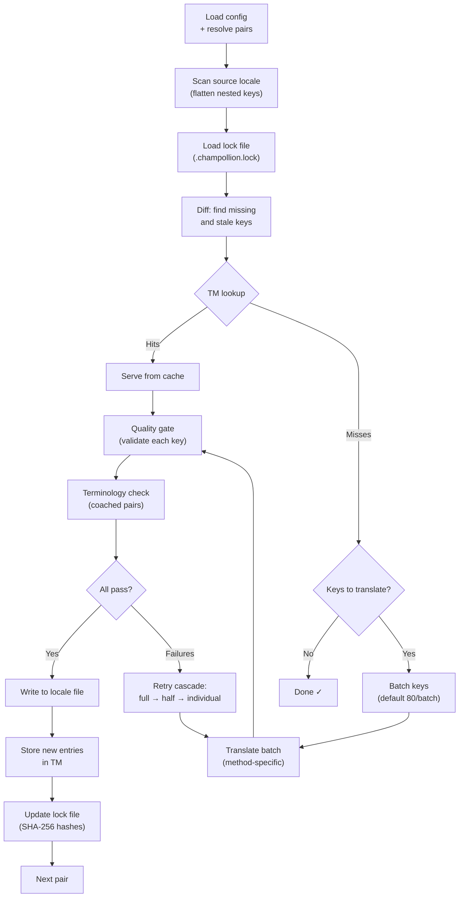

# Como a Sincronização Funciona

O comando `sync` é a operação central do Champollion. Aqui está o que acontece quando você executa `npx champollion sync`.

## Visão Geral do Pipeline



## Passo a Passo

### 1. Resolução de Configuração

Champollion carrega `champollion.config.json` (ou detecta automaticamente as configurações). Ele resolve:
- Locale de origem e locales de destino
- O grafo de pares (quais combinações origem→destino processar)
- Configurações de método, modelo e qualidade por par

Antes de escanear arquivos, champollion imprime um cabeçalho de inicialização:

```
champollion v0.1.0

[INFO] Detected format: json (auto)
[INFO] Detected framework: Hugo
```

- **Banner de versão**: Mostra a versão instalada para depuração e relatórios de problemas.
- **Detecção de formato**: Relata o formato do arquivo e se foi detectado automaticamente `(auto)` ou configurado explicitamente `(config)`. Suporta `json`, `toml` e `yaml`.
- **Detecção de framework**: Quando `contentDir` está definido, identifica o framework (`Hugo`) para confirmar que a sincronização de conteúdo está ativa.

### 2. Escaneamento da Origem

O arquivo de locale de origem é carregado e achatado em um mapa chave→valor:

```json
// Input (nested)
{ "hero": { "title": "Welcome", "subtitle": "Build" } }

// Flattened
{ "hero.title": "Welcome", "hero.subtitle": "Build" }
```

### 3. Detecção de Mudanças

Champollion lê `.champollion.lock`, que armazena hashes SHA-256 dos valores de origem traduzidos anteriormente. Para cada chave, ele verifica:

| Condição | Ação |
|----------|------|
| Chave ausente do destino | **Traduzir** |
| Hash da origem mudou desde a última sincronização | **Re-traduzir** (desatualizado) |
| Valor de destino começa com `[EN]` | **Re-traduzir** (marcador de fallback legado) |
| Hash da origem inalterado, chave existe | **Pular** |

É por isso que champollion traduz apenas o que mudou — não está re-traduzindo seu arquivo inteiro a cada sincronização.

### 4. Agrupamento em Lotes

As chaves são agrupadas em lotes (padrão: 80 chaves/lote para LLM, 128 para Google Translate). O agrupamento reduz viagens de API enquanto mantém os prompts gerenciáveis.

Durante a tradução, champollion exibe uma barra de progresso inline que se atualiza após cada lote ser concluído:

```
[INFO] fr.json — 2,847 missing
     ████████████████░░░░░░░░░░░░░░░░ 1,440/2,847 keys
```

A barra é renderizada usando `\r` retorno de carro para atualizações no local — sem rolagem. Suprimida em modos `--quiet` e `--json`.

### 4b. Memória de Tradução

Antes do agrupamento, champollion verifica o cache de Memória de Tradução (`.champollion/tm.json`). Chaves cujo texto de origem + locale + método correspondem a uma tradução anterior são servidas instantaneamente do cache — nenhuma chamada de API necessária.

```
  [TM] 142 key(s) served from cache
  Translating 3 key(s) to French (llm)... [OK]
```

TM é o mecanismo principal de economia de custos. Re-executar sincronização após uma única mudança de chave traduz apenas essa chave, não o arquivo inteiro. Veja [Memória de Tradução](/docs/concepts/translation-memory) para detalhes.

Para contornar o cache em uma única execução: `champollion sync --no-tm`

### 5. Tradução

Cada lote é enviado para o método de tradução configurado:

- **`llm`**: Prompt estruturado para OpenRouter com instruções de registro e orientação de gênero
- **`llm-coached`**: O mesmo, mas com regras gramaticais, dicionário e notas de estilo injetadas
- **`google-translate`**: API Google Cloud Translation v2 requisição em lote
- **`api`**: HTTP POST para um endpoint remoto

A mensagem do sistema (registro, orientação de gênero, regras) é idêntica entre lotes para um determinado locale, habilitando **cache de prompt** — provedores como Anthropic e Google armazenam em cache mensagens de sistema repetidas, reduzindo custos de tokens.

### 6. Portão de Qualidade

Cada tradução é validada antes de ser escrita no disco. Cinco verificações são executadas:

| Verificação | O que detecta | Exemplo |
|-------------|--------------|---------|
| **Vazio/em branco** | Modelo não retornou nada | `""` |
| **Echo da origem** | Modelo retornou a entrada em inglês | `"Welcome"` para japonês |
| **Loop de alucinação** | Trigramas repetidos | `"Qo' Qo' Qo' Qo'"` |
| **Inflação de comprimento** | Saída é 4×+ mais longa que a origem | Origem de 10 caracteres → saída de 50 caracteres |
| **Conformidade de script** | Script errado para o locale | Texto latino para locale árabe |

Falhas são registradas com um prefixo `[GATE]`. Sem fallbacks silenciosos.

Veja [Portão de Qualidade](/docs/concepts/quality-gate) para detalhes.

### 6b. Verificação de Terminologia

Para pares treinados com um dicionário, champollion verifica se o LLM realmente usou a terminologia necessária após a tradução. Violações são registradas como avisos `[TERM]`:

```
[TERM] en→fr: 2 term violation(s)
  • "dashboard" → expected "tableau de bord" but got "panneau"
```

Estes são avisos, não erros bloqueadores — a tradução ainda é escrita.

### 7. Cascata de Repetição

Em falha de análise JSON ou erros em nível de lote, champollion tenta novamente com lotes progressivamente menores:

```
Full batch (80 keys) → Failed
  └→ Half batch (40 keys) → 1 failure
      └→ Individual keys (1 each) → Isolates the problem key
```

O orçamento de repetição é limitado por `maxRetries` (padrão: 3) para evitar gastos de tokens descontrolados.

### 8. Escrita e Bloqueio

As traduções aprovadas são escritas no arquivo de locale de destino, preservando a estrutura de aninhamento original. O arquivo de bloqueio é atualizado com novos hashes SHA-256.

### 9. Verificação

Após todos os pares serem processados, champollion relê os arquivos de locale escritos do disco e executa uma passagem de verificação (a menos que `--no-verify` esteja definido). Isso detecta a lacuna entre o relatório de sucesso da sincronização e as chaves estarem erradas na prática:

- **Paridade de chaves** — todas as chaves de origem presentes em cada destino
- **Marcadores de fallback `[EN]`** — marcadores legados de execuções anteriores
- **Traduções vazias** — valores em branco que passaram despercebidos
- **Conformidade de script** — locales não-latinos com traduções apenas ASCII
- **Preservação de placeholder** — placeholders ICU correspondem à origem
- **Problemas de codificação** — marcadores BOM, caracteres invisíveis

Isso também está disponível como um comando `champollion verify` autônomo para gates de CI.

## Tradução de Conteúdo (Fase 2)

Para projetos Docusaurus e Hugo, `sync` executa uma segunda fase após a tradução de chaves JSON. Esta fase traduz arquivos Markdown e MDX (docs, posts de blog, tutoriais) usando os mesmos métodos e portão de qualidade.

### Como funciona

1. Champollion descobre todos os arquivos de conteúdo de origem (`.md`, `.mdx`) caminhando pelo diretório de conteúdo/docs
2. Para cada par arquivo × locale, ele verifica um arquivo de bloqueio de conteúdo separado (`.champollion-content.lock`) para mudanças de hash SHA-256
3. Arquivos alterados ou ausentes são coletados em um pool de itens de trabalho plano
4. O pool é processado com **concorrência paralela** (padrão: 12 chamadas de API simultâneas)

```
Phase 2: content (79 translations to process, 341 skipped, concurrency: 48)

    [1/79] (1%)  docs/concepts/security.md → ja [RE-TRANSLATE] (~3328s left)
    [2/79] (3%)  docs/concepts/security.md → th [RE-TRANSLATE] (~1821s left)
    ...
    [79/79] (100%) blog/v3-2-quality.md → de [OK]

  [OK] Created 79 content file(s), 341 unchanged
```

### Paralelismo

Tanto a Fase 1 (chaves JSON) quanto a Fase 2 (conteúdo) agora são executadas em paralelo:

- **Fase 1**: Todas as traduções de locale disparam simultaneamente (padrão: 50 locales simultâneos). Dentro de cada locale, lotes de API também são executados em paralelo (4 lotes simultâneos). Uma sincronização de 12 locales com 120 chaves é concluída em ~1 minuto em vez de ~15 minutos.
- **Fase 2**: Todas as combinações arquivo×locale são traduzidas como um pool plano (padrão: 12 chamadas de API simultâneas). Diferentes arquivos e diferentes locales são traduzidos simultaneamente.

Controle o paralelismo com `--json-concurrency`, `--content-concurrency` ou `--concurrency` (define ambos):

```bash
# Faster JSON sync (more parallel locale translations)
npx champollion sync --json-concurrency 30

# Faster content sync (more parallel API calls)
npx champollion sync --content-concurrency 20

# Slower (gentler on rate limits)
npx champollion sync --concurrency 4
```

### Proteção de conteúdo

Durante a tradução, champollion protege conteúdo não-traduzível:

- **Blocos de código** (cercados e indentados) são substituídos por placeholders
- **Campos de frontmatter** não na lista `translatableFields` são preservados como estão
- **Links**, caminhos de imagem e tags HTML são protegidos
- **Shortcodes** e variáveis de interpolação (por exemplo, `{count}`, `{{.Params.title}}`) são protegidos

Após a tradução, todos os placeholders são restaurados e validados. Se algum estiver faltando ou corrompido, a tradução é rejeitada e tentada novamente.

## Sucesso Parcial

Um lote falhado não bloqueia o resto. Se 9 de 10 lotes forem bem-sucedidos, esses 9 são escritos. O lote falhado é registrado e você pode re-executar `sync` para tentar novamente.

## Execução Seca

Visualize o que mudaria sem escrever nenhum arquivo:

```bash
npx champollion sync --dry-run
```

## Forçar Re-tradução

Force chaves específicas a serem re-traduzidas mesmo se inalteradas:

```bash
npx champollion sync --force-keys "hero.title,nav.about"
```

## Estimativa de Custo

Antes de traduzir, champollion gera um **relatório de custo pré-sincronização** mostrando custos estimados por par. Isso é executado automaticamente durante cada `sync` — você o vê antes de qualquer chamada de API ser feita.

```
╔══════════════════════════════════════════════════════════╗
║  Cost Estimate                                          ║
╠════════════╦═══════╦════════════╦════════════════════════╣
║ Pair       ║ Keys  ║ Est. Cost  ║ Method                 ║
╠════════════╬═══════╬════════════╬════════════════════════╣
║ en → fr    ║   142 ║ $0.07      ║ google-translate       ║
║ en → ja    ║    38 ║   —        ║ llm (model-dependent)  ║
║ en → crk   ║    38 ║   —        ║ llm-coached            ║
╚════════════╩═══════╩════════════╩════════════════════════╝
```

### O Que É Estimado

Cada método de tradução fornece sua própria estimativa de custo:

| Método | Base de Custo | Precisão |
|--------|--------------|----------|
| `google-translate` | Taxa publicada pelo Google ($20/milhão de caracteres) | Preciso |
| `llm` | Varia por modelo OpenRouter | Dependente do modelo — verifique [preços OpenRouter](https://openrouter.ai/models) |
| `llm-coached` | Mesmo que `llm` mais tokens de contexto de treinamento | Dependente do modelo |
| `api` | Determinado pelo servidor | Desconhecido — não é possível estimar sem consultar o endpoint |

Quando um método não consegue determinar o custo (métodos LLM, APIs remotas), champollion relata `—` em vez de adivinhar. Use `--dry` para ver estimativas de custo sem realmente traduzir.

---

## Veja Também

- [Referência CLI — sync](/docs/reference/cli#sync) — flags e opções de comando
- [Memória de Tradução](/docs/concepts/translation-memory) — cache e economia de custos
- [Portão de Qualidade](/docs/concepts/quality-gate) — como as traduções são validadas
- [Métodos de Tradução](/docs/guides/translation-methods) — como cada método funciona
- [Trabalhando com Tradutores Profissionais](/docs/guides/professional-translators) — fluxo de trabalho XLIFF
- [Configuração](/docs/getting-started/configuration) — referência de configuração
- [Guia CI/CD](/docs/guides/ci-cd) — automatizando sincronizações em seu pipeline
