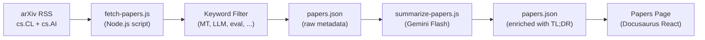

# Feed de Artigos de Pesquisa

Champollion mantém um feed curado de artigos de pesquisa em tradução automática e PLN do arXiv, filtrados e resumidos para profissionais. O feed é semi-automatizado: artigos são buscados e filtrados diariamente, resumidos por IA e publicados no site.

## Por Que Existe

O pipeline de tradução do champollion é construído sobre técnicas de pesquisas publicadas — register-steered prompting, coaching data injection, context rollover, quality gates. O feed de Papers serve três propósitos:

1. **Transparência**: Usuários podem ver a pesquisa que respalda cada funcionalidade
2. **Descoberta**: Novas técnicas publicadas no arXiv podem informar futuras funcionalidades ou configurações de usuário
3. **Comunidade**: Posiciona champollion como uma ferramenta informada por pesquisa, não apenas outro wrapper de API

## Arquitetura



### Etapas do Pipeline

#### 1. Busca (Diária)

`scripts/fetch-papers.js` consulta a API Atom do arXiv para artigos recentes em:
- `cs.CL` (Computation and Language)
- `cs.AI` (Artificial Intelligence)

Retorna: título, autores, resumo, ID do arXiv, link do PDF, data de publicação, categorias.

#### 2. Filtro

Artigos são filtrados por relevância de palavras-chave. Um artigo deve corresponder a pelo menos uma palavra-chave primária:

**Palavras-chave primárias** (deve corresponder a ≥1):
- `machine translation`, `neural machine translation`, `NMT`
- `LLM`, `large language model`
- `multilingual`, `cross-lingual`
- `document-level translation`
- `low-resource language`, `endangered language`
- `translation evaluation`, `BLEU`, `COMET`, `chrF`
- `tokenization`, `morphology`, `polysynthetic`
- `context window`, `sliding window`
- `prompt engineering` (em contexto de tradução)

**Palavras-chave de reforço** (aumentam a pontuação de relevância):
- `i18n`, `internationalization`, `localization`
- `few-shot`, `in-context learning`
- `terminology`, `glossary`, `consistency`
- `quality estimation`, `hallucination`

#### 3. Resumir (Assistido por IA)

`scripts/summarize-papers.js` processa artigos novos (não resumidos):

Para cada artigo, envia o resumo para Gemini 3.5 Flash com:
```
Read this ML research abstract and produce:
1. A 2-sentence TL;DR accessible to a software developer (not a researcher)
2. A single bullet: "Why this matters for MT" — how could this technique
   improve machine translation quality, cost, or speed in production?

Abstract: {abstract}
```

A saída é armazenada de volta em `papers.json` junto com os metadados brutos.

#### 4. Publicar

A página Papers do Docusaurus (`website/src/pages/papers.js`) renderiza `papers.json` como uma grade de cards filtrável e paginada.

Cada card exibe:
- **Título** (vinculado ao arXiv)
- **Autores** (primeiros 3 + "et al.")
- **Data** (publicação ou última atualização)
- **TL;DR** (gerado por IA)
- **Por que importa** (gerado por IA)
- **Categorias** (tags do arXiv)
- **Link do PDF**

### Automação

Um workflow do GitHub Actions executa o pipeline diariamente:

```yaml title=".github/workflows/fetch-papers.yml"
name: Fetch MT Research Papers
on:
  schedule:
    - cron: '0 6 * * *'  # 06:00 UTC daily
  workflow_dispatch: {}   # Manual trigger

jobs:
  fetch:
    runs-on: ubuntu-latest
    steps:
      - uses: actions/checkout@v4
      - uses: actions/setup-node@v4
        with:
          node-version: 20
      - run: node scripts/fetch-papers.js
      - run: node scripts/summarize-papers.js
        env:
          GEMINI_API_KEY: ${{ secrets.GEMINI_API_KEY }}
      - name: Commit if changed
        run: |
          git config user.name "github-actions[bot]"
          git config user.email "github-actions[bot]@users.noreply.github.com"
          git add website/src/data/papers.json
          git diff --cached --quiet || git commit -m "chore: update research papers feed"
          git push
```

## Schema de Dados

```typescript
interface Paper {
  id: string;           // arXiv ID (e.g., "2406.12345")
  title: string;
  authors: string[];
  abstract: string;
  published: string;    // ISO date
  updated: string;      // ISO date
  pdfUrl: string;
  categories: string[];
  primaryCategory: string;

  // Computed by filter
  relevanceScore: number;
  matchedKeywords: string[];

  // Computed by summarizer (null until processed)
  tldr: string | null;
  whyItMatters: string | null;
  summarizedAt: string | null;
}
```

## Localizações de Arquivos

| Arquivo | Propósito |
|---------|-----------|
| `scripts/fetch-papers.js` | Buscador RSS do arXiv e filtro de palavras-chave |
| `scripts/summarize-papers.js` | Resumização por IA via Gemini |
| `website/src/data/papers.json` | Dados de artigos (commitados no repositório) |
| `website/src/pages/papers.js` | Componente da página Docusaurus |
| `website/src/pages/papers.module.css` | Estilos da página |
| `.github/workflows/fetch-papers.yml` | Automação diária |

## Status de Implementação

| Funcionalidade | Status |
|----------------|--------|
| `fetch-papers.js` (busca + filtro do arXiv) | 🔲 Planejado |
| `summarize-papers.js` (resumo por IA) | 🔲 Planejado |
| Página de Papers (componente React) | 🔲 Planejado |
| Workflow do GitHub Actions | 🔲 Planejado |
| Filtragem de categoria/palavra-chave na página | 🔲 Planejado |
| Paginação | 🔲 Planejado |

## Veja Também

- [Arquitetura](/docs/concepts/architecture) — como os componentes do champollion se relacionam
- [Context Rollover](/docs/concepts/context-rollover) — uma funcionalidade diretamente informada por este feed de pesquisa
