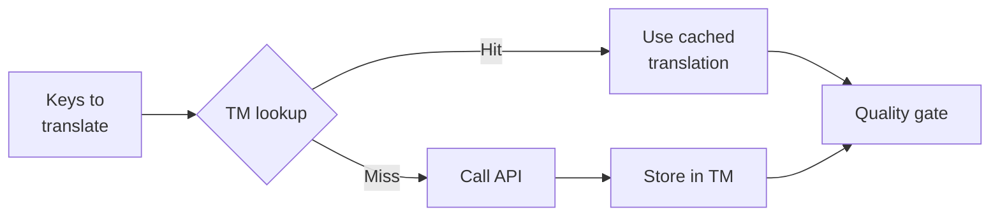

# Memória de Tradução

Translation Memory (TM) é a camada de cache integrada do champollion. Ela armazena cada tradução indexada por texto de origem + locale + método, então executar `sync` apenas chama a API para chaves que realmente mudaram.

## Por que TM Existe

Sem TM, cada `sync` retraduz cada chave modificada — mesmo que você já tenha traduzido o mesmo texto em inglês para a mesma locale em uma execução anterior. Cenários comuns onde isso desperdiça dinheiro:

| Cenário | Sem TM | Com TM |
|---------|--------|--------|
| Re-executar sync após 1 mudança de chave (500 chaves × 10 locales) | 5.000 chamadas de API | 10 chamadas de API |
| Reverter uma chave para um valor anterior em inglês | Chamada de API completa | Acerto de cache instantâneo |
| Mesma frase aparece em 3 arquivos de locale | 3 × chamadas de API | 1 chamada de API + 2 acertos de cache |
| Dry-run → sync real | Chamadas de API completas em ambos | Primeira execução cacheia, segunda reutiliza |

TM é **habilitado por padrão** e não requer configuração. Traduções são cacheadas automaticamente durante cada `sync` e servidas em execuções subsequentes.

## Como Funciona

### Chave de Cache

Cada entrada de TM é indexada por um hash SHA-256 de três valores:

```
SHA-256( sourceValue + '\x00' + locale + '\x00' + method )
```

| Componente | Por que está na chave |
|------------|----------------------|
| `sourceValue` | Texto em inglês diferente → tradução diferente |
| `locale` | "Hello" traduz diferente para francês vs japonês |
| `method` | Saída do Google Translate ≠ saída do GPT-4o |

O separador de byte nulo (`\x00`) previne colisão entre `"ab" + "c"` e `"a" + "bc"`.

### Durante Sync



1. Antes de chamar a API de tradução, champollion particiona chaves em **acertos de TM** e **falhas de TM**
2. Acertos são servidos instantaneamente do cache — sem chamada de API, sem latência, sem custo
3. Falhas passam pelo pipeline de tradução normal
4. Novas traduções da API são armazenadas em TM para execuções futuras
5. Todas as traduções (cacheadas + novas) passam pela porta de qualidade

### Armazenamento

TM é armazenado em `.champollion/tm.json` na raiz do seu projeto. O arquivo usa JSON compacto (sem formatação) para manter o tamanho gerenciável. Cada entrada armazena:

| Campo | Descrição |
|-------|-----------|
| `t` | O texto traduzido |
| `ts` | Timestamp ISO-8601 de quando foi cacheado |
| `l` | Código de locale de destino (para estatísticas/filtragem) |
| `m` | Nome do método de tradução (para estatísticas/filtragem) |

Com 50 idiomas × 500 chaves = 25.000 entradas, o arquivo deve ter ~2-3 MB.

## Gerenciando o Cache

### Ver Estatísticas

```bash
champollion tm stats
```

Mostra contagem de entradas, tamanho do arquivo e um detalhamento por locale:

```
  Translation Memory — .champollion/tm.json

  Entries:      2,847
  File size:    1.2 MB
  Created:      2026-05-20
  Last entry:   2026-05-24

  By locale:
    fr       482 entries  (llm: 380, llm-coached: 102)
    de       471 entries  (llm: 471)
    ja       465 entries  (llm: 465)
```

### Limpar o Cache

```bash
# Clear everything (with confirmation prompt)
champollion tm clear

# Clear without prompt (CI environments)
champollion tm clear --yes

# Clear only one locale
champollion tm clear --locale fr
```

### Pular TM para Uma Execução

```bash
# Force fresh API calls for all keys (useful when switching providers)
champollion sync --no-tm
```

Isso não deleta o cache — apenas o ignora para esta execução e não armazena novos resultados.

## Quando TM Não Ajuda

TM não produzirá um acerto de cache quando:

- **Texto de origem mudou** — o hash muda, então é uma falha
- **Método mudou** — mudar de `llm` para `google-translate` significa chaves de cache diferentes
- **Primeira execução** — inicialização a frio, sem entradas ainda
- **Flag `--no-tm`** — explicitamente ignora o cache

## Você Deve Fazer Commit de `.champollion/tm.json`?

**Geralmente não.** TM é otimização local para desenvolvedores. É preenchido automaticamente durante sync e apenas ajuda ao re-executar sync na mesma máquina. Porém, você pode considerar fazer commit se:

- Sua equipe compartilha um único runner de CI que sincroniza traduções
- Você quer builds reproduzíveis sem chamadas de API
- Você está arquivando traduções para conformidade

Adicione `.champollion/tm.json` a `.gitignore` para uso típico.

---

## Veja Também

- [How Sync Works](/docs/concepts/how-sync-works) — onde TM se encaixa no pipeline
- [CLI Reference — tm](/docs/reference/cli#tm) — referência de comando
- [CLI Reference — sync --no-tm](/docs/reference/cli#sync) — ignorando TM
