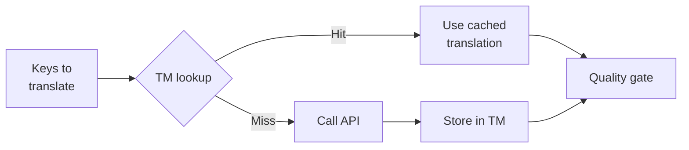

# Memória de Tradução

Translation Memory (TM) é a camada de cache integrada do champollion. Ela armazena cada tradução indexada por texto de origem + locale + método, então executar `sync` apenas chama a API para chaves que realmente mudaram.

## Por que TM Existe

Sem TM, cada `sync` retraduz cada chave modificada — mesmo que você já tenha traduzido o mesmo texto em inglês para a mesma locale em uma execução anterior. Cenários comuns onde isso desperdiça dinheiro:

| Cenário | Sem TM | Com TM |
|---------|--------|--------|
| Re-executar sync após 1 mudança de chave (500 chaves × 10 locales) | 5.000 chamadas de API | 10 chamadas de API |
| Reverter uma chave para um valor anterior em inglês | Chamada de API completa | Acerto de cache instantâneo |
| Mesma frase aparece em 3 arquivos de locale | 3 × chamadas de API | 1 chamada de API + 2 acertos de cache |
| Dry-run → sync real | Chamadas de API completas em ambos | Primeira execução cacheia, segunda reutiliza |

TM é **habilitado por padrão** e não requer configuração. Traduções são cacheadas automaticamente durante cada `sync` e servidas em execuções subsequentes.

## Como Funciona

### Chave de Cache

Cada entrada de TM é indexada por um hash SHA-256 de três valores:

```
SHA-256( sourceValue + '\x00' + locale + '\x00' + method )
```

| Componente | Por que está na chave |
|------------|----------------------|
| `sourceValue` | Texto em inglês diferente → tradução diferente |
| `locale` | "Hello" traduz diferente para francês vs japonês |
| `method` | Saída do Google Translate ≠ saída do GPT-4o |

O separador de byte nulo (`\x00`) previne colisão entre `"ab" + "c"` e `"a" + "bc"`.

O `sourceValue` é o texto a partir do qual a chave é traduzida, incluindo quaisquer outros elementos que permitam distinguir dois textos idênticos:

- **Contexto gettext.** Uma entrada com um `msgctxt` é armazenada em cache com seu contexto: "Open" (verbo) e "Open" (adjetivo) são duas entradas diferentes.
- **Formas plurais que o idioma de origem não possui.** O i18next armazena plurais como chaves com sufixo, e um idioma de destino pode ter formas que o de origem não possui: francês e espanhol adicionam `count_many`, que é traduzido a partir do texto em inglês `count_other`. As duas chaves enviam o mesmo texto, mas formas diferentes são solicitadas ao modelo (`"2 recettes"` e `"1 000 000 de recettes"`), portanto cada uma recebe sua própria entrada: `count_other` mantém a forma comum, e `count_many` é armazenada em cache sob o texto somado à sua forma. O mesmo se aplica a qualquer forma traduzida a partir do texto de outra categoria (árabe `_zero`, `_two`, `_few`, `_many`; russo `_few`, `_many`; formas ordinais).
- **`msgid_plural` do gettext e plurais ARB / ICU** são uma mensagem por chave (todas as formas em um único valor), portanto continuam sendo uma única entrada.

Antes da versão 0.4.0, uma forma emprestada compartilhava a entrada da forma a partir da qual é traduzida, e a entrada mantinha a resposta gravada por último, de modo que `--redo all` podia gravar uma forma em ambas as chaves. Um cache dessa época é reparado conforme é utilizado. Quando a entrada compartilhada contém o texto da forma emprestada, ela é movida para a entrada própria dessa forma, e a outra forma é traduzida novamente na próxima vez em que entrar na fila. Caso contrário, a entrada permanece com a forma da qual ela foi emprestada, e a forma emprestada é enviada ao modelo uma única vez, na primeira vez em que entrar na fila (a execução informa isso). `champollion verify` emite um aviso quando uma forma emprestada contém exatamente o texto da forma da qual foi emprestada e o cache não indica que o modelo escreveu dessa maneira. Alguns idiomas de fato escrevem duas formas de maneira idêntica, por isso trata-se de um aviso; `--redo keys:<key>` solicita novamente.

### Durante Sync


```mermaid
flowchart LR
    A["Keys to\ntranslate"] --> B{"TM lookup"}
    B -->|Hit| C["Use cached\ntranslation"]
    B -->|Miss| D["Call API"]
    D --> E["Store in TM"]
    C --> F["Quality gate"]
    E --> F
```

1. Antes de chamar a API de tradução, champollion particiona chaves em **acertos de TM** e **falhas de TM**
2. Acertos são servidos instantaneamente do cache — sem chamada de API, sem latência, sem custo
3. Falhas passam pelo pipeline de tradução normal
4. Novas traduções da API são armazenadas em TM para execuções futuras
5. Todas as traduções (cacheadas + novas) passam pela porta de qualidade

### Armazenamento

TM é armazenado em `.champollion/tm.json` na raiz do seu projeto. O arquivo usa JSON compacto (sem formatação) para manter o tamanho gerenciável. Cada entrada armazena:

| Campo | Descrição |
|-------|-----------|
| `t` | O texto traduzido |
| `ts` | Timestamp ISO-8601 de quando foi cacheado |
| `l` | Código de locale de destino (para estatísticas/filtragem) |
| `m` | Nome do método de tradução (para estatísticas/filtragem) |

Com 50 idiomas × 500 chaves = 25.000 entradas, o arquivo deve ter ~2-3 MB.

## Gerenciando o Cache

### Ver Estatísticas

```bash
champollion tm stats
```

Mostra contagem de entradas, tamanho do arquivo e um detalhamento por locale:

```
  Translation Memory — .champollion/tm.json

  Entries:      2,847
  File size:    1.2 MB
  Created:      2026-05-20 09:14 MDT
  Last entry:   2026-05-24 17:52 MDT

  By locale:
    fr       482 entries
               380  llm · model google/gemini-3.8-flash · register formal-vous
               102  llm-coached · model google/gemini-3.8-flash · register formal-vous · coaching 3f2a9c1b
    de       471 entries
               471  llm · model google/gemini-3.8-flash · register formal-Sie
    ja       465 entries
               465  llm · model google/gemini-3.8-flash · register polite
```

As datas estão no horário local desta máquina, com o fuso horário indicado (`--json`
também inclui os timestamps em UTC armazenados como `createdAt` e `lastEntryAt`).
Cada linha sob um locale indica o que gerou essas entradas: o método, o modelo e
o registro (e uma impressão digital do texto de coaching, para cada método cujo
prompt o contenha: `llm`, `local`, `openai`, `anthropic`, `gemini`,
`llm-coached`; o `coachingFile` próprio de um par, idioma ou fallback é lido
para isso, e seu texto é o que conta, não o seu caminho). Dois
modelos sob um único locale geralmente indicam uma troca de modelo; `champollion status`
informa se os próprios arquivos de locale agora misturam o texto dos dois modelos.

### Limpar o Cache

```bash
# Clear everything (with confirmation prompt)
champollion tm clear

# Clear without prompt (CI environments)
champollion tm clear --yes

# Clear only one locale
champollion tm clear --locale fr
```

### Pular TM para Uma Execução

```bash
# Fresh API calls for everything queued (useful when debugging quality)
champollion sync --redo all --fresh     # --fresh = --no-tm
```

Isso não exclui o cache e não o lê nesta execução — mas o que a execução traduz (e paga por) continua sendo armazenado, para que a próxima execução use o cache novamente.

## Trocando de modelo

**Como trocar.** O modelo é uma configuração em `champollion.config.json`: edite `"model"` (e `"defaultMethod"` quando o método também mudar), ou o `"model"` específico de um par em `"pairs"`. O próximo `champollion sync` irá utilizá-lo.

`sync --model <name>` (e `--method <name>`) definem um modelo para **apenas uma execução**: o arquivo não é alterado, o sync informa isso e o próximo `sync` comum volta a usar o modelo configurado. O que essa execução traduziu permanece nos arquivos. Uma sincronização comum posterior indica quais traduções foram geradas por outro modelo, oferecendo dois caminhos: mantê-las tornando esse modelo o configurado (defina `"model"` para ele — nada é enviado) ou fazer o modelo configurado traduzi-las (o comando de refazer que ele exibe, com o respectivo preço). `champollion status` informa o mesmo. Não é necessário executar `champollion init` novamente para fazer a troca; `init --force` reescreve apenas o que suas flags especificam e mantém todas as outras configurações ([Referência da CLI](/docs/reference/cli#init)).

Mudar de modelo não descarta o seu cache. Quando uma string não tem uma entrada sob o novo modelo, o sync reutiliza a tradução feita sob o modelo anterior, desde que o método, o registro e o coaching permaneçam inalterados. As entradas reutilizadas passam pelas mesmas verificações de qualidade que qualquer outro cache hit. Antes da estimativa de custo, o sync informa quantas traduções serão reutilizadas e qual modelo as gerou — o mesmo ocorre em uma simulação (dry run) e também após a conclusão da troca: uma string revertida para um texto que apenas o modelo anterior traduziu recebe a tradução desse modelo, e a execução informa isso antes da estimativa.

Para fazer o novo modelo traduzi-las (ele envia as chaves que um modelo
anterior traduziu; o que o novo modelo já traduziu continua vindo do
cache):

```bash
champollion sync --redo all --fresh-on-model-change
```

Isoladamente, `--fresh-on-model-change` afeta apenas as chaves que a execução já
traduziria de qualquer forma (chaves novas ou alteradas). Após uma retradução completa, o sync deixa de
anunciar a troca de modelo para esse idioma. As chaves para as quais as respostas do novo modelo
falharam são registradas como **pendentes** em `.champollion.lock`: o próximo
`champollion sync` solicita essas chaves ao novo modelo mais uma vez (e não ao cache), e
a troca é concluída quando elas forem finalizadas. `champollion status` lista as chaves
pendentes e avisa quando os arquivos contêm texto de um modelo anterior — mesclado com o
atual, ou inteiramente ([Quality Gate](/docs/concepts/quality-gate#a-redo-that-could-not-finish)).
Ele sabe qual modelo escreveu cada valor porque o sync registra isso em
`.champollion.lock` (o modelo que respondeu ou aquele cuja tradução em cache
foi servida). Para valores gravados antes da versão 0.4.0, ele recorre ao
cache e exibe "model unknown" quando dois modelos armazenaram o mesmo texto em cache. Um
`champollion sync` comum sem nada para traduzir informa, em uma linha por idioma,
quando os arquivos foram gravados por um modelo diferente do configurado, exibindo o
comando acima.
Uma operação de refazer em massa nunca substitui uma tradução editada manualmente por uma pessoa no arquivo
([Editando traduções](/docs/guides/professional-translators#editing-key-value-files)).

Alterar o método, o registro ou o coaching ainda gera novas traduções, pois essas alterações existem justamente para obter um texto diferente. Quando chaves são enviadas ao modelo mesmo que o cache contenha traduções do mesmo texto geradas de outra forma (por exemplo, após trocar de `local` para `llm`), o sync informa isso uma vez por idioma, indicando o que as gerou — é por isso que a execução não mostra nada servido a partir do cache.

Uma alteração de método, registro ou coaching não retraduz nada por conta própria: uma sincronização comum (ou uma simulação) sem nada novo para traduzir mantém os arquivos como estão. Ela informa isso por idioma: quantos valores foram gerados por outro método, o comando redo para substituí-los (`champollion sync --pair en:fr --redo all`) e quanto isso custaria.

## Quando TM Não Ajuda

TM não produzirá um acerto de cache quando:

- **Texto de origem alterado** — o hash muda, resultando em cache miss
- **Método alterado** — alternar de `llm` para `google-translate` gera chaves de cache diferentes
- **Registro ou coaching alterados** — a chave de cache os inclui (uma alteração apenas no modelo é reutilizada; veja acima). O fallback de um par possui sua própria chave (método, modelo, registro, coaching): após alterá-lo, `sync` e `status` indicam os valores gravados pela configuração anterior e o comando de redo (`--redo all`; com `--fresh-on-model-change` apenas para troca de modelo). Caches gravados antes da versão 0.4.0 indexavam o coaching apenas para `llm-coached`; na primeira execução, as entradas criadas com o coaching que o par possui naquele momento são mantidas
- **Não fazem parte da chave:** o glossário e as regras gramaticais e notas de estilo de `llm-coached` — editá-los não retraduz nada que esteja em cache (`--redo keys:… --fresh` faz a solicitação novamente)
- **`--retranslate <glob>`** — os arquivos de conteúdo especificados são traduzidos do zero propositalmente
- **Primeira execução** — inicialização a frio (cold start), sem entradas ainda
- **`--no-tm` / `--fresh`** — ignora explicitamente o cache
- **Uma chave pendente** — uma chave que uma operação de refazer não conseguiu concluir é solicitada novamente ao modelo, não servida a partir do cache

O cache nunca decide se uma chave é *colocada na fila*: uma chave inalterada cuja tradução já esteja no arquivo é ignorada antes de qualquer busca (ela não é contabilizada como um cache hit). E uma chave recusada pelo quality gate para um modelo não é enviada novamente a esse modelo em uma sincronização comum — isso apenas cobraria pela mesma resposta ([retida](/docs/concepts/quality-gate#refused-keys-are-held-back)); o cache ainda é consultado para ela.

## Você Deve Fazer Commit de `.champollion/tm.json`?

**Geralmente não.** TM é otimização local para desenvolvedores. É preenchido automaticamente durante sync e apenas ajuda ao re-executar sync na mesma máquina. Porém, você pode considerar fazer commit se:

- Sua equipe compartilha um único runner de CI que sincroniza traduções
- Você quer builds reproduzíveis sem chamadas de API
- Você está arquivando traduções para conformidade

Adicione `.champollion/tm.json` a `.gitignore` para uso típico.

---

## Veja Também

- [How Sync Works](/docs/concepts/how-sync-works) — onde TM se encaixa no pipeline
- [CLI Reference — tm](/docs/reference/cli#tm) — referência de comando
- [CLI Reference — sync --no-tm](/docs/reference/cli#sync) — ignorando TM
