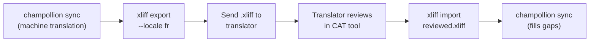

# Trabalhando com Tradutores Profissionais

Champollion gera traduções automáticas, mas alguns projetos precisam de revisão humana — conteúdo regulatório, cópia sensível à marca ou UI de alto risco. O fluxo XLIFF permite exportar traduções para revisão profissional e importá-las de volta perfeitamente.

## O que é XLIFF?

XLIFF (XML Localization Interchange File Format) é o formato de troca padrão da indústria para ferramentas de tradução. Toda ferramenta CAT (Computer-Assisted Translation) profissional suporta:

- **memoQ** — importar XLIFF, revisar em contexto, exportar arquivo revisado
- **SDL Trados Studio** — suporte nativo a XLIFF
- **Phrase (Memsource)** — fazer upload de jobs XLIFF para equipes de tradutores
- **Smartling** — pipeline de ingestão XLIFF
- **OmegaT** — ferramenta CAT gratuita/open-source com suporte a XLIFF

Champollion gera XLIFF 1.2 (a versão universalmente suportada) em vez de 2.0+ para máxima compatibilidade com ferramentas.

## O Fluxo



### Passo 1: Gerar Traduções Automáticas

Execute `sync` primeiro para obter uma tradução automática de base:

```bash
champollion sync
```

### Passo 2: Exportar XLIFF

Exporte o par origem + destino como XLIFF:

```bash
champollion xliff export --locale fr
```

Isso escreve `.champollion/xliff/fr.xliff` contendo:
- Cada chave de origem com seu valor em inglês
- A tradução automática atual (se houver) como `<target>`
- Chaves sem traduções marcadas como `state="new"`

```xml
<trans-unit id="hero.title" xml:space="preserve">
  <source>Welcome to our platform</source>
  <target state="translated">Bienvenue sur notre plateforme</target>
</trans-unit>
```

### Passo 3: Enviar para o Tradutor

Envie o arquivo `.xliff` para seu tradutor ou faça upload para sua plataforma CAT. O tradutor vê origem e destino lado a lado, e pode:

- Editar traduções automáticas
- Preencher traduções faltantes
- Sinalizar problemas de qualidade
- Aplicar sua própria memória de tradução e termbases

### Passo 4: Importar Arquivo Revisado

Quando o tradutor retorna o `.xliff` revisado, importe-o:

```bash
# Preview what will change
champollion xliff import .champollion/xliff/fr.xliff --dry

# Apply changes
champollion xliff import .champollion/xliff/fr.xliff
```

Saída:
```
  ✓ Imported 142 translations for fr
    Updated:    23 (changed from existing)
    Added:      0 (new keys)
    Unchanged:  119
    Written to: locales/fr.json
```

### Passo 5: Preencher Lacunas

Se novas chaves foram adicionadas após o XLIFF ser exportado, execute `sync` para traduzi-las:

```bash
champollion sync
```

Champollion traduz apenas chaves que ainda estão faltando — traduções revisadas da importação XLIFF são preservadas.

## Dicas

### Exportar Caminhos Personalizados

```bash
# Export to a specific directory
champollion xliff export --locale ja --out ./for-review/

# Export with a specific filename
champollion xliff export --locale de --out ./review/german.xliff
```

### Múltiplas Localidades

Exporte cada localidade separadamente:

```bash
for locale in fr de ja ko; do
  champollion xliff export --locale $locale
done
```

### Controle de Versão

Adicione `.champollion/xliff/` a `.gitignore` — arquivos XLIFF são artefatos transitórios, não fonte do projeto:

```gitignore
.champollion/xliff/
```

### Quando Usar XLIFF vs. Apenas `sync`

| Cenário | Recomendação |
|----------|---------------|
| App interno, 90%+ de qualidade aceitável | Apenas `sync` — tradução automática é suficiente |
| Cópia de marketing voltada para usuários | Exportar XLIFF para revisão humana |
| Conteúdo legal/regulatório | Exportar XLIFF — revisão humana obrigatória |
| 50+ localidades, prazo apertado | `sync` primeiro, exportação XLIFF apenas para as 5 principais localidades |
| Tradutor já usa ferramenta CAT | XLIFF é o formato natural de entrega |

---

## Veja Também

- [Referência CLI — xliff](/docs/reference/cli#xliff) — referência de comando
- [Memória de Tradução](/docs/concepts/translation-memory) — cache de traduções revisadas
- [Métodos de Tradução](/docs/guides/translation-methods) — opções de tradução automática
