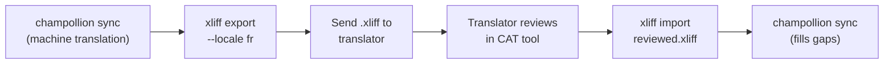

# Trabalhando com Tradutores Profissionais

Champollion gera traduções automáticas, mas alguns projetos precisam de revisão humana — conteúdo regulatório, cópia sensível à marca ou UI de alto risco. O fluxo XLIFF permite exportar traduções para revisão profissional e importá-las de volta perfeitamente.

O XLIFF abrange os **arquivos de strings** (chaves e valores) do seu aplicativo. O **Markdown** traduzido (newsletters, posts de blog, páginas de documentação) é revisado de forma diferente: o revisor edita o arquivo `.md` traduzido diretamente, e a sincronização mantém essas edições. Consulte [Revisando Markdown traduzido](#reviewing-translated-markdown) abaixo.

## O que é XLIFF?

XLIFF (XML Localization Interchange File Format) é o formato de troca padrão da indústria para ferramentas de tradução. Toda ferramenta CAT (Computer-Assisted Translation) profissional suporta:

- **memoQ** — importar XLIFF, revisar em contexto, exportar arquivo revisado
- **SDL Trados Studio** — suporte nativo a XLIFF
- **Phrase (Memsource)** — fazer upload de jobs XLIFF para equipes de tradutores
- **Smartling** — pipeline de ingestão XLIFF
- **OmegaT** — ferramenta CAT gratuita/open-source com suporte a XLIFF

Champollion gera XLIFF 1.2 (a versão universalmente suportada) em vez de 2.0+ para máxima compatibilidade com ferramentas.

## O Fluxo


```mermaid
flowchart LR
    A["champollion sync\n(machine translation)"] --> B["xliff export\n--locale fr"]
    B --> C["Send .xliff to\ntranslator"]
    C --> D["Translator reviews\nin CAT tool"]
    D --> E["xliff import\nreviewed.xliff"]
    E --> F["champollion sync\n(fills gaps)"]
```

### Passo 1: Gerar Traduções Automáticas

Execute `sync` primeiro para obter uma tradução automática de base:

```bash
champollion sync
```

### Passo 2: Exportar XLIFF

Exporte o par origem + destino como XLIFF:

```bash
champollion xliff export --locale fr
```

Isso escreve `.champollion/xliff/fr.xliff` contendo:
- Cada chave de origem com seu valor em inglês
- A tradução automática atual (se houver) como `<target>`
- Chaves sem traduções marcadas como `state="new"`

```xml
<trans-unit id="hero.title" xml:space="preserve">
  <source>Welcome to our platform</source>
  <target state="translated">Bienvenue sur notre plateforme</target>
</trans-unit>
```

### Passo 3: Enviar para o Tradutor

Envie o arquivo `.xliff` para seu tradutor ou faça upload para sua plataforma CAT. O tradutor vê origem e destino lado a lado, e pode:

- Editar traduções automáticas
- Preencher traduções faltantes
- Sinalizar problemas de qualidade
- Aplicar sua própria memória de tradução e termbases

### Passo 4: Importar Arquivo Revisado

Quando o tradutor retorna o `.xliff` revisado, importe-o:

```bash
# Preview what will change
champollion xliff import .champollion/xliff/fr.xliff --dry

# Apply changes
champollion xliff import .champollion/xliff/fr.xliff
```

Saída:
```
  ✓ Imported 142 translations for fr
    Updated:    23 (changed from existing)
    Added:      0 (new keys)
    Unchanged:  119
    Written to: locales/fr.json
```

### Passo 5: Preencher Lacunas

Se novas chaves foram adicionadas após o XLIFF ser exportado, execute `sync` para traduzi-las:

```bash
champollion sync
```

Champollion traduz apenas chaves que ainda estão faltando — traduções revisadas da importação XLIFF são preservadas.

## Dicas

### Exportar Caminhos Personalizados

```bash
# Export to a specific directory
champollion xliff export --locale ja --out ./for-review/

# Export with a specific filename
champollion xliff export --locale de --out ./review/german.xliff
```

### Múltiplas Localidades

Exporte cada localidade separadamente:

```bash
for locale in fr de ja ko; do
  champollion xliff export --locale $locale
done
```

### Controle de Versão

Adicione `.champollion/xliff/` a `.gitignore` — arquivos XLIFF são artefatos transitórios, não fonte do projeto:

```gitignore
.champollion/xliff/
```

### Quando Usar XLIFF vs. Apenas `sync`

| Cenário | Recomendação |
|----------|---------------|
| App interno, 90%+ de qualidade aceitável | Apenas `sync` — tradução automática é suficiente |
| Cópia de marketing voltada para usuários | Exportar XLIFF para revisão humana |
| Conteúdo legal/regulatório | Exportar XLIFF — revisão humana obrigatória |
| 50+ localidades, prazo apertado | `sync` primeiro, exportação XLIFF apenas para as 5 principais localidades |
| Tradutor já usa ferramenta CAT | XLIFF é o formato natural de entrega |

## Editando traduções nos arquivos de locale {#editing-key-value-files}

Um revisor também pode corrigir uma tradução diretamente em um arquivo de locale (`messages/fr.json`, `locale/fr/LC_MESSAGES/django.po`, `app_fr.arb`, …) e fazer o commit. O Champollion registra, em `.champollion.lock`, um fingerprint de cada valor que escreve. Um valor que não coincide mais foi alterado por uma pessoa, e a sincronização o trata como sendo dela:

| O que é executado | O que acontece com o valor editado |
|-------------------|------------------------------------|
| Um `sync` simples, com o inglês inalterado | Intocado (como antes). |
| `sync --redo all` / `--force`, uma troca de modelo (`--redo all --fresh-on-model-change`) ou a nova tentativa de chaves que um redo deixou pendentes | **Mantido.** A execução informa quantas manteve e quais, e como substituir uma: `--redo keys:<key>`. |
| `sync --redo keys:<key>` especificando-a | Substituído — você solicitou essa chave pelo nome. O texto editado é exibido primeiro. |
| A **origem em inglês dessa chave é alterada** | Traduzido novamente (a edição era para o texto antigo). O texto editado é exibido para que possa ser reaplicado e anexado a `.champollion-replaced-edits.jsonl` na raiz do projeto. |

O `.champollion-replaced-edits.jsonl` é um arquivo rastreado ao lado do lock (a pasta de cache `.champollion/` é por máquina e ignorada pelo git): uma linha JSON por edição substituída, com o locale, arquivo, chave, a redação editada, por que foi substituída e o novo texto de origem. Faça o commit dele com o lock — é a única cópia dessa redação. O `champollion status` informa quantas ele contém.

Valores gravados antes da existência desse registro, ou por outra ferramenta, não possuem fingerprint. Esse valor é considerado do Champollion apenas quando o cache de tradução contém exatamente esse texto para a chave; caso contrário, ele é tratado como de uma pessoa e mantido em refações em massa (a execução os lista como valores sem registro de gravação). Valores importados com `champollion xliff import` são trabalho de uma pessoa e são mantidos da mesma forma.

## Revisando Markdown traduzido {#reviewing-translated-markdown}

Arquivos de conteúdo de uma `contentDir` (por exemplo, `newsletters/2026-10.md` → `newsletters/2026-10.crk.md`) não têm exportação XLIFF. O revisor trabalha no próprio arquivo traduzido:

1. Execute `champollion sync` e faça o commit das traduções junto com `.champollion-content.lock`.
2. O revisor edita o arquivo traduzido, seja um parágrafo ou um campo de front-matter traduzido como `title`, e faz o commit.
3. Em sincronizações posteriores, as edições são mantidas. Se o texto de origem em inglês for alterado em outros parágrafos, os parágrafos do revisor permanecem palavra por palavra e apenas os parágrafos alterados são traduzidos. A execução exibe `kept the edits made by hand to …`.

Há duas exceções, e a sincronização avisa sobre ambas. Se o parágrafo em inglês que o revisor corrigiu também for alterado, esse parágrafo será traduzido novamente e a redação do revisor será exibida para que possa ser reaplicada. Se o revisor adicionou ou removeu parágrafos e o texto de origem for alterado posteriormente, o arquivo será mantido como está e listado a cada sincronização, até que alguém o atualize manualmente.

Para descartar as edições e voltar à tradução automática, especifique o arquivo: `champollion sync --redo files:2026-10.md`. As regras completas estão em [Tradução de conteúdo](/docs/guides/content-translation#reviewing-and-editing-translations).

---

## Veja Também

- [Referência da CLI — xliff](/docs/reference/cli#xliff) — referência de comandos
- [Memória de tradução](/docs/concepts/translation-memory) — armazenamento em cache de traduções revisadas
- [Métodos de tradução](/docs/guides/translation-methods) — opções de tradução automática
- [Tradução de conteúdo](/docs/guides/content-translation) — traduzindo Markdown e como as edições dos revisores são mantidas
- [Quality Gate](/docs/concepts/quality-gate#refused-keys-are-held-back) — chaves recusadas pelo gate e chaves que uma refação deixou pendentes
