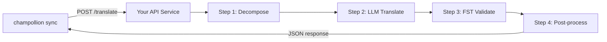

# Servindo um Método Personalizado como uma API

O **`api` method** do champollion permite apontar qualquer par de tradução para um endpoint HTTP externo. É assim que você integra pipelines muito complexos para um único prompt de LLM — analisadores morfológicos, transdutores de estado finito (FSTs), cadeias de LLM multi-etapas, ou qualquer método de pesquisa personalizado que você tenha desenvolvido.

Existem duas maneiras de subir esse endpoint:

1. **`champollion serve`** — um comando que serve a stack configurada do seu projeto champollion existente (método, registros, coaching, Memória de Tradução, quality gate) por trás deste contrato. Nenhum código de servidor. Veja [o caminho sem código](#the-zero-code-path-champollion-serve).
2. **Um serviço personalizado** — escreva seu próprio servidor HTTP implementando o contrato, para pipelines que vivem totalmente fora do champollion.

## Por que um Serviço de API?

Alguns pipelines de tradução não conseguem rodar dentro de um simples ciclo de solicitação-resposta:

| Etapa do pipeline | Exemplo |
|---|---|
| **Decomposição morfológica** | Dividir palavras polissintéticas em morfemas antes da tradução |
| **Validação FST** | Rejeitar saídas que violem regras fonológicas ou morfológicas |
| **Cadeias de LLM multi-etapas** | Gerar → verificar → corrigir ciclos com modelos diferentes |
| **Busca em dicionário** | Fazer referência cruzada a um dicionário bilíngue curado no meio do pipeline |
| **Humano no loop** | Enfileirar traduções incertas para revisão de especialista |

O método `api` trata seu pipeline como uma caixa preta — champollion envia strings de origem, seu serviço retorna traduções. O que acontece dentro é inteiramente com você.

## Arquitetura



## O Caminho Sem Código: `champollion serve`

Se o seu pipeline já é um projeto champollion — um método configurado (LLM, com coaching ou uma engine), registros, arquivos de coaching, Memória de Tradução e o quality gate determinístico — você não precisa escrever nenhum servidor. O `champollion serve` sobe **a sua própria stack configurada** por trás do exato contrato descrito abaixo:

```bash
# Owner side — run from the project whose champollion.config.json defines the stack
CHAMPOLLION_SERVE_TOKEN=$(openssl rand -hex 24) npx champollion serve
# [OK] champollion serve listening on http://127.0.0.1:1822/translate
```

Toda requisição passa pelo mesmo pipeline que o `champollion sync` usa:

- **Memória de Tradução** — strings que a TM já possui são servidas do cache gratuitamente, sem tocar no seu provedor upstream. Resultados da API validados pelo gate são armazenados em cache para a próxima requisição.
- **Quality gate** — toda resposta é validada de forma determinística (repetição, proporção de tamanho, conformidade de script, eco da fonte). Falhas retornam como erros estruturados por chave (HTTP 207/422) — nunca como uma saída silenciosamente degradada.
- **Cost guard** — `--max-cost-per-request` e `--max-session-cost` recusam requisições cujo custo upstream *estimado* exceda seus limites, antes que qualquer chamada ao provedor seja feita. Métodos com preços desconhecidos também são recusados sob um limite: desconhecido não é gratuito. Requisições cobertas pela TM têm um custo conhecido de $0 e sempre passam.

O servidor faz o bind em `127.0.0.1` por padrão: qualquer um que consiga alcançar a porta pode gastar o orçamento da sua API upstream, então expô-la é uma decisão explícita — `--bind 0.0.0.0` mais um bearer token forte. `--no-auth` só é aceito em conjunto com um bind de loopback. Um limite de taxa por IP e um limite de tamanho de requisição estão ativados por padrão; veja `champollion serve --help`.

### Aponte um Consumidor para Ele

Emita o manifesto do plugin que os consumidores instalam (um comando de cada lado):

```bash
# Owner side
champollion serve --emit-manifest --endpoint https://translate.example.org
# [OK] Wrote ./my-project-serve/method.json
```

```bash
# Consumer side
champollion plugin install ./my-project-serve
```

```json title="champollion.config.json (consumer)"
{
  "pairs": {
    "en:crk": { "methodPlugin": "my-project-serve" }
  }
}
```

```bash
CHAMPOLLION_API_KEY=<the server's bearer token> champollion sync
```

O método `api` do consumidor faz um POST das strings de origem para o seu servidor; sua stack traduz, passa pelo gate e armazena em cache; o `qualityTier` do manifesto é um repasse honesto dos seus pares configurados (o nível mais conservador quando eles diferem). Seus prompts, dados de coaching e chaves de provedor nunca saem da sua máquina.

O restante deste guia aborda a criação de um serviço **personalizado** — útil quando o seu pipeline não é um projeto champollion (uma cadeia FST em Python, um sistema de pesquisa sob medida). O contrato de comunicação é idêntico em ambos os casos.

## Configurando Seu Serviço

Seu serviço de API deve implementar um único endpoint que aceita e retorna JSON:

### Formato de Solicitação

champollion envia este corpo JSON exato (veja [api.js](https://github.com/gamedaysuits/Champollion/blob/main/cli/lib/methods/api.js)):

```json
POST /translate
Content-Type: application/json
Authorization: Bearer <CHAMPOLLION_API_KEY>

{
  "source_locale": "en",
  "target_locale": "crk",
  "method": "crk-coached-v1",
  "keys": {
    "greeting": "Hello, welcome to our app",
    "farewell": "Goodbye and thanks"
  }
}
```

| Campo | Tipo | Descrição |
|-------|------|-------------|
| `source_locale` | string | Código de idioma de origem BCP 47 |
| `target_locale` | string | Código de idioma de destino BCP 47 |
| `method` | string | Nome do plugin ou `"default"` |
| `keys` | object | Mapa de chave → string de origem para traduzir |
```

### Response Format

Your service must return a `translations` object. An optional `meta` object can include cost and diagnostic info:

```json
{
  "translations": {
    "greeting": "tânisi, pê-kîwêw ôta",
    "farewell": "ekosi mâka, kinanâskomitin"
  },
  "meta": {
    "model": "my-custom-pipeline/v1",
    "cost_usd": 0.0042,
    "method": "decompose-translate-validate"
  }
}
```

| Field | Type | Required | Description |
|-------|------|----------|-------------|
| `translations` | object | ✅ | Map of key → translated string |
| `meta` | object | — | Optional metadata |
| `meta.cost_usd` | number | — | If present, displayed in champollion's output |
| `errors` | object | — | For partial success (HTTP 207): map of key → `{ message }` |

### Minimal Express Server

```javascript
import express from 'express';

const app = express();
app.use(express.json());

/**
 * champollion API contract:
 *
 * Request:  { source_locale, target_locale, method, keys: { "key": "source" } }
 * Response: { translations: { "key": "translated" }, meta: { ... } }
 */
app.post('/translate', async (req, res) => {
  const { source_locale, target_locale, method, keys } = req.body;

  const translations = {};

  for (const [key, source] of Object.entries(keys)) {
    // --- Your pipeline goes here ---
    // Step 1: Morphological decomposition
    const morphemes = await decompose(source, source_locale);

    // Step 2: LLM translation with context
    const draft = await llmTranslate(morphemes, target_locale);

    // Step 3: FST validation
    const validated = await fstValidate(draft, target_locale);

    // Step 4: Post-processing (orthography normalization, etc.)
    translations[key] = await postProcess(validated);
  }

  res.json({
    translations,
    meta: {
      model: 'my-custom-pipeline/v1',
      method: 'decompose-translate-validate',
    },
  });
});

app.listen(3001, () => {
  console.log('Translation API running on http://localhost:3001');
});
```

## Configuring champollion

Point a translation pair at your running service in `champollion.config.json`:

```json
{
  "inputLocale": "en",
  "pairs": {
    "en:crk": {
      "method": "api",
      "endpoint": "http://localhost:3001/translate",
      "register": "Formal Plains Cree. Use SRO orthography."
    }
  }
}
```

Then run sync as usual:

```bash
npx champollion sync
```

champollion will POST your source strings to the endpoint and write the returned translations to `crk.json`.

## Case Study: Plains Cree Pipeline

:::info[Under Development]
The Plains Cree pipeline described below is **under active development** and is not yet running in production. Details here reflect the current design direction and may change as the project evolves.
:::

The **arena** project demonstrates this pattern. Its Plains Cree pipeline uses:

1. **Morphological decomposition** — Break polysynthetic Cree words into translatable morpheme chains
2. **LLM translation** — Context-enriched GPT-4o translation with coaching data (SRO orthography rules, register instructions)
3. **FST validation** — Finite-state transducer checks that outputs conform to Cree phonological rules
4. **Confidence scoring** — Each translation gets a confidence score based on FST pass rate and dictionary coverage

The entire pipeline runs as a single HTTP endpoint that champollion calls via the `api` method.

### Running Evaluations

After translating, you can evaluate output quality using the harness directly:

```bash
# Clone the harness
git clone https://github.com/gamedaysuits/Champollion.git
cd Champollion/arena
pip install -e .

# Execute a avaliação contra um corpus real e não empacotado
mt-eval run --corpus eval-amh-fra-globalvoices-test-v1 --model gemini-pro --yes
```

This produces structured evaluation records with chrF++, BLEU, and exact match scores that can be used as regression baselines.

## Authentication

If your API requires authentication, set the `apiKey` field or use an environment variable:

```json
{
  "pairs": {
    "en:crk": {
      "method": "api",
      "endpoint": "https://my-mt-service.example.com/translate",
      "apiKey": "${CRK_API_KEY}"
    }
  }
}
```

## Data Sovereignty

The `api` method is particularly important for **Indigenous language communities**. By self-hosting the translation pipeline, a community keeps full control over:

- **Proprietary coaching data** — register instructions, orthography rules, and domain glossaries never leave community infrastructure.
- **Linguistic resources** — curated dictionaries, FST grammars, and elder-verified translations remain under community ownership.
- **Access policies** — the community decides who can call the endpoint and under what terms.

This design follows the direction of [Indigenous data-sovereignty principles](/docs/network/community/low-resource-languages#data-sovereignty-principles) — community ownership and control of language data: sensitive language data stays governed by the community rather than a third-party platform.

:::tip
Combine the `api` method with a private deployment (e.g., a community-hosted VM or on-prem server) for the strongest data-sovereignty posture. `champollion serve` gives a community exactly this self-hosting posture without writing any server code — coaching data, provider keys, and the Translation Memory all stay on community infrastructure. See [Support a Low-Resource Language](/docs/network/community/low-resource-languages) for a full walkthrough.
:::

## Cost Estimation

The `api` method returns `null` for cost estimation by default — your service controls pricing. If you want to provide cost transparency, have your API return a `cost` field in the metadata:

```json
{
  "translations": { "...": "..." },
  "metadata": {
    "cost": {
      "estimatedCost": 0.0042,
      "currency": "USD",
      "source": "my-service-pricing"
    }
  }
}
```

## Melhores Práticas

1. **Retorne strings vazias para falhas** — Não retorne a string de origem como uma "tradução". Retorne `""` e o gate de qualidade do champollion vai detectar. A chave será pulada e retentada na próxima sincronização.
2. **Inclua pontuações de confiança** — Se seu pipeline conseguir estimar qualidade, retorne na metadata. Isso ajuda com auditoria de qualidade.
3. **Implemente verificações de saúde** — Adicione um endpoint `GET /health` para que champollion possa verificar conectividade antes de iniciar uma sincronização grande.
4. **Limite taxa graciosamente** — Se seu pipeline tem limites de throughput, retorne códigos de status `429`. O sistema de lote do champollion vai recuar.
5. **Registre tudo** — Pipelines multi-etapas podem falhar silenciosamente. Registre entrada/saída de cada etapa para debug.

## Licenciamento

O padrão do método `api` é totalmente aberto — não há restrições de licença em envolver seu próprio pipeline de tradução como um serviço HTTP. O harness de avaliação `arena` é licenciado AGPL-3.0-or-later (com uma exceção de plugin-padrão-eval §7); você pode estudar e construir sobre ele sob esses termos.

## Veja Também

- [Métodos de Tradução](/docs/guides/translation-methods) — visão geral de todos os métodos integrados (`openai`, `google`, `api`, etc.)
- [Especificação de Plugin](/docs/reference/plugin-spec) — schema completo para `champollion.config.json` incluindo os campos do método `api`
- [Apoie um Idioma com Poucos Recursos](/docs/network/community/low-resource-languages) — guia de ponta a ponta para idiomas com poucos recursos, incluindo os princípios de soberania de dados
- [Arquitetura](/docs/concepts/architecture) — como funcionam o loop de sincronização, o processamento em lote e o despacho de métodos do champollion
- [Avaliação de MT](/docs/network/leaderboard/rules) — metodologia de avaliação, métricas e o processo de submissão para o placar de líderes
- [Placar de Líderes de Métodos](/leaderboard) — rankings de qualidade ao vivo entre métodos e pares de idiomas
