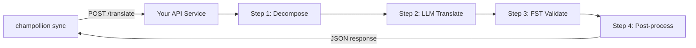

# Servindo um Método Personalizado como uma API

O **`api` method** do champollion permite apontar qualquer par de tradução para um endpoint HTTP externo. É assim que você integra pipelines muito complexos para um único prompt de LLM — analisadores morfológicos, transdutores de estado finito (FSTs), cadeias de LLM multi-etapas, ou qualquer método de pesquisa personalizado que você tenha desenvolvido.

Existem duas maneiras de disponibilizar esse endpoint:

1. **`champollion serve`** — um único comando que serve a stack configurada do seu projeto champollion existente (método, registros, coaching, Translation Memory, quality gate) sob este contrato. Sem código de servidor. Consulte [o caminho sem código](#the-zero-code-path-champollion-serve).
2. **Um serviço personalizado** — escreva seu próprio servidor HTTP implementando o contrato, para pipelines que funcionam totalmente fora do champollion.

## Por que um Serviço de API?

Alguns pipelines de tradução não conseguem rodar dentro de um simples ciclo de solicitação-resposta:

| Etapa do pipeline | Exemplo |
|---|---|
| **Decomposição morfológica** | Dividir palavras polissintéticas em morfemas antes da tradução |
| **Validação FST** | Rejeitar saídas que violem regras fonológicas ou morfológicas |
| **Cadeias de LLM multi-etapas** | Gerar → verificar → corrigir ciclos com modelos diferentes |
| **Busca em dicionário** | Fazer referência cruzada a um dicionário bilíngue curado no meio do pipeline |
| **Humano no loop** | Enfileirar traduções incertas para revisão de especialista |

O método `api` trata seu pipeline como uma caixa preta — champollion envia strings de origem, seu serviço retorna traduções. O que acontece dentro é inteiramente com você.

## Arquitetura


```mermaid
graph LR
    A[champollion sync] -->|POST /translate| B[Your API Service]
    B --> C[Step 1: Decompose]
    C --> D[Step 2: LLM Translate]
    D --> E[Step 3: FST Validate]
    E --> F[Step 4: Post-process]
    F -->|JSON response| A
```

## O caminho sem código: `champollion serve`

Se o seu pipeline já for um projeto champollion — um método configurado (LLM, coached ou uma engine), registros, arquivos de coaching, Translation Memory e o quality gate determinístico —, você não precisa escrever nenhum servidor. O `champollion serve` disponibiliza **sua própria stack configurada** sob o contrato exato descrito abaixo:

```bash
# Owner side — run from the project whose champollion.config.json defines the stack
CHAMPOLLION_SERVE_TOKEN=$(openssl rand -hex 24) npx champollion serve
# [OK] champollion serve listening on http://127.0.0.1:1822/translate
```

Cada requisição passa pelo mesmo pipeline que o `champollion sync` utiliza:

- **Translation Memory** — strings que a TM já contém são servidas a partir do cache gratuitamente, sem consultar o seu provedor upstream. Os resultados da API validados pelo gate são armazenados em cache para a próxima requisição.
- **Quality gate** — cada resposta é validada deterministicamente (repetição, proporção de comprimento, conformidade de script, eco da fonte). Falhas retornam como erros estruturados por chave (HTTP 207/422) — nunca como uma saída degradada silenciosamente.
- **Cost guard** — `--max-cost-per-request` e `--max-session-cost` recusam requisições cujo custo estimado upstream exceda seus limites, antes que qualquer chamada ao provedor seja feita. Métodos com preços desconhecidos também são recusados sob um limite: desconhecido não significa gratuito. Requisições cobertas pela TM têm custo conhecido de $0 e sempre passam.

O servidor vincula-se a `127.0.0.1` por padrão: qualquer pessoa que possa acessar a porta pode consumir seu orçamento de API upstream, portanto expô-lo é uma decisão explícita — `--bind 0.0.0.0` mais um token bearer forte. `--no-auth` só é aceito em conjunto com uma vinculação loopback. Um limite de taxa por IP e um limite de tamanho de requisição vêm ativados por padrão; consulte `champollion serve --help`.

### Aponte um consumidor para ele

Emita o manifesto do plugin que os consumidores instalam (um comando de cada lado):

```bash
# Owner side
champollion serve --emit-manifest --endpoint https://translate.example.org
# [OK] Wrote ./my-project-serve/method.json
```

```bash
# Consumer side
champollion plugin install ./my-project-serve
```

```json title="champollion.config.json (consumer)"
{
  "pairs": {
    "en:crk": { "methodPlugin": "my-project-serve" }
  }
}
```

```bash
CHAMPOLLION_API_KEY=<the server's bearer token> champollion sync
```

O método `api` do consumidor envia strings de origem via POST para o seu servidor; sua stack traduz, valida no gate e armazena em cache; o `qualityTier` do manifesto é um repasse fiel dos seus pares configurados (o nível mais conservador quando diferem). Seus prompts, dados de coaching e chaves de provedor nunca saem da sua máquina.

O restante deste guia aborda a criação de um serviço **personalizado** — útil quando o seu pipeline não é um projeto champollion (uma cadeia FST em Python, um sistema de pesquisa sob medida). O contrato de comunicação é idêntico em ambos os casos.

## Configurando Seu Serviço

Seu serviço de API deve implementar um único endpoint que aceita e retorna JSON:

### Formato de Solicitação

champollion envia este corpo JSON exato (veja [api.js](https://github.com/gamedaysuits/Champollion/blob/main/cli/lib/methods/api.js)):

```json
POST /translate
Content-Type: application/json
Authorization: Bearer <CHAMPOLLION_API_KEY>

{
  "source_locale": "en",
  "target_locale": "crk",
  "method": "my-project-serve",
  "keys": {
    "greeting": "Hello, welcome to our app",
    "farewell": "Goodbye and thanks"
  }
}
```

| Campo | Tipo | Descrição |
|-------|------|-------------|
| `source_locale` | string | Código de idioma de origem BCP 47 |
| `target_locale` | string | Código de idioma de destino BCP 47 |
| `method` | string | Nome do plugin ou `"default"` |
| `keys` | object | Mapeamento de chave → string de origem a traduzir |
| `instructions` | object | Apenas quando o endpoint declara `"acceptsInstructions": true`: chave → notas por chave (quais formas plurais uma mensagem precisa, feedback de nova tentativa do quality gate) |
| `text_format` | string | `"markdown"` para texto de documentos Markdown (veja abaixo); ausente para strings de aplicativos |

### Formato de resposta

Seu serviço deve retornar um objeto `translations`. Um objeto opcional `meta` pode incluir informações de custo e diagnóstico:

```json
{
  "translations": {
    "greeting": "<the greeting, translated>",
    "farewell": "<the farewell, translated>"
  },
  "meta": {
    "model": "my-custom-pipeline/v1",
    "cost_usd": 0.0042,
    "method": "decompose-translate-validate"
  }
}
```

| Campo | Tipo | Obrigatório | Descrição |
|-------|------|----------|-------------|
| `translations` | object | ✅ | Mapeamento de chave → string traduzida |
| `meta` | object | — | Metadados opcionais |
| `meta.cost_usd` | number | — | Se presente, exibido na saída do champollion |
| `errors` | object | — | Para sucesso parcial (HTTP 207): mapeamento de chave → `{ message }` |

### Servidor Express mínimo

```javascript
import express from 'express';

const app = express();
app.use(express.json());

/**
 * champollion API contract:
 *
 * Request:  { source_locale, target_locale, method, keys: { "key": "source" } }
 * Response: { translations: { "key": "translated" }, meta: { ... } }
 */
app.post('/translate', async (req, res) => {
  const { source_locale, target_locale, method, keys } = req.body;

  const translations = {};

  for (const [key, source] of Object.entries(keys)) {
    // --- Your pipeline goes here ---
    // Step 1: Morphological decomposition
    const morphemes = await decompose(source, source_locale);

    // Step 2: LLM translation with context
    const draft = await llmTranslate(morphemes, target_locale);

    // Step 3: FST validation
    const validated = await fstValidate(draft, target_locale);

    // Step 4: Post-processing (orthography normalization, etc.)
    translations[key] = await postProcess(validated);
  }

  res.json({
    translations,
    meta: {
      model: 'my-custom-pipeline/v1',
      method: 'decompose-translate-validate',
    },
  });
});

app.listen(3001, () => {
  console.log('Translation API running on http://localhost:3001');
});
```

## Configurando o champollion

Aponte um par de tradução para o seu serviço em execução no `champollion.config.json`:

```json
{
  "inputLocale": "en",
  "pairs": {
    "en:crk": {
      "method": "api",
      "endpoint": "http://localhost:3001/translate",
      "register": "Formal Plains Cree. Use SRO orthography."
    }
  }
}
```

Em seguida, execute a sincronização como de costume:

```bash
npx champollion sync
```

O champollion enviará suas strings de origem via POST para o endpoint e gravará as traduções retornadas em `crk.json`.

### O seu endpoint segue instruções?

Indique isso com `"acceptsInstructions"` no par (ou no nível superior de `method.json` do plugin):

- **`false`** — um modelo de NMT treinado, como um servido por `nmt-forge serve`, traduz texto e nada mais; consultado duas vezes, responde o mesmo. Quando o quality gate recusa uma de suas respostas, o champollion **não** o consulta novamente (isso seria uma chamada desperdiçada); ele avalia a primeira resposta como uma segunda resposta seria avaliada (um nome mantido como escrito é aceito) e envia o restante para o `fallback` do par.
- **`true`** — um LLM por trás do seu endpoint pode usar notas por chave: as requisições carregam um objeto `instructions`, e uma chave recusada é solicitada novamente com o feedback do gate.
- **não definido** — o champollion não consegue determinar. Uma chave recusada é solicitada mais uma vez sem feedback, e a execução informa que o endpoint pode ignorá-la.

```json
{
  "pairs": {
    "en:crk": {
      "method": "api",
      "endpoint": "http://127.0.0.1:8378/translate",
      "acceptsInstructions": false,
      "fallback": { "method": "llm-coached" }
    }
  }
}
```

O fallback aqui é um modelo hospedado. Para manter tudo nesta máquina, use `"fallback": { "method": "local", "model": "<your local model>" }` em vez disso (consulte [Método de fallback](/docs/getting-started/configuration#fallback) para saber quando usar cada um).

## Estudo de caso: Pipeline de Plains Cree

:::info[Em desenvolvimento]
O pipeline de Plains Cree descrito abaixo está **em desenvolvimento ativo** e ainda não está em execução na produção. Os detalhes aqui refletem a direção atual do projeto e podem mudar à medida que ele evolui.
:::

O projeto **arena** demonstra esse padrão. Seu pipeline de Plains Cree utiliza:

1. **Decomposição morfológica** — Dividir palavras polissintéticas em Cree em cadeias de morfemas traduzíveis
2. **Tradução com LLM** — Tradução com GPT-4o enriquecida com contexto e dados de coaching (regras de ortografia SRO, instruções de registro)
3. **Validação FST** — Transdutor de estados finitos (FST) verifica se os resultados estão em conformidade com as regras fonológicas do Cree
4. **Pontuação de confiança** — Cada tradução recebe uma pontuação de confiança com base na taxa de aprovação no FST e na cobertura do dicionário

Todo o pipeline é executado como um único endpoint HTTP que o champollion chama por meio do método `api`.

### Executando avaliações

Após a tradução, você pode avaliar a qualidade da saída usando o harness diretamente:

```bash
# Clone the harness
git clone https://github.com/gamedaysuits/Champollion.git
cd Champollion/arena
python3 -m pip install -e .

# Run the evaluation against a real, non-bundled corpus
mt-eval run --corpus eval-amh-fra-globalvoices-test-v1 --model google/gemini-3.1-pro-preview --yes
```

Isso produz registros de avaliação estruturados com pontuações de chrF++, BLEU e correspondência exata (exact match) que podem ser usados como referências de regressão.

## Autenticação

Se a sua API exigir autenticação, informe o nome da variável de ambiente que contém
o token no par (`"${VAR}"`, lido do ambiente ou de `.env.local`),
ou defina `CHAMPOLLION_API_KEY`. O Champollion envia apenas esse token para o
endpoint — nunca a chave de outro provedor. Um endpoint em loopback (`nmt-forge
serve`, `champollion serve`) não precisa de nenhum.

```json
{
  "pairs": {
    "en:crk": {
      "method": "api",
      "endpoint": "https://my-mt-service.example.com/translate",
      "apiKey": "${CRK_API_KEY}"
    }
  }
}
```

O conteúdo (corpos em Markdown) utiliza o mesmo contrato: cada bloco é uma chave
(`segment.<N>`, ou `body` para uma página inteira) e a requisição carrega
`"text_format": "markdown"`, para que o servidor possa diferenciar texto de documento de
strings de aplicativo. Servidores que não reconhecem o campo podem ignorá-lo.

## Soberania de dados

O método `api` é particularmente importante para **comunidades de línguas indígenas**. Ao auto-hospedar o pipeline de tradução, a comunidade mantém total controle sobre:

- **Dados proprietários de coaching** — instruções de registro, regras ortográficas e glossários de domínio nunca saem da infraestrutura da comunidade.
- **Recursos linguísticos** — dicionários com curadoria, gramáticas FST e traduções verificadas por anciãos permanecem sob posse da comunidade.
- **Políticas de acesso** — a comunidade decide quem pode chamar o endpoint e sob quais termos.

Esse design segue a orientação dos [princípios de soberania de dados indígenas](/docs/network/community/low-resource-languages#data-sovereignty-principles) — propriedade e controle comunitários dos dados linguísticos: dados linguísticos sensíveis permanecem governados pela comunidade em vez de uma plataforma de terceiros.

:::tip
Combine o método `api` com uma implantação privada (por exemplo, uma VM hospedada pela comunidade ou um servidor local) para obter a mais forte postura de soberania de dados. O `champollion serve` oferece à comunidade exatamente essa postura de auto-hospedagem sem a necessidade de escrever código de servidor — dados de coaching, chaves de provedores e a Translation Memory permanecem todos na infraestrutura da comunidade. Consulte [Apoiar uma língua de poucos recursos](/docs/network/community/low-resource-languages) para um passo a passo completo.
:::

## Estimativa de Custo

O método `api` retorna `null` para estimativa de custo por padrão — seu serviço controla os preços. Se você quiser fornecer transparência de custos, faça com que sua API retorne um campo `cost` nos metadados:

```json
{
  "translations": { "...": "..." },
  "metadata": {
    "cost": {
      "estimatedCost": 0.0042,
      "currency": "USD",
      "source": "my-service-pricing"
    }
  }
}
```

## Melhores Práticas

1. **Não retorne tradução para falhas** — Não retorne a string de origem como uma "tradução". Deixe a chave fora de `translations` (ou reporte-a sob `errors` com HTTP 207): a chave é ignorada e solicitada novamente na próxima sincronização. Uma resposta recusada pelo quality gate — uma string vazia, um eco da fonte — é memorizada, e uma sincronização normal não enviará essa chave para o seu endpoint novamente até que alguém a especifique com `--redo keys:` (isso cobraria pela mesma resposta).
2. **Inclua pontuações de confiança** — Se o seu pipeline puder estimar a qualidade, retorne-a nos metadados. Isso ajuda na auditoria de qualidade.
3. **Implemente verificações de integridade (health checks)** — Adicione um endpoint `GET /health` para que o champollion possa verificar a conectividade antes de iniciar uma sincronização grande.
4. **Aplique limitação de taxa (rate limit) de forma suave** — Se o seu pipeline tiver limites de throughput, retorne códigos de status `429`. O sistema de lotes do champollion fará um recuo exponencial (backoff).
5. **Registre tudo em logs** — Pipelines de várias etapas podem falhar silenciosamente. Registre a entrada/saída de cada etapa para depuração.

## Licenciamento

O padrão do método `api` é totalmente aberto — não há restrições de licença em envolver seu próprio pipeline de tradução como um serviço HTTP. O harness de avaliação `arena` é licenciado AGPL-3.0-or-later (com uma exceção de plugin-padrão-eval §7); você pode estudar e construir sobre ele sob esses termos.

## Veja Também

- [Métodos de tradução](/docs/guides/translation-methods) — visão geral de cada método integrado (`openai`, `google`, `api` etc.)
- [Especificação do plugin](/docs/reference/plugin-spec) — esquema completo de `champollion.config.json`, incluindo campos do método `api`
- [Apoiar uma língua de poucos recursos](/docs/network/community/low-resource-languages) — guia de ponta a ponta para línguas de poucos recursos, incluindo princípios de soberania de dados
- [Arquitetura](/docs/concepts/architecture) — como funcionam o loop de sincronização, o processamento em lote e o despacho de métodos do champollion
- [Avaliação de MT](/docs/network/leaderboard/rules) — metodologia de avaliação, métricas e o processo de submissão ao leaderboard
- [Leaderboard de métodos](/leaderboard) — classificações de qualidade em tempo real entre métodos e pares de idiomas
