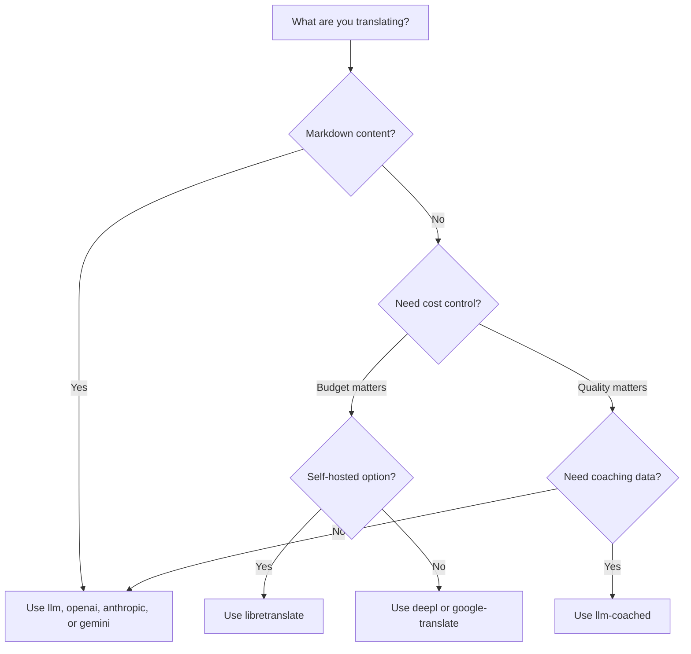

# Métodos de Tradução

O Champollion suporta vários métodos de tradução. Cada par de idiomas pode usar um método diferente — você não fica preso a uma única abordagem para todo o seu projeto.

## Comparação de Métodos

### Provedores de LLM

Focados em qualidade, com suporte a Markdown e coaching. Melhor para projetos com muito conteúdo.

| Método | Chave | O que faz |
|--------|-------|----------|
| `llm` (padrão) | `OPENROUTER_API_KEY` | LLM via OpenRouter — 200+ modelos, roteamento automático |
| `llm-coached` | `OPENROUTER_API_KEY` | LLM + regras gramaticais, dicionários, notas de estilo |
| `openai` | `OPENAI_API_KEY` | API OpenAI direto (gpt-4o, gpt-4o-mini) |
| `anthropic` | `ANTHROPIC_API_KEY` | API Anthropic direto (Claude Sonnet, Haiku, Opus) |
| `gemini` | `GEMINI_API_KEY` | API Google Gemini direto (Flash, Pro) — camada gratuita |

### MT Tradicional

Focado em velocidade e custo. Melhor para alto volume de pares chave-valor.

| Método | Chave | O que faz |
|--------|-------|-----------|
| `google-translate` | `GOOGLE_TRANSLATE_API_KEY` | Google Cloud Translation API v2 (194 idiomas) |
| `deepl` | `DEEPL_API_KEY` | DeepL API com suporte a glossário (33 idiomas) |
| `microsoft-translator` | `MICROSOFT_TRANSLATOR_API_KEY` | Azure Cognitive Services Translator (135 idiomas) |
| `libretranslate` | *(auto-hospedado)* | LibreTranslate auto-hospedado (AGPL, gratuito) |
| `tilde` | `TILDE_API_KEY` | Tilde MT — motores desenvolvidos na UE, forte em idiomas bálticos e europeus |
| `translated` | `LARA_ACCESS_KEY_ID` + `LARA_ACCESS_KEY_SECRET` | Translated's Lara — MT adaptativa profissional (200 idiomas) |

### Infraestrutura

| Método | Chave | O que faz |
|--------|-------|----------|
| `api` | *(por provedor)* | Cliente HTTP fino para qualquer endpoint de tradução REST |

## Árvore de Decisão



---

## `llm` — Tradução com LLM (Padrão)

Traduz via qualquer LLM no [OpenRouter](https://openrouter.ai). Este é o método padrão e o mais versátil.

**Como funciona:**
1. Agrupa chaves (padrão 80/lote) com instruções de registro e contexto
2. Envia para OpenRouter como um prompt estruturado
3. Analisa a resposta JSON
4. Valida cada tradução através do [portão de qualidade](/docs/concepts/quality-gate)
5. Escreve traduções aprovadas, tenta novamente ou rejeita falhas

**Quando usar:** Maioria dos projetos. Especialmente sites com muito conteúdo em Markdown, onde blocos de código e shortcodes precisam ser protegidos.

**Configuração:**

```json
{
  "defaultMethod": "llm",
  "model": "google/gemini-3.5-flash"
}
```

## `llm-coached` — Tradução com LLM Orientada

Igual a `llm`, mas com regras gramaticais, dicionários de termos e notas de estilo injetados em cada prompt.

**Como funciona:**
1. Carrega dados de coaching de `.champollion/coaching/<locale>.json` ou do diretório `coaching/` de um plugin
2. Injeta regras gramaticais, termos de dicionário e notas de estilo no prompt do sistema
3. Termos de dicionário que correspondem às chaves de origem são incluídos como terminologia obrigatória
4. A tradução prossegue como em `llm`, com dados de coaching adicionando precisão

**Quando usar:** Idiomas com poucos recursos, terminologia específica de domínio (legal, médica), registros formais, ou qualquer caso em que a saída genérica do LLM não seja precisa o suficiente.

**Formato de dados de coaching:**

```json title=".champollion/coaching/fr.json"
{
  "grammar_rules": [
    "French adjectives agree in gender and number with the noun they modify",
    "Use 'vous' for formal contexts, 'tu' for informal"
  ],
  "dictionary": {
    "dashboard": "tableau de bord",
    "deployment": "déploiement",
    "settings": "paramètres"
  },
  "style_notes": "Prefer active voice. Avoid anglicisms where a native French term exists."
}
```

Veja também: [Guia de Idiomas com Poucos Recursos](/docs/network/community/low-resource-languages)

---

## `openai` — API OpenAI Direto

Traduz diretamente via API OpenAI Chat Completions. Sem intermediário OpenRouter — sua chave, sua conta, seu painel de uso.

**Modelos:** `gpt-4o` (padrão), `gpt-4o-mini`

**Recursos:**
- ✅ Suporte a Markdown (tradução de conteúdo)
- ✅ Suporte a coaching (regras gramaticais, substituições de dicionário, notas de estilo)
- ✅ Modo JSON para saída estruturada de chave-valor
- ✅ Backoff exponencial com retry

**Configuração:**

```json
{
  "pairs": {
    "en:fr": { "method": "openai", "model": "gpt-4o-mini" }
  }
}
```

```bash
export OPENAI_API_KEY=sk-proj-...
```

Obtenha sua chave em [platform.openai.com/api-keys](https://platform.openai.com/api-keys).

## `anthropic` — API Anthropic Direto

Traduz diretamente via API Anthropic Messages. Usa o parâmetro `system` para dados de coaching, habilitando cache de prompt do Anthropic.

**Modelos:** `claude-sonnet-4-6` (padrão), `claude-haiku-4-5`, `claude-opus-4-7`

**Recursos:**
- ✅ Suporte a Markdown (tradução de conteúdo)
- ✅ Suporte a coaching (regras gramaticais, substituições de dicionário, notas de estilo)
- ✅ Cache de prompt do sistema (amortiza custo de coaching entre lotes)
- ✅ Backoff exponencial com retry

**Configuração:**

```json
{
  "pairs": {
    "en:ja": { "method": "anthropic", "model": "claude-haiku-4-5" }
  }
}
```

```bash
export ANTHROPIC_API_KEY=sk-ant-...
```

Obtenha sua chave em [console.anthropic.com](https://console.anthropic.com/settings/keys).

## `gemini` — API Google Gemini Direto

Traduz diretamente via API Google Gemini `generateContent`. **Camada gratuita disponível** — melhor ponto de partida com custo zero.

**Modelos:** `gemini-2.5-flash` (padrão), `gemini-2.5-pro`

**Recursos:**
- ✅ Suporte a Markdown (tradução de conteúdo)
- ✅ Suporte a coaching (regras gramaticais, substituições de dicionário, notas de estilo)
- ✅ Modo de resposta JSON via `responseMimeType`
- ✅ Camada gratuita (cota diária generosa)
- ✅ Backoff exponencial com retry

**Configuração:**

```json
{
  "pairs": {
    "en:ko": { "method": "gemini", "model": "gemini-2.5-pro" }
  }
}
```

```bash
export GEMINI_API_KEY=AI...
```

Obtenha sua chave em [aistudio.google.com/apikey](https://aistudio.google.com/apikey).

### Validação de Modelo {#model-validation}

Os provedores de LLM direto (`openai`, `anthropic`, `gemini`) validam sua string de modelo no primeiro uso. Isso detecta três categorias de erros:

**Formato de método incorreto** — Usando um caminho de modelo estilo OpenRouter com um provedor direto:

```
[WARN] OpenAI: model "google/gemini-3.5-flash" looks like an OpenRouter path.
       Direct providers use bare model names (e.g., "gpt-4o").
       To use OpenRouter models, set method to 'llm' instead.
```

**Provedor incorreto** — Usando um modelo de um provedor completamente diferente:

```
[WARN] Gemini: model "claude-sonnet-4-6" is an Anthropic model.
       This provider (gemini) cannot serve Anthropic models.
       Use --method anthropic or set "method": "anthropic" in config.
```

**Modelo descontinuado ou com erro de digitação** — Na primeira chamada de API, champollion busca a lista de modelos ao vivo do provedor e verifica seu modelo:

```
[WARN] Gemini: model "gemini-1.5-flash" not found in available models.
       Similar models: gemini-2.0-flash, gemini-2.5-flash, gemini-2.5-pro
       The API call will proceed — the provider will give the final verdict.
```

:::note[Estes são avisos, não erros]
A validação de modelo registra avisos mas não bloqueia a chamada da API. O provedor da API dá o veredicto final — um nome de modelo futuro poderia corresponder a um padrão diferente, e não queremos bloquear com base em heurísticas.
:::

---

## `google-translate` — Google Cloud Translation API

Integração direta com Google Cloud Translation API v2. Usa a API REST — sem SDK, sem conta de serviço. Apenas a chave de API.

**Quando usar:** Pares de strings chave-valor de alto volume onde velocidade e custo importam mais do que nuances. Suporta 194 idiomas nativamente ([lista publicada pelo Google](https://docs.cloud.google.com/translate/docs/languages)).

**Limitações:**
- ⚠️ **Sem suporte a Markdown.** Vai corromper blocos de código, shortcodes e variáveis de interpolação.
- Sem controle de registro/tom
- Sem coaching ou aplicação de terminologia

```bash
npx champollion sync --method google-translate
```

:::tip[Detecção automática]
Se apenas `GOOGLE_TRANSLATE_API_KEY` está configurado (sem chave OpenRouter), champollion muda automaticamente para Google Translate. Nenhuma mudança de configuração necessária.
:::

## `deepl` — API DeepL

Integração direta com a API de tradução DeepL. Suporta glossários para terminologia consistente.

**Quando usar:** Idiomas europeus onde DeepL se destaca (alemão, francês, espanhol, holandês, polonês, etc.). Suporte a glossário garante terminologia consistente sem dados de coaching.

**Recursos:**
- ✅ Detecção automática de endpoint gratuito/pro (sufixo `:fx` em chaves gratuitas)
- ✅ Criação e gerenciamento de glossário
- ✅ Controle de nível de formalidade
- ⚠️ **Sem suporte a Markdown** — apenas pares chave-valor

**Configuração:**

```json
{
  "pairs": {
    "en:de": { "method": "deepl" }
  }
}
```

```bash
export DEEPL_API_KEY=your-key-here
```

Obtenha sua chave em [deepl.com/pro-api](https://www.deepl.com/pro-api).

## `microsoft-translator` — Azure Cognitive Services

Integração direta com API Microsoft Translator Text v3.

**Quando usar:** Ambientes corporativos com infraestrutura existente do Azure. Suporta 135 idiomas, incluindo alguns que o Google Translate não cobre (tibetano, feroês, inuktitut e outros).

**Recursos:**
- ✅ Até 100 segmentos por requisição (alto throughput)
- ✅ Parâmetro de região opcional para otimização de latência
- ⚠️ **Sem suporte a Markdown** — apenas pares chave-valor
- ⚠️ **Sem tradução de conteúdo** — apenas pares chave-valor

**Configuração:**

```json
{
  "pairs": {
    "en:ar": { "method": "microsoft-translator" }
  }
}
```

```bash
export MICROSOFT_TRANSLATOR_API_KEY=your-key
export MICROSOFT_TRANSLATOR_REGION=global  # optional
```

Obtenha sua chave no [Portal Azure](https://portal.azure.com) → Cognitive Services → Translator.

## `libretranslate` — Tradução Auto-Hospedada

Tradução de código aberto auto-hospedada usando LibreTranslate. Executa localmente ou em sua própria infraestrutura — zero custos de API, soberania total de dados.

**Quando usar:** Projetos que exigem tradução offline, conformidade com privacidade de dados (GDPR), ou operação com custo zero. Especialmente útil para pipelines de CI que não devem depender de APIs externas.

**Recursos:**
- ✅ Auto-hospedado — sem chamadas de API externas
- ✅ Gratuito e código aberto (AGPL-3.0)
- ✅ Implantação Docker disponível
- ⚠️ **Sem suporte a Markdown** — apenas pares chave-valor
- ⚠️ **Sem tradução de conteúdo** — apenas pares chave-valor
- ⚠️ Qualidade varia por par de idiomas

**Configuração:**

```bash
# Run LibreTranslate locally with Docker
docker run -d -p 5000:5000 libretranslate/libretranslate

# Configure (optional — defaults to localhost:5000)
export LIBRETRANSLATE_API_URL=http://localhost:5000/translate
```

```json
{
  "pairs": {
    "en:es": { "method": "libretranslate" }
  }
}
```

---

## `api` — API de Tradução Remota

Um cliente HTTP fino para endpoints de tradução hospedados em comunidade ou protegidos por IP. Champollion envia chaves e recebe traduções de volta — não contém lógica de tradução.

**Quando usar:** Quando métodos de tradução são hospedados no servidor (ex: dados de coaching proprietários, modelos fine-tuned, pipelines FST que não podem ser distribuídos).

```json
{
  "pairs": {
    "en:crk": {
      "method": "api",
      "endpoint": "https://api.example.com/v1/translate",
      "apiKey": "your-key"
    }
  }
}
```

:::note[Tradução Controlada pela Comunidade (aspirante à soberania)]
O método `api` é a ponte para a **tradução hospedada e controlada pela comunidade (aspirante à soberania)**. Comunidades indígenas e de idiomas minoritários podem hospedar seus próprios endpoints de tradução — mantendo dados de treinamento, modelos ajustados e a propriedade intelectual linguística sob controle da comunidade — enquanto o Champollion se conecta a eles como um thin client.

Veja [Suporte a um Idioma com Poucos Recursos](/docs/network/community/low-resource-languages) para o passo a passo completo de hospedagem comunitária, e [Servindo um Método via API](/docs/guides/serving-a-method) para requisitos de endpoint.
:::

---

## Configuração Por Par

O verdadeiro poder está em misturar métodos por par de idiomas:

```json title="champollion.config.json"
{
  "version": 3,
  "pairs": {
    "en:fr": { "method": "deepl" },
    "en:ja": { "method": "openai", "model": "gpt-4o" },
    "en:ko": { "method": "gemini" },
    "en:ar": { "method": "microsoft-translator" },
    "en:crk": { "methodPlugin": "crk-coached-v1" }
  }
}
```

Isso traduz francês via DeepL (suporte a glossário), japonês via OpenAI (qualidade), coreano via Gemini (camada gratuita), árabe via Microsoft Translator (cobertura), e Plains Cree via um plugin orientado (especializado).

## Plugins

Plugins são receitas de tradução pré-empacotadas para pares de idiomas específicos. São manifestos JSON — não código — que dizem ao champollion qual método usar, com quais configurações e qual qualidade foi benchmarkada.

:::tip[Do harness de avaliação para produção em um comando]
Plugins desenvolvidos e comprovados no [harness de avaliação](/docs/network/specifications/harness) podem ser instalados diretamente — o método que você valida lá é implantado aqui com um único comando `plugin install`. Veja [Avaliação de MT](/docs/network/leaderboard/rules) para o fluxo de trabalho de avaliação completo.
:::

```bash
champollion plugin install ./french-formal-v1/
champollion plugin list
champollion plugin remove french-formal-v1
```

Veja a [Especificação de Plugin](/docs/reference/plugin-spec) para o formato de manifesto completo.

---

## Alternando Provedores

Mudando entre métodos? O formato de modelo e a variável de ambiente mudam — aqui está o mapa:

### OpenRouter → Provedor Direto

```diff title="champollion.config.json"
 {
   "pairs": {
     "en:fr": {
-      "method": "llm",
-      "model": "openai/gpt-4o"
+      "method": "openai",
+      "model": "gpt-4o"
     }
   }
 }
```

```diff title="Environment variables"
- export OPENROUTER_API_KEY=sk-or-v1-...
+ export OPENAI_API_KEY=sk-proj-...
```

**Diferenças principais:**
- OpenRouter usa formato `provider/model` (ex: `openai/gpt-4o`). Provedores diretos usam nomes de modelo simples (ex: `gpt-4o`).
- Cada provedor direto tem sua própria variável de ambiente (`OPENAI_API_KEY`, `ANTHROPIC_API_KEY`, `GEMINI_API_KEY`).
- Se você usar o formato de modelo errado, champollion vai avisar você — veja [Validação de Modelo](#model-validation).

### Provedor Direto → OpenRouter

```diff title="champollion.config.json"
 {
   "pairs": {
     "en:ja": {
-      "method": "anthropic",
-      "model": "claude-sonnet-4-6"
+      "method": "llm",
+      "model": "anthropic/claude-sonnet-4-6"
     }
   }
 }
```

:::tip[Quando usar OpenRouter vs Direto]
**Use OpenRouter** quando você quer alternar entre modelos sem mudar variáveis de ambiente, ou quando você quer acesso a 200+ modelos com uma única chave. **Use provedores diretos** quando você quer faturamento mais simples, latência menor (sem intermediário), ou acesso a recursos específicos do provedor como cache de prompt do Anthropic.
:::

---

## Comparação de Custos

Custo aproximado por 1.000 chaves traduzidas (assume ~10 tokens por chave, 80 chaves por lote):

| Método | Custo / 1K Chaves | Velocidade | Qualidade | Melhor Para |
|--------|-------------------|-----------|-----------|------------|
| `gemini` (Flash) | **Gratuito** (dentro da camada) | Rápido | Bom | Começando, projetos pessoais |
| `google-translate` | ~$0,02 | Mais rápido | Adequado | Alto volume, idiomas europeus |
| `deepl` | ~$0,02 | Rápido | Bom | Idiomas europeus, terminologia |
| `microsoft-translator` | ~$0,01 | Rápido | Adequado | Lojas Azure, cobertura ampla de idiomas |
| `libretranslate` | **Gratuito** (auto-hospedado) | Varia | Razoável | Ar-gapped, GDPR, pipelines de CI |
| `gemini` (Pro) | ~$0,07 | Médio | Muito bom | Sensível a qualidade, cota gratuita |
| `openai` (GPT-4o-mini) | ~$0,01 | Rápido | Bom | LLM com orçamento |
| `openai` (GPT-4o) | ~$0,10 | Médio | Muito bom | Sensível a qualidade |
| `anthropic` (Haiku) | ~$0,01 | Rápido | Bom | LLM com orçamento |
| `anthropic` (Sonnet) | ~$0,10 | Médio | Muito bom | Sensível a qualidade |
| `anthropic` (Opus) | ~$0,50 | Lento | Excelente | Qualidade máxima |
| `llm` (OpenRouter) | Varia por modelo | Varia | Varia | Comparação de modelos, experimentação |

:::note[Estas são estimativas]
Os custos reais dependem do comprimento do seu texto de origem, tamanho do lote e mudanças de preços do provedor. Verifique a página de preços atual de cada provedor para taxas exatas.
:::

---

## Veja Também

- [Idiomas Suportados](/docs/reference/supported-languages)
- [Dados de Coaching](/docs/concepts/coaching-data)
- [Suporte a um Idioma com Poucos Recursos](/docs/network/community/low-resource-languages)
- [Especificação de Plugin](/docs/reference/plugin-spec)
- [Servindo um Método via API](/docs/guides/serving-a-method)
- [Portão de Qualidade](/docs/concepts/quality-gate)
- [Arquitetura](/docs/concepts/architecture)
- [Troubleshooting](/docs/guides/troubleshooting) — erros de modelo, problemas de API
